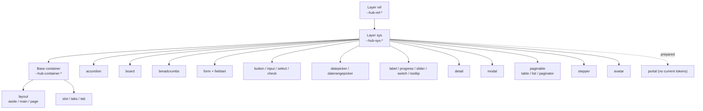
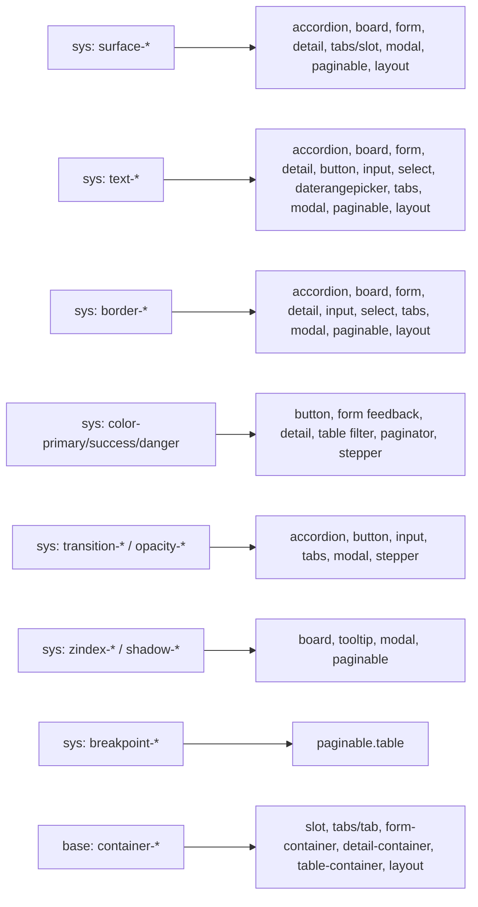

# CSS Variables — ng-hub-ui

## Introduction

This document is the reference guide for the CSS custom property system used across all `ng-hub-ui` libraries. It is intended for frontend developers, UX engineers, and QA teams who need to understand, use, or extend design tokens in the `hub-library/projects` ecosystem. It covers the full token architecture (from primitives to component-level variables), naming conventions, theming rules, and a complete per-component variable inventory.

## Token Architecture

### Three-layer model

The ng-hub-ui token system is organized into three layers, following a model similar to Bootstrap's base/component split but extended with a dedicated semantic layer:

| Layer              | Purpose                                              | Recommended prefix    | Example                    |
| ------------------ | ---------------------------------------------------- | --------------------- | -------------------------- |
| `ref` (primitives) | Raw design values (palettes, spacing, radius, sizes) | `--hub-ref-*`         | `--hub-ref-color-blue-500` |
| `sys` (semantic)   | Global tokens with usage intent                      | `--hub-sys-*`         | `--hub-sys-color-primary`  |
| `component`        | Component-specific tokens                            | `--hub-{component}-*` | `--hub-paginator-link-bg`  |

The `--hub-` prefix is mandatory for all tokens in this system. It provides a clear namespace that avoids collisions with third-party libraries (Bootstrap, Angular Material, etc.) and makes it immediately obvious that a variable belongs to the ng-hub-ui design system. All new tokens must use this prefix regardless of layer.

Layer dependency rules:

- `ref` depends on no other variable — only literal values.
- `sys` depends on `ref`.
- `component` depends preferably on `sys` (and optionally on `ref`).
- Avoid `component -> component` dependencies, except for explicit compatibility aliases.

Container scope note:

- `--hub-container-*` is a cross-cutting base scope, not part of the `ref` or `sys` collections.
- It acts as an inheritable bridge between semantic tokens and concrete components/slots.
- In design tools (Figma), it should be organized as a component/foundation collection (base styles), not as primitive (`ref`) or semantic (`sys`) tokens.



The following diagram shows how `sys` token families fan out to specific components:



### Compatibility note

All new variables must use the `ref + sys + component` model from the start. The `container` scope remains a dedicated inheritable base layer (`--hub-container-*`) used as a bridge across slots/components. Existing tokens can be migrated progressively by introducing the canonical name and keeping the old one as a `var()` fallback during a transition period of at least two stable releases.

### `inherit` mapping for design tools (Figma)

`inherit` is a CSS behavior, not a design token value. In token inventories and Figma variable collections, do not store `inherit` as a string; map it to the parent semantic token used by the component context.

Recommended mapping rules:

- Typography inheritance (`font-family`, `font-size`, `font-weight`, `line-height`) should alias the parent/container typography tokens.
- Text color inheritance should alias the parent/container text color token (default: `--hub-sys-text-primary`, unless a component state overrides it).
- Example: `--hub-breadcrumb-font-size: inherit` should be mapped to the container typography size (`--hub-container-font-size` → `--hub-ref-font-size-base`), and `--hub-board-card-title-color: inherit` to the parent text color token.

### Icon token mapping for design tools (Figma)

Icon variables defined as `url("data:image/svg+xml,...")` (for example `--hub-datepicker-icon` or `--hub-check-input-checked-icon`) are implementation details for CSS rendering. In Figma, they should not be represented as string variables.

Recommended mapping rules:

- Map icon URL tokens to an icon component instance from the design system (for example `Chevron/Down` for dropdown indicators).
- Keep icon visual properties as tokens (`color`, `size`, `opacity`, `state`) and bind those properties to semantic/component tokens.
- Use component variants for icon state/direction changes (for example `down/up`, `default/hover/active/disabled`) instead of new URL variables.

## Naming Convention

### Patterns by layer

All tokens follow lowercase kebab-case. The `--hub-` prefix is mandatory. No ambiguous abbreviations — `bg` and `color` are acceptable, but non-standard acronyms should be avoided.

| Layer       | Pattern                                         |
| ----------- | ----------------------------------------------- |
| `ref`       | `--hub-ref-{group}-{token}`                     |
| `sys`       | `--hub-sys-{group}-{token}`                     |
| `component` | `--hub-{component}-{slot?}-{property}-{state?}` |

### Directional spacing rule

For paired spacing tokens in this library, the canonical naming is `-x` and `-y`.

- Use `-x` for horizontal pairs (`left + right` or logical inline axis).
- Use `-y` for vertical pairs (`top + bottom` or logical block axis).
- `-inline` and `-block` may still appear in CSS property usage (`padding-inline`, `margin-block`), but they are not the preferred suffixes for design tokens in the current `ng-hub-ui` catalog.
- New component tokens should follow the existing inventory and prefer `--hub-{component}-...-padding-x` / `--hub-{component}-...-padding-y`.
- Single-value spacing tokens (one uniform value, not a pair — e.g. `--hub-avatar-content-padding`) are not paired tokens and may keep the bare `-padding` suffix.
- **Grandfathered exceptions** (published API, kept for compatibility; do not imitate in new tokens): the `modal` margin cascade (`--hub-modal-margin` shorthand plus `-margin-block` and per-side variants) and the logical-suffix tokens `--hub-nav-mobile-*-padding-inline` / `--hub-nav-mobile-body-padding-block-end` / `--hub-nav-vertical-panel-padding-{inline,block}` / `--hub-nav-header-*-inline-start` / `--hub-table-batch-actions-margin-inline-end`.

### Allowed states

States appear as the final suffix of a token name:

- `hover`
- `focus`
- `active`
- `disabled`
- `selected`
- `open`
- `closed`

### Valid and invalid examples

Valid:

- `--hub-ref-space-3`
- `--hub-sys-border-color-default`
- `--hub-paginator-link-bg`
- `--hub-paginator-link-bg-hover`
- `--hub-accordion-btn-color-active`

Invalid:

- `--tableColorPrimary` (camelCase and no prefix)
- `--hub-primary` (too generic, no semantic group)
- `--hub-table-active-link` (inconsistent order: must end with state)

### Formal regex validation

| Layer       | Regex                                  |
| ----------- | -------------------------------------- |
| `ref`       | `^--hub-ref-[a-z0-9]+(?:-[a-z0-9]+)+$` |
| `sys`       | `^--hub-sys-[a-z0-9]+(?:-[a-z0-9]+)+$` |
| `component` | `^--hub-[a-z0-9]+(?:-[a-z0-9]+){1,}$`  |

## `ref` Variables (Primitives)

### Colors

Color primitives are organized as full tonal ramps (`100`–`900`), Bootstrap-aligned. Semantic intent (primary, success, …) is assigned later in the `sys` layer — **never reference a hue ramp directly from a component**. There are no flat `--hub-ref-color-primary` aliases: `primary` is `blue`, `success` is `green`, `danger` is `red`, `warning` is `yellow`, `info` is `cyan`.

#### Neutrals

| Variable               | Value     |
| ---------------------- | --------- |
| `--hub-ref-color-white` | `#ffffff` |
| `--hub-ref-color-black` | `#000000` |
| `--hub-ref-color-gray-100` | `#f8f9fa` |
| `--hub-ref-color-gray-200` | `#e9ecef` |
| `--hub-ref-color-gray-300` | `#dee2e6` |
| `--hub-ref-color-gray-400` | `#ced4da` |
| `--hub-ref-color-gray-500` | `#adb5bd` |
| `--hub-ref-color-gray-600` | `#6c757d` |
| `--hub-ref-color-gray-700` | `#495057` |
| `--hub-ref-color-gray-800` | `#343a40` |
| `--hub-ref-color-gray-900` | `#212529` |

#### Tonal ramps

Token pattern: `--hub-ref-color-{hue}-{step}`, where `{hue}` ∈ `blue · green · red · yellow · cyan` and `{step}` ∈ `100…900`.

| Step | `blue` (primary) | `green` (success) | `red` (danger) | `yellow` (warning) | `cyan` (info) |
| ---- | ---------------- | ----------------- | -------------- | ------------------ | ------------- |
| 100  | `#cfe2ff`        | `#d1e7dd`         | `#f8d7da`      | `#fff3cd`          | `#cff4fc`     |
| 200  | `#9ec5fe`        | `#a3cfbb`         | `#f1aeb5`      | `#ffe69c`          | `#9eeaf9`     |
| 300  | `#6ea8fe`        | `#75b798`         | `#ea868f`      | `#ffda6a`          | `#6edff6`     |
| 400  | `#3d8bfd`        | `#479f76`         | `#e35d6a`      | `#ffcd39`          | `#3dd5f3`     |
| 500  | `#0d6efd`        | `#198754`         | `#dc3545`      | `#ffc107`          | `#0dcaf0`     |
| 600  | `#0a58ca`        | `#146c43`         | `#b02a37`      | `#cc9a06`          | `#0aa2c0`     |
| 700  | `#084298`        | `#0f5132`         | `#842029`      | `#997404`          | `#087990`     |
| 800  | `#052c65`        | `#0a3622`         | `#58151c`      | `#664d03`          | `#055160`     |
| 900  | `#031633`        | `#051b11`         | `#2c0b0e`      | `#332701`          | `#032830`     |

#### Surfaces

| Variable             | Value     |
| -------------------- | --------- |
| `--hub-ref-surface-1` | `#ffffff` |
| `--hub-ref-surface-2` | `#f8f9fa` |

### Spacing

| Variable          | Value     |
| ----------------- | --------- |
| `--hub-ref-space-0` | `0`       |
| `--hub-ref-space-1` | `0.25rem` |
| `--hub-ref-space-2` | `0.5rem`  |
| `--hub-ref-space-3` | `1rem`    |
| `--hub-ref-space-4` | `1.5rem`  |
| `--hub-ref-space-5` | `3rem`    |
| `--hub-ref-space-6` | `4.5rem`  |
| `--hub-ref-space-7` | `6rem`    |

### Radius

| Variable             | Value      |
| -------------------- | ---------- |
| `--hub-ref-radius-none` | `0`       |
| `--hub-ref-radius-sm`   | `0.25rem`  |
| `--hub-ref-radius-md`   | `0.375rem` |
| `--hub-ref-radius-lg`   | `0.5rem`   |
| `--hub-ref-radius-xl`   | `1rem`     |
| `--hub-ref-radius-xxl`  | `2rem`     |
| `--hub-ref-radius-pill` | `50rem`    |

### Borders

| Variable                 | Value |
| ------------------------ | ----- |
| `--hub-ref-border-width` | `1px` |

### Typography

| Variable                         | Value                                                                                |
| -------------------------------- | ------------------------------------------------------------------------------------ |
| `--hub-ref-font-family-base`     | `system-ui, -apple-system, "Segoe UI", Roboto, "Helvetica Neue", Arial, sans-serif`  |
| `--hub-ref-font-family-display`  | `"Sora", system-ui, -apple-system, "Segoe UI", Roboto, sans-serif`                   |
| `--hub-ref-font-family-mono`     | `SFMono-Regular, Menlo, Monaco, Consolas, "Liberation Mono", "Courier New", monospace` |
| `--hub-ref-font-size-xs`         | `0.75rem`                                                                            |
| `--hub-ref-font-size-sm`         | `0.875rem`                                                                           |
| `--hub-ref-font-size-base`       | `1rem`                                                                              |
| `--hub-ref-font-size-lg`         | `1.25rem`                                                                           |
| `--hub-ref-font-weight-light`    | `300`                                                                               |
| `--hub-ref-font-weight-base`     | `400`                                                                               |
| `--hub-ref-font-weight-medium`   | `500`                                                                               |
| `--hub-ref-font-weight-semibold` | `600`                                                                               |
| `--hub-ref-font-weight-bold`     | `700`                                                                               |
| `--hub-ref-line-height-sm`       | `1.25`                                                                              |
| `--hub-ref-line-height-base`     | `1.5`                                                                               |
| `--hub-ref-line-height-lg`       | `2`                                                                                 |

### Icons

| Variable            | Value |
| ------------------- | ----- |
| `--hub-ref-icon-size` | `1em` |

## `sys` Variables (Semantic)

### Surfaces, text and borders

Semantic neutrals. The token names are stable across themes; only the literal values change per theme (dark shown where it differs).

| Token                            | Light                          | Dark      |
| -------------------------------- | ------------------------------ | --------- |
| `--hub-sys-surface-page`         | `#ffffff`                      | `#121212` |
| `--hub-sys-surface-elevated`     | `#f8f9fa`                      | `#1e1e1e` |
| `--hub-sys-text-primary`         | `#212529`                      | `#f8f9fa` |
| `--hub-sys-text-secondary`       | `alpha 75% of text-primary`    | inherits  |
| `--hub-sys-text-tertiary`        | `alpha 50% of text-primary`    | inherits  |
| `--hub-sys-text-muted`           | `#6c757d`                      | `#adb5bd` |
| `--hub-sys-border-color-default` | `#dee2e6`                      | `#343a40` |
| `--hub-sys-link-color`           | `var(--hub-sys-color-primary)` | inherits  |
| `--hub-sys-link-hover-color`     | `#0a58ca`                      | `#9ec5fe` |
| `--hub-sys-color-ink`            | `#212529`                      | `#f8f9fa` |

Stable semantic aliases (named mappings used by components for readability):

| Alias                             | Maps to                          |
| --------------------------------- | -------------------------------- |
| `--hub-sys-color-surface-default` | `--hub-sys-surface-page`         |
| `--hub-sys-color-surface-subtle`  | `--hub-sys-surface-elevated`     |
| `--hub-sys-color-text-subtle`     | `--hub-sys-text-muted`           |
| `--hub-sys-color-border-subtle`   | `--hub-sys-border-color-default` |

### Semantic colors (generated)

Semantic color families are **generated, not enumerated**. A theme sets only the accent of each variant (`--hub-sys-color-{variant}`); the role family is derived once in `:root` with `color-mix()` against the contextual `--hub-sys-surface-page` and `--hub-sys-color-ink`. Overriding a single accent — even on a subtree — recomputes the whole family at runtime. `--hub-sys-color-ink` is the per-theme contrast target (dark on light themes, light on dark/terminal).

**Variants:** `primary` · `secondary` · `success` · `danger` · `warning` · `info` · `neutral` · `light` · `dark`. The set is **open**: redefine `$hub-accents` (or pass `$hub-accents-extra`) before importing to add as many variants as you want (e.g. brand, accent, tertiary) — each one derives the same role family. Chromatic and neutral variants share the same generative engine.

**Roles per variant** and their derivation:

| Role            | Token                                   | Derivation                        |
| --------------- | --------------------------------------- | --------------------------------- |
| accent (base)   | `--hub-sys-color-{variant}`             | the only value a theme sets       |
| `subtle`        | `--hub-sys-color-{variant}-subtle`         | `color-mix(12% accent, surface)`  |
| `border-subtle` | `--hub-sys-color-{variant}-border-subtle`  | `color-mix(35% accent, surface)`  |
| `emphasis`      | `--hub-sys-color-{variant}-emphasis`       | `color-mix(80% accent, ink)`      |
| `on`            | `--hub-sys-color-{variant}-on`             | grayscale contrast flip via relative color |

**Canonical example (`primary`, light theme):**

```css
--hub-sys-color-primary:               #0d6efd; /* accent — theme-set */
--hub-sys-color-primary-subtle:        color-mix(in oklch, var(--hub-sys-color-primary) 12%, var(--hub-sys-surface-page));
--hub-sys-color-primary-border-subtle: color-mix(in oklch, var(--hub-sys-color-primary) 35%, var(--hub-sys-surface-page));
--hub-sys-color-primary-emphasis:      color-mix(in oklch, var(--hub-sys-color-primary) 80%, var(--hub-sys-color-ink));
--hub-sys-color-primary-on:            oklch(from var(--hub-sys-color-primary) clamp(0, (0.62 - l) * 1000, 1) 0 h);
```

> The identical family is generated for **every** variant. `hub-tokens` is the implementation of this rule — do not hand-enumerate the other variants here.

Default accents per built-in light/dark theme:

| Variant     | Hue    | Light     | Dark      |
| ----------- | ------ | --------- | --------- |
| `primary`   | blue   | `#0d6efd` | `#6ea8fe` |
| `success`   | green  | `#198754` | `#75b798` |
| `danger`    | red    | `#dc3545` | `#ea868f` |
| `warning`   | yellow | `#ffc107` | `#ffda6a` |
| `info`      | cyan   | `#0dcaf0` | `#6edff6` |

Neutral variant accents (part of `$hub-accents` — they derive the **same full role family** as the chromatic variants; the built-in theme maps do not re-tint them):

| Token                       | Default (all built-in themes)            |
| --------------------------- | ---------------------------------------- |
| `--hub-sys-color-secondary` | `var(--hub-ref-color-gray-600, #6c757d)` |
| `--hub-sys-color-neutral`   | `var(--hub-ref-color-gray-600, #6c757d)` |
| `--hub-sys-color-light`     | `var(--hub-ref-color-gray-100, #f8f9fa)` |
| `--hub-sys-color-dark`      | `var(--hub-ref-color-gray-900, #212529)` |

Standalone brand aliases (base only — no derived role family):

| Token                              | Value                                    |
| ---------------------------------- | ---------------------------------------- |
| `--hub-sys-color-brand-default`    | `var(--hub-sys-color-primary, #0d6efd)`  |
| `--hub-sys-color-brand-on-default` | `var(--hub-ref-color-white, #fff)`       |

**Expressive gradient** (theme-aware; re-colors when `data-theme` changes):

| Token                       | Light value                                                                                |
| --------------------------- | ------------------------------------------------------------------------------------------ |
| `--hub-sys-gradient-1`      | `#7c3aed`                                                                                   |
| `--hub-sys-gradient-2`      | `#db2777`                                                                                   |
| `--hub-sys-gradient-3`      | `#d97706`                                                                                   |
| `--hub-sys-gradient-accent` | `linear-gradient(135deg, var(--hub-sys-gradient-1), var(--hub-sys-gradient-2), var(--hub-sys-gradient-3))` |

### Shadows

| Token                            | Layer | Status    | Light                                     | Dark                                    | Notes                  |
| -------------------------------- | ----- | --------- | ----------------------------------------- | --------------------------------------- | ---------------------- |
| `--hub-sys-shadow-sm`            | `sys` | `IN_USE` | `0 0.125rem 0.25rem rgba(0, 0, 0, 0.075)` | `0 0.125rem 0.25rem rgba(0, 0, 0, 0.3)` | Low elevation          |
| `--hub-sys-shadow`               | `sys` | `IN_USE` | `0 0.5rem 1rem rgba(0, 0, 0, 0.15)`       | `0 0.5rem 1rem rgba(0, 0, 0, 0.3)`      | Medium elevation       |
| `--hub-sys-shadow-lg`            | `sys` | `IN_USE` | `0 1rem 3rem rgba(0, 0, 0, 0.175)`        | `0 1rem 3rem rgba(0, 0, 0, 0.3)`        | High elevation (modal) |
| `--hub-sys-shadow-inset`         | `sys` | `IN_USE` | `inset 0 1px 2px rgba(0, 0, 0, 0.075)`    | `inset 0 1px 2px rgba(0, 0, 0, 0.3)`    | Inset shadow           |
| `--hub-sys-shadow-none`          | `sys` | `IN_USE` | `none`                                    | `none`                                  | Explicit no shadow     |
| `--hub-sys-shadow-md`            | `sys` | `IN_USE` | `var(--hub-sys-shadow)`                   | `var(--hub-sys-shadow)`                 | Alias of medium shadow |

### Radius (sys aliases)

Semantic aliases over the `ref` radius scale, so components reference `sys` rather than primitives.

| Token                   | Maps to                 |
| ----------------------- | ----------------------- |
| `--hub-sys-radius-none` | `--hub-ref-radius-none` |
| `--hub-sys-radius-sm`   | `--hub-ref-radius-sm`   |
| `--hub-sys-radius-md`   | `--hub-ref-radius-md`   |
| `--hub-sys-radius-lg`   | `--hub-ref-radius-lg`   |
| `--hub-sys-radius-xl`   | `--hub-ref-radius-xl`   |
| `--hub-sys-radius-xxl`  | `--hub-ref-radius-xxl`  |
| `--hub-sys-radius-pill` | `--hub-ref-radius-pill` |

### Focus and accessibility

The following tokens are required for all interactive elements. Do not remove `outline` from elements without replacing it with a tokenized focus ring.

| Token                         | Recommended value          | Status    |
| ----------------------------- | -------------------------- | --------- |
| `--hub-sys-focus-ring-width`  | `0.25rem`                  | `IN_USE` |
| `--hub-sys-focus-ring-color`  | `rgba(13, 110, 253, 0.25)` | `IN_USE` |
| `--hub-sys-focus-ring-offset` | `2px`                      | `IN_USE` |
| `--hub-sys-hit-area-min-size` | `44px`                     | `IN_USE` |
| `--hub-sys-text-contrast-min` | `4.5`                      | `IN_USE` |

Accessibility rules for new tokens and components:

1. Minimum contrast: normal text `>= 4.5:1`; large text (`>= 18px` regular or `>= 14px` bold) `>= 3:1`.
2. Focus ring is required on all interactive elements; use global focus tokens for color, width, and offset.
3. Minimum touch target: recommended minimum `44px x 44px` for interactive controls.

### Z-index layers

| Token                             | Recommended value | Status    |
| --------------------------------- | ----------------- | --------- |
| `--hub-sys-zindex-dropdown`       | `1000`            | `IN_USE` |
| `--hub-sys-zindex-sticky`         | `1020`            | `IN_USE` |
| `--hub-sys-zindex-fixed`          | `1030`            | `IN_USE` |
| `--hub-sys-zindex-modal-backdrop` | `1050`            | `IN_USE` |
| `--hub-sys-zindex-modal`          | `1055`            | `IN_USE` |
| `--hub-sys-zindex-popover`        | `1070`            | `IN_USE` |
| `--hub-sys-zindex-tooltip`        | `1080`            | `IN_USE` |
| `--hub-sys-zindex-toast`          | `1090`            | `IN_USE` |

### Transitions and states

| Token                           | Recommended value                                            | Status    |
| ------------------------------- | ------------------------------------------------------------ | --------- |
| `--hub-sys-transition-fast`                 | `all 0.15s ease-in-out`                                      | `IN_USE` |
| `--hub-sys-transition-base`                 | `all 0.2s ease-in-out`                                       | `IN_USE` |
| `--hub-sys-transition-slow`                 | `all 0.3s ease-in-out`                                       | `IN_USE` |
| `--hub-sys-transition-fade`                 | `opacity 0.15s linear`                                       | `IN_USE` |
| `--hub-sys-transition-collapse`             | `height 0.35s ease`                                          | `IN_USE` |
| `--hub-sys-transition-duration-base`        | `260ms`                                                      | `IN_USE` |
| `--hub-sys-transition-timing-function-base` | `ease`                                                       | `IN_USE` |
| `--hub-sys-state-active-bg`                 | `rgba(0, 0, 0, 0.1)` / `rgba(255, 255, 255, 0.1)` (dark)     | `IN_USE` |
| `--hub-sys-state-hover-bg`                  | `rgba(0, 0, 0, 0.075)` / `rgba(255, 255, 255, 0.075)` (dark) | `IN_USE` |
| `--hub-sys-state-striped-bg`                | `rgba(0, 0, 0, 0.05)` / `rgba(255, 255, 255, 0.05)` (dark)   | `IN_USE` |

### Breakpoints

| Token                      | Recommended value | Status    |
| -------------------------- | ----------------- | --------- |
| `--hub-sys-breakpoint-xs`  | `0`               | `IN_USE` |
| `--hub-sys-breakpoint-sm`  | `576px`           | `IN_USE` |
| `--hub-sys-breakpoint-md`  | `768px`           | `IN_USE` |
| `--hub-sys-breakpoint-lg`  | `992px`           | `IN_USE` |
| `--hub-sys-breakpoint-xl`  | `1200px`          | `IN_USE` |
| `--hub-sys-breakpoint-xxl` | `1400px`          | `IN_USE` |

### Opacity

| Token                        | Recommended value | Status    |
| ---------------------------- | ----------------- | --------- |
| `--hub-sys-opacity-0`        | `0`               | `IN_USE` |
| `--hub-sys-opacity-25`       | `0.25`            | `IN_USE` |
| `--hub-sys-opacity-50`       | `0.5`             | `IN_USE` |
| `--hub-sys-opacity-75`       | `0.75`            | `IN_USE` |
| `--hub-sys-opacity-100`      | `1`               | `IN_USE` |
| `--hub-sys-opacity-disabled` | `0.65`            | `IN_USE` |

### Light / Dark theme

Theming rule: the same semantic tokens (`--hub-sys-*`) are used in both themes. Only the assigned values change per theme. Components must consume semantic tokens, not literals.

<!-- parity:ignore-start — illustrative theming table; every row below re-documents a token whose canonical row lives in its own section -->

| Semantic token                   | Light                      | Dark                        |
| -------------------------------- | -------------------------- | --------------------------- |
| `--hub-sys-surface-page`         | `#ffffff`                  | `#121212`                   |
| `--hub-sys-surface-elevated`     | `#f8f9fa`                  | `#1e1e1e`                   |
| `--hub-sys-text-primary`         | `#212529`                  | `#f8f9fa`                   |
| `--hub-sys-text-muted`           | `#6c757d`                  | `#adb5bd`                   |
| `--hub-sys-border-color-default` | `#dee2e6`                  | `#343a40`                   |
| `--hub-sys-color-primary`        | `#0d6efd`                  | `#6ea8fe`                   |
| `--hub-sys-color-success`        | `#198754`                  | `#75b798`                   |
| `--hub-sys-color-danger`         | `#dc3545`                  | `#ea868f`                   |
| `--hub-sys-focus-ring-color`     | `rgba(13, 110, 253, 0.25)` | `rgba(110, 168, 254, 0.35)` |

<!-- parity:ignore-end -->

CSS implementation:

```css
:root,
[data-theme='light'] {
	--hub-sys-surface-page: #ffffff;
	--hub-sys-text-primary: #212529;
	--hub-sys-border-color-default: #dee2e6;
}

[data-theme='dark'] {
	--hub-sys-surface-page: #121212;
	--hub-sys-text-primary: #f8f9fa;
	--hub-sys-border-color-default: #343a40;
}
```

### Structure (sizing · grid · gap)

Canonical structural tokens (Bootstrap-compatible). Sizing keywords and fractional widths, the responsive page-wrapper max-widths, the grid column count and gutters, and a semantic `gap` scale aliasing the spacing scale. Consumed directly, via the layout mixins (`hub.stack`, `hub.cluster`, `hub.grid`, `hub.center`) or via the opt-in utility sheets.

| Variable | Value |
| -------- | ----- |
| `--hub-sys-size-full` | `100%` |
| `--hub-sys-size-auto` | `auto` |
| `--hub-sys-size-min` | `min-content` |
| `--hub-sys-size-max` | `max-content` |
| `--hub-sys-size-fit` | `fit-content` |
| `--hub-sys-size-1-2` | `50%` |
| `--hub-sys-size-1-3` | `33.333333%` |
| `--hub-sys-size-2-3` | `66.666667%` |
| `--hub-sys-size-1-4` | `25%` |
| `--hub-sys-size-3-4` | `75%` |
| `--hub-sys-container-max-width-sm` | `540px` |
| `--hub-sys-container-max-width-md` | `720px` |
| `--hub-sys-container-max-width-lg` | `960px` |
| `--hub-sys-container-max-width-xl` | `1140px` |
| `--hub-sys-container-max-width-xxl` | `1320px` |
| `--hub-sys-grid-columns` | `12` |
| `--hub-sys-grid-gutter-x` | `var(--hub-ref-space-4)` |
| `--hub-sys-grid-gutter-y` | `var(--hub-ref-space-0)` |
| `--hub-sys-gap-0` | `var(--hub-ref-space-0)` |
| `--hub-sys-gap-1` | `var(--hub-ref-space-1)` |
| `--hub-sys-gap-2` | `var(--hub-ref-space-2)` |
| `--hub-sys-gap-3` | `var(--hub-ref-space-3)` |
| `--hub-sys-gap-4` | `var(--hub-ref-space-4)` |
| `--hub-sys-gap-5` | `var(--hub-ref-space-5)` |

### Utility opacity knobs

Cascade knobs read by the opt-in utility sheets and their mixin equivalents. They are deliberately **unprefixed by layer** — they mirror Bootstrap's `--bs-bg-opacity` / `--bs-text-opacity` contract under the `hub` namespace (ds utility class names are Bootstrap-exact). Each utility resolves its colour through `color-mix(… calc(var(--knob, 1) * 100%), transparent)`, so a consumer can re-tune opacity on any subtree by setting the knob; the `.bg-opacity-*`, `.text-opacity-*` and `.link-underline-opacity-*` classes just set these knobs.

| Token | Initial value | Usage | Status | Source |
| ----- | ------------- | ----- | ------ | ------ |
| `--hub-bg-opacity` | `1` | Opacity multiplier applied by `.bg-*` / `.text-bg-*` surface utilities (set by `.bg-opacity-{10,25,50,75,100}`) | `IN_USE` | `ds/styles/utilities/surfaces.scss:47` |
| `--hub-text-opacity` | `1` | Opacity multiplier applied by `.text-*` colour utilities (set by `.text-opacity-{25,50,75,100}`) | `IN_USE` | `ds/styles/utilities/text.scss:146` |
| `--hub-link-underline-opacity` | `1` | Opacity multiplier for the `.link-underline-*` underline colour (set by `.link-underline-opacity-{0,10,25,50,75,100}`) | `IN_USE` | `ds/styles/utilities/text.scss:177` |
| `--hub-link-opacity` | `1` | Opacity multiplier for the `.link-*` text colour (set by `.link-opacity-{10,25,50,75,100}`) | `IN_USE` | `ds/styles/utilities/text.scss:199` |
| `--hub-border-opacity` | `1` | Opacity multiplier applied by `.border` / `.border-*` colour utilities (set by `.border-opacity-{10,25,50,75,100}`) | `IN_USE` | `ds/styles/utilities/surfaces.scss:117` |
| `--hub-focus-ring-opacity` | `0.25` | Alpha the `.focus-ring-*` utilities mix the accent with when re-tinting `--hub-sys-focus-ring-color` | `IN_USE` | `ds/styles/mixins/_helpers.scss:70` |
| `--hub-border-width` | `var(--hub-ref-border-width, 1px)` | Thickness of the box `.border` draws around a surface. A flat theme sets it to `0` and every boxed surface loses its outline at once, without a consumer rewriting a single rule | `IN_USE` | `ds/styles/mixins/_surfaces.scss:58` |
| `--hub-border-side-width` | `var(--hub-ref-border-width, 1px)` | Thickness of the single-side rules (`.border-top`, `-bottom`, `-start`, `-end`). Deliberately separate from `--hub-border-width`: those rules separate one row from the next, and that is structure a flat theme should not erase along with its cards | `IN_USE` | `ds/styles/utilities/surfaces.scss:93` |

## `container` Variables (Inheritable base)

These variables form a cross-cutting **re-base hook layer** for the page container and for `generic`, `tabs`, and `tab` slots. They are defined once with real defaults; a container component (e.g. `panels`) reads them for its outer chrome (surface, border, padding, typography) as `var(--hub-container-*, <component fallback>)`. Because they are live CSS variables, **overriding a single container token on a subtree re-bases every descendant container that reads it** — no recompile. Each component still keeps its own `--hub-{component}-*` token as the final fallback.

### Typography

| Recommended variable              | Recommended initial value         | Notes                             |
| --------------------------------- | --------------------------------- | --------------------------------- |
| `--hub-container-font-family`     | `var(--hub-ref-font-family-base)` | Typography inherited by container |
| `--hub-container-font-size`       | `var(--hub-ref-font-size-base)`   | Typographic size inherited        |
| `--hub-container-font-weight`     | `var(--hub-ref-font-weight-base)` | Font weight inherited             |
| `--hub-container-font-style`      | `normal`                          | Typographic style inherited       |
| `--hub-container-text-color`      | `var(--hub-sys-text-primary)`     | Base text color                   |
| `--hub-container-text-align`      | `start`                           | Text alignment                    |
| `--hub-container-text-decoration` | `none`                            | Text decoration                   |
| `--hub-container-text-transform`  | `none`                            | Text transformation               |

### Layout

| Recommended variable              | Recommended initial value | Notes                           |
| --------------------------------- | ------------------------- | ------------------------------- |
| `--hub-container-flex-direction`  | `row`                     | Direction in flex layout        |
| `--hub-container-flex-wrap`       | `nowrap`                  | Wrapping in flex layout         |
| `--hub-container-justify-content` | `flex-start`              | Main axis distribution          |
| `--hub-container-align-items`     | `stretch`                       | Cross axis alignment            |
| `--hub-container-row-gap`         | `var(--hub-ref-space-2)`        | Vertical gap between children   |
| `--hub-container-column-gap`      | `var(--hub-ref-space-2)`        | Horizontal gap between children |
| `--hub-container-margin-x`        | `0`                             | Horizontal outer margin         |
| `--hub-container-margin-y`        | `0`                             | Vertical outer margin           |
| `--hub-container-padding-x`       | `var(--hub-ref-space-3)`        | Horizontal inner padding (per-axis re-base) |
| `--hub-container-padding-y`       | `var(--hub-ref-space-3)`        | Vertical inner padding (per-axis re-base) |
| `--hub-container-width`           | `100%`                          | Default width                   |

### Visual

| Recommended variable            | Recommended initial value             | Notes                |
| ------------------------------- | ------------------------------------- | -------------------- |
| `--hub-container-bg`            | `var(--hub-sys-surface-page)`         | Container background |
| `--hub-container-border-radius` | `var(--hub-ref-radius-md, 0.375rem)`  | Container radius     |
| `--hub-container-border-width`  | `var(--hub-ref-border-width, 1px)`    | Border thickness     |
| `--hub-container-border-style`  | `solid`                               | Border style         |
| `--hub-container-border-color`  | `var(--hub-sys-border-color-default)` | Border color         |

Example of base token assignment to a component:

```css
.hub-accordion {
	--hub-accordion-color: var(--hub-sys-text-primary);
	--hub-accordion-bg: var(--hub-sys-surface-page);
	--hub-accordion-border-color: var(--hub-sys-border-color-default);
	--hub-accordion-border-radius: var(--hub-ref-radius-sm);
	--hub-accordion-btn-focus-box-shadow: 0 0 0 var(--hub-sys-focus-ring-width, 0.25rem) var(--hub-sys-focus-ring-color);
}
```

## Components

**Component accent-slot family (generative).** Components that expose a semantic variant read a single local accent slot — `--hub-{component}-accent` — defaulting to `var(--hub-sys-color-primary)`, and derive its role family locally with `color-mix(in oklch, …)` / relative color: `--hub-{component}-accent-subtle`, `-border-subtle`, `-emphasis` and the contrast pair `-on`. Because derivation reads the live slot, a custom accent (e.g. `brand`) works at runtime with a single rule — `[data-variant="brand"] { --hub-{component}-accent: var(--hub-sys-color-brand) }` — without recompiling the library. This family is generated by the slot convention (mirroring the sys family) and is not re-enumerated inside each component's own table below — the complete slot inventory is machine-checked in the annex that follows (`tokens-parity` check G).

### Accent slots (generated annex)

Every accent slot discovered in the libraries (declared or consumed), one row per token. This table is validated against the code by `tokens-parity` **check G** — when a library adds or removes a slot, update this annex to match. Defaults and derivation live in each library's stylesheet: base slots default to `var(--hub-sys-color-primary)` unless the component re-bases them, and the `subtle` / `emphasis` / `on` roles derive from the live slot via `color-mix(in oklch, …)` / relative color.

<!-- parity:ignore-start — enumerated and validated by check G, not by the row parser -->
<!-- accent-annex:start -->

| Slot token | Role |
| ---------- | ---- |
| `--hub-avatar-accent` | base |
| `--hub-avatar-accent-subtle` | subtle |
| `--hub-avatar-accent-emphasis` | emphasis |
| `--hub-avatar-accent-on` | on |
| `--hub-action-sheet-accent` | base |
| `--hub-action-sheet-accent-subtle` | subtle |
| `--hub-action-sheet-accent-emphasis` | emphasis |
| `--hub-badge-accent` | base |
| `--hub-badge-accent-subtle` | subtle |
| `--hub-badge-accent-emphasis` | emphasis |
| `--hub-badge-accent-on` | on |
| `--hub-board-accent` | base |
| `--hub-board-accent-subtle` | subtle |
| `--hub-board-accent-emphasis` | emphasis |
| `--hub-board-accent-on` | on |
| `--hub-breadcrumb-accent` | base |
| `--hub-breadcrumb-accent-subtle` | subtle |
| `--hub-breadcrumb-accent-emphasis` | emphasis |
| `--hub-breadcrumb-accent-on` | on |
| `--hub-btn-accent` | base |
| `--hub-btn-accent-subtle` | subtle |
| `--hub-btn-accent-emphasis` | emphasis |
| `--hub-btn-accent-on` | on |
| `--hub-calendar-accent` | base |
| `--hub-calendar-accent-subtle` | subtle |
| `--hub-calendar-accent-emphasis` | emphasis |
| `--hub-calendar-accent-on` | on |
| `--hub-dropdown-item-accent` | base (per-item runtime slot, set via host `[style.--hub-dropdown-item-accent]`) |
| `--hub-dropdown-panel-accent` | base (per-panel runtime slot) |
| `--hub-fab-accent` | base |
| `--hub-list-accent` | base |
| `--hub-list-accent-subtle` | subtle |
| `--hub-list-accent-emphasis` | emphasis |
| `--hub-list-accent-on` | on |
| `--hub-loading-accent` | base (single indicator slot; the variants share one colour, so no role family is derived) |
| `--hub-loading-bar-accent` | base (single fill slot; the bar is one colour end to end, so no role family is derived) |
| `--hub-modal-accent` | base |
| `--hub-modal-accent-subtle` | subtle |
| `--hub-modal-accent-emphasis` | emphasis |
| `--hub-modal-accent-on` | on |
| `--hub-nav-accent` | base |
| `--hub-nav-accent-subtle` | subtle |
| `--hub-nav-accent-emphasis` | emphasis |
| `--hub-nav-accent-on` | on |
| `--hub-panels-accent` | base |
| `--hub-panels-accent-subtle` | subtle |
| `--hub-panels-accent-emphasis` | emphasis |
| `--hub-panels-accent-on` | on |
| `--hub-panels-alert-accent` | base (alert appearance slot) |
| `--hub-panels-card-accent` | base (card variant tint slot) |
| `--hub-progress-accent` | base |
| `--hub-segmented-accent` | base |
| `--hub-speed-dial-item-accent` | base (per-item runtime slot) |
| `--hub-stepper-accent` | base |
| `--hub-stepper-accent-subtle` | subtle |
| `--hub-stepper-accent-emphasis` | emphasis |
| `--hub-stepper-accent-on` | on |
| `--hub-table-accent` | base |
| `--hub-table-accent-subtle` | subtle |
| `--hub-table-accent-emphasis` | emphasis |
| `--hub-table-accent-on` | on |
| `--hub-table-action-accent` | base (per-action runtime slot) |
| `--hub-toast-accent` | base |
| `--hub-toast-accent-subtle` | subtle |
| `--hub-toast-accent-emphasis` | emphasis |
| `--hub-toast-accent-on` | on |

<!-- accent-annex:end -->
<!-- parity:ignore-end -->

Unified component inventory with current (`IN_USE`) and planned (`PENDING`) variables, always using the final canonical token name.

Default table format: `Token` + `Initial value` + `Usage` + `Status` + `Source`.
Implemented components can use the same definitive format when the inventory is already normalized.

Status legend:

- `IN_USE`: token is implemented and consumed in code.
- `PENDING`: token is defined in the catalog but not yet implemented everywhere it is intended to be used.
- `INTERNAL`: the component writes the variable at runtime (from inputs/config/state). It is not a theming hook — external overrides are ignored — but it is inventoried so every variable in code has a row.

Source legend:

- File paths point to the current implementation source.
- `PROPOSAL` marks a documented target token not yet implemented in code.
- `UX-EXCEL` marks a token imported from the UX inventory.
- `INVENTORY` marks a token consolidated from prior internal inventories.

### `accordion`

| Token                                          | Initial value                                                                                                                                                                                                                                                                                | Usage                                        | Status   | Source                                                               |
| ---------------------------------------------- | -------------------------------------------------------------------------------------------------------------------------------------------------------------------------------------------------------------------------------------------------------------------------------------------- | -------------------------------------------- | -------- | -------------------------------------------------------------------- |
| `--hub-accordion-active-bg`                    | `var(--hub-sys-color-primary-subtle, #e7f1ff)`                                                                                                                                                                                                                                               | Active/expanded header background color      | `IN_USE` | `panels/src/lib/components/panels/panels.variables.scss:133` |
| `--hub-accordion-active-color`                 | `var(--hub-sys-color-primary, #0d6efd)`                                                                                                                                                                                                                                                      | Active/expanded header text color            | `IN_USE` | `panels/src/lib/components/panels/panels.variables.scss:132` |
| `--hub-accordion-bg`                           | `var(--hub-sys-surface-page, #fff)`                                                                                                                                                                                                                                                          | Panel background color                       | `IN_USE` | `panels/src/lib/components/panels/panels.variables.scss:120` |
| `--hub-accordion-body-padding-x`               | `1.25rem`                                                                                                                                                                                                                                                                                    | Horizontal body padding                      | `IN_USE` | `panels/src/lib/components/panels/panels.variables.scss:160` |
| `--hub-accordion-body-padding-y`               | `var(--hub-ref-space-3, 1rem)`                                                                                                                                                                                                                                                               | Vertical body padding                        | `IN_USE` | `panels/src/lib/components/panels/panels.variables.scss:161` |
| `--hub-accordion-border-color`                 | `var(--hub-sys-border-color-default, rgba(0, 0, 0, 0.125))`                                                                                                                                                                                                                                  | Panel border color                           | `IN_USE` | `panels/src/lib/components/panels/panels.variables.scss:122` |
| `--hub-accordion-border-radius`                | `var(--hub-ref-radius-sm, 0.25rem)`                                                                                                                                                                                                                                                          | Panel border radius                          | `IN_USE` | `panels/src/lib/components/panels/panels.variables.scss:123` |
| `--hub-accordion-border-width`                 | `var(--hub-ref-border-width, 1px)`                                                                                                                                                                                                                                                           | Panel border width                           | `IN_USE` | `panels/src/lib/components/panels/panels.variables.scss:121` |
| `--hub-accordion-btn-bg`                       | `var(--hub-sys-surface-page, #fff)`                                                                                                                                                                                                                                                          | Header button background                     | `IN_USE` | `panels/src/lib/components/panels/panels.variables.scss:131` |
| `--hub-accordion-btn-color`                    | `var(--hub-sys-text-primary, #212529)`                                                                                                                                                                                                                                                       | Header button text color                     | `IN_USE` | `panels/src/lib/components/panels/panels.variables.scss:130` |
| `--hub-accordion-btn-focus-box-shadow`         | `0 0 0 var(--hub-sys-focus-ring-width, 0.25rem) var(--hub-sys-focus-ring-color, rgba(13, 110, 253, 0.25))`                                                                                                                                                                                   | Focus ring shadow                            | `IN_USE` | `panels/src/lib/components/panels/panels.variables.scss:144` |
| `--hub-accordion-btn-icon-mask`                | `url("data:image/svg+xml;charset=UTF-8,%3Csvg viewBox='0 0 16 16' xmlns='http://www.w3.org/2000/svg'%3E%3Cpath fill='%23000' fill-rule='evenodd' d='M1.646 4.646a.5.5 0 0 1 .708 0L8 10.293l5.646-5.647a.5.5 0 0 1 .708.708l-6 6a.5.5 0 0 1-.708 0l-6-6a.5.5 0 0 1 0-.708z'/%3E%3C/svg%3E")` | Chevron icon mask (down by default)          | `IN_USE` | `panels/src/lib/components/panels/panels.variables.scss:137` |
| `--hub-accordion-btn-icon-transform`           | `rotate(-180deg)`                                                                                                                                                                                                                                                                            | Expanded state icon transform (up direction) | `IN_USE` | `panels/src/lib/components/panels/panels.variables.scss:141` |
| `--hub-accordion-btn-icon-transition`          | `transform 0.2s ease-in-out`                                                                                                                                                                                                                                                                 | Icon transition                              | `IN_USE` | `panels/src/lib/components/panels/panels.variables.scss:142` |
| `--hub-accordion-btn-icon-width`               | `1.25rem`                                                                                                                                                                                                                                                                                    | Icon size                                    | `IN_USE` | `panels/src/lib/components/panels/panels.variables.scss:140` |
| `--hub-accordion-btn-padding-x`                | `1.25rem`                                                                                                                                                                                                                                                                                    | Header horizontal padding                    | `IN_USE` | `panels/src/lib/components/panels/panels.variables.scss:128` |
| `--hub-accordion-btn-padding-y`                | `var(--hub-ref-space-3, 1rem)`                                                                                                                                                                                                                                                               | Header vertical padding                      | `IN_USE` | `panels/src/lib/components/panels/panels.variables.scss:129` |
| `--hub-accordion-collapse-transition-duration` | `0.25s`                                                                                                                                                                                                                                                                                      | Collapse/expand transition duration          | `IN_USE` | `panels/src/lib/components/panels/panels.variables.scss:155` |
| `--hub-accordion-collapse-transition-easing`   | `cubic-bezier(0.4, 0, 0.2, 1)`                                                                                                                                                                                                                                                               | Collapse/expand transition easing            | `IN_USE` | `panels/src/lib/components/panels/panels.variables.scss:157` |
| `--hub-accordion-color`                        | `var(--hub-sys-text-primary, #212529)`                                                                                                                                                                                                                                                       | Panel text color                             | `IN_USE` | `panels/src/lib/components/panels/panels.variables.scss:119` |
| `--hub-accordion-icon-active-color`            | `var(--hub-accordion-active-color, var(--hub-sys-color-primary, #0d6efd))`                                                                                                                                                                                                                   | Expanded icon color                          | `IN_USE` | `panels/src/lib/components/panels/panels.variables.scss:135` |
| `--hub-accordion-icon-color`                   | `var(--hub-accordion-btn-color, var(--hub-sys-text-primary, #212529))`                                                                                                                                                                                                                       | Collapsed icon color                         | `IN_USE` | `panels/src/lib/components/panels/panels.variables.scss:134` |
| `--hub-accordion-inner-border-radius`          | `calc(var(--hub-accordion-border-radius, var(--hub-ref-radius-sm, 0.25rem)) - var(--hub-accordion-border-width, var(--hub-ref-border-width, 1px)))`                                                                                                                                          | Inner border radius                          | `IN_USE` | `panels/src/lib/components/panels/panels.variables.scss:125` |
| `--hub-accordion-transition`                   | `color 0.15s ease-in-out, background-color 0.15s ease-in-out, border-color 0.15s ease-in-out, box-shadow 0.15s ease-in-out, border-radius 0.15s ease`                                                                                                                                        | Header visual transition                     | `IN_USE` | `panels/src/lib/components/panels/panels.variables.scss:148` |

### `action sheet`

| Token | Initial value | Usage | Status | Source |
| --- | --- | --- | --- | --- |
| `--hub-action-sheet-z-index`                 | `1055`                                                                                       | Stacking layer of the whole overlay                                        | `IN_USE` | `action-sheet/src/lib/components/action-sheet/action-sheet.component.scss:21`  |
| `--hub-action-sheet-backdrop-bg`             | `rgba(0, 0, 0, 0.45)`                                                                        | Backdrop behind the sheet                                                  | `IN_USE` | `action-sheet/src/lib/components/action-sheet/action-sheet.component.scss:22`  |
| `--hub-action-sheet-bg`                      | `var(--hub-sys-surface-page, #fff)`                                                          | Sheet background color                                                     | `IN_USE` | `action-sheet/src/lib/components/action-sheet/action-sheet.component.scss:23`  |
| `--hub-action-sheet-color`                   | `var(--hub-sys-text-primary, #212529)`                                                       | Sheet text color                                                           | `IN_USE` | `action-sheet/src/lib/components/action-sheet/action-sheet.component.scss:24`  |
| `--hub-action-sheet-border-color`            | `var(--hub-sys-border-color-default, #dee2e6)`                                               | Rule between groups and above the cancel action                            | `IN_USE` | `action-sheet/src/lib/components/action-sheet/action-sheet.component.scss:25`  |
| `--hub-action-sheet-border-radius`           | `var(--hub-ref-radius-lg, 0.5rem)`                                                           | Sheet corner radius                                                        | `IN_USE` | `action-sheet/src/lib/components/action-sheet/action-sheet.component.scss:26`  |
| `--hub-action-sheet-shadow`                  | `0 -0.5rem 1.5rem rgba(0, 0, 0, 0.18)`                                                       | Sheet shadow                                                               | `IN_USE` | `action-sheet/src/lib/components/action-sheet/action-sheet.component.scss:27`  |
| `--hub-action-sheet-max-width`               | `34rem`                                                                                      | Width cap of the sheet on wide screens                                     | `IN_USE` | `action-sheet/src/lib/components/action-sheet/action-sheet.component.scss:28`  |
| `--hub-action-sheet-padding`                 | `var(--hub-ref-space-2, 0.5rem)`                                                             | Padding inside the sheet                                                   | `IN_USE` | `action-sheet/src/lib/components/action-sheet/action-sheet.component.scss:29`  |
| `--hub-action-sheet-gap`                     | `var(--hub-ref-space-2, 0.5rem)`                                                             | Space between the sheet blocks                                             | `IN_USE` | `action-sheet/src/lib/components/action-sheet/action-sheet.component.scss:30`  |
| `--hub-action-sheet-inset`                   | `var(--hub-ref-space-2, 0.5rem)`                                                             | Margin between the sheet and the viewport edges                            | `IN_USE` | `action-sheet/src/lib/components/action-sheet/action-sheet.component.scss:31`  |
| `--hub-action-sheet-duration`                | `240ms`                                                                                      | Entry, exit and snap-back duration                                         | `IN_USE` | `action-sheet/src/lib/components/action-sheet/action-sheet.component.scss:32`  |
| `--hub-action-sheet-header-color`            | `var(--hub-sys-text-primary, #212529)`                                                       | Header text color                                                          | `IN_USE` | `action-sheet/src/lib/components/action-sheet/action-sheet.component.scss:35`  |
| `--hub-action-sheet-sub-header-color`        | `var(--hub-sys-text-muted, #6c757d)`                                                         | Sub-header text color                                                      | `IN_USE` | `action-sheet/src/lib/components/action-sheet/action-sheet.component.scss:36`  |
| `--hub-action-sheet-group-title-color`       | `var(--hub-sys-text-muted, #6c757d)`                                                         | Group title color                                                          | `IN_USE` | `action-sheet/src/lib/components/action-sheet/action-sheet.component.scss:37`  |
| `--hub-action-sheet-action-color`            | `var(--hub-sys-text-primary, #212529)`                                                       | Action text color                                                          | `IN_USE` | `action-sheet/src/lib/components/action-sheet/action-sheet.component.scss:40`  |
| `--hub-action-sheet-action-bg`               | `transparent`                                                                                | Action background color                                                    | `IN_USE` | `action-sheet/src/lib/components/action-sheet/action-sheet.component.scss:41`  |
| `--hub-action-sheet-action-hover-bg`         | `var(--hub-sys-color-surface-subtle, #f8f9fa)`                                               | Action background on hover                                                 | `IN_USE` | `action-sheet/src/lib/components/action-sheet/action-sheet.component.scss:42`  |
| `--hub-action-sheet-action-min-height`       | `3rem`                                                                                       | Minimum height of an action — the touch target                             | `IN_USE` | `action-sheet/src/lib/components/action-sheet/action-sheet.component.scss:43`  |
| `--hub-action-sheet-action-padding-x`        | `var(--hub-ref-space-3, 1rem)`                                                               | Horizontal padding of an action                                            | `IN_USE` | `action-sheet/src/lib/components/action-sheet/action-sheet.component.scss:44`  |
| `--hub-action-sheet-action-gap`              | `var(--hub-ref-space-2, 0.5rem)`                                                             | Space between an action icon and its label                                 | `IN_USE` | `action-sheet/src/lib/components/action-sheet/action-sheet.component.scss:45`  |
| `--hub-action-sheet-action-font-size`        | `1rem`                                                                                       | Action font size                                                           | `IN_USE` | `action-sheet/src/lib/components/action-sheet/action-sheet.component.scss:46`  |
| `--hub-action-sheet-action-radius`           | `var(--hub-ref-radius-md, 0.375rem)`                                                         | Action corner radius                                                       | `IN_USE` | `action-sheet/src/lib/components/action-sheet/action-sheet.component.scss:47`  |
| `--hub-action-sheet-action-disabled-opacity` | `0.5`                                                                                        | Opacity of a disabled action                                               | `IN_USE` | `action-sheet/src/lib/components/action-sheet/action-sheet.component.scss:48`  |
| `--hub-action-sheet-destructive-color`       | `var(--hub-sys-color-danger, #dc3545)`                                                       | Text color of the destructive action                                       | `IN_USE` | `action-sheet/src/lib/components/action-sheet/action-sheet.component.scss:49`  |
| `--hub-action-sheet-accent`                  | `var(--hub-sys-color-primary, #0d6efd)`                                                      | Semantic accent for the sheet — re-based per `variant` (default = primary) | `IN_USE` | `action-sheet/src/lib/components/action-sheet/action-sheet.component.scss:306` |
| `--hub-action-sheet-accent-emphasis`         | `color-mix(in oklch, var(--hub-action-sheet-accent) 80%, var(--hub-sys-color-ink, #212529))` | Accent role: emphasis, derived locally from the accent slot                | `IN_USE` | `action-sheet/src/lib/components/action-sheet/action-sheet.component.scss:99`  |
| `--hub-action-sheet-accent-subtle`           | `color-mix(in oklch, var(--hub-action-sheet-accent) 12%, var(--hub-action-sheet-bg))`        | Accent role: subtle, derived locally from the accent slot                  | `IN_USE` | `action-sheet/src/lib/components/action-sheet/action-sheet.component.scss:54`  |
| `--hub-action-sheet-selected-color`          | `var(--hub-action-sheet-accent)`                                                             | Text color of the selected action                                          | `IN_USE` | `action-sheet/src/lib/components/action-sheet/action-sheet.component.scss:55`  |
| `--hub-action-sheet-selected-bg`             | `var(--hub-action-sheet-accent-subtle)`                                                      | Background of the selected action                                          | `IN_USE` | `action-sheet/src/lib/components/action-sheet/action-sheet.component.scss:56`  |
| `--hub-action-sheet-handle-width`            | `2.25rem`                                                                                    | Width of the drag handle                                                   | `IN_USE` | `action-sheet/src/lib/components/action-sheet/action-sheet.component.scss:59`  |
| `--hub-action-sheet-handle-height`           | `0.25rem`                                                                                    | Height of the drag handle                                                  | `IN_USE` | `action-sheet/src/lib/components/action-sheet/action-sheet.component.scss:60`  |
| `--hub-action-sheet-handle-color`            | `var(--hub-sys-border-color-default, #dee2e6)`                                               | Color of the drag handle                                                   | `IN_USE` | `action-sheet/src/lib/components/action-sheet/action-sheet.component.scss:61`  |
| `--hub-action-sheet-focus-ring-width`        | `var(--hub-sys-focus-ring-width, 0.25rem)`                                                   | Width of the keyboard focus ring                                           | `IN_USE` | `action-sheet/src/lib/components/action-sheet/action-sheet.component.scss:62`  |
| `--hub-action-sheet-focus-ring-color`        | `var(--hub-sys-focus-ring-color, rgba(13, 110, 253, 0.25))`                                  | Color of the keyboard focus ring                                           | `IN_USE` | `action-sheet/src/lib/components/action-sheet/action-sheet.component.scss:63`  |

### `avatar`

| Token                               | Initial value                                                                            | Usage                                                  | Status   | Source                                 |
| ----------------------------------- | ---------------------------------------------------------------------------------------- | ------------------------------------------------------ | -------- | -------------------------------------- |
| `--hub-avatar-size` | runtime (`50px`) | Avatar box size in px — written on the host from the `size` input (the input is the API; a CSS override is overruled by the inline style) | `INTERNAL` | `avatar/src/lib/avatar.component.ts:108` |
| `--hub-avatar-overflow` | `hidden` | Overflow clipping behavior for avatar container | `IN_USE` | `avatar/src/lib/avatar.component.scss:4` |
| `--hub-avatar-border-radius-round` | `50%` | Round shape radius token | `IN_USE` | `avatar/src/lib/avatar.component.scss:5` |
| `--hub-avatar-border-radius-square` | `var(--hub-ref-radius-sm, 0.25rem)` | Default square shape radius token | `IN_USE` | `avatar/src/lib/avatar.component.scss:6` |
| `--hub-avatar-border-radius` | `var(--hub-avatar-border-radius-round, var(--hub-avatar-border-radius-square, 0.25rem))` | Effective avatar radius used in host/container/content | `IN_USE` | `avatar/src/lib/avatar.component.scss:7` |
| `--hub-avatar-border-width-default` | `var(--hub-ref-border-width, 1px)` | Default border width when border is enabled | `IN_USE` | `avatar/src/lib/avatar.component.scss:8` |
| `--hub-avatar-border-width` | `0` | Effective avatar border width | `IN_USE` | `avatar/src/lib/avatar.component.scss:9` |
| `--hub-avatar-border-color` | `transparent` | Effective avatar border color | `IN_USE` | `avatar/src/lib/avatar.component.scss:10` |
| `--hub-avatar-fg-color` | `var(--hub-avatar-accent-on, var(--hub-ref-color-white, #fff))` | Text/avatar foreground color token | `IN_USE` | `avatar/src/lib/avatar.component.scss:21` |
| `--hub-avatar-bg-color` | `var(--hub-avatar-accent, var(--hub-sys-color-primary, #0d6efd))` | Avatar surface color token (accent by default; initials/value override it, images cover it) | `IN_USE` | `avatar/src/lib/avatar.component.scss:25` |
| `--hub-avatar-font-family` | `var( --hub-ref-font-family-base, system-ui, -apple-system, 'Segoe UI', Roboto, 'Helvetica Neue', Arial, sans-serif )` | Avatar text font family | `IN_USE` | `avatar/src/lib/avatar.component.scss:26` |
| `--hub-avatar-font-weight` | `var(--hub-ref-font-weight-base, 400)` | Avatar text font weight | `IN_USE` | `avatar/src/lib/avatar.component.scss:36` |
| `--hub-avatar-font-size` | `calc(var(--hub-avatar-size, 50px) / 3)` | Avatar text font size | `IN_USE` | `avatar/src/lib/avatar.component.scss:37` |
| `--hub-avatar-line-height` | `var(--hub-avatar-size, 50px)` | Avatar text line-height token | `IN_USE` | `avatar/src/lib/avatar.component.scss:38` |
| `--hub-avatar-text-transform` | `uppercase` | Avatar text transform | `IN_USE` | `avatar/src/lib/avatar.component.scss:39` |
| `--hub-avatar-text-align` | `center` | Avatar text alignment | `IN_USE` | `avatar/src/lib/avatar.component.scss:40` |
| `--hub-avatar-object-fit` | `cover` | Avatar image object-fit token | `IN_USE` | `avatar/src/lib/avatar.component.scss:41` |
| `--hub-avatar-content-padding` | `calc(var(--hub-avatar-size, 50px) * 0.2)` | Padding around projected custom content (icon/SVG/image) | `IN_USE` | `avatar/src/lib/avatar.component.scss:47` |
| `--hub-avatar-content-icon-size` | `calc(var(--hub-avatar-size, 50px) * 0.55)` | Font size for projected icon fonts / emoji | `IN_USE` | `avatar/src/lib/avatar.component.scss:48` |
| `--hub-avatar-badge-size` | `calc(var(--hub-avatar-size, 50px) * 0.28)` | Badge dot diameter / label min-height (scales with size) | `IN_USE` | `avatar/src/lib/avatar.component.scss:51` |
| `--hub-avatar-badge-offset` | `0px` | Badge inset from the bottom-end corner | `IN_USE` | `avatar/src/lib/avatar.component.scss:52` |
| `--hub-avatar-badge-ring-width` | `max(2px, calc(var(--hub-avatar-size, 50px) * 0.05))` | Ring around the badge (separates it from the avatar) | `IN_USE` | `avatar/src/lib/avatar.component.scss:53` |
| `--hub-avatar-badge-ring-color` | `var(--hub-sys-surface-page, #fff)` | Badge ring colour | `IN_USE` | `avatar/src/lib/avatar.component.scss:54` |
| `--hub-avatar-badge-color` | `var(--hub-sys-color-secondary, #6c757d)` | Badge fill (neutral default; pick a semantic colour with the `badgeColor` input → `--hub-sys-color-*`) | `IN_USE` | `avatar/src/lib/avatar.component.scss:56` |
| `--hub-avatar-badge-text-color` | `var(--hub-ref-color-white, #fff)` | Badge label text colour | `IN_USE` | `avatar/src/lib/avatar.component.scss:57` |
| `--hub-avatar-badge-font-size` | `calc(var(--hub-avatar-size, 50px) * 0.22)` | Badge label font size | `IN_USE` | `avatar/src/lib/avatar.component.scss:58` |
| `--hub-avatar-badge-padding` | `calc(var(--hub-avatar-size, 50px) * 0.08)` | Badge label inline padding | `IN_USE` | `avatar/src/lib/avatar.component.scss:59` |
| `--hub-avatar-group-overlap`        | `calc(var(--hub-avatar-size, 50px) * 0.3)`                                               | Overlap amount between stacked avatars in `.hub-avatar-group` | `IN_USE` | `avatar/src/lib/avatar.component.scss:62` |
| `--hub-avatar-group-ring-width`     | `max(2px, calc(var(--hub-avatar-size, 50px) * 0.04))`                                    | Ring width on each avatar inside a group               | `IN_USE` | `avatar/src/lib/avatar.component.scss:63` |
| `--hub-avatar-group-ring-color`     | `var(--hub-sys-surface-page, #fff)`                                                      | Ring colour on each avatar inside a group              | `IN_USE` | `avatar/src/lib/avatar.component.scss:64` |

### `board`

| Token                                      | Initial value                                                                    | Usage                                           | Status   | Source                                                   |
| ------------------------------------------ | -------------------------------------------------------------------------------- | ----------------------------------------------- | -------- | -------------------------------------------------------- |
| `--hub-board-container-color`              | `var(--hub-sys-text-primary, #212529)`                                           | Board text color                                | `IN_USE` | `board/src/lib/components/board/board.component.scss:3`  |
| `--hub-board-container-bg`                 | `var(--hub-sys-surface-page, #fff)`                                              | Board background                                | `IN_USE` | `board/src/lib/components/board/board.component.scss:4`  |
| `--hub-board-border-width`                 | `var(--hub-ref-border-width, 1px)`                                               | Base border width shared by columns and cards   | `IN_USE` | `board/src/lib/components/board/board.component.scss:5`  |
| `--hub-board-border-color`                 | `var(--hub-sys-border-color-default, #dee2e6)`                                   | Base border color shared by columns and cards   | `IN_USE` | `board/src/lib/components/board/board.component.scss:6`  |
| `--hub-board-border-radius`                | `var(--hub-ref-radius-md, 0.375rem)`                                             | Base border radius shared by columns and cards  | `IN_USE` | `board/src/lib/components/board/board.component.scss:7`  |
| `--hub-board-columns-gap`                  | `var(--hub-ref-space-3, 1rem)`                                                   | Gap between board columns                       | `IN_USE` | `board/src/lib/components/board/board.component.scss:8`  |
| `--hub-board-column-width`                 | `256px`                                                                          | Column width                                    | `IN_USE` | `board/src/lib/components/board/board.component.scss:9`  |
| `--hub-board-column-min-height`            | `200px`                                                                          | Column minimum height                           | `IN_USE` | `board/src/lib/components/board/board.component.scss:10` |
| `--hub-board-column-body-min-height`       | `128px`                                                                          | Column body minimum height                      | `IN_USE` | `board/src/lib/components/board/board.component.scss:11` |
| `--hub-board-column-body-gap`              | `var(--hub-ref-space-3, 1rem)`                                                   | Gap between cards in a column                   | `IN_USE` | `board/src/lib/components/board/board.component.scss:12` |
| `--hub-board-column-spacer-y`              | `0.75rem`                                                                        | Base vertical spacer for column sections        | `IN_USE` | `board/src/lib/components/board/board.component.scss:13` |
| `--hub-board-column-spacer-x`              | `var(--hub-ref-space-3, 1rem)`                                                   | Base horizontal spacer for column sections      | `IN_USE` | `board/src/lib/components/board/board.component.scss:14` |
| `--hub-board-column-border-width`          | `var(--hub-board-border-width)`                                                  | Column border width (inherits from board base)  | `IN_USE` | `board/src/lib/components/board/board.component.scss:15` |
| `--hub-board-column-border-color`          | `var(--hub-board-border-color)`                                                  | Column border color (inherits from board base)  | `IN_USE` | `board/src/lib/components/board/board.component.scss:16` |
| `--hub-board-column-border-radius`         | `var(--hub-board-border-radius)`                                                 | Column border radius (inherits from board base) | `IN_USE` | `board/src/lib/components/board/board.component.scss:17` |
| `--hub-board-column-box-shadow`            | `none`                                                                           | Column box shadow                               | `IN_USE` | `board/src/lib/components/board/board.component.scss:18` |
| `--hub-board-column-inner-border-radius`   | `var(--hub-board-border-radius)`                                                 | Inner radius for column header/footer           | `IN_USE` | `board/src/lib/components/board/board.component.scss:19` |
| `--hub-board-column-cap-padding-y`         | `var(--hub-ref-space-2, 0.5rem)`                                                 | Column cap shared vertical padding              | `IN_USE` | `board/src/lib/components/board/board.component.scss:20` |
| `--hub-board-column-cap-padding-x`         | `var(--hub-ref-space-3, 1rem)`                                                   | Column cap shared horizontal padding            | `IN_USE` | `board/src/lib/components/board/board.component.scss:21` |
| `--hub-board-column-cap-bg`                | `var(--hub-sys-surface-elevated, #f8f9fa)`                           | Column cap shared background                    | `IN_USE` | `board/src/lib/components/board/board.component.scss:22` |
| `--hub-board-column-cap-color`             | `inherit`                                                                        | Column cap shared text color                    | `IN_USE` | `board/src/lib/components/board/board.component.scss:23` |
| `--hub-board-column-header-padding-y`      | `var(--hub-board-column-cap-padding-y)`                                          | Column header vertical padding                  | `IN_USE` | `board/src/lib/components/board/board.component.scss:24` |
| `--hub-board-column-header-padding-x`      | `var(--hub-board-column-cap-padding-x)`                                          | Column header horizontal padding                | `IN_USE` | `board/src/lib/components/board/board.component.scss:25` |
| `--hub-board-column-header-bg`             | `var(--hub-board-column-cap-bg)`                                                 | Column header background                        | `IN_USE` | `board/src/lib/components/board/board.component.scss:26` |
| `--hub-board-column-header-color`          | `var(--hub-board-column-cap-color)`                                              | Column header text color                        | `IN_USE` | `board/src/lib/components/board/board.component.scss:27` |
| `--hub-board-column-footer-padding-y`      | `var(--hub-board-column-cap-padding-y)`                                          | Column footer vertical padding                  | `IN_USE` | `board/src/lib/components/board/board.component.scss:28` |
| `--hub-board-column-footer-padding-x`      | `var(--hub-board-column-cap-padding-x)`                                          | Column footer horizontal padding                | `IN_USE` | `board/src/lib/components/board/board.component.scss:29` |
| `--hub-board-column-footer-bg`             | `var(--hub-board-column-cap-bg)`                                                 | Column footer background                        | `IN_USE` | `board/src/lib/components/board/board.component.scss:30` |
| `--hub-board-column-footer-color`          | `var(--hub-board-column-cap-color)`                                              | Column footer text color                        | `IN_USE` | `board/src/lib/components/board/board.component.scss:31` |
| `--hub-board-column-body-padding-y`        | `var(--hub-board-column-spacer-y)`                                               | Column body vertical padding                    | `IN_USE` | `board/src/lib/components/board/board.component.scss:32` |
| `--hub-board-column-body-padding-x`        | `var(--hub-board-column-spacer-x)`                                               | Column body horizontal padding                  | `IN_USE` | `board/src/lib/components/board/board.component.scss:33` |
| `--hub-board-column-header-title-color`    | `inherit`                                                                        | Column header title color                       | `IN_USE` | `board/src/lib/components/board/board.component.scss:34` |
| `--hub-board-column-header-title-spacer-y` | `var(--hub-ref-space-2, 0.5rem)`                                                 | Column header title bottom spacing              | `IN_USE` | `board/src/lib/components/board/board.component.scss:35` |
| `--hub-board-column-header-subtitle-color` | `var(--hub-sys-text-muted, #6c757d)`                                             | Column header subtitle color                    | `IN_USE` | `board/src/lib/components/board/board.component.scss:36` |
| `--hub-board-column-height`                | `100%`                                                                           | Column height                                   | `IN_USE` | `board/src/lib/components/board/board.component.scss:37` |
| `--hub-board-column-color`                 | `var(--hub-board-container-color)`                                               | Column text color                               | `IN_USE` | `board/src/lib/components/board/board.component.scss:38` |
| `--hub-board-column-bg`                    | `var(--hub-board-container-bg)`                                                  | Column background                               | `IN_USE` | `board/src/lib/components/board/board.component.scss:39` |
| `--hub-board-card-spacer-y`                | `0.75rem`                                                                        | Base vertical spacer for card sections          | `IN_USE` | `board/src/lib/components/board/board.component.scss:40` |
| `--hub-board-card-spacer-x`                | `var(--hub-ref-space-3, 1rem)`                                                   | Base horizontal spacer for card sections        | `IN_USE` | `board/src/lib/components/board/board.component.scss:41` |
| `--hub-board-card-title-spacer-y`          | `var(--hub-ref-space-2, 0.5rem)`                                                 | Card title bottom spacing                       | `IN_USE` | `board/src/lib/components/board/board.component.scss:42` |
| `--hub-board-card-title-color`             | `inherit`                                                                        | Card title color                                | `IN_USE` | `board/src/lib/components/board/board.component.scss:43` |
| `--hub-board-card-subtitle-color`          | `var(--hub-sys-text-muted, #6c757d)`                                             | Card subtitle color                             | `IN_USE` | `board/src/lib/components/board/board.component.scss:44` |
| `--hub-board-card-border-width`            | `var(--hub-board-border-width)`                                                  | Card border width (inherits from board base)    | `IN_USE` | `board/src/lib/components/board/board.component.scss:45` |
| `--hub-board-card-border-color`            | `var(--hub-board-border-color)`                                                  | Card border color (inherits from board base)    | `IN_USE` | `board/src/lib/components/board/board.component.scss:46` |
| `--hub-board-card-border-radius`           | `var(--hub-board-border-radius)`                                                 | Card border radius (inherits from board base)   | `IN_USE` | `board/src/lib/components/board/board.component.scss:47` |
| `--hub-board-card-box-shadow`              | `none`                                                                           | Card box shadow                                 | `IN_USE` | `board/src/lib/components/board/board.component.scss:48` |
| `--hub-board-card-inner-border-radius`     | `calc(var(--hub-board-card-border-radius) - var(--hub-board-card-border-width))` | Inner card border radius                        | `IN_USE` | `board/src/lib/components/board/board.component.scss:49` |
| `--hub-board-card-cap-padding-y`           | `var(--hub-ref-space-2, 0.5rem)`                                                 | Card cap shared vertical padding                | `IN_USE` | `board/src/lib/components/board/board.component.scss:50` |
| `--hub-board-card-cap-padding-x`           | `var(--hub-ref-space-3, 1rem)`                                                   | Card cap shared horizontal padding              | `IN_USE` | `board/src/lib/components/board/board.component.scss:51` |
| `--hub-board-card-cap-bg`                  | `var(--hub-sys-surface-elevated, #f8f9fa)`                           | Card cap shared background                      | `IN_USE` | `board/src/lib/components/board/board.component.scss:52` |
| `--hub-board-card-cap-color`               | `inherit`                                                                        | Card cap shared text color                      | `IN_USE` | `board/src/lib/components/board/board.component.scss:53` |
| `--hub-board-card-padding-y`               | `var(--hub-board-card-spacer-y)`                                                 | Card body vertical padding                      | `IN_USE` | `board/src/lib/components/board/board.component.scss:54` |
| `--hub-board-card-padding-x`               | `var(--hub-board-card-spacer-x)`                                                 | Card body horizontal padding                    | `IN_USE` | `board/src/lib/components/board/board.component.scss:55` |
| `--hub-board-card-header-padding-y`        | `var(--hub-board-card-cap-padding-y)`                                            | Card header vertical padding                    | `IN_USE` | `board/src/lib/components/board/board.component.scss:56` |
| `--hub-board-card-header-padding-x`        | `var(--hub-board-card-cap-padding-x)`                                            | Card header horizontal padding                  | `IN_USE` | `board/src/lib/components/board/board.component.scss:57` |
| `--hub-board-card-header-bg`               | `var(--hub-board-card-cap-bg)`                                                   | Card header background                          | `IN_USE` | `board/src/lib/components/board/board.component.scss:58` |
| `--hub-board-card-header-color`            | `var(--hub-board-card-cap-color)`                                                | Card header text color                          | `IN_USE` | `board/src/lib/components/board/board.component.scss:59` |
| `--hub-board-card-footer-padding-y`        | `var(--hub-board-card-cap-padding-y)`                                            | Card footer vertical padding                    | `IN_USE` | `board/src/lib/components/board/board.component.scss:60` |
| `--hub-board-card-footer-padding-x`        | `var(--hub-board-card-cap-padding-x)`                                            | Card footer horizontal padding                  | `IN_USE` | `board/src/lib/components/board/board.component.scss:61` |
| `--hub-board-card-footer-bg`               | `var(--hub-board-card-cap-bg)`                                                   | Card footer background                          | `IN_USE` | `board/src/lib/components/board/board.component.scss:62` |
| `--hub-board-card-footer-color`            | `var(--hub-board-card-cap-color)`                                                | Card footer text color                          | `IN_USE` | `board/src/lib/components/board/board.component.scss:63` |
| `--hub-board-card-height`                  | `auto`                                                                           | Card height                                     | `IN_USE` | `board/src/lib/components/board/board.component.scss:64` |
| `--hub-board-card-color`                   | `var(--hub-board-container-color)`                                               | Card text color                                 | `IN_USE` | `board/src/lib/components/board/board.component.scss:65` |
| `--hub-board-card-bg`                      | `var(--hub-board-container-bg)`                                                  | Card background                                 | `IN_USE` | `board/src/lib/components/board/board.component.scss:66` |
| `--hub-board-drag-transition`              | `transform 250ms cubic-bezier(0, 0, 0.2, 1)`                                     | Drag-and-drop animation transition              | `IN_USE` | `board/src/lib/components/board/board.component.scss:67` |
| `--hub-board-accent`                       | `var(--hub-sys-color-primary, #0d6efd)`                                          | Semantic accent — re-based per `variant`; drives the drop placeholder | `IN_USE` | `board/src/lib/components/board/board.component.scss:73` |
| `--hub-board-accent-subtle`                | `color-mix(in oklch, var(--hub-board-accent) 12%, var(--hub-sys-surface-page, #fff))` | Soft accent tint for the placeholder background | `IN_USE` | `board/src/lib/components/board/board.component.scss:75` |
| `--hub-board-placeholder-border-color`     | `var(--hub-board-accent)`                                                        | Drop placeholder border color                   | `IN_USE` | `board/src/lib/components/board/board.component.scss:77` |
| `--hub-board-placeholder-border-width` | `2px` | Drop placeholder border width | `IN_USE` | `board/src/lib/components/board/board.component.scss:78` |
| `--hub-board-placeholder-border-style` | `dashed` | Drop placeholder border style | `IN_USE` | `board/src/lib/components/board/board.component.scss:79` |
| `--hub-board-placeholder-bg`               | `var(--hub-board-accent-subtle)`                                                | Drop placeholder background                     | `IN_USE` | `board/src/lib/components/board/board.component.scss:80` |
| `--hub-board-placeholder-min-height` | `60px` | Drop placeholder minimum height | `IN_USE` | `board/src/lib/components/board/board.component.scss:81` |

### `breadcrumbs`

| Token                                    | Initial value                              | Usage                                                             | Status   | Source                                                                   |
| ---------------------------------------- | ------------------------------------------ | ----------------------------------------------------------------- | -------- | ------------------------------------------------------------------------ |
| `--hub-breadcrumb-padding-x` | `var(--hub-ref-space-3, 1rem)` | Horizontal padding of the breadcrumb list | `IN_USE` | `breadcrumbs/src/lib/components/breadcrumb/breadcrumb.component.scss:3` |
| `--hub-breadcrumb-padding-y` | `0.25rem` | Vertical padding of the breadcrumb list | `IN_USE` | `breadcrumbs/src/lib/components/breadcrumb/breadcrumb.component.scss:4` |
| `--hub-breadcrumb-margin-bottom` | `var(--hub-ref-space-0, 0)` | Bottom margin of the breadcrumb list | `IN_USE` | `breadcrumbs/src/lib/components/breadcrumb/breadcrumb.component.scss:5` |
| `--hub-breadcrumb-bg` | `var(--hub-sys-surface-page, transparent)` | Background color of the breadcrumb list | `IN_USE` | `breadcrumbs/src/lib/components/breadcrumb/breadcrumb.component.scss:6` |
| `--hub-breadcrumb-color` | `var(--hub-sys-text-primary, #212529)` | Base text color of the breadcrumb list | `IN_USE` | `breadcrumbs/src/lib/components/breadcrumb/breadcrumb.component.scss:7` |
| `--hub-breadcrumb-font-size` | `inherit` | Font size of the breadcrumb list; inherits from parent by default | `IN_USE` | `breadcrumbs/src/lib/components/breadcrumb/breadcrumb.component.scss:42` |
| `--hub-breadcrumb-border-radius` | `var(--hub-ref-radius-md, 0.375rem)` | Border radius of the breadcrumb list container | `IN_USE` | `breadcrumbs/src/lib/components/breadcrumb/breadcrumb.component.scss:8` |
| `--hub-breadcrumb-divider-color` | `var(--hub-sys-text-muted, #6c757d)` | Color of the separator between breadcrumb items | `IN_USE` | `breadcrumbs/src/lib/components/breadcrumb/breadcrumb.component.scss:9` |
| `--hub-breadcrumb-divider` | `'>'` | Content of the separator (LTR) | `IN_USE` | `breadcrumbs/src/lib/components/breadcrumb/breadcrumb.component.scss:40` |
| `--hub-breadcrumb-divider-flipped` | `'<'` | Content of the separator (RTL) | `IN_USE` | `breadcrumbs/src/lib/components/breadcrumb/breadcrumb.component.scss:41` |
| `--hub-breadcrumb-item-padding-x` | `var(--hub-ref-space-1, 0.25rem)` | Horizontal padding between breadcrumb items | `IN_USE` | `breadcrumbs/src/lib/components/breadcrumb/breadcrumb.component.scss:10` |
| `--hub-breadcrumb-item-active-color` | `var(--hub-sys-text-muted, #6c757d)` | Text color of the last (active) breadcrumb item | `IN_USE` | `breadcrumbs/src/lib/components/breadcrumb/breadcrumb.component.scss:11` |
| `--hub-breadcrumb-accent` | `var(--hub-sys-color-primary, #0d6efd)` | Semantic accent for the links — re-based per `variant` (default = link colour) | `IN_USE` | `breadcrumbs/src/lib/components/breadcrumb/breadcrumb.component.scss:167` |
| `--hub-breadcrumb-link-color` | `var(--hub-breadcrumb-accent)` | Text color of breadcrumb links (follows the accent) | `IN_USE` | `breadcrumbs/src/lib/components/breadcrumb/breadcrumb.component.scss:23` |
| `--hub-breadcrumb-link-hover-color` | `var(--hub-breadcrumb-accent-emphasis, var(--hub-sys-link-hover-color, #0a58ca))` | Text color of breadcrumb links on hover | `IN_USE` | `breadcrumbs/src/lib/components/breadcrumb/breadcrumb.component.scss:24` |
| `--hub-breadcrumb-link-decoration` | `none` | Text decoration of breadcrumb links | `IN_USE` | `breadcrumbs/src/lib/components/breadcrumb/breadcrumb.component.scss:25` |
| `--hub-breadcrumb-link-hover-decoration` | `underline` | Text decoration of breadcrumb links on hover | `IN_USE` | `breadcrumbs/src/lib/components/breadcrumb/breadcrumb.component.scss:26` |
| `--hub-breadcrumb-max-item-width` | `12rem` | Max width of a breadcrumb item label before it is clipped with an ellipsis (opt-in via the `truncateItems` input) | `IN_USE` | `breadcrumbs/src/lib/components/breadcrumb/breadcrumb.component.scss:45` |
| `--hub-breadcrumb-link-focus-color` | `var(--hub-breadcrumb-accent-emphasis)` | Text color of a link, or of the collapsed indicator, while it holds keyboard focus | `IN_USE` | `breadcrumbs/src/lib/components/breadcrumb/breadcrumb.component.scss:30` |
| `--hub-breadcrumb-focus-bg` | `transparent` | Background behind a link while it holds keyboard focus | `IN_USE` | `breadcrumbs/src/lib/components/breadcrumb/breadcrumb.component.scss:31` |
| `--hub-breadcrumb-focus-ring-width` | `var(--hub-sys-focus-ring-width, 0.25rem)` | Width of the keyboard focus ring | `IN_USE` | `breadcrumbs/src/lib/components/breadcrumb/breadcrumb.component.scss:32` |
| `--hub-breadcrumb-focus-ring-color` | `var(--hub-sys-focus-ring-color, rgba(13, 110, 253, 0.25))` | Color of the keyboard focus ring | `IN_USE` | `breadcrumbs/src/lib/components/breadcrumb/breadcrumb.component.scss:33` |
| `--hub-breadcrumb-focus-ring-radius` | `var(--hub-ref-radius-sm, 0.25rem)` | Corner radius the keyboard focus ring is drawn with | `IN_USE` | `breadcrumbs/src/lib/components/breadcrumb/breadcrumb.component.scss:34` |
| `--hub-breadcrumb-collapsed-color` | `var(--hub-sys-text-muted, #6c757d)` | Text color of the collapsed indicator (the `…` button shown when `maxItems` folds the trail) | `IN_USE` | `breadcrumbs/src/lib/components/breadcrumb/breadcrumb.component.scss:36` |
| `--hub-breadcrumb-collapsed-hover-color` | `var(--hub-breadcrumb-accent)` | Text color of the collapsed indicator on hover | `IN_USE` | `breadcrumbs/src/lib/components/breadcrumb/breadcrumb.component.scss:37` |
| `--hub-breadcrumb-collapsed-bg` | `transparent` | Background of the collapsed indicator | `IN_USE` | `breadcrumbs/src/lib/components/breadcrumb/breadcrumb.component.scss:38` |
| `--hub-breadcrumb-collapsed-hover-bg` | `var(--hub-breadcrumb-accent-subtle)` | Background of the collapsed indicator on hover | `IN_USE` | `breadcrumbs/src/lib/components/breadcrumb/breadcrumb.component.scss:39` |

### `calendar`

| Token                                  | Initial value                                                           | Usage                                           | Status   | Source                                                            |
| -------------------------------------- | ----------------------------------------------------------------------- | ----------------------------------------------- | -------- | ----------------------------------------------------------------- |
| `--hub-calendar-bg`                    | `var(--hub-sys-surface-page, #ffffff)`                                                                               | Calendar container background                                                                                                             | `IN_USE` | `calendar/src/lib/components/calendar/calendar.component.scss:23`  |
| `--hub-calendar-color`                 | `var(--hub-sys-text-primary, #212529)`                                                                               | Calendar base text color                                                                                                                  | `IN_USE` | `calendar/src/lib/components/calendar/calendar.component.scss:24`  |
| `--hub-calendar-accent`                | `var(--hub-sys-color-primary, #0d6efd)`                                                                              | Semantic accent — re-based per `variant`; drives today/selected day, active view button, events                                           | `IN_USE` | `calendar/src/lib/components/calendar/calendar.component.scss:823` |
| `--hub-calendar-accent-subtle`         | `color-mix(in oklch, var(--hub-calendar-accent) 12%, var(--hub-sys-surface-page, #fff))`                             | Selected-day tint (generated from the accent)                                                                                             | `IN_USE` | `calendar/src/lib/components/calendar/calendar.component.scss:38`  |
| `--hub-calendar-border-color`          | `var(--hub-sys-border-color-default, #dee2e6)`                                                                       | Calendar border color                                                                                                                     | `IN_USE` | `calendar/src/lib/components/calendar/calendar.component.scss:25`  |
| `--hub-calendar-border-radius`         | `var(--hub-ref-radius-md, 0.375rem)`                                                                                 | Calendar border radius                                                                                                                    | `IN_USE` | `calendar/src/lib/components/calendar/calendar.component.scss:26`  |
| `--hub-calendar-font-family`           | `var(--hub-ref-font-family-base, system-ui, -apple-system, 'Segoe UI', Roboto, 'Helvetica Neue', Arial, sans-serif)` | Calendar typography family                                                                                                                | `IN_USE` | `calendar/src/lib/components/calendar/calendar.component.scss:28`  |
| `--hub-calendar-height` | `100%` | Height of the calendar, and so whether it scrolls or grows — written by the `height` input, which is the route that cannot break the internal layout the way a consumer stylesheet on `hub-calendar` can | `IN_USE` | `calendar/src/lib/components/calendar/calendar.component.scss:110` |
| `--hub-calendar-header-bg`             | `var(--hub-sys-surface-elevated, #f8f9fa)`                                                                           | Header background                                                                                                                         | `IN_USE` | `calendar/src/lib/components/calendar/calendar.component.scss:43`  |
| `--hub-calendar-btn-bg`                | `var(--hub-ref-color-white, #ffffff)`                                                                                | Calendar button background                                                                                                                | `IN_USE` | `calendar/src/lib/components/calendar/calendar.component.scss:52`  |
| `--hub-calendar-btn-color`             | `inherit`                                                                                                            | Calendar button text color                                                                                                                | `IN_USE` | `calendar/src/lib/components/calendar/calendar.component.scss:53`  |
| `--hub-calendar-btn-border-color`      | `var(--hub-sys-border-color-default, #dee2e6)`                                                                       | Calendar button border color                                                                                                              | `IN_USE` | `calendar/src/lib/components/calendar/calendar.component.scss:54`  |
| `--hub-calendar-btn-border-radius`     | `var(--hub-ref-radius-sm, 0.25rem)`                                                                                  | Calendar button border radius                                                                                                             | `IN_USE` | `calendar/src/lib/components/calendar/calendar.component.scss:55`  |
| `--hub-calendar-btn-padding-x`         | `var(--hub-ref-space-3, 1rem)`                                                                                       | Calendar button horizontal padding                                                                                                        | `IN_USE` | `calendar/src/lib/components/calendar/calendar.component.scss:56`  |
| `--hub-calendar-btn-padding-y`         | `var(--hub-ref-space-2, 0.5rem)`                                                                                     | Calendar button vertical padding                                                                                                          | `IN_USE` | `calendar/src/lib/components/calendar/calendar.component.scss:57`  |
| `--hub-calendar-btn-hover-bg`          | `var(--hub-sys-state-hover-bg, rgba(0, 0, 0, 0.075))`                                                                | Calendar button hover background                                                                                                          | `IN_USE` | `calendar/src/lib/components/calendar/calendar.component.scss:58`  |
| `--hub-calendar-btn-active-bg`         | `var(--hub-calendar-accent)`                                                                                         | Active button background                                                                                                                  | `IN_USE` | `calendar/src/lib/components/calendar/calendar.component.scss:59`  |
| `--hub-calendar-btn-active-color`      | `var(--hub-calendar-accent-on)`                                                                                      | Active button text color                                                                                                                  | `IN_USE` | `calendar/src/lib/components/calendar/calendar.component.scss:60`  |
| `--hub-calendar-day-min-height`        | `80px`                                                                                                               | Day cell minimum height                                                                                                                   | `IN_USE` | `calendar/src/lib/components/calendar/calendar.component.scss:65`  |
| `--hub-calendar-day-hover-bg`          | `var(--hub-sys-state-hover-bg, rgba(0, 0, 0, 0.075))`                                                                | Day cell hover background                                                                                                                 | `IN_USE` | `calendar/src/lib/components/calendar/calendar.component.scss:66`  |
| `--hub-calendar-day-today-bg`          | `color-mix(in oklch, var(--hub-calendar-accent) 8%, var(--hub-calendar-bg, #fff))`                                   | Today day-cell background                                                                                                                 | `IN_USE` | `calendar/src/lib/components/calendar/calendar.component.scss:67`  |
| `--hub-calendar-day-other-month-bg`    | `var(--hub-sys-surface-elevated, #f8f9fa)`                                                                           | Other-month day-cell background                                                                                                           | `IN_USE` | `calendar/src/lib/components/calendar/calendar.component.scss:68`  |
| `--hub-calendar-day-other-month-color` | `var(--hub-sys-text-muted, #6c757d)`                                                                                 | Other-month day-cell text color                                                                                                           | `IN_USE` | `calendar/src/lib/components/calendar/calendar.component.scss:69`  |
| `--hub-calendar-day-weekend-bg`        | `var(--hub-sys-surface-elevated, #f8f9fa)`                                                                           | Weekend day-cell background                                                                                                               | `IN_USE` | `calendar/src/lib/components/calendar/calendar.component.scss:70`  |
| `--hub-calendar-day-selected-bg`       | `var(--hub-calendar-accent-subtle)`                                                                                  | Selected day-cell background                                                                                                              | `IN_USE` | `calendar/src/lib/components/calendar/calendar.component.scss:71`  |
| `--hub-calendar-day-drag-over-bg`      | `color-mix(in oklch, var(--hub-calendar-accent) 32%, var(--hub-calendar-bg, #fff))`                                  | Drag-over day-cell background                                                                                                             | `IN_USE` | `calendar/src/lib/components/calendar/calendar.component.scss:72`  |
| `--hub-calendar-event-bg`              | `var(--hub-calendar-accent)`                                                                                         | Event chip background                                                                                                                     | `IN_USE` | `calendar/src/lib/components/calendar/calendar.component.scss:75`  |
| `--hub-calendar-event-color`           | `var(--hub-calendar-accent-on)`                                                                                      | Event chip text color                                                                                                                     | `IN_USE` | `calendar/src/lib/components/calendar/calendar.component.scss:76`  |
| `--hub-calendar-event-border-radius`   | `var(--hub-ref-radius-sm, 0.25rem)`                                                                                  | Event chip border radius                                                                                                                  | `IN_USE` | `calendar/src/lib/components/calendar/calendar.component.scss:77`  |
| `--hub-calendar-event-padding-x`       | `var(--hub-ref-space-2, 0.5rem)`                                                                                     | Event chip horizontal padding                                                                                                             | `IN_USE` | `calendar/src/lib/components/calendar/calendar.component.scss:78`  |
| `--hub-calendar-event-padding-y`       | `var(--hub-ref-space-1, 0.25rem)`                                                                                    | Event chip vertical padding                                                                                                               | `IN_USE` | `calendar/src/lib/components/calendar/calendar.component.scss:79`  |
| `--hub-calendar-event-font-size`       | `var(--hub-ref-font-size-xs, 0.75rem)`                                                                              | Event chip font size                                                                                                                      | `IN_USE` | `calendar/src/lib/components/calendar/calendar.component.scss:80`  |
| `--hub-calendar-event-gap` | `var(--hub-ref-space-1, 0.25rem)` | Gap between the dot, the hour and the title inside a timed event chip | `IN_USE` | `calendar/src/lib/components/calendar/calendar.component.scss:463` |
| `--hub-calendar-event-time-font-size` | `0.9em` | Size of the hour printed at the end of a month-view timed chip, relative to the chip so it re-scales with it | `IN_USE` | `calendar/src/lib/components/calendar/calendar.component.scss:83` |
| `--hub-calendar-event-padding-x-timed` | `var(--hub-ref-space-1, 0.25rem)` | Horizontal padding of a timed event chip, which carries no filled background to pad against | `IN_USE` | `calendar/src/lib/components/calendar/calendar.component.scss:464` |
| `--hub-calendar-month-card-bg`         | `var(--hub-sys-surface-elevated, #f8f9fa)`                                                                           | Month card background (year view)                                                                                                         | `IN_USE` | `calendar/src/lib/components/calendar/calendar.component.scss:86`  |
| `--hub-calendar-month-card-hover-bg`   | `var(--hub-sys-state-hover-bg, rgba(0, 0, 0, 0.075))`                                                                | Month card hover background (year view)                                                                                                   | `IN_USE` | `calendar/src/lib/components/calendar/calendar.component.scss:87`  |
| `--hub-calendar-primary`               | `var(--hub-calendar-accent)`                                                                                         | Accent color alias used in month cards                                                                                                    | `IN_USE` | `calendar/src/lib/components/calendar/calendar.component.scss:40`  |
| `--hub-calendar-muted`                 | `var(--hub-sys-text-muted, #6c757d)`                                                                                 | Muted text alias for secondary labels                                                                                                     | `IN_USE` | `calendar/src/lib/components/calendar/calendar.component.scss:31`  |
| `--hub-calendar-btn-transition`        | `var(--hub-sys-transition-base, all 0.2s ease-in-out)`                                                               | Transition for calendar actions and month cards                                                                                           | `IN_USE` | `calendar/src/lib/components/calendar/calendar.component.scss:32`  |
| `--hub-calendar-day-padding-x`         | `var(--hub-ref-space-1, 0.25rem)`                                                                                     | Day cell horizontal padding                                                                                                               | `IN_USE` | `calendar/src/lib/components/calendar/calendar.component.scss:63`  |
| `--hub-calendar-day-padding-y`         | `var(--hub-ref-space-1, 0.25rem)`                                                                                     | Day cell vertical padding                                                                                                                 | `IN_USE` | `calendar/src/lib/components/calendar/calendar.component.scss:64`  |
| `--hub-calendar-header-padding-x`      | `var(--hub-ref-space-3, 1rem)`                                                                                       | Header horizontal padding                                                                                                                 | `IN_USE` | `calendar/src/lib/components/calendar/calendar.component.scss:44`  |
| `--hub-calendar-header-padding-y`      | `var(--hub-ref-space-3, 1rem)`                                                                                       | Header vertical padding                                                                                                                   | `IN_USE` | `calendar/src/lib/components/calendar/calendar.component.scss:45`  |
| `--hub-calendar-header-gap` | `var(--hub-ref-space-3, 1rem)` | Minimum distance between the header title and the button group on either side of it | `IN_USE` | `calendar/src/lib/components/calendar/calendar.component.scss:49` |
| `--hub-calendar-month-card-padding-x`  | `var(--hub-ref-space-4, 1.5rem)`                                                                                     | Month card horizontal padding                                                                                                             | `IN_USE` | `calendar/src/lib/components/calendar/calendar.component.scss:88`  |
| `--hub-calendar-month-card-padding-y`  | `var(--hub-ref-space-4, 1.5rem)`                                                                                     | Month card vertical padding                                                                                                               | `IN_USE` | `calendar/src/lib/components/calendar/calendar.component.scss:89`  |
| `--hub-calendar-week-number-width`     | `3rem`                                                                                                               | Width of the week-number column shown by `config.showWeekNumbers` (month view)                                                            | `IN_USE` | `calendar/src/lib/components/calendar/calendar.component.scss:92`  |
| `--hub-calendar-time-column-width`     | `60px`                                                                                                               | Width of the hour ruler in the week and day views — also the width of the all-day strip's label margin, so the two stay on the same track | `IN_USE` | `calendar/src/lib/components/calendar/calendar.component.scss:93`  |
| `--hub-calendar-all-day-min-height`    | `2.5rem`                                                                                                             | Minimum height of the all-day strip above the week and day hour grids, kept whether or not the period holds an all-day event              | `IN_USE` | `calendar/src/lib/components/calendar/calendar.component.scss:94`  |
| `--hub-calendar-hour-height` | `60px` | Height of one hour row in the week and day grids — also the unit every timed event is placed in, so re-scaling it moves the events with the ruler | `IN_USE` | `calendar/src/lib/components/calendar/calendar.component.scss:95` |
| `--hub-calendar-event-min-height` | `1.5rem` | Floor on the height of a timed event band, so an event shorter than the grid can draw stays legible without its top edge lying about the start time | `IN_USE` | `calendar/src/lib/components/calendar/calendar.component.scss:96` |
| `--hub-calendar-event-gutter` | `2px` | Horizontal gap between timed events sharing a column because they overlap in time | `IN_USE` | `calendar/src/lib/components/calendar/calendar.component.scss:97` |
| `--hub-calendar-grid-hours` | runtime (`24`) | Number of hours the ruler draws — written on the grid from `config.dayStartHour`/`dayEndHour`, and what gives the day columns the ruler's height | `INTERNAL` | `calendar/src/lib/components/calendar/calendar.component.html:191` |
| `--hub-calendar-event-offset` | runtime (hours) | Distance from the top of the ruler to a timed event's band, in hours — written per event from its start time | `INTERNAL` | `calendar/src/lib/components/calendar/calendar.component.html:214` |
| `--hub-calendar-event-span` | runtime (hours) | Height of a timed event's band, in hours — written per event from its duration, clipped to the part inside the ruler | `INTERNAL` | `calendar/src/lib/components/calendar/calendar.component.html:215` |

### `form`

The `form` component uses the same unified layout contract as `detail`, with the `--hub-form-*` prefix and `flex` as the default display mode.

#### Canonical unified layout tokens (`form container`)

| Token                                   | Initial value                              | Usage                                                    | Status    | Source     |
| --------------------------------------- | ------------------------------------------ | -------------------------------------------------------- | --------- | ---------- |
| `--hub-form-container-display`          | `flex`                                     | Container display mode (`flex` or `grid`)                | `PENDING` | `PROPOSAL` |
| `--hub-form-container-bg`               | `var(--hub-sys-surface-page)`              | Container background                                     | `PENDING` | `PROPOSAL` |
| `--hub-form-container-color`            | `var(--hub-sys-text-primary)`              | Container text color                                     | `PENDING` | `PROPOSAL` |
| `--hub-form-container-border-width`     | `var(--hub-ref-border-width, 1px)`         | Container border width                                   | `PENDING` | `PROPOSAL` |
| `--hub-form-container-border-style`     | `solid`                                    | Container border style                                   | `PENDING` | `PROPOSAL` |
| `--hub-form-container-border-color`     | `var(--hub-sys-border-color-default)`      | Container border color                                   | `PENDING` | `PROPOSAL` |
| `--hub-form-container-margin-x`         | `0`                                        | Container horizontal margin                              | `PENDING` | `PROPOSAL` |
| `--hub-form-container-margin-y`         | `0`                                        | Container vertical margin                                | `PENDING` | `PROPOSAL` |
| `--hub-form-container-gap-row`          | `var(--hub-ref-space-2, 0.5rem)`           | Row gap of the container (`flex` or `grid`)              | `PENDING` | `PROPOSAL` |
| `--hub-form-container-gap-column`       | `var(--hub-ref-space-3, 1rem)`             | Column gap of the container (`flex` or `grid`)           | `PENDING` | `PROPOSAL` |
| `--hub-form-container-template-columns` | `repeat(auto-fit, minmax(12rem, 1fr))`     | Container grid template columns (`grid` mode)            | `PENDING` | `PROPOSAL` |
| `--hub-form-container-direction`        | `column`                                   | Container flex direction (`flex` mode)                   | `PENDING` | `PROPOSAL` |
| `--hub-form-container-wrap`             | `wrap`                                     | Container flex wrap (`flex` mode)                        | `PENDING` | `PROPOSAL` |
| `--hub-form-container-justify-content`  | `flex-start`                               | Container main axis distribution                         | `PENDING` | `PROPOSAL` |
| `--hub-form-container-align-items`      | `stretch`                                  | Container cross axis alignment                           | `PENDING` | `PROPOSAL` |
| `--hub-form-container-align-content`    | `flex-start`                               | Container multi-line or track alignment                  | `PENDING` | `PROPOSAL` |
| `--hub-form-fieldset-display`           | `flex`                                     | Fieldset display mode (`flex` or `grid`)                 | `PENDING` | `PROPOSAL` |
| `--hub-form-fieldset-bg`                | `transparent`                              | Fieldset background                                      | `PENDING` | `PROPOSAL` |
| `--hub-form-fieldset-color`             | `inherit`                                  | Fieldset text color                                      | `PENDING` | `PROPOSAL` |
| `--hub-form-fieldset-border-style`      | `solid`                                    | Fieldset border style                                    | `PENDING` | `PROPOSAL` |
| `--hub-form-fieldset-margin-x`          | `0`                                        | Fieldset horizontal margin                               | `PENDING` | `PROPOSAL` |
| `--hub-form-fieldset-margin-y`          | `0`                                        | Fieldset vertical margin                                 | `PENDING` | `PROPOSAL` |
| `--hub-form-fieldset-gap-row`           | `var(--hub-ref-space-2, 0.5rem)`           | Fieldset row gap                                         | `PENDING` | `PROPOSAL` |
| `--hub-form-fieldset-gap-column`        | `var(--hub-ref-space-2, 0.5rem)`           | Fieldset column gap                                      | `PENDING` | `PROPOSAL` |
| `--hub-form-fieldset-template-columns`  | `1fr`                                      | Grid template columns (`grid` mode)                      | `PENDING` | `PROPOSAL` |
| `--hub-form-fieldset-direction`         | `column`                                   | Flex direction (`flex` mode)                             | `PENDING` | `PROPOSAL` |
| `--hub-form-fieldset-wrap`              | `nowrap`                                   | Flex wrap (`flex` mode)                                  | `PENDING` | `PROPOSAL` |
| `--hub-form-fieldset-justify-content`   | `flex-start`                               | Main axis distribution                                   | `PENDING` | `PROPOSAL` |
| `--hub-form-fieldset-align-items`       | `stretch`                                  | Cross axis alignment                                     | `PENDING` | `PROPOSAL` |
| `--hub-form-fieldset-align-content`     | `flex-start`                               | Multi-line alignment (`flex`) / track alignment (`grid`) | `PENDING` | `PROPOSAL` |
| `--hub-form-legend-color`               | `var(--hub-sys-text-muted)`                | Legend text color                                        | `PENDING` | `PROPOSAL` |
| `--hub-form-legend-font-size`           | `var(--hub-ref-font-size-sm, 0.875rem)`    | Legend font size                                         | `PENDING` | `PROPOSAL` |
| `--hub-form-legend-font-weight`         | `var(--hub-ref-font-weight-semibold, 600)` | Legend font weight                                       | `PENDING` | `PROPOSAL` |
| `--hub-form-legend-padding-x`           | `var(--hub-ref-space-1, 0.25rem)`          | Legend horizontal padding                                | `PENDING` | `PROPOSAL` |
| `--hub-form-legend-padding-y`           | `0`                                        | Legend vertical padding                                  | `PENDING` | `PROPOSAL` |
| `--hub-form-legend-margin-x`            | `0`                                        | Legend horizontal margin                                 | `PENDING` | `PROPOSAL` |
| `--hub-form-legend-margin-y`            | `0`                                        | Legend vertical margin                                   | `PENDING` | `PROPOSAL` |
| `--hub-form-legend-bg`                  | `transparent`                              | Legend background                                        | `PENDING` | `PROPOSAL` |

| Token                                    | Initial value                              | Usage                                                      | Status    | Source                                    |
| ---------------------------------------- | ------------------------------------------ | ---------------------------------------------------------- | --------- | ----------------------------------------- |
| `--hub-form-fieldset-border-color` | `var(--hub-sys-border-color-default, #dee2e6)` | Form fieldset border color | `IN_USE` | `forms/src/lib/components/fieldset/fieldset.component.scss:19` |
| `--hub-form-fieldset-border-radius` | `var(--hub-ref-radius-md, 0.375rem)` | Form fieldset border radius | `IN_USE` | `forms/src/lib/components/fieldset/fieldset.component.scss:20` |
| `--hub-form-fieldset-border-width` | `var(--hub-ref-border-width, 1px)` | Form fieldset border width | `IN_USE` | `forms/src/lib/components/fieldset/fieldset.component.scss:18` |
| `--hub-form-fieldset-legend-padding-y`   | `0`                                        | Suggested vertical padding for fieldset legends            | `PENDING` | `PROPOSAL`                                |
| `--hub-form-fieldset-padding-x` | `var(--hub-ref-space-3, 1rem)` | Fieldset horizontal padding | `IN_USE` | `forms/src/lib/styles/_tokens.scss:20` |
| `--hub-form-fieldset-padding-y` | `var(--hub-ref-space-3, 1rem)` | Fieldset vertical padding | `IN_USE` | `forms/src/lib/styles/_tokens.scss:21` |
| `--hub-form-focus-ring-color` | `var(--hub-sys-focus-ring-color, rgba(13, 110, 253, 0.25))` | Form focus ring color | `IN_USE` | `forms/src/lib/styles/_tokens.scss:64` |
| `--hub-form-focus-ring-width` | `var(--hub-sys-focus-ring-width, 0.25rem)` | Form focus ring width | `IN_USE` | `forms/src/lib/styles/_tokens.scss:63` |
| `--hub-form-gap`                         | `var(--hub-ref-space-3, 1rem)`             | Vertical gap between form fields                           | `PENDING` | `UX-EXCEL`                                |
| `--hub-form-padding-bottom`              | `var(--hub-ref-space-3, 1rem)`             | Bottom padding of the form body                            | `PENDING` | `UX-EXCEL`                                |
| `--hub-form-padding-top`                 | `var(--hub-ref-space-3, 1rem)`             | Top padding of the form body                               | `PENDING` | `UX-EXCEL`                                |
| `--hub-form-container-border-radius`     | `var(--hub-ref-radius-md, 0.375rem)`       | Border radius of the form container                        | `PENDING` | `UX-EXCEL`                                |
| `--hub-form-container-gap`               | `var(--hub-ref-space-3, 1rem)`             | Gap between form content blocks                            | `PENDING` | `UX-EXCEL`                                |
| `--hub-form-container-padding-x`         | `var(--hub-ref-space-3, 1rem)`             | Horizontal padding of the form container                   | `PENDING` | `UX-EXCEL`                                |
| `--hub-form-container-padding-y`         | `var(--hub-ref-space-3, 1rem)`             | Vertical padding of the form container                     | `PENDING` | `UX-EXCEL`                                |
| `--hub-form-feedback-font-size` | `var(--hub-ref-font-size-sm, 0.875rem)` | Form feedback font size | `IN_USE` | `forms/src/lib/styles/_tokens.scss:36` |
| `--hub-form-feedback-margin-top` | `var(--hub-ref-space-1, 0.25rem)` | Form feedback margin top | `IN_USE` | `forms/src/lib/styles/_tokens.scss:37` |
| `--hub-form-invalid-border-color` | `var(--hub-sys-color-danger, #dc3545)` | Form invalid border color | `IN_USE` | `forms/src/lib/styles/_tokens.scss:25` |
| `--hub-form-invalid-color` | `var(--hub-sys-color-danger, #dc3545)` | Form invalid color | `IN_USE` | `forms/src/lib/styles/_tokens.scss:24` |
| `--hub-form-text-color` | `var(--hub-sys-text-muted, #6c757d)` | Form text color | `IN_USE` | `forms/src/lib/styles/_tokens.scss:39` |
| `--hub-form-text-font-size` | `var(--hub-ref-font-size-sm, 0.875rem)` | Form text font size | `IN_USE` | `forms/src/lib/styles/_tokens.scss:40` |
| `--hub-form-text-margin-top` | `var(--hub-ref-space-1, 0.25rem)` | Form text margin top | `IN_USE` | `forms/src/lib/styles/_tokens.scss:41` |
| `--hub-form-disabled-opacity` | `var(--hub-sys-opacity-disabled, 0.65)` | Disabled field opacity | `IN_USE` | `forms/src/lib/styles/_tokens.scss:67` |
| `--hub-form-feedback-color` | `var(--hub-form-invalid-color)` | Validation feedback text color | `IN_USE` | `forms/src/lib/styles/_tokens.scss:35` |
| `--hub-form-field-gap` | `var(--hub-ref-space-1, 0.25rem)` | Gap between label and control | `IN_USE` | `forms/src/lib/styles/_tokens.scss:12` |
| `--hub-field-stack-gap` | `0` | Space a field leaves under itself when fields are stacked one under another. Zero by default — the gap has always been the container's to give — so nothing moves for an existing form; set it to hand that job to the fields instead. `hubFormControlAdapter` zeroes it on every control it builds, so a field created into another component's chrome never reserves room below itself. The default is the **fallback of the rule that reads it**, not a `:root` declaration: a declaration ties with a consumer's own and the winner is decided by import order alone | `IN_USE` | `forms/src/lib/styles/_field.scss:31` |
| `--hub-field-floating-inset` | `1.125rem` | Room a floating label needs above the value: added to the field's top padding and to its minimum height, so the label lifts into space that already exists instead of over the text. Shared by every field type — an input, a select and a datepicker with a floating label are the same height because they read this same value | `IN_USE` | `forms/src/lib/styles/_tokens.scss:87` |
| `--hub-field-floating-travel` | `0.375rem` | How far the label rises when the field is focused or filled. Applied as a `translateY` after the scale, so it is measured in the shrunk label's own units, not the field's | `IN_USE` | `forms/src/lib/styles/_tokens.scss:88` |
| `--hub-field-floating-scale` | `0.75` | How much the label shrinks once lifted. Three quarters of the 16px base is the 12px Material settles on; anything closer to 1 leaves the label still reading as a placeholder, which defeats lifting it | `IN_USE` | `forms/src/lib/styles/_tokens.scss:89` |
| `--hub-form-invalid-focus-ring-color` | `var(--hub-sys-color-danger-subtle, rgba(220, 53, 69, 0.25))` | Invalid field focus ring color | `IN_USE` | `forms/src/lib/styles/_tokens.scss:26` |
| `--hub-form-valid-color` | `var(--hub-sys-color-success, #198754)` | Valid (success) field accent color — opt-in via `showValid` | `IN_USE` | `forms/src/lib/styles/_tokens.scss:30` |
| `--hub-form-valid-border-color` | `var(--hub-sys-color-success, #198754)` | Valid field border color (opt-in) | `IN_USE` | `forms/src/lib/styles/_tokens.scss:31` |
| `--hub-form-valid-focus-ring-color` | `var(--hub-sys-color-success-subtle, rgba(25, 135, 84, 0.25))` | Valid field focus ring color (opt-in) | `IN_USE` | `forms/src/lib/styles/_tokens.scss:32` |
| `--hub-form-valid-feedback-color` | `var(--hub-form-valid-color)` | Valid (success) feedback text color | `IN_USE` | `forms/src/lib/styles/_tokens.scss:33` |
| `--hub-form-label-horizontal-max-width` | `12rem` | Horizontal label max width | `IN_USE` | `forms/src/lib/styles/_tokens.scss:22` |
| `--hub-form-required-color` | `var(--hub-sys-color-danger, #dc3545)` | Required field marker color | `IN_USE` | `forms/src/lib/styles/_tokens.scss:66` |
| `--hub-form-hint-size` | `1.15em` | Diameter of the question mark that carries `formTextType="tooltip"` helper text. In `em` on purpose, so it scales with the label beside it rather than staying a fixed circle that grows relative to the words as a form scales its type down | `IN_USE` | `forms/src/lib/styles/_tokens.scss` |
| `--hub-form-hint-font-size` | `var(--hub-ref-font-size-xs, 0.75rem)` | Size of the `?` inside the mark | `IN_USE` | `forms/src/lib/styles/_tokens.scss` |
| `--hub-form-hint-font-weight` | `var(--hub-ref-font-weight-bold, 700)` | Weight of the `?` inside the mark — bold because at this diameter a regular glyph reads as a smudge | `IN_USE` | `forms/src/lib/styles/_tokens.scss` |
| `--hub-form-hint-color` | `var(--hub-sys-text-muted, #6c757d)` | Colour of the mark at rest. Muted: it is an offer, not an instruction, and a form of them should not read as a row of alerts | `IN_USE` | `forms/src/lib/styles/_tokens.scss` |
| `--hub-form-hint-bg` | `transparent` | Background of the mark at rest | `IN_USE` | `forms/src/lib/styles/_tokens.scss` |
| `--hub-form-hint-border-width` | `1px` | Border width of the mark | `IN_USE` | `forms/src/lib/styles/_tokens.scss` |
| `--hub-form-hint-border-color` | `var(--hub-sys-border-color-default, #dee2e6)` | Border colour of the mark at rest | `IN_USE` | `forms/src/lib/styles/_tokens.scss` |
| `--hub-form-hint-hover-color` | `var(--hub-sys-text-primary, #212529)` | Colour of the mark under the pointer or with focus | `IN_USE` | `forms/src/lib/styles/_tokens.scss` |
| `--hub-form-hint-hover-bg` | `var(--hub-sys-surface-elevated, #f8f9fa)` | Background of the mark under the pointer or with focus | `IN_USE` | `forms/src/lib/styles/_tokens.scss` |
| `--hub-form-hint-hover-border-color` | `var(--hub-sys-border-color-default, #dee2e6)` | Border colour of the mark under the pointer or with focus | `IN_USE` | `forms/src/lib/styles/_tokens.scss` |
| `--hub-form-row-gap` | `var(--hub-ref-space-3, 1rem)` | Horizontal label gutter gap | `IN_USE` | `forms/src/lib/styles/_tokens.scss:19` |
| `--hub-form-transition` | `border-color 0.15s ease-in-out, box-shadow 0.15s ease-in-out` | Shared field transition | `IN_USE` | `forms/src/lib/styles/_tokens.scss:68` |

### `detail`

The `detail` token set is defined as a single, standardized collection that supports both `flex` and `grid` layouts without legacy aliases.

#### Container (`detail`)

| Token                                     | Initial value                          | Usage                                          | Status    | Source     |
| ----------------------------------------- | -------------------------------------- | ---------------------------------------------- | --------- | ---------- |
| `--hub-detail-container-display`          | `flex`                                 | Container display mode (`flex` or `grid`)      | `PENDING` | `PROPOSAL` |
| `--hub-detail-container-bg`               | `var(--hub-sys-surface-page)`          | Container background                           | `PENDING` | `PROPOSAL` |
| `--hub-detail-container-color`            | `var(--hub-sys-text-primary)`          | Container text color                           | `PENDING` | `PROPOSAL` |
| `--hub-detail-container-border-width`     | `var(--hub-ref-border-width, 1px)`     | Container border width                         | `PENDING` | `PROPOSAL` |
| `--hub-detail-container-border-style`     | `solid`                                | Container border style                         | `PENDING` | `PROPOSAL` |
| `--hub-detail-container-border-color`     | `var(--hub-sys-border-color-default)`  | Container border color                         | `PENDING` | `PROPOSAL` |
| `--hub-detail-container-border-radius`    | `var(--hub-ref-radius-md, 0.375rem)`   | Container border radius                        | `PENDING` | `PROPOSAL` |
| `--hub-detail-container-padding-x`        | `var(--hub-ref-space-3, 1rem)`         | Container horizontal padding                   | `PENDING` | `PROPOSAL` |
| `--hub-detail-container-padding-y`        | `var(--hub-ref-space-3, 1rem)`         | Container vertical padding                     | `PENDING` | `PROPOSAL` |
| `--hub-detail-container-margin-x`         | `0`                                    | Container horizontal margin                    | `PENDING` | `PROPOSAL` |
| `--hub-detail-container-margin-y`         | `0`                                    | Container vertical margin                      | `PENDING` | `PROPOSAL` |
| `--hub-detail-container-gap-row`          | `var(--hub-ref-space-2, 0.5rem)`       | Row gap of the container (`flex` or `grid`)    | `PENDING` | `PROPOSAL` |
| `--hub-detail-container-gap-column`       | `var(--hub-ref-space-3, 1rem)`         | Column gap of the container (`flex` or `grid`) | `PENDING` | `PROPOSAL` |
| `--hub-detail-container-template-columns` | `repeat(auto-fit, minmax(12rem, 1fr))` | Container grid template columns (`grid` mode)  | `PENDING` | `PROPOSAL` |
| `--hub-detail-container-direction`        | `column`                               | Container flex direction (`flex` mode)         | `PENDING` | `PROPOSAL` |
| `--hub-detail-container-wrap`             | `wrap`                                 | Container flex wrap (`flex` mode)              | `PENDING` | `PROPOSAL` |
| `--hub-detail-container-justify-content`  | `flex-start`                           | Container main axis distribution               | `PENDING` | `PROPOSAL` |
| `--hub-detail-container-align-items`      | `stretch`                              | Container cross axis alignment                 | `PENDING` | `PROPOSAL` |
| `--hub-detail-container-align-content`    | `flex-start`                           | Container multi-line or track alignment        | `PENDING` | `PROPOSAL` |

#### Fieldset (`detail fieldset`)

| Token                                    | Initial value                         | Usage                                                    | Status    | Source     |
| ---------------------------------------- | ------------------------------------- | -------------------------------------------------------- | --------- | ---------- |
| `--hub-detail-fieldset-display`          | `flex`                                | Fieldset display mode (`flex` or `grid`)                 | `PENDING` | `PROPOSAL` |
| `--hub-detail-fieldset-bg`               | `transparent`                         | Fieldset background                                      | `PENDING` | `PROPOSAL` |
| `--hub-detail-fieldset-color`            | `inherit`                             | Fieldset text color                                      | `PENDING` | `PROPOSAL` |
| `--hub-detail-fieldset-border-width`     | `var(--hub-ref-border-width, 1px)`    | Fieldset border width                                    | `PENDING` | `PROPOSAL` |
| `--hub-detail-fieldset-border-style`     | `solid`                               | Fieldset border style                                    | `PENDING` | `PROPOSAL` |
| `--hub-detail-fieldset-border-color`     | `var(--hub-sys-border-color-default)` | Fieldset border color                                    | `PENDING` | `PROPOSAL` |
| `--hub-detail-fieldset-border-radius`    | `var(--hub-ref-radius-sm, 0.25rem)`   | Fieldset border radius                                   | `PENDING` | `PROPOSAL` |
| `--hub-detail-fieldset-padding-x`        | `var(--hub-ref-space-2, 0.5rem)`      | Fieldset horizontal padding                              | `PENDING` | `PROPOSAL` |
| `--hub-detail-fieldset-padding-y`        | `var(--hub-ref-space-2, 0.5rem)`      | Fieldset vertical padding                                | `PENDING` | `PROPOSAL` |
| `--hub-detail-fieldset-margin-x`         | `0`                                   | Fieldset horizontal margin                               | `PENDING` | `PROPOSAL` |
| `--hub-detail-fieldset-margin-y`         | `0`                                   | Fieldset vertical margin                                 | `PENDING` | `PROPOSAL` |
| `--hub-detail-fieldset-gap-row`          | `var(--hub-ref-space-2, 0.5rem)`      | Fieldset row gap                                         | `PENDING` | `PROPOSAL` |
| `--hub-detail-fieldset-gap-column`       | `var(--hub-ref-space-2, 0.5rem)`      | Fieldset column gap                                      | `PENDING` | `PROPOSAL` |
| `--hub-detail-fieldset-template-columns` | `1fr`                                 | Grid template columns (`grid` mode)                      | `PENDING` | `PROPOSAL` |
| `--hub-detail-fieldset-direction`        | `column`                              | Flex direction (`flex` mode)                             | `PENDING` | `PROPOSAL` |
| `--hub-detail-fieldset-wrap`             | `nowrap`                              | Flex wrap (`flex` mode)                                  | `PENDING` | `PROPOSAL` |
| `--hub-detail-fieldset-justify-content`  | `flex-start`                          | Main axis distribution                                   | `PENDING` | `PROPOSAL` |
| `--hub-detail-fieldset-align-items`      | `stretch`                             | Cross axis alignment                                     | `PENDING` | `PROPOSAL` |
| `--hub-detail-fieldset-align-content`    | `flex-start`                          | Multi-line alignment (`flex`) / track alignment (`grid`) | `PENDING` | `PROPOSAL` |

#### Legend (`detail legend`)

| Token                             | Initial value                              | Usage                     | Status    | Source     |
| --------------------------------- | ------------------------------------------ | ------------------------- | --------- | ---------- |
| `--hub-detail-legend-color`       | `var(--hub-sys-text-muted)`                | Legend text color         | `PENDING` | `PROPOSAL` |
| `--hub-detail-legend-font-size`   | `var(--hub-ref-font-size-sm, 0.875rem)`    | Legend font size          | `PENDING` | `PROPOSAL` |
| `--hub-detail-legend-font-weight` | `var(--hub-ref-font-weight-semibold, 600)` | Legend font weight        | `PENDING` | `PROPOSAL` |
| `--hub-detail-legend-padding-x`   | `var(--hub-ref-space-1, 0.25rem)`          | Legend horizontal padding | `PENDING` | `PROPOSAL` |
| `--hub-detail-legend-padding-y`   | `0`                                        | Legend vertical padding   | `PENDING` | `PROPOSAL` |
| `--hub-detail-legend-margin-x`    | `0`                                        | Legend horizontal margin  | `PENDING` | `PROPOSAL` |
| `--hub-detail-legend-margin-y`    | `0`                                        | Legend vertical margin    | `PENDING` | `PROPOSAL` |
| `--hub-detail-legend-bg`          | `transparent`                              | Legend background         | `PENDING` | `PROPOSAL` |

### `input`

| Token                                    | Initial value                                                                                                                                                                                                                                                                                                                                                                                                                                                                                                                                                                                                                                                                                                                                                                                                                                                                                                                                     | Usage                                                                                                                                                                                                                                                                                                                                                                                                                                                                                                                                                                                                                                                                                                                                                                                                                                                                                                                                                                          | Status   | Source                                    |
| ---------------------------------------- | ------------------------------------------------------------------------------------------------------------------------------------------------------------------------------------------------------------------------------------------------------------------------------------------------------------------------------------------------------------------------------------------------------------------------------------------------------------------------------------------------------------------------------------------------------------------------------------------------------------------------------------------------------------------------------------------------------------------------------------------------------------------------------------------------------------------------------------------------------------------------------------------------------------------------------------------------- | ------------------------------------------------------------------------------------------------------------------------------------------------------------------------------------------------------------------------------------------------------------------------------------------------------------------------------------------------------------------------------------------------------------------------------------------------------------------------------------------------------------------------------------------------------------------------------------------------------------------------------------------------------------------------------------------------------------------------------------------------------------------------------------------------------------------------------------------------------------------------------------------------------------------------------------------------------------------------------ | -------- | ----------------------------------------- |
| `--hub-input-bg` | `var(--hub-sys-surface-page, #fff)` | Input bg | `IN_USE` | `forms/src/lib/styles/_tokens.scss:99` |
| `--hub-input-border-color` | `var(--hub-sys-border-color-default, #dee2e6)` | Input border color | `IN_USE` | `forms/src/lib/styles/_tokens.scss:116` |
| `--hub-input-border-radius` | `var(--hub-ref-radius-md, 0.375rem)` | Input border radius | `IN_USE` | `forms/src/lib/styles/_tokens.scss:117` |
| `--hub-input-border-width` | `var(--hub-ref-border-width, 1px)` | Input border width | `IN_USE` | `forms/src/lib/styles/_tokens.scss:115` |
| `--hub-input-color` | `var(--hub-sys-text-primary, #212529)` | Input color | `IN_USE` | `forms/src/lib/styles/_tokens.scss:98` |
| `--hub-input-focus-border-color` | `var(--hub-sys-color-primary, #0d6efd)` | Input focus border color | `IN_USE` | `forms/src/lib/styles/_tokens.scss:118` |
| `--hub-input-focus-box-shadow` | `0 0 0 var(--hub-form-focus-ring-width) var(--hub-form-focus-ring-color)` | Input focus box shadow | `IN_USE` | `forms/src/lib/styles/_tokens.scss:119` |
| `--hub-input-font-family` | `var(--hub-ref-font-family-base, system-ui, -apple-system, 'Segoe UI', Roboto, 'Helvetica Neue', Arial, sans-serif)` | Input font family | `IN_USE` | `forms/src/lib/styles/_tokens.scss:100` |
| `--hub-input-font-size` | `var(--hub-ref-font-size-base, 1rem)` | Input font size | `IN_USE` | `forms/src/lib/styles/_tokens.scss:110` |
| `--hub-input-font-weight` | `var(--hub-ref-font-weight-base, 400)` | Input font weight | `IN_USE` | `forms/src/lib/styles/_tokens.scss:111` |
| `--hub-input-group-action-bg` | `var(--hub-sys-color-secondary-subtle, #e9ecef)` | Fill of attached content that can be operated ([hubPrepend]/[hubAppend] buttons); static addons take the field surface instead | `IN_USE` | `forms/src/lib/styles/_tokens.scss:162` |
| `--hub-input-group-action-color` | `var(--hub-sys-color-secondary-emphasis, #41464b)` | Ink of attached content that can be operated | `IN_USE` | `forms/src/lib/styles/_tokens.scss:163` |
| `--hub-input-group-attached-radius` | `0` | Radius of the corners a group shares — the control's and the attached strip's. Zero welds them into one line; set it to the field radius to unweld the group, which is what a field drawn without a box wants | `IN_USE` | `forms/src/lib/styles/_tokens.scss:171` |
| `--hub-input-group-attached-gap` | `0` | Space between the elements a slot projects. Zero makes a run of actions read as one strip | `IN_USE` | `forms/src/lib/styles/_tokens.scss:172` |
| `--hub-input-group-attached-border-width` | `var(--hub-input-border-width)` | Border of attached content, kept apart from the field's own so a field can drop its box without erasing the outline of the buttons beside it | `IN_USE` | `forms/src/lib/styles/_tokens.scss:173` |
| `--hub-input-group-attached-border-color` | `var(--hub-input-border-color)` | Colour of that border. `currentColor` lets each action keep its own — a destructive one stays red instead of being repainted the field's grey | `IN_USE` | `forms/src/lib/styles/_tokens.scss:174` |
| `--hub-input-group-addon-bg` | `var(--hub-input-bg)` | Input group addon bg | `IN_USE` | `forms/src/lib/styles/_tokens.scss:156` |
| `--hub-input-group-addon-border-color` | `var( --hub-input-border-color )` | Input group addon border color | `IN_USE` | `forms/src/lib/styles/_tokens.scss:158` |
| `--hub-input-group-addon-color` | `var(--hub-sys-text-muted, #6c757d)` | Input group addon color | `IN_USE` | `forms/src/lib/styles/_tokens.scss:157` |
| `--hub-input-line-height` | `var(--hub-ref-line-height-base, 1.5)` | Input line height | `IN_USE` | `forms/src/lib/styles/_tokens.scss:112` |
| `--hub-input-padding-x` | `0.75rem` | Input padding x | `IN_USE` | `forms/src/lib/styles/_tokens.scss:114` |
| `--hub-input-padding-y` | `0.375rem` | Input padding y | `IN_USE` | `forms/src/lib/styles/_tokens.scss:113` |
| `--hub-input-placeholder-color` | `var(--hub-sys-text-muted, #6c757d)` | Input placeholder color | `IN_USE` | `forms/src/lib/styles/_tokens.scss:120` |
| `--hub-input-readonly-bg` | `transparent` | Read-only field background | `IN_USE` | `forms/src/lib/styles/_tokens.scss:125` |
| `--hub-input-readonly-border-color` | `transparent` | Read-only field border color | `IN_USE` | `forms/src/lib/styles/_tokens.scss:126` |
| `--hub-input-readonly-color` | `var(--hub-input-color)` | Read-only field text color — full contrast, the value is there to be read | `IN_USE` | `forms/src/lib/styles/_tokens.scss:127` |
| `--hub-input-readonly-cursor` | `default` | Read-only field cursor | `IN_USE` | `forms/src/lib/styles/_tokens.scss:128` |
| `--hub-input-plaintext-color` | `var(--hub-ref-color-gray-700, #495057)` | Value colour on a `plaintext` field — a shade lighter than an editable field's. The label is deliberately left alone, on the same tokens as every other field's, because a form's labels have to keep one rhythm whatever state each field is in. Inside a box the box separates label from value; with no box the value carries the signal on its own, and a touch lighter says it is not being edited without breaking the column | `IN_USE` | `forms/src/lib/styles/_tokens.scss:136` |
| `--hub-input-plaintext-padding-block` | `0 calc(var(--hub-input-padding-y) * 2)` | Vertical padding a `plaintext` control keeps, doing two jobs at once. None above puts the value directly under its label, because a label and its value are one thing and should read as a pair; twice the field's own padding below holds the control at exactly an editable field's height, so a grid mixing the two lines up. Written as a `calc()` of that padding rather than a literal so it cannot drift if the field's padding moves — replace it with a single value and you give up one of the two | `IN_USE` | `forms/src/lib/styles/_tokens.scss:144` |
| `--hub-input-plaintext-font-weight` | `300` | Weight of a `plaintext` value. A value nobody is typing is being read rather than filled, and at one step lighter than an editable field's it stops competing with its own label — which keeps the weight every other field's label has. Verify it against your own font: a family with no light face will synthesise or ignore it | `IN_USE` | `forms/src/lib/styles/_tokens.scss:148` |
| `--hub-input-transition` | `var(--hub-form-transition)` | Input transition | `IN_USE` | `forms/src/lib/styles/_tokens.scss:149` |
| `--hub-input-wrapper-gap` | `var(--hub-ref-space-2, 0.5rem)` | Input wrapper gap | `IN_USE` | `forms/src/lib/styles/_tokens.scss:150` |
| `--hub-textarea-border-radius` | `var( --hub-input-border-radius )` | Textarea border radius | `IN_USE` | `forms/src/lib/styles/_tokens.scss:454` |
| `--hub-textarea-min-height` | `4.5rem` | Textarea min height | `IN_USE` | `forms/src/lib/styles/_tokens.scss:455` |
| `--hub-textarea-padding-x` | `var(--hub-input-padding-x)` | Textarea padding x | `IN_USE` | `forms/src/lib/styles/_tokens.scss:452` |
| `--hub-textarea-padding-y` | `var(--hub-input-padding-y)` | Textarea padding y | `IN_USE` | `forms/src/lib/styles/_tokens.scss:453` |
| `--hub-input-color-size` | `calc(var(--hub-input-line-height) * var(--hub-input-font-size) + 2 * var(--hub-input-padding-y))` | Width of the colour square at the start of the classic colour field (no palette). Its height is always the field height, so the default, the field inner height, keeps it square. Up to 22.34.0 it sized the native colour button, `2.5rem` | `IN_USE` | `forms/src/lib/styles/_tokens.scss:207` |
| `--hub-input-swatch-size` | `calc(var(--hub-input-line-height) * var(--hub-input-font-size))` | Height of one row of the colour swatch grid: one line of text, so a single row framed by the field padding and border is as tall as any other input | `IN_USE` | `forms/src/lib/styles/_tokens.scss:214` |
| `--hub-input-swatch-min-width` | `2rem` | Narrowest a swatch cell gets before the grid opens another row; above it the cells share the row width | `IN_USE` | `forms/src/lib/styles/_tokens.scss:220` |
| `--hub-input-swatch-gap` | `var(--hub-input-padding-y)` | Gap between swatch cells; follows the field block padding | `IN_USE` | `forms/src/lib/styles/_tokens.scss:221` |
| `--hub-input-swatch-radius` | `var(--hub-ref-radius-sm, 0.25rem)` | Swatch cell corner radius | `IN_USE` | `forms/src/lib/styles/_tokens.scss:222` |
| `--hub-input-swatch-border-color` | `color-mix(in oklch, var(--hub-sys-text-primary, #212529) 20%, transparent)` | Hairline inside every swatch, so a swatch the colour of the field still has an edge. Also the line between the classic field colour square and its hex text | `IN_USE` | `forms/src/lib/styles/_tokens.scss:224` |
| `--hub-input-swatch-wrapped-border-color` | `transparent` | Field border once the swatches wrap onto several rows. Transparent drops the box, because a tall bordered block reads as a text area; set it to `var(--hub-input-border-color)` to keep it | `IN_USE` | `forms/src/lib/styles/_tokens.scss:228` |
| `--hub-input-swatch-wrapped-bg` | `transparent` | Field background once the swatches wrap onto several rows; transparent by default, like the border | `IN_USE` | `forms/src/lib/styles/_tokens.scss:229` |
| `--hub-input-swatch-ring-width` | `2px` | Width of the ring around the selected or focused swatch, and of the focus ring of the classic field colour square | `IN_USE` | `forms/src/lib/styles/_tokens.scss:232` |
| `--hub-input-swatch-ring-offset` | `2px` | Gap of field background between a swatch and its selection ring | `IN_USE` | `forms/src/lib/styles/_tokens.scss:233` |
| `--hub-input-swatch-ring-color` | `var(--hub-sys-text-primary, #212529)` | Selection ring colour | `IN_USE` | `forms/src/lib/styles/_tokens.scss:234` |
| `--hub-input-swatch-focus-ring-color` | `var(--hub-input-focus-border-color)` | Ring colour of the swatch under keyboard focus, and of the classic field colour square | `IN_USE` | `forms/src/lib/styles/_tokens.scss:235` |
| `--hub-input-swatch-mark-icon` | `url("data:image/svg+xml,%3Csvg xmlns='http://www.w3.org/2000/svg' viewBox='0 0 16 16'%3E%3Cpath fill='none' stroke='black' stroke-width='2.5' d='M3 8.5 6.5 12 13 4.5'/%3E%3C/svg%3E")` | Check mark on the selected swatch, as a mask image | `IN_USE` | `forms/src/lib/styles/_tokens.scss:240` |
| `--hub-input-swatch-mark-size` | `calc(var(--hub-input-swatch-size) * 0.625)` | Check mark size. A length rather than a percentage, because cells stretch wide | `IN_USE` | `forms/src/lib/styles/_tokens.scss:242` |
| `--hub-input-swatch-custom-bg` | `conic-gradient(from 90deg, #f44336, #ffeb3b, #4caf50, #00bcd4, #3f51b5, #e91e63, #f44336)` | Spectrum shown by the custom-colour cell until it holds a colour, and by the classic field square while the field is empty | `IN_USE` | `forms/src/lib/styles/_tokens.scss:244` |
| `--hub-input-swatch-mark-color` | unset (the per-swatch ink) | Consumed-only hook. Set it to force one colour for the check mark on every swatch; unset, each swatch gets black or white, whichever reads on it | `IN_USE` | `forms/src/lib/components/input/input.component.scss:317` |
| `--hub-input-swatch-color` | runtime (the swatch colour) | Colour of one swatch cell, or of the classic field square, written on the element at runtime | `INTERNAL` | `forms/src/lib/components/input/input.component.scss:225` |
| `--hub-input-swatch-ink` | runtime (black or white) | Ink that reads on one swatch, computed at runtime; the automatic colour of its check mark | `INTERNAL` | `forms/src/lib/components/input/input.component.scss:318` |
| `--hub-input-counter-button-bg` | `var(--hub-sys-surface-elevated, #f8f9fa)` | Counter stepper button background | `IN_USE` | `forms/src/lib/styles/_tokens.scss:200` |
| `--hub-input-counter-button-color` | `var(--hub-sys-text-primary, #212529)` | Counter stepper button color | `IN_USE` | `forms/src/lib/styles/_tokens.scss:201` |
| `--hub-input-counter-button-width` | `2.5rem` | Counter stepper button width | `IN_USE` | `forms/src/lib/styles/_tokens.scss:202` |
| `--hub-input-eye-mask` | `url("data:image/svg+xml,%3Csvg xmlns='http://www.w3.org/2000/svg' viewBox='0 0 16 16'%3E%3Cpath d='M16 8s-3-5.5-8-5.5S0 8 0 8s3 5.5 8 5.5S16 8 16 8zM1.173 8a13.133 13.133 0 0 1 1.66-2.043C4.12 4.668 5.88 3.5 8 3.5c2.12 0 3.879 1.168 5.168 2.457A13.133 13.133 0 0 1 14.828 8c-.058.087-.122.183-.195.288-.335.48-.83 1.12-1.465 1.755C11.879 11.332 10.119 12.5 8 12.5c-2.12 0-3.879-1.168-5.168-2.457A13.134 13.134 0 0 1 1.172 8z'/%3E%3Cpath d='M8 5.5a2.5 2.5 0 1 0 0 5 2.5 2.5 0 0 0 0-5zM4.5 8a3.5 3.5 0 1 1 7 0 3.5 3.5 0 0 1-7 0z'/%3E%3C/svg%3E")` | Password visibility toggle eye icon | `IN_USE` | `forms/src/lib/components/input/input.component.scss:490` |
| `--hub-input-icon-color` | `var(--hub-sys-text-muted, #6c757d)` | Affix glyph color (projected leading/trailing content) | `IN_USE` | `forms/src/lib/styles/_tokens.scss:177` |
| `--hub-input-icon-size` | `var(--hub-ref-font-size-base, 1rem)` | Affix glyph size | `IN_USE` | `forms/src/lib/styles/_tokens.scss:178` |
| `--hub-input-affix-inset` | `var(--hub-input-padding-x)` | Affix inset from the field edge | `IN_USE` | `forms/src/lib/styles/_tokens.scss:179` |
| `--hub-input-affix-gap` | `var(--hub-ref-space-2, 0.5rem)` | Gap between the affix and the control text | `IN_USE` | `forms/src/lib/styles/_tokens.scss:180` |
| `--hub-input-clear-icon` | `url("data:image/svg+xml,%3Csvg xmlns='http://www.w3.org/2000/svg' viewBox='0 0 16 16'%3E%3Cpath fill='black' d='M4.646 4.646a.5.5 0 0 1 .708 0L8 7.293l2.646-2.647a.5.5 0 0 1 .708.708L8.707 8l2.647 2.646a.5.5 0 0 1-.708.708L8 8.707l-2.646 2.647a.5.5 0 0 1-.708-.708L7.293 8 4.646 5.354a.5.5 0 0 1 0-.708'/%3E%3C/svg%3E")` | Clear (✕) button glyph as a mask image | `IN_USE` | `forms/src/lib/styles/_tokens.scss:183` |
| `--hub-input-clear-size` | `var(--hub-ref-font-size-base, 1rem)` | Clear button size | `IN_USE` | `forms/src/lib/styles/_tokens.scss:184` |
| `--hub-input-clear-color` | `var(--hub-sys-text-muted, #6c757d)` | Clear button color | `IN_USE` | `forms/src/lib/styles/_tokens.scss:185` |
| `--hub-input-clear-hover-color` | `var(--hub-sys-color-danger, #dc3545)` | Clear button color on hover/focus | `IN_USE` | `forms/src/lib/styles/_tokens.scss:186` |
| `--hub-input-password-toggle-width` | `2.5rem` | Password reveal toggle addon width | `IN_USE` | `forms/src/lib/styles/_tokens.scss:189` |
| `--hub-input-capslock-color` | `var(--hub-sys-color-warning, #997404)` | Caps Lock hint text color | `IN_USE` | `forms/src/lib/styles/_tokens.scss:190` |
| `--hub-input-strength-height` | `0.25rem` | Strength meter segment height | `IN_USE` | `forms/src/lib/styles/_tokens.scss:191` |
| `--hub-input-strength-gap` | `0.25rem` | Gap between strength meter segments | `IN_USE` | `forms/src/lib/styles/_tokens.scss:192` |
| `--hub-input-strength-track` | `var(--hub-input-border-color)` | Strength meter inactive segment (track) color | `IN_USE` | `forms/src/lib/styles/_tokens.scss:193` |
| `--hub-input-strength-1` | `var(--hub-sys-color-danger, #dc3545)` | Strength meter color at level 1 (weak) | `IN_USE` | `forms/src/lib/styles/_tokens.scss:194` |
| `--hub-input-strength-2` | `var(--hub-sys-color-warning, #ffc107)` | Strength meter color at level 2 (fair) | `IN_USE` | `forms/src/lib/styles/_tokens.scss:195` |
| `--hub-input-strength-3` | `var(--hub-sys-color-info, #0dcaf0)` | Strength meter color at level 3 (good) | `IN_USE` | `forms/src/lib/styles/_tokens.scss:196` |
| `--hub-input-strength-4` | `var(--hub-sys-color-success, #198754)` | Strength meter color at level 4 (strong) | `IN_USE` | `forms/src/lib/styles/_tokens.scss:197` |
| `--hub-input-strength-color` | `var(--hub-input-strength-1)` | Active strength-segment color, cascaded per level from the tokens above | `IN_USE` | `forms/src/lib/components/input/input.component.scss:513` |

### `file input`

| Token | Initial value | Usage | Status | Source |
| ----- | ------------- | ----- | ------ | ------ |
| `--hub-file-input-bg` | `var(--hub-sys-surface-page, #fff)` | Dropzone background | `IN_USE` | `forms/src/lib/styles/_tokens.scss:248` |
| `--hub-file-input-color` | `var(--hub-sys-text-primary, #212529)` | Dropzone text color | `IN_USE` | `forms/src/lib/styles/_tokens.scss:249` |
| `--hub-file-input-border-width` | `var(--hub-ref-border-width, 1px)` | Dropzone border width | `IN_USE` | `forms/src/lib/styles/_tokens.scss:250` |
| `--hub-file-input-border-style` | `dashed` | Dropzone border style | `IN_USE` | `forms/src/lib/styles/_tokens.scss:251` |
| `--hub-file-input-border-color` | `var(--hub-sys-border-color-default, #dee2e6)` | Dropzone border color at rest | `IN_USE` | `forms/src/lib/styles/_tokens.scss:252` |
| `--hub-file-input-border-radius` | `var(--hub-input-border-radius)` | Dropzone corner radius | `IN_USE` | `forms/src/lib/styles/_tokens.scss:253` |
| `--hub-file-input-padding-x` | `var(--hub-ref-space-3, 1rem)` | Dropzone horizontal padding | `IN_USE` | `forms/src/lib/styles/_tokens.scss:254` |
| `--hub-file-input-padding-y` | `var(--hub-ref-space-4, 1.5rem)` | Dropzone vertical padding | `IN_USE` | `forms/src/lib/styles/_tokens.scss:255` |
| `--hub-file-input-min-height` | `7rem` | Dropzone minimum height | `IN_USE` | `forms/src/lib/styles/_tokens.scss:256` |
| `--hub-file-input-gap` | `var(--hub-ref-space-2, 0.5rem)` | Gutter between dropzone icon, prompt and hint | `IN_USE` | `forms/src/lib/styles/_tokens.scss:257` |
| `--hub-file-input-transition` | `var(--hub-form-transition)` | Dropzone and action-button transition | `IN_USE` | `forms/src/lib/styles/_tokens.scss:258` |
| `--hub-file-input-hover-border-color` | `var(--hub-sys-color-primary, #0d6efd)` | Dropzone border color on hover | `IN_USE` | `forms/src/lib/styles/_tokens.scss:259` |
| `--hub-file-input-hover-bg` | `var(--hub-sys-surface-elevated, #f8f9fa)` | Dropzone background on hover | `IN_USE` | `forms/src/lib/styles/_tokens.scss:260` |
| `--hub-file-input-dragover-bg` | `color-mix(in oklch, var(--hub-sys-color-primary, #0d6efd) 8%, transparent)` | Dropzone background while a drag hovers it | `IN_USE` | `forms/src/lib/styles/_tokens.scss:261` |
| `--hub-file-input-dragover-border-color` | `var(--hub-sys-color-primary, #0d6efd)` | Dropzone border color while a drag hovers it | `IN_USE` | `forms/src/lib/styles/_tokens.scss:262` |
| `--hub-file-input-focus-border-color` | `var(--hub-input-focus-border-color)` | Dropzone border color on keyboard focus | `IN_USE` | `forms/src/lib/styles/_tokens.scss:263` |
| `--hub-file-input-focus-box-shadow` | `var(--hub-input-focus-box-shadow)` | Dropzone focus ring | `IN_USE` | `forms/src/lib/styles/_tokens.scss:264` |
| `--hub-file-input-prompt-color` | `var(--hub-sys-text-muted, #6c757d)` | Drop-invitation text color | `IN_USE` | `forms/src/lib/styles/_tokens.scss:269` |
| `--hub-file-input-prompt-font-size` | `var(--hub-ref-font-size-base, 1rem)` | Drop-invitation font size | `IN_USE` | `forms/src/lib/styles/_tokens.scss:270` |
| `--hub-file-input-browse-color` | `var(--hub-sys-color-primary, #0d6efd)` | Browse-action text color | `IN_USE` | `forms/src/lib/styles/_tokens.scss:285` |
| `--hub-file-input-browse-font-weight` | `var(--hub-ref-font-weight-medium, 500)` | Browse-action font weight | `IN_USE` | `forms/src/lib/styles/_tokens.scss:286` |
| `--hub-file-input-hint-color` | `var(--hub-sys-text-muted, #6c757d)` | Constraints-hint text color | `IN_USE` | `forms/src/lib/styles/_tokens.scss:280` |
| `--hub-file-input-hint-font-size` | `var(--hub-ref-font-size-sm, 0.875rem)` | Constraints-hint font size | `IN_USE` | `forms/src/lib/styles/_tokens.scss:281` |
| `--hub-file-input-icon` | `url("data:image/svg+xml,%3Csvg xmlns='http://www.w3.org/2000/svg' viewBox='0 0 16 16'%3E%3Cpath fill='black' d='M.5 9.9a.5.5 0 0 1 .5.5v2.5a1 1 0 0 0 1 1h12a1 1 0 0 0 1-1v-2.5a.5.5 0 0 1 1 0v2.5a2 2 0 0 1-2 2H2a2 2 0 0 1-2-2v-2.5a.5.5 0 0 1 .5-.5'/%3E%3Cpath fill='black' d='M7.646.146a.5.5 0 0 1 .708 0l3 3a.5.5 0 0 1-.708.708L8.5 1.707V10.5a.5.5 0 0 1-1 0V1.707L5.354 3.854a.5.5 0 1 1-.708-.708z'/%3E%3C/svg%3E")` | Upload glyph of the dropzone as a mask image | `IN_USE` | `forms/src/lib/styles/_tokens.scss:305` |
| `--hub-file-input-icon-size` | `2rem` | Upload glyph size | `IN_USE` | `forms/src/lib/styles/_tokens.scss:306` |
| `--hub-file-input-icon-color` | `var(--hub-sys-text-muted, #6c757d)` | Upload glyph tint | `IN_USE` | `forms/src/lib/styles/_tokens.scss:307` |
| `--hub-file-input-file-icon` | `url("data:image/svg+xml,%3Csvg xmlns='http://www.w3.org/2000/svg' viewBox='0 0 16 16'%3E%3Cpath fill='black' d='M4 0a2 2 0 0 0-2 2v12a2 2 0 0 0 2 2h8a2 2 0 0 0 2-2V4.414A1.5 1.5 0 0 0 13.56 3.35L10.65.44A1.5 1.5 0 0 0 9.586 0zm5.5 1.5v2a1 1 0 0 0 1 1h2z'/%3E%3C/svg%3E")` | Per-file glyph (files with no thumbnail) as a mask image | `IN_USE` | `forms/src/lib/styles/_tokens.scss:313` |
| `--hub-file-input-file-icon-size` | `1.5rem` | Per-file glyph size | `IN_USE` | `forms/src/lib/styles/_tokens.scss:314` |
| `--hub-file-input-file-icon-color` | `var(--hub-sys-text-muted, #6c757d)` | Per-file glyph tint | `IN_USE` | `forms/src/lib/styles/_tokens.scss:315` |
| `--hub-file-input-remove-icon` | `url("data:image/svg+xml,%3Csvg xmlns='http://www.w3.org/2000/svg' viewBox='0 0 16 16'%3E%3Cpath fill='black' d='M4.646 4.646a.5.5 0 0 1 .708 0L8 7.293l2.646-2.647a.5.5 0 0 1 .708.708L8.707 8l2.647 2.646a.5.5 0 0 1-.708.708L8 8.707l-2.646 2.647a.5.5 0 0 1-.708-.708L7.293 8 4.646 5.354a.5.5 0 0 1 0-.708'/%3E%3C/svg%3E")` | Remove-file button glyph as a mask image | `IN_USE` | `forms/src/lib/styles/_tokens.scss:316` |
| `--hub-file-input-cancel-icon` | `url("data:image/svg+xml,%3Csvg xmlns='http://www.w3.org/2000/svg' viewBox='0 0 16 16'%3E%3Cpath fill='black' d='M5 3.5h6a1.5 1.5 0 0 1 1.5 1.5v6a1.5 1.5 0 0 1-1.5 1.5H5A1.5 1.5 0 0 1 3.5 11V5A1.5 1.5 0 0 1 5 3.5'/%3E%3C/svg%3E")` | Cancel-upload button glyph as a mask image | `IN_USE` | `forms/src/lib/styles/_tokens.scss:317` |
| `--hub-file-input-retry-icon` | `url("data:image/svg+xml,%3Csvg xmlns='http://www.w3.org/2000/svg' viewBox='0 0 16 16'%3E%3Cpath fill='black' d='M8 3a5 5 0 1 0 4.546 2.914.5.5 0 0 1 .908-.417A6 6 0 1 1 8 2z'/%3E%3Cpath fill='black' d='M8 4.466V.534a.25.25 0 0 1 .41-.192l2.36 1.966c.12.1.12.284 0 .384L8.41 4.658A.25.25 0 0 1 8 4.466'/%3E%3C/svg%3E")` | Retry-upload button glyph as a mask image | `IN_USE` | `forms/src/lib/styles/_tokens.scss:318` |
| `--hub-file-input-done-icon` | `url("data:image/svg+xml,%3Csvg xmlns='http://www.w3.org/2000/svg' viewBox='0 0 16 16'%3E%3Cpath fill='none' stroke='black' stroke-width='2' d='M3 8.5 6.5 12 13 4.5'/%3E%3C/svg%3E")` | Finished-upload tick as a mask image | `IN_USE` | `forms/src/lib/styles/_tokens.scss:319` |
| `--hub-file-input-done-color` | `var(--hub-sys-color-success, #198754)` | Finished-upload tick and item border color | `IN_USE` | `forms/src/lib/styles/_tokens.scss:320` |
| `--hub-file-input-action-size` | `1rem` | Per-file action button size | `IN_USE` | `forms/src/lib/styles/_tokens.scss:323` |
| `--hub-file-input-action-color` | `var(--hub-sys-text-muted, #6c757d)` | Per-file action button tint | `IN_USE` | `forms/src/lib/styles/_tokens.scss:324` |
| `--hub-file-input-action-hover-color` | `var(--hub-sys-text-primary, #212529)` | Per-file action button tint on hover | `IN_USE` | `forms/src/lib/styles/_tokens.scss:325` |
| `--hub-file-input-remove-hover-color` | `var(--hub-sys-color-danger, #dc3545)` | Remove button tint on hover | `IN_USE` | `forms/src/lib/styles/_tokens.scss:326` |
| `--hub-file-input-list-gap` | `var(--hub-ref-space-2, 0.5rem)` | Gutter between file rows | `IN_USE` | `forms/src/lib/styles/_tokens.scss:329` |
| `--hub-file-input-list-margin-top` | `var(--hub-ref-space-2, 0.5rem)` | Space between the dropzone and the file list | `IN_USE` | `forms/src/lib/styles/_tokens.scss:330` |
| `--hub-file-input-item-bg` | `var(--hub-sys-surface-elevated, #f8f9fa)` | File row/tile background | `IN_USE` | `forms/src/lib/styles/_tokens.scss:331` |
| `--hub-file-input-item-color` | `var(--hub-sys-text-primary, #212529)` | File row/tile text color | `IN_USE` | `forms/src/lib/styles/_tokens.scss:332` |
| `--hub-file-input-item-border-color` | `var(--hub-sys-border-color-default, #dee2e6)` | File row/tile border color | `IN_USE` | `forms/src/lib/styles/_tokens.scss:333` |
| `--hub-file-input-item-border-radius` | `var(--hub-ref-radius-sm, 0.25rem)` | File row/tile corner radius | `IN_USE` | `forms/src/lib/styles/_tokens.scss:334` |
| `--hub-file-input-item-padding-x` | `var(--hub-ref-space-2, 0.5rem)` | File row/tile horizontal padding | `IN_USE` | `forms/src/lib/styles/_tokens.scss:335` |
| `--hub-file-input-item-padding-y` | `var(--hub-ref-space-2, 0.5rem)` | File row/tile vertical padding | `IN_USE` | `forms/src/lib/styles/_tokens.scss:336` |
| `--hub-file-input-item-gap` | `var(--hub-ref-space-2, 0.5rem)` | Gutter between thumbnail, metadata and actions | `IN_USE` | `forms/src/lib/styles/_tokens.scss:337` |
| `--hub-file-input-name-font-size` | `var(--hub-ref-font-size-sm, 0.875rem)` | File name font size | `IN_USE` | `forms/src/lib/styles/_tokens.scss:338` |
| `--hub-file-input-size-color` | `var(--hub-sys-text-muted, #6c757d)` | File size text color | `IN_USE` | `forms/src/lib/styles/_tokens.scss:339` |
| `--hub-file-input-size-font-size` | `var(--hub-ref-font-size-sm, 0.875rem)` | File size font size | `IN_USE` | `forms/src/lib/styles/_tokens.scss:340` |
| `--hub-file-input-error-color` | `var(--hub-sys-color-danger, #dc3545)` | Failed-upload message and item border color | `IN_USE` | `forms/src/lib/styles/_tokens.scss:341` |
| `--hub-file-input-error-font-size` | `var(--hub-ref-font-size-sm, 0.875rem)` | Failed-upload message font size | `IN_USE` | `forms/src/lib/styles/_tokens.scss:342` |
| `--hub-file-input-clear-color` | `var(--hub-sys-text-muted, #6c757d)` | Remove-all button text color | `IN_USE` | `forms/src/lib/styles/_tokens.scss:343` |
| `--hub-file-input-clear-font-size` | `var(--hub-ref-font-size-sm, 0.875rem)` | Remove-all button font size | `IN_USE` | `forms/src/lib/styles/_tokens.scss:344` |
| `--hub-file-input-thumb-size` | `2.5rem` | Thumbnail size in list preview | `IN_USE` | `forms/src/lib/styles/_tokens.scss:347` |
| `--hub-file-input-thumb-radius` | `var(--hub-ref-radius-sm, 0.25rem)` | Thumbnail corner radius | `IN_USE` | `forms/src/lib/styles/_tokens.scss:348` |
| `--hub-file-input-thumb-bg` | `var(--hub-sys-surface-page, #fff)` | Thumbnail background behind a transparent image | `IN_USE` | `forms/src/lib/styles/_tokens.scss:349` |
| `--hub-file-input-grid-min-width` | `8rem` | Minimum tile width in grid preview | `IN_USE` | `forms/src/lib/styles/_tokens.scss:352` |
| `--hub-file-input-grid-gap` | `var(--hub-ref-space-2, 0.5rem)` | Gutter between tiles in grid preview | `IN_USE` | `forms/src/lib/styles/_tokens.scss:353` |
| `--hub-file-input-grid-thumb-height` | `6rem` | Tile height in `preview="grid"` and in an inline grid (`preview="inline"` with `multiple`). Up to 22.34.0 it was the thumbnail height of the grid preview | `IN_USE` | `forms/src/lib/styles/_tokens.scss:354` |
| `--hub-file-input-inline-width` | `100%` | Width of the single inline field (`preview="inline"` without `multiple`). Applies empty and filled alike, so the field keeps its size when a file lands | `IN_USE` | `forms/src/lib/styles/_tokens.scss:362` |
| `--hub-file-input-inline-min-height` | `var(--hub-file-input-min-height)` | Minimum height of the single inline field | `IN_USE` | `forms/src/lib/styles/_tokens.scss:363` |
| `--hub-file-input-inline-aspect-ratio` | `auto` | Aspect ratio of the single inline field. With `-inline-width: 8rem`, `1` gives an avatar | `IN_USE` | `forms/src/lib/styles/_tokens.scss:364` |
| `--hub-file-input-tile-radius` | `var(--hub-file-input-border-radius)` | Tile corner radius, in `inline` and `grid` alike. `50%` makes a round avatar | `IN_USE` | `forms/src/lib/styles/_tokens.scss:367` |
| `--hub-file-input-tile-padding` | `var(--hub-ref-space-2, 0.5rem)` | Space between the tile edge and its image or icon; `0` lets the image run to the edge | `IN_USE` | `forms/src/lib/styles/_tokens.scss:368` |
| `--hub-file-input-tile-fit` | `contain` | `object-fit` of the tile image: `contain` shows all of it, `cover` fills the tile | `IN_USE` | `forms/src/lib/styles/_tokens.scss:369` |
| `--hub-file-input-tile-bg` | `var(--hub-file-input-bg)` | Tile background | `IN_USE` | `forms/src/lib/styles/_tokens.scss:370` |
| `--hub-file-input-tile-border-style` | `solid` | Border style of a tile that holds a file. Solid, where the empty dropzone is dashed: a cue that does not rely on colour | `IN_USE` | `forms/src/lib/styles/_tokens.scss:372` |
| `--hub-file-input-tile-border-color` | `var(--hub-file-input-border-color)` | Tile border colour | `IN_USE` | `forms/src/lib/styles/_tokens.scss:373` |
| `--hub-file-input-tile-name-color` | `var(--hub-file-input-color)` | File name colour on a tile drawn as an icon | `IN_USE` | `forms/src/lib/styles/_tokens.scss:374` |
| `--hub-file-input-tile-name-font-size` | `var(--hub-ref-font-size-sm, 0.875rem)` | File name font size on a tile | `IN_USE` | `forms/src/lib/styles/_tokens.scss:375` |
| `--hub-file-input-tile-error-bg` | `var(--hub-sys-surface-page, #fff)` | Surface behind the message on a tile whose upload failed | `IN_USE` | `forms/src/lib/styles/_tokens.scss:376` |
| `--hub-file-input-tile-veil-bg` | `color-mix(in oklch, var(--hub-sys-surface-page, #fff) 60%, transparent)` | Veil over the tile content while the Replace layer shows (hover, keyboard focus, drag-over): the page surface at 60 % | `IN_USE` | `forms/src/lib/styles/_tokens.scss:381` |
| `--hub-file-input-tile-replace-bg` | `var(--hub-sys-surface-page, #fff)` | Replace pill background, a solid surface so its contrast never depends on the image behind | `IN_USE` | `forms/src/lib/styles/_tokens.scss:382` |
| `--hub-file-input-tile-replace-color` | `var(--hub-sys-text-primary, #212529)` | Replace pill text colour | `IN_USE` | `forms/src/lib/styles/_tokens.scss:383` |
| `--hub-file-input-tile-replace-border-color` | `var(--hub-sys-border-color-default, #dee2e6)` | Replace pill border colour | `IN_USE` | `forms/src/lib/styles/_tokens.scss:384` |
| `--hub-file-input-tile-replace-radius` | `var(--hub-ref-radius-pill, 50rem)` | Replace pill corner radius | `IN_USE` | `forms/src/lib/styles/_tokens.scss:385` |
| `--hub-file-input-tile-replace-padding-x` | `0.75rem` | Replace pill horizontal padding | `IN_USE` | `forms/src/lib/styles/_tokens.scss:386` |
| `--hub-file-input-tile-replace-padding-y` | `0.375rem` | Replace pill vertical padding | `IN_USE` | `forms/src/lib/styles/_tokens.scss:387` |
| `--hub-file-input-tile-replace-gap` | `0.375rem` | Gap between the Replace pill glyph and its text | `IN_USE` | `forms/src/lib/styles/_tokens.scss:388` |
| `--hub-file-input-tile-replace-font-size` | `var(--hub-ref-font-size-sm, 0.875rem)` | Replace pill font size | `IN_USE` | `forms/src/lib/styles/_tokens.scss:389` |
| `--hub-file-input-tile-replace-shadow` | `0 0.125rem 0.5rem color-mix(in oklch, var(--hub-sys-text-primary, #212529) 20%, transparent)` | Replace pill shadow | `IN_USE` | `forms/src/lib/styles/_tokens.scss:390` |
| `--hub-file-input-tile-replace-icon` | `var(--hub-file-input-icon)` | Replace pill glyph as a mask image; the dropzone upload glyph by default | `IN_USE` | `forms/src/lib/styles/_tokens.scss:392` |
| `--hub-file-input-tile-replace-icon-size` | `1rem` | Replace pill glyph size | `IN_USE` | `forms/src/lib/styles/_tokens.scss:393` |
| `--hub-file-input-tile-action-size` | `1.75rem` | Size of the corner buttons on a tile (remove, cancel, retry) and of the image viewer close button | `IN_USE` | `forms/src/lib/styles/_tokens.scss:396` |
| `--hub-file-input-tile-action-inset` | `var(--hub-ref-space-2, 0.5rem)` | Distance from the tile corner to its buttons | `IN_USE` | `forms/src/lib/styles/_tokens.scss:397` |
| `--hub-file-input-tile-action-gap` | `var(--hub-ref-space-1, 0.25rem)` | Gap between the corner buttons of one tile | `IN_USE` | `forms/src/lib/styles/_tokens.scss:398` |
| `--hub-file-input-tile-action-icon-size` | `1rem` | Corner button glyph size | `IN_USE` | `forms/src/lib/styles/_tokens.scss:399` |
| `--hub-file-input-tile-action-radius` | `var(--hub-ref-radius-pill, 50rem)` | Corner button corner radius | `IN_USE` | `forms/src/lib/styles/_tokens.scss:400` |
| `--hub-file-input-tile-action-bg` | `var(--hub-sys-surface-page, #fff)` | Corner button background, a surface of its own so the button stays visible over any image | `IN_USE` | `forms/src/lib/styles/_tokens.scss:401` |
| `--hub-file-input-tile-action-color` | `var(--hub-sys-text-primary, #212529)` | Corner button glyph colour | `IN_USE` | `forms/src/lib/styles/_tokens.scss:402` |
| `--hub-file-input-tile-action-hover-color` | `var(--hub-sys-color-primary, #0d6efd)` | Corner button glyph colour on hover | `IN_USE` | `forms/src/lib/styles/_tokens.scss:403` |
| `--hub-file-input-tile-action-border-color` | `var(--hub-sys-border-color-default, #dee2e6)` | Corner button border colour | `IN_USE` | `forms/src/lib/styles/_tokens.scss:404` |
| `--hub-file-input-tile-action-shadow` | `0 0.125rem 0.25rem color-mix(in oklch, var(--hub-sys-text-primary, #212529) 15%, transparent)` | Corner button shadow | `IN_USE` | `forms/src/lib/styles/_tokens.scss:405` |
| `--hub-file-input-tile-remove-hover-color` | `var(--hub-file-input-remove-hover-color)` | Remove button glyph colour on hover | `IN_USE` | `forms/src/lib/styles/_tokens.scss:407` |
| `--hub-file-input-count-color` | `var(--hub-file-input-hint-color)` | Colour of the file counter ("3 of 5 files") under an inline grid with `maxFiles` | `IN_USE` | `forms/src/lib/styles/_tokens.scss:410` |
| `--hub-file-input-count-font-size` | `var(--hub-file-input-hint-font-size)` | Font size of the file counter | `IN_USE` | `forms/src/lib/styles/_tokens.scss:411` |
| `--hub-file-input-viewer-bg` | `var(--hub-sys-surface-page, #fff)` | Background of the image viewer, the native modal `<dialog>` a picked image opens in | `IN_USE` | `forms/src/lib/styles/_tokens.scss:415` |
| `--hub-file-input-viewer-color` | `var(--hub-sys-text-primary, #212529)` | Image viewer text colour | `IN_USE` | `forms/src/lib/styles/_tokens.scss:416` |
| `--hub-file-input-viewer-backdrop` | `color-mix(in oklch, var(--hub-ref-color-gray-900, #212529) 75%, transparent)` | Image viewer backdrop: a fixed dark grey in both themes | `IN_USE` | `forms/src/lib/styles/_tokens.scss:417` |
| `--hub-file-input-viewer-radius` | `var(--hub-ref-radius-lg, 0.5rem)` | Image viewer corner radius | `IN_USE` | `forms/src/lib/styles/_tokens.scss:418` |
| `--hub-file-input-viewer-padding` | `var(--hub-ref-space-3, 1rem)` | Image viewer padding | `IN_USE` | `forms/src/lib/styles/_tokens.scss:419` |
| `--hub-file-input-viewer-max-width` | `min(90vw, 64rem)` | Image viewer maximum width | `IN_USE` | `forms/src/lib/styles/_tokens.scss:420` |
| `--hub-file-input-viewer-max-height` | `85vh` | Image viewer maximum height | `IN_USE` | `forms/src/lib/styles/_tokens.scss:421` |
| `--hub-file-input-viewer-caption-font-size` | `var(--hub-ref-font-size-sm, 0.875rem)` | Font size of the file name under the enlarged image | `IN_USE` | `forms/src/lib/styles/_tokens.scss:422` |
| `--hub-file-input-kind-icon-size` | `2.5rem` | Size of the file-kind icon a tile draws when it cannot show the file as an image | `IN_USE` | `forms/src/lib/styles/_tokens.scss:431` |
| `--hub-file-input-kind-icon-color` | `var(--hub-file-input-icon-color)` | File-kind icon colour. Scope it per kind with `.hub-file-input__tile[data-file-kind="pdf"]` | `IN_USE` | `forms/src/lib/styles/_tokens.scss:432` |
| `--hub-file-input-kind-pdf-icon` | `url("data:image/svg+xml,%3Csvg xmlns='http://www.w3.org/2000/svg' viewBox='0 0 16 16'%3E%3Cpath fill='black' d='M14 14V4.5L9.5 0H4a2 2 0 0 0-2 2v12a2 2 0 0 0 2 2h8a2 2 0 0 0 2-2M9.5 3A1.5 1.5 0 0 0 11 4.5h2V14a1 1 0 0 1-1 1H4a1 1 0 0 1-1-1V2a1 1 0 0 1 1-1h5.5z'/%3E%3Cpath fill='black' d='M4.603 14.087a.8.8 0 0 1-.438-.42c-.195-.388-.13-.776.08-1.102.198-.307.526-.568.897-.787a7.7 7.7 0 0 1 1.482-.645 20 20 0 0 0 1.062-2.227 7.3 7.3 0 0 1-.43-1.295c-.086-.4-.119-.796-.046-1.136.075-.354.274-.672.65-.823.192-.077.4-.12.602-.077a.7.7 0 0 1 .477.365c.088.164.12.356.127.538.007.188-.012.396-.047.614-.084.51-.27 1.134-.52 1.794a11 11 0 0 0 .98 1.686 5.8 5.8 0 0 1 1.334.05c.364.066.734.195.96.465.12.144.193.32.2.518.007.192-.047.382-.138.563a1.04 1.04 0 0 1-.354.416.86.86 0 0 1-.51.138c-.331-.014-.654-.196-.933-.417a5.7 5.7 0 0 1-.911-.95 11.7 11.7 0 0 0-1.997.406 11.3 11.3 0 0 1-1.02 1.51c-.292.35-.609.656-.927.787a.8.8 0 0 1-.58.029m1.379-1.901q-.25.115-.459.238c-.328.194-.541.383-.647.547-.094.145-.096.25-.04.361q.016.032.026.044l.035-.012c.137-.056.355-.235.635-.572a8 8 0 0 0 .45-.606m1.64-1.33a13 13 0 0 1 1.01-.193 12 12 0 0 1-.51-.858 21 21 0 0 1-.5 1.05zm2.446.45q.226.245.435.41c.24.19.407.253.498.256a.1.1 0 0 0 .07-.015.3.3 0 0 0 .094-.125.44.44 0 0 0 .059-.2.1.1 0 0 0-.026-.063c-.052-.062-.2-.152-.518-.209a4 4 0 0 0-.612-.053zM8.078 7.8a7 7 0 0 0 .2-.828q.046-.282.038-.465a.6.6 0 0 0-.032-.198.5.5 0 0 0-.145.04c-.087.035-.158.106-.196.283-.04.192-.03.469.046.822q.036.167.09.346z'/%3E%3C/svg%3E")` | File-kind icon for PDF files (Bootstrap Icons `file-earmark-pdf`), as a mask image | `IN_USE` | `forms/src/lib/styles/_tokens.scss:433` |
| `--hub-file-input-kind-document-icon` | `url("data:image/svg+xml,%3Csvg xmlns='http://www.w3.org/2000/svg' viewBox='0 0 16 16'%3E%3Cpath fill='black' d='M5.5 7a.5.5 0 0 0 0 1h5a.5.5 0 0 0 0-1zM5 9.5a.5.5 0 0 1 .5-.5h5a.5.5 0 0 1 0 1h-5a.5.5 0 0 1-.5-.5m0 2a.5.5 0 0 1 .5-.5h2a.5.5 0 0 1 0 1h-2a.5.5 0 0 1-.5-.5'/%3E%3Cpath fill='black' d='M9.5 0H4a2 2 0 0 0-2 2v12a2 2 0 0 0 2 2h8a2 2 0 0 0 2-2V4.5zm0 1v2A1.5 1.5 0 0 0 11 4.5h2V14a1 1 0 0 1-1 1H4a1 1 0 0 1-1-1V2a1 1 0 0 1 1-1z'/%3E%3C/svg%3E")` | File-kind icon for text documents: Word, OpenDocument text, RTF, plain text, Markdown (`file-earmark-text`), as a mask image | `IN_USE` | `forms/src/lib/styles/_tokens.scss:434` |
| `--hub-file-input-kind-spreadsheet-icon` | `url("data:image/svg+xml,%3Csvg xmlns='http://www.w3.org/2000/svg' viewBox='0 0 16 16'%3E%3Cpath fill='black' d='M14 14V4.5L9.5 0H4a2 2 0 0 0-2 2v12a2 2 0 0 0 2 2h8a2 2 0 0 0 2-2M9.5 3A1.5 1.5 0 0 0 11 4.5h2V9H3V2a1 1 0 0 1 1-1h5.5zM3 12v-2h2v2zm0 1h2v2H4a1 1 0 0 1-1-1zm3 2v-2h3v2zm4 0v-2h3v1a1 1 0 0 1-1 1zm3-3h-3v-2h3zm-7 0v-2h3v2z'/%3E%3C/svg%3E")` | File-kind icon for spreadsheets and CSV/TSV (`file-earmark-spreadsheet`), as a mask image | `IN_USE` | `forms/src/lib/styles/_tokens.scss:435` |
| `--hub-file-input-kind-presentation-icon` | `url("data:image/svg+xml,%3Csvg xmlns='http://www.w3.org/2000/svg' viewBox='0 0 16 16'%3E%3Cpath fill='black' d='M5 6a.5.5 0 0 0-.496.438l-.5 4A.5.5 0 0 0 4.5 11h3v2.016c-.863.055-1.5.251-1.5.484 0 .276.895.5 2 .5s2-.224 2-.5c0-.233-.637-.429-1.5-.484V11h3a.5.5 0 0 0 .496-.562l-.5-4A.5.5 0 0 0 11 6zm2 3.78V7.22c0-.096.106-.156.19-.106l2.13 1.279a.125.125 0 0 1 0 .214l-2.13 1.28A.125.125 0 0 1 7 9.778z'/%3E%3Cpath fill='black' d='M14 14V4.5L9.5 0H4a2 2 0 0 0-2 2v12a2 2 0 0 0 2 2h8a2 2 0 0 0 2-2M9.5 3A1.5 1.5 0 0 0 11 4.5h2V14a1 1 0 0 1-1 1H4a1 1 0 0 1-1-1V2a1 1 0 0 1 1-1h5.5z'/%3E%3C/svg%3E")` | File-kind icon for presentations (`file-earmark-slides`), as a mask image | `IN_USE` | `forms/src/lib/styles/_tokens.scss:436` |
| `--hub-file-input-kind-archive-icon` | `url("data:image/svg+xml,%3Csvg xmlns='http://www.w3.org/2000/svg' viewBox='0 0 16 16'%3E%3Cpath fill='black' d='M5 7.5a1 1 0 0 1 1-1h1a1 1 0 0 1 1 1v.938l.4 1.599a1 1 0 0 1-.416 1.074l-.93.62a1 1 0 0 1-1.11 0l-.929-.62a1 1 0 0 1-.415-1.074L5 8.438zm2 0H6v.938a1 1 0 0 1-.03.243l-.4 1.598.93.62.929-.62-.4-1.598A1 1 0 0 1 7 8.438z'/%3E%3Cpath fill='black' d='M14 4.5V14a2 2 0 0 1-2 2H4a2 2 0 0 1-2-2V2a2 2 0 0 1 2-2h5.5zm-3 0A1.5 1.5 0 0 1 9.5 3V1h-2v1h-1v1h1v1h-1v1h1v1H6V5H5V4h1V3H5V2h1V1H4a1 1 0 0 0-1 1v12a1 1 0 0 0 1 1h8a1 1 0 0 0 1-1V4.5z'/%3E%3C/svg%3E")` | File-kind icon for archives: zip, rar, 7z, tar, gzip… (`file-earmark-zip`), as a mask image | `IN_USE` | `forms/src/lib/styles/_tokens.scss:437` |
| `--hub-file-input-kind-audio-icon` | `url("data:image/svg+xml,%3Csvg xmlns='http://www.w3.org/2000/svg' viewBox='0 0 16 16'%3E%3Cpath fill='black' d='M11 6.64a1 1 0 0 0-1.243-.97l-1 .25A1 1 0 0 0 8 6.89v4.306A2.6 2.6 0 0 0 7 11c-.5 0-.974.134-1.338.377-.36.24-.662.628-.662 1.123s.301.883.662 1.123c.364.243.839.377 1.338.377s.974-.134 1.338-.377c.36-.24.662-.628.662-1.123V8.89l2-.5z'/%3E%3Cpath fill='black' d='M14 14V4.5L9.5 0H4a2 2 0 0 0-2 2v12a2 2 0 0 0 2 2h8a2 2 0 0 0 2-2M9.5 3A1.5 1.5 0 0 0 11 4.5h2V14a1 1 0 0 1-1 1H4a1 1 0 0 1-1-1V2a1 1 0 0 1 1-1h5.5z'/%3E%3C/svg%3E")` | File-kind icon for audio files (`file-earmark-music`), as a mask image | `IN_USE` | `forms/src/lib/styles/_tokens.scss:438` |
| `--hub-file-input-kind-video-icon` | `url("data:image/svg+xml,%3Csvg xmlns='http://www.w3.org/2000/svg' viewBox='0 0 16 16'%3E%3Cpath fill='black' d='M6 6.883v4.234a.5.5 0 0 0 .757.429l3.528-2.117a.5.5 0 0 0 0-.858L6.757 6.454a.5.5 0 0 0-.757.43z'/%3E%3Cpath fill='black' d='M14 14V4.5L9.5 0H4a2 2 0 0 0-2 2v12a2 2 0 0 0 2 2h8a2 2 0 0 0 2-2M9.5 3A1.5 1.5 0 0 0 11 4.5h2V14a1 1 0 0 1-1 1H4a1 1 0 0 1-1-1V2a1 1 0 0 1 1-1h5.5z'/%3E%3C/svg%3E")` | File-kind icon for video files (`file-earmark-play`), as a mask image | `IN_USE` | `forms/src/lib/styles/_tokens.scss:439` |
| `--hub-file-input-kind-code-icon` | `url("data:image/svg+xml,%3Csvg xmlns='http://www.w3.org/2000/svg' viewBox='0 0 16 16'%3E%3Cpath fill='black' d='M14 4.5V14a2 2 0 0 1-2 2H4a2 2 0 0 1-2-2V2a2 2 0 0 1 2-2h5.5zm-3 0A1.5 1.5 0 0 1 9.5 3V1H4a1 1 0 0 0-1 1v12a1 1 0 0 0 1 1h8a1 1 0 0 0 1-1V4.5z'/%3E%3Cpath fill='black' d='M8.646 6.646a.5.5 0 0 1 .708 0l2 2a.5.5 0 0 1 0 .708l-2 2a.5.5 0 0 1-.708-.708L10.293 9 8.646 7.354a.5.5 0 0 1 0-.708m-1.292 0a.5.5 0 0 0-.708 0l-2 2a.5.5 0 0 0 0 .708l2 2a.5.5 0 0 0 .708-.708L5.707 9l1.647-1.646a.5.5 0 0 0 0-.708'/%3E%3C/svg%3E")` | File-kind icon for code and structured text: JSON, XML, HTML, CSS, scripts… (`file-earmark-code`), as a mask image | `IN_USE` | `forms/src/lib/styles/_tokens.scss:440` |
| `--hub-file-input-kind-image-icon` | `url("data:image/svg+xml,%3Csvg xmlns='http://www.w3.org/2000/svg' viewBox='0 0 16 16'%3E%3Cpath fill='black' d='M6.502 7a1.5 1.5 0 1 0 0-3 1.5 1.5 0 0 0 0 3'/%3E%3Cpath fill='black' d='M14 14a2 2 0 0 1-2 2H4a2 2 0 0 1-2-2V2a2 2 0 0 1 2-2h5.5L14 4.5zM4 1a1 1 0 0 0-1 1v10l2.224-2.224a.5.5 0 0 1 .61-.075L8 11l2.157-3.02a.5.5 0 0 1 .76-.063L13 10V4.5h-2A1.5 1.5 0 0 1 9.5 3V1z'/%3E%3C/svg%3E")` | File-kind icon for images the browser cannot paint (HEIC, TIFF, PSD…) or any image when `imagePreview` is off (`file-earmark-image`), as a mask image | `IN_USE` | `forms/src/lib/styles/_tokens.scss:441` |
| `--hub-file-input-kind-generic-icon` | `url("data:image/svg+xml,%3Csvg xmlns='http://www.w3.org/2000/svg' viewBox='0 0 16 16'%3E%3Cpath fill='black' d='M14 4.5V14a2 2 0 0 1-2 2H4a2 2 0 0 1-2-2V2a2 2 0 0 1 2-2h5.5zm-3 0A1.5 1.5 0 0 1 9.5 3V1H4a1 1 0 0 0-1 1v12a1 1 0 0 0 1 1h8a1 1 0 0 0 1-1V4.5z'/%3E%3C/svg%3E")` | File-kind icon for any file that fits no other family (`file-earmark`), as a mask image | `IN_USE` | `forms/src/lib/styles/_tokens.scss:442` |
| `--hub-file-input-progress-height` | `0.25rem` | Upload progress bar thickness | `IN_USE` | `forms/src/lib/styles/_tokens.scss:445` |
| `--hub-file-input-progress-radius` | `var(--hub-ref-radius-pill, 50rem)` | Upload progress bar corner radius | `IN_USE` | `forms/src/lib/styles/_tokens.scss:446` |
| `--hub-file-input-progress-track-bg` | `var(--hub-sys-border-color-default, #dee2e6)` | Upload progress bar track color | `IN_USE` | `forms/src/lib/styles/_tokens.scss:447` |
| `--hub-file-input-progress-bar-bg` | `var(--hub-sys-color-primary, #0d6efd)` | Upload progress bar fill color | `IN_USE` | `forms/src/lib/styles/_tokens.scss:448` |
| `--hub-file-input-progress-indeterminate-duration` | `1.2s` | Sweep duration when the upload total is unknown | `IN_USE` | `forms/src/lib/styles/_tokens.scss:449` |
| `--hub-file-input-progress-value` | runtime (0–100) | Current upload percentage driving the progress bar width | `INTERNAL` | `forms/src/lib/components/file-input/file-input.component.scss:252` |
| `--hub-file-input-prompt-direction` | `row` | Flex direction of the dropzone prompt (row, or column to stack the invitation over the browse action) | `IN_USE` | `forms/src/lib/styles/_tokens.scss:271` |
| `--hub-file-input-prompt-align` | `baseline` | Cross-axis alignment of the dropzone prompt | `IN_USE` | `forms/src/lib/styles/_tokens.scss:273` |
| `--hub-file-input-prompt-gap` | `0.25em` | Gutter between the invitation and the browse action | `IN_USE` | `forms/src/lib/styles/_tokens.scss:274` |
| `--hub-file-input-drop-text-color` | `inherit` | Invitation line colour | `IN_USE` | `forms/src/lib/styles/_tokens.scss:275` |
| `--hub-file-input-drop-text-font-size` | `inherit` | Invitation line font size | `IN_USE` | `forms/src/lib/styles/_tokens.scss:276` |
| `--hub-file-input-drop-text-font-weight` | `inherit` | Invitation line font weight | `IN_USE` | `forms/src/lib/styles/_tokens.scss:277` |
| `--hub-file-input-drop-subtext-color` | `var(--hub-file-input-hint-color)` | Second invitation line colour | `IN_USE` | `forms/src/lib/styles/_tokens.scss:278` |
| `--hub-file-input-drop-subtext-font-size` | `var(--hub-file-input-hint-font-size)` | Second invitation line font size | `IN_USE` | `forms/src/lib/styles/_tokens.scss:279` |
| `--hub-file-input-browse-font-size` | `inherit` | Browse-action font size | `IN_USE` | `forms/src/lib/styles/_tokens.scss:287` |
| `--hub-file-input-browse-text-decoration` | `underline` | Browse-action text decoration | `IN_USE` | `forms/src/lib/styles/_tokens.scss:288` |
| `--hub-file-input-browse-bg` | `transparent` | Browse-action background (set it to render the affordance as a button) | `IN_USE` | `forms/src/lib/styles/_tokens.scss:289` |
| `--hub-file-input-browse-hover-bg` | `var(--hub-file-input-browse-bg)` | Browse-action background on hover | `IN_USE` | `forms/src/lib/styles/_tokens.scss:290` |
| `--hub-file-input-browse-padding-x` | `0` | Browse-action horizontal padding | `IN_USE` | `forms/src/lib/styles/_tokens.scss:291` |
| `--hub-file-input-browse-padding-y` | `0` | Browse-action vertical padding | `IN_USE` | `forms/src/lib/styles/_tokens.scss:292` |
| `--hub-file-input-browse-radius` | `0` | Browse-action corner radius | `IN_USE` | `forms/src/lib/styles/_tokens.scss:293` |
| `--hub-file-input-browse-gap` | `var(--hub-ref-space-2, 0.5rem)` | Gutter between the browse-action glyph and its label | `IN_USE` | `forms/src/lib/styles/_tokens.scss:294` |
| `--hub-file-input-browse-icon` | `none` | Optional leading glyph of the browse action, as a mask image | `IN_USE` | `forms/src/lib/styles/_tokens.scss:298` |
| `--hub-file-input-browse-icon-display` | `none` | Display of the browse-action glyph; `none` keeps it off | `IN_USE` | `forms/src/lib/styles/_tokens.scss:299` |
| `--hub-file-input-browse-icon-size` | `1.125em` | Browse-action glyph size | `IN_USE` | `forms/src/lib/styles/_tokens.scss:300` |
| `--hub-file-input-icon-bg` | `transparent` | Medallion surface behind the dropzone glyph; transparent keeps it off | `IN_USE` | `forms/src/lib/styles/_tokens.scss:310` |
| `--hub-file-input-icon-chip-size` | `var(--hub-file-input-icon-size)` | Medallion size behind the dropzone glyph | `IN_USE` | `forms/src/lib/styles/_tokens.scss:311` |
| `--hub-file-input-icon-chip-radius` | `0` | Medallion corner radius behind the dropzone glyph | `IN_USE` | `forms/src/lib/styles/_tokens.scss:312` |
| `--hub-file-input-browse-margin-top` | `0` | Space above the browse action when the prompt is stacked into a column | `IN_USE` | `forms/src/lib/styles/_tokens.scss:295` |

### `badges`

| Token | Initial value | Usage | Status | Source |
| --- | --- | --- | --- | --- |
| `--hub-badge-accent` | `var(--hub-sys-color-primary, #0d6efd)` | Badge accent | `IN_USE` | `badges/src/lib/components/badge/badge.component.scss:17` |
| `--hub-badge-accent-border`    | `color-mix(in oklch, var(--hub-badge-accent) 35%, var(--hub-sys-surface-page, #fff))`                                | Badge accent border                                                      | `IN_USE` | `badges/src/lib/components/badge/badge.component.scss:178`     |
| `--hub-badge-accent-on` | `oklch(from var(--hub-badge-accent) clamp(0, (0.62 - l) * 1000, 1) 0 h)` | Badge accent contrast (on-color) | `IN_USE` | `badges/src/lib/components/badge/badge.component.scss:22` |
| `--hub-badge-accent-emphasis` | `color-mix(in oklch, var(--hub-badge-accent) 80%, var(--hub-sys-color-ink, #212529))` | Badge accent emphasis | `IN_USE` | `badges/src/lib/components/badge/badge.component.scss:55` |
| `--hub-badge-accent-subtle`    | `color-mix(in oklch, var(--hub-badge-accent) 12%, var(--hub-sys-surface-page, #fff))`                                | Badge accent subtle                                                      | `IN_USE` | `badges/src/lib/components/badge/badge.component.scss:155`     |
| `--hub-badge-align` | `center` | Badge align | `IN_USE` | `badges/src/lib/components/badge/badge.component.scss:43` |
| `--hub-badge-bg` | `var(--hub-badge-accent)` | Badge bg | `IN_USE` | `badges/src/lib/components/badge/badge.component.scss:21` |
| `--hub-badge-border-color` | `var(--hub-badge-accent)` | Badge border color | `IN_USE` | `badges/src/lib/components/badge/badge.component.scss:23` |
| `--hub-badge-border-radius` | `var(--hub-ref-radius-pill, 50rem)` | Badge border radius | `IN_USE` | `badges/src/lib/components/badge/badge.component.scss:45` |
| `--hub-badge-border-width` | `var(--hub-ref-border-width, 1px)` | Badge border width | `IN_USE` | `badges/src/lib/components/badge/badge.component.scss:44` |
| `--hub-badge-color` | `var(--hub-badge-accent-on)` | Badge color | `IN_USE` | `badges/src/lib/components/badge/badge.component.scss:22` |
| `--hub-badge-direction` | `row` | Badge direction | `IN_USE` | `badges/src/lib/components/badge/badge.component.scss:42` |
| `--hub-badge-dot-color` | `currentColor` | Badge dot color | `IN_USE` | `badges/src/lib/components/badge/badge.component.scss:24` |
| `--hub-badge-dot-size` | `var(--hub-ref-space-2, 0.5rem)` | Badge dot size | `IN_USE` | `badges/src/lib/components/badge/badge.component.scss:47` |
| `--hub-badge-focus-ring-color` | `var(--hub-sys-focus-ring-color, rgba(13, 110, 253, 0.25))` | Badge focus ring color | `IN_USE` | `badges/src/lib/components/badge/badge.component.scss:52` |
| `--hub-badge-focus-ring-width` | `var(--hub-sys-focus-ring-width, 0.25rem)` | Badge focus ring width | `IN_USE` | `badges/src/lib/components/badge/badge.component.scss:51` |
| `--hub-badge-font-family` | `var(--hub-ref-font-family-base, system-ui, -apple-system, 'Segoe UI', Roboto, 'Helvetica Neue', Arial, sans-serif)` | Badge font family | `IN_USE` | `badges/src/lib/components/badge/badge.component.scss:25` |
| `--hub-badge-font-size` | `var(--hub-ref-font-size-sm, 0.875rem)` | Badge font size | `IN_USE` | `badges/src/lib/components/badge/badge.component.scss:35` |
| `--hub-badge-max-width` | `100%` | Badge max width (truncation bound for the content ellipsis) | `IN_USE` | `badges/src/lib/components/badge/badge.component.scss:46` |
| `--hub-badge-font-weight` | `var(--hub-ref-font-weight-semibold, 600)` | Badge font weight | `IN_USE` | `badges/src/lib/components/badge/badge.component.scss:36` |
| `--hub-badge-gap` | `var(--hub-ref-space-1, 0.25rem)` | Badge gap | `IN_USE` | `badges/src/lib/components/badge/badge.component.scss:41` |
| `--hub-badge-letter-spacing` | `0.01em` | Badge letter spacing | `IN_USE` | `badges/src/lib/components/badge/badge.component.scss:38` |
| `--hub-badge-line-height` | `1` | Badge line height | `IN_USE` | `badges/src/lib/components/badge/badge.component.scss:37` |
| `--hub-badge-padding-x` | `var(--hub-ref-space-2, 0.5rem)` | Badge padding x | `IN_USE` | `badges/src/lib/components/badge/badge.component.scss:39` |
| `--hub-badge-padding-y` | `var(--hub-ref-space-1, 0.25rem)` | Badge padding y | `IN_USE` | `badges/src/lib/components/badge/badge.component.scss:40` |
| `--hub-badge-remove-gap` | `0.125rem` | Badge remove gap | `IN_USE` | `badges/src/lib/components/badge/badge.component.scss:49` |
| `--hub-badge-remove-hover-bg` | `color-mix(in oklch, currentColor 12%, transparent)` | Badge remove hover bg | `IN_USE` | `badges/src/lib/components/badge/badge.component.scss:50` |
| `--hub-badge-remove-size` | `1rem` | Badge remove size | `IN_USE` | `badges/src/lib/components/badge/badge.component.scss:48` |
| `--hub-badge-transition` | `var(--hub-sys-transition-base, all 0.2s ease-in-out)` | Badge transition | `IN_USE` | `badges/src/lib/components/badge/badge.component.scss:53` |
| `--hub-badge-active-bg` | `var(--hub-badge-accent-emphasis)` | Active (pressed) background of an interactive badge (.hub-badge--active) | `IN_USE` | `badges/src/lib/components/badge/badge.component.scss:55` |
| `--hub-badge-overlay-offset` | `-0.25rem` | Corner inset of the overlay status dot (dotOverlay) | `IN_USE` | `badges/src/lib/components/badge/badge.component.scss:57` |
| `--hub-chip-set-gap` | `var(--hub-ref-space-2, 0.5rem)` | Gap between chips inside a hub-chip-set | `IN_USE` | `badges/src/lib/components/chip-set/chip-set.component.scss:5` |
| `--hub-chip-transition` | `var(--hub-sys-transition-base, all 0.2s ease-in-out)` | Chip transition | `IN_USE` | `badges/src/lib/components/chip/chip.component.scss:39` |
| `--hub-chip-focus-ring-width` | `var(--hub-sys-focus-ring-width, 0.25rem)` | Chip focus ring width | `IN_USE` | `badges/src/lib/components/chip/chip.component.scss:38` |
| `--hub-chip-border-radius` | `var(--hub-ref-radius-pill, 50rem)` | Chip shell radius | `IN_USE` | `badges/src/lib/components/chip/chip.component.scss:37` |
| `--hub-chip-border-width` | `var(--hub-ref-border-width, 1px)` | Chip border width | `IN_USE` | `badges/src/lib/components/chip/chip.component.scss:36` |
| `--hub-chip-padding-y` | `var(--hub-ref-space-1, 0.25rem)` | Chip vertical padding | `IN_USE` | `badges/src/lib/components/chip/chip.component.scss:35` |
| `--hub-chip-padding-x` | `var(--hub-ref-space-2, 0.5rem)` | Chip horizontal padding | `IN_USE` | `badges/src/lib/components/chip/chip.component.scss:34` |
| `--hub-chip-font-weight` | `var(--hub-ref-font-weight-medium, 500)` | Chip font weight | `IN_USE` | `badges/src/lib/components/chip/chip.component.scss:33` |
| `--hub-chip-font-size` | `var(--hub-ref-font-size-sm, 0.875rem)` | Chip font size | `IN_USE` | `badges/src/lib/components/chip/chip.component.scss:32` |
| `--hub-chip-font-family` | `var(--hub-ref-font-family-base, system-ui, -apple-system, 'Segoe UI', Roboto, 'Helvetica Neue', Arial, sans-serif)` | Chip font family | `IN_USE` | `badges/src/lib/components/chip/chip.component.scss:22` |
| `--hub-chip-focus-ring` | `var(--hub-sys-focus-ring-color, rgba(13, 110, 253, 0.25))` | Chip focus ring colour | `IN_USE` | `badges/src/lib/components/chip/chip.component.scss:20` |
| `--hub-chip-gap` | `var(--hub-ref-space-1, 0.25rem)` | Gap between leading slot, label and dismiss button | `IN_USE` | `badges/src/lib/components/chip/chip.component.scss:19` |
| `--hub-chip-hover-bg` | `color-mix(in oklch, var(--hub-badge-accent) 20%, var(--hub-sys-surface-page, #fff))` | Hover surface for an unselected, enabled chip | `IN_USE` | `badges/src/lib/components/chip/chip.component.scss:18` |
| `--hub-chip-selected-color` | `var(--hub-badge-accent-on)` | Selected chip text colour (on-accent contrast) | `IN_USE` | `badges/src/lib/components/chip/chip.component.scss:17` |
| `--hub-chip-selected-bg` | `var(--hub-badge-accent)` | Selected chip background | `IN_USE` | `badges/src/lib/components/chip/chip.component.scss:16` |
| `--hub-chip-border-color` | `var(--hub-badge-accent-border)` | Resting chip border colour | `IN_USE` | `badges/src/lib/components/chip/chip.component.scss:15` |
| `--hub-chip-color` | `var(--hub-badge-accent-emphasis)` | Resting chip text colour | `IN_USE` | `badges/src/lib/components/chip/chip.component.scss:14` |
| `--hub-chip-bg` | `var(--hub-badge-accent-subtle)` | Resting chip background (shared badge accent family) | `IN_USE` | `badges/src/lib/components/chip/chip.component.scss:13` |

### `buttons`

| Token | Initial value | Usage | Status | Source |
| --- | --- | --- | --- | --- |
| `--hub-button-border-radius` | `var(--hub-sys-radius-md, 0.375rem)` | Button border radius | `IN_USE` | `buttons/src/lib/components/btn/button.component.scss:7` |
| `--hub-button-border-width` | `1.5px` | Button border width | `IN_USE` | `buttons/src/lib/components/btn/button.component.scss:8` |
| `--hub-button-disabled-opacity` | `var(--hub-sys-opacity-disabled, 0.65)` | Button disabled opacity | `IN_USE` | `buttons/src/lib/components/btn/button.component.scss:20` |
| `--hub-button-font-size` | `var(--hub-ref-font-size-base, 1rem)` | Button font size | `IN_USE` | `buttons/src/lib/components/btn/button.component.scss:9` |
| `--hub-button-font-weight` | `var(--hub-ref-font-weight-medium, 500)` | Button font weight | `IN_USE` | `buttons/src/lib/components/btn/button.component.scss:10` |
| `--hub-button-gap` | `var(--hub-ref-space-2, 0.5rem)` | Button gap | `IN_USE` | `buttons/src/lib/components/btn/button.component.scss:11` |
| `--hub-button-padding-x` | `var(--hub-ref-space-3, 1rem)` | Button padding x | `IN_USE` | `buttons/src/lib/components/btn/button.component.scss:5` |
| `--hub-button-padding-y` | `var(--hub-ref-space-2, 0.5rem)` | Button padding y | `IN_USE` | `buttons/src/lib/components/btn/button.component.scss:6` |
| `--hub-button-spinner-size` | `0.875em` | Button spinner size | `IN_USE` | `buttons/src/lib/components/btn/button.component.scss:13` |
| `--hub-button-spinner-duration` | `0.7s` | Button loading spinner spin duration | `IN_USE` | `buttons/src/lib/components/btn/button.component.scss:14` |
| `--hub-button-spinner` | `url("data:image/svg+xml,%3Csvg xmlns='http://www.w3.org/2000/svg' viewBox='0 0 24 24'%3E%3Cpath fill='none' stroke='%23000' stroke-width='3' stroke-linecap='round' d='M12 3a9 9 0 1 0 9 9'/%3E%3C/svg%3E")` | Button loading spinner glyph (swappable SVG) | `IN_USE` | `buttons/src/lib/components/btn/button.component.scss:19` |
| `--hub-button-transition` | `var(--hub-sys-transition-fast, all 0.15s ease-in-out)` | Button transition | `IN_USE` | `buttons/src/lib/components/btn/button.component.scss:12` |
| `--hub-btn-active-color` | `var(--hub-btn-accent-on)` | Pressed (:active) button text-color slot | `IN_USE` | `buttons/src/lib/components/btn/button.component.scss:63` |
| `--hub-btn-active-border` | `transparent` | Pressed (:active) button border-color slot | `IN_USE` | `buttons/src/lib/components/btn/button.component.scss:62` |
| `--hub-btn-active-bg` | `color-mix(in oklch, var(--hub-btn-accent) 70%, var(--hub-sys-color-ink, #212529))` | Pressed (:active) button background slot | `IN_USE` | `buttons/src/lib/components/btn/button.component.scss:61` |
| `--hub-btn-hover-color` | `var(--hub-btn-accent-emphasis)` | Overridable button hover text-color slot | `IN_USE` | `buttons/src/lib/components/btn/button.component.scss:60` |
| `--hub-btn-hover-border` | `transparent` | Overridable button hover border-color slot | `IN_USE` | `buttons/src/lib/components/btn/button.component.scss:59` |
| `--hub-btn-hover-bg` | `var(--hub-btn-accent-subtle)` | Overridable button hover background slot | `IN_USE` | `buttons/src/lib/components/btn/button.component.scss:58` |
| `--hub-dropdown-item-border-radius` | `var(--hub-sys-radius-sm, 0.25rem)` | Dropdown item border radius | `IN_USE` | `buttons/src/lib/components/dropdown-item/dropdown-item.component.scss:8` |
| `--hub-dropdown-item-disabled-opacity` | `0.45` | Dropdown item disabled opacity | `IN_USE` | `buttons/src/lib/components/dropdown-item/dropdown-item.component.scss:9` |
| `--hub-dropdown-item-hover-bg` | `var(--hub-sys-color-surface-subtle, #f8f9fa)` | Dropdown item hover bg | `IN_USE` | `buttons/src/lib/components/dropdown-item/dropdown-item.component.scss:7` |
| `--hub-dropdown-item-padding-x` | `var(--hub-ref-space-3, 1rem)` | Dropdown item padding x | `IN_USE` | `buttons/src/lib/components/dropdown-item/dropdown-item.component.scss:6` |
| `--hub-dropdown-item-padding-y` | `var(--hub-ref-space-2, 0.5rem)` | Dropdown item padding y | `IN_USE` | `buttons/src/lib/components/dropdown-item/dropdown-item.component.scss:5` |
| `--hub-dropdown-panel-bg` | `var(--hub-sys-color-surface-default, #fff)` | Dropdown panel bg | `IN_USE` | `buttons/src/lib/components/dropdown-panel/dropdown-panel.component.scss:8` |
| `--hub-dropdown-panel-border-color` | `var(--hub-sys-color-border-subtle, #dee2e6)` | Dropdown panel border color | `IN_USE` | `buttons/src/lib/components/dropdown-panel/dropdown-panel.component.scss:9` |
| `--hub-dropdown-panel-border-radius` | `var(--hub-sys-radius-md, 0.375rem)` | Dropdown panel border radius | `IN_USE` | `buttons/src/lib/components/dropdown-panel/dropdown-panel.component.scss:10` |
| `--hub-dropdown-panel-max-height` | `20rem` | Dropdown panel max height | `IN_USE` | `buttons/src/lib/components/dropdown-panel/dropdown-panel.component.scss:6` |
| `--hub-dropdown-panel-min-width` | `11.25rem` | Dropdown panel min width | `IN_USE` | `buttons/src/lib/components/dropdown-panel/dropdown-panel.component.scss:5` |
| `--hub-dropdown-panel-padding-y` | `var(--hub-ref-space-1, 0.25rem)` | Dropdown panel padding y | `IN_USE` | `buttons/src/lib/components/dropdown-panel/dropdown-panel.component.scss:7` |
| `--hub-dropdown-panel-shadow` | `var(--hub-sys-shadow-lg, 0 1rem 3rem rgba(0, 0, 0, 0.175))` | Dropdown panel shadow | `IN_USE` | `buttons/src/lib/components/dropdown-panel/dropdown-panel.component.scss:11` |
| `--hub-dropdown-panel-zindex` | `var(--hub-sys-zindex-dropdown, 1000)` | Dropdown panel z index | `IN_USE` | `buttons/src/lib/components/dropdown-panel/dropdown-panel.component.scss:12` |
| `--hub-fab-border-radius` | `50%` | Fab border radius | `IN_USE` | `buttons/src/lib/components/fab/fab.component.scss:8` |
| `--hub-fab-extended-height` | `3.5rem` | Fab extended height | `IN_USE` | `buttons/src/lib/components/fab/fab.component.scss:12` |
| `--hub-fab-extended-padding-x` | `1.25rem` | Fab extended padding x | `IN_USE` | `buttons/src/lib/components/fab/fab.component.scss:14` |
| `--hub-fab-extended-radius` | `1.75rem` | Fab extended radius | `IN_USE` | `buttons/src/lib/components/fab/fab.component.scss:13` |
| `--hub-fab-offset` | `var(--hub-ref-space-3, 1rem)` | Fab offset | `IN_USE` | `buttons/src/lib/components/fab/fab.component.scss:11` |
| `--hub-fab-shadow` | `var(--hub-sys-shadow-md, 0 0.5rem 1rem rgba(0, 0, 0, 0.15))` | Fab shadow | `IN_USE` | `buttons/src/lib/components/fab/fab.component.scss:9` |
| `--hub-fab-shadow-hover` | `var(--hub-sys-shadow-lg, 0 1rem 3rem rgba(0, 0, 0, 0.175))` | Fab shadow hover | `IN_USE` | `buttons/src/lib/components/fab/fab.component.scss:10` |
| `--hub-fab-size-large` | `4.5rem` | Fab size large | `IN_USE` | `buttons/src/lib/components/fab/fab.component.scss:7` |
| `--hub-fab-size-mini` | `2.5rem` | Fab size mini | `IN_USE` | `buttons/src/lib/components/fab/fab.component.scss:5` |
| `--hub-fab-size-standard` | `3.5rem` | Fab size standard | `IN_USE` | `buttons/src/lib/components/fab/fab.component.scss:6` |
| `--hub-fab-transition` | `box-shadow 0.2s ease, transform 0.15s ease` | Fab transition | `IN_USE` | `buttons/src/lib/components/fab/fab.component.scss:15` |
| `--hub-fab-zindex` | `var(--hub-sys-zindex-fixed, 1030)` | Fab z index | `IN_USE` | `buttons/src/lib/components/fab/fab.component.scss:16` |
| `--hub-speed-dial-animation` | `0.2s ease` | Speed dial animation | `IN_USE` | `buttons/src/lib/components/speed-dial/speed-dial.component.scss:4` |
| `--hub-speed-dial-gap` | `0.625rem` | Speed dial gap | `IN_USE` | `buttons/src/lib/components/speed-dial/speed-dial.component.scss:2` |
| `--hub-speed-dial-zindex` | `var(--hub-sys-zindex-fixed, 1030)` | Speed dial z index | `IN_USE` | `buttons/src/lib/components/speed-dial/speed-dial.component.scss:3` |
| `--hub-dropdown-divider-color` | `var(--hub-sys-color-border-subtle, #e2e8f0)` | Background color of the dropdown divider line | `IN_USE` | `buttons/src/lib/components/dropdown-divider/dropdown-divider.component.ts:19` |
| `--hub-speed-dial-label-bg` | `var(--hub-sys-color-ink, #212529)` | Background of the speed-dial item label chip (tooltip-style, theme-aware) | `IN_USE` | `buttons/src/lib/components/speed-dial/speed-dial-item/speed-dial-item.component.scss:6` |
| `--hub-speed-dial-label-color` | `var(--hub-sys-surface-page, #ffffff)` | Text color of the speed-dial item label chip | `IN_USE` | `buttons/src/lib/components/speed-dial/speed-dial-item/speed-dial-item.component.scss:7` |
| `--hub-dropdown-header-color` | `var(--hub-sys-color-text-subtle, #94a3b8)` | Text color of a dropdown section header | `IN_USE` | `buttons/src/lib/components/dropdown-header/dropdown-header.component.ts:17` |
| `--hub-dropdown-header-font-size` | `var(--hub-ref-font-size-xs, 0.75rem)` | Font size of a dropdown section header | `IN_USE` | `buttons/src/lib/components/dropdown-header/dropdown-header.component.ts:15` |
| `--hub-dropdown-header-padding-x` | `var(--hub-ref-space-3, 1rem)` | Horizontal padding of a dropdown section header | `IN_USE` | `buttons/src/lib/components/dropdown-header/dropdown-header.component.ts:14` |

### `utils`

| Token | Initial value | Usage | Status | Source |
| --- | --- | --- | --- | --- |
| `--hub-overlay-backdrop-zindex` | `calc(var(--hub-sys-zindex-dropdown, 1000) - 1)` | Overlay backdrop z index | `IN_USE` | `utils/src/lib/styles/overlay.scss:17` |
| `--hub-overlay-bg` | `var(--hub-sys-surface-elevated, #f8f9fa)` | Overlay bg | `IN_USE` | `utils/src/lib/styles/overlay.scss:13` |
| `--hub-overlay-border-radius` | `var(--hub-sys-radius-sm, 0.25rem)` | Overlay border radius | `IN_USE` | `utils/src/lib/styles/overlay.scss:14` |
| `--hub-overlay-shadow` | `var(--hub-sys-shadow, 0 0.5rem 1rem rgba(0, 0, 0, 0.15))` | Overlay shadow | `IN_USE` | `utils/src/lib/styles/overlay.scss:15` |
| `--hub-overlay-zindex` | `var(--hub-sys-zindex-dropdown, 1000)` | Overlay z index | `IN_USE` | `utils/src/lib/styles/overlay.scss:16` |
| `--hub-tooltip-bg` | `var(--hub-sys-color-ink, #212529)` | Tooltip background | `IN_USE` | `utils/src/lib/styles/tooltip.scss:20` |
| `--hub-tooltip-border-radius` | `var(--hub-sys-radius-md, 0.375rem)` | Tooltip corner radius | `IN_USE` | `utils/src/lib/styles/tooltip.scss:25` |
| `--hub-tooltip-color` | `var(--hub-sys-surface-page, #fff)` | Tooltip text color | `IN_USE` | `utils/src/lib/styles/tooltip.scss:21` |
| `--hub-tooltip-font-family` | `var(--hub-ref-font-family-base, system-ui, -apple-system, 'Segoe UI', Roboto, 'Helvetica Neue', Arial, sans-serif)` | Tooltip font family | `IN_USE` | `utils/src/lib/styles/tooltip.scss:35` |
| `--hub-tooltip-font-size` | `var(--hub-ref-font-size-sm, 0.875rem)` | Tooltip font size | `IN_USE` | `utils/src/lib/styles/tooltip.scss:26` |
| `--hub-tooltip-font-weight` | `var(--hub-ref-font-weight-base, 400)` | Tooltip font weight | `IN_USE` | `utils/src/lib/styles/tooltip.scss:27` |
| `--hub-tooltip-line-height` | `var(--hub-ref-line-height-base, 1.5)` | Tooltip line height | `IN_USE` | `utils/src/lib/styles/tooltip.scss:28` |
| `--hub-tooltip-max-width` | `200px` | Tooltip max width | `IN_USE` | `utils/src/lib/styles/tooltip.scss:29` |
| `--hub-tooltip-white-space` | `normal` | How the label wraps. Forwarded from the host, so one tooltip can be told to keep its text on a single line without a global rule that changes every tooltip in the product | `IN_USE` | `utils/src/lib/styles/tooltip.scss:30` |
| `--hub-tooltip-text-align` | `center` | Alignment of the label. Forwarded the same way — a tooltip carrying a sentence or two usually wants to read left, while a short name reads better centred | `IN_USE` | `utils/src/lib/styles/tooltip.scss:31` |
| `--hub-tooltip-opacity` | `0.9` | Tooltip visible opacity | `IN_USE` | `utils/src/lib/styles/tooltip.scss:22` |
| `--hub-tooltip-padding-x` | `var(--hub-ref-space-2, 0.5rem)` | Tooltip horizontal padding | `IN_USE` | `utils/src/lib/styles/tooltip.scss:23` |
| `--hub-tooltip-padding-y` | `var(--hub-ref-space-1, 0.25rem)` | Tooltip vertical padding | `IN_USE` | `utils/src/lib/styles/tooltip.scss:24` |
| `--hub-tooltip-shadow` | `none` | Tooltip box shadow | `IN_USE` | `utils/src/lib/styles/tooltip.scss:34` |
| `--hub-tooltip-transition-duration` | `0.15s` | Tooltip fade duration | `IN_USE` | `utils/src/lib/styles/tooltip.scss:33` |
| `--hub-tooltip-zindex` | `var(--hub-sys-zindex-tooltip, 1080)` | Tooltip stacking order | `IN_USE` | `utils/src/lib/styles/tooltip.scss:32` |

### `select`

| Token                                              | Initial value                                                                                                                                                                                                                     | Usage                                                                                                                                                                                                                                                          | Status    | Source                                    |
| -------------------------------------------------- | --------------------------------------------------------------------------------------------------------------------------------------------------------------------------------------------------------------------------------- | -------------------------------------------------------------------------------------------------------------------------------------------------------------------------------------------------------------------------------------------------------------- | --------- | ----------------------------------------- |
| `--hub-select-arrow-color` | `var(--hub-sys-text-muted, #6c757d)` | Select arrow color | `IN_USE` | `forms/src/lib/styles/_tokens.scss:538` |
| `--hub-select-arrow-size` | `5px` | Border of the caret's CSS triangle (its width is 2×, its height 1×); tune to follow a denser field scale | `IN_USE` | `forms/src/lib/styles/_tokens.scss:542` |
| `--hub-select-arrow-gap` | `var(--hub-ref-space-2, 0.5rem)` | Inline clearance of the caret wrapper — separation from the value and from the field edge | `IN_USE` | `forms/src/lib/styles/_tokens.scss:543` |
| `--hub-select-bg` | `var(--hub-input-bg)` | Select bg | `IN_USE` | `forms/src/lib/styles/_tokens.scss:508` |
| `--hub-select-border-color` | `var( --hub-input-border-color )` | Select border color | `IN_USE` | `forms/src/lib/styles/_tokens.scss:511` |
| `--hub-select-border-radius` | `var( --hub-input-border-radius )` | Select border radius | `IN_USE` | `forms/src/lib/styles/_tokens.scss:512` |
| `--hub-select-border-width` | `var( --hub-input-border-width )` | Select border width | `IN_USE` | `forms/src/lib/styles/_tokens.scss:510` |
| `--hub-select-clear-color` | `var(--hub-sys-text-muted, #6c757d)` | Select clear color | `IN_USE` | `forms/src/lib/styles/_tokens.scss:544` |
| `--hub-select-clear-hover-color` | `var(--hub-sys-color-danger, #dc3545)` | Select clear hover color | `IN_USE` | `forms/src/lib/styles/_tokens.scss:545` |
| `--hub-select-color` | `var(--hub-input-color)` | Select color | `IN_USE` | `forms/src/lib/styles/_tokens.scss:507` |
| `--hub-select-dropdown-bg` | `var(--hub-sys-surface-page, #fff)` | Select dropdown bg | `IN_USE` | `forms/src/lib/styles/_tokens.scss:558` |
| `--hub-select-dropdown-border-color` | `var(--hub-sys-border-color-default, #dee2e6)` | Select dropdown border color | `IN_USE` | `forms/src/lib/styles/_tokens.scss:559` |
| `--hub-select-dropdown-border-radius` | `var(--hub-ref-radius-md, 0.375rem)` | Select dropdown border radius | `IN_USE` | `forms/src/lib/styles/_tokens.scss:560` |
| `--hub-select-dropdown-box-shadow` | `var(--hub-sys-shadow, 0 0.5rem 1rem rgba(0, 0, 0, 0.15))` | Select dropdown box shadow | `IN_USE` | `forms/src/lib/styles/_tokens.scss:561` |
| `--hub-select-focus-border-color` | `var( --hub-input-focus-border-color )` | Select focus border color | `IN_USE` | `forms/src/lib/styles/_tokens.scss:513` |
| `--hub-select-focus-box-shadow` | `var( --hub-input-focus-box-shadow )` | Select focus box shadow | `IN_USE` | `forms/src/lib/styles/_tokens.scss:514` |
| `--hub-select-font-size` | `var(--hub-input-font-size)` | Select font size | `IN_USE` | `forms/src/lib/styles/_tokens.scss:509` |
| `--hub-select-option-color` | `var(--hub-sys-text-primary, #212529)` | Select option color | `IN_USE` | `forms/src/lib/styles/_tokens.scss:546` |
| `--hub-select-option-marked-bg` | `var(--hub-sys-surface-elevated, #f8f9fa)` | Select option marked bg | `IN_USE` | `forms/src/lib/styles/_tokens.scss:549` |
| `--hub-select-option-padding-x` | `var(--hub-ref-space-3, 1rem)` | Select option padding x | `IN_USE` | `forms/src/lib/styles/_tokens.scss:547` |
| `--hub-select-option-padding-y` | `var(--hub-ref-space-2, 0.5rem)` | Select option padding y | `IN_USE` | `forms/src/lib/styles/_tokens.scss:548` |
| `--hub-select-option-selected-bg` | `var(--hub-sys-color-primary, #0d6efd)` | Select option selected bg | `IN_USE` | `forms/src/lib/styles/_tokens.scss:550` |
| `--hub-select-option-selected-color` | `var(--hub-sys-color-primary-on, var(--hub-ref-color-white, #fff))` | Select option selected color | `IN_USE` | `forms/src/lib/styles/_tokens.scss:553` |
| `--hub-select-padding-x` | `var(--hub-input-padding-x)` | Select padding x | `IN_USE` | `forms/src/lib/styles/_tokens.scss:516` |
| `--hub-select-group-action-bg` | `var(--hub-input-group-action-bg)` | Select attached-action fill | `IN_USE` | `forms/src/lib/styles/_tokens.scss:532` |
| `--hub-select-group-action-color` | `var(--hub-input-group-action-color)` | Select attached-action ink | `IN_USE` | `forms/src/lib/styles/_tokens.scss:533` |
| `--hub-select-group-attached-radius` | `var(--hub-input-group-attached-radius)` | Select group seam radius | `IN_USE` | `forms/src/lib/styles/_tokens.scss:534` |
| `--hub-select-group-attached-gap` | `var(--hub-input-group-attached-gap)` | Select attached-content gap | `IN_USE` | `forms/src/lib/styles/_tokens.scss:535` |
| `--hub-select-group-attached-border-width` | `var(--hub-select-border-width)` | Select attached-content border width | `IN_USE` | `forms/src/lib/styles/_tokens.scss:536` |
| `--hub-select-group-attached-border-color` | `var(--hub-select-border-color)` | Select attached-content border colour | `IN_USE` | `forms/src/lib/styles/_tokens.scss:537` |
| `--hub-select-group-addon-bg` | `var(--hub-input-group-addon-bg)` | Select group addon bg (prepend/append) | `IN_USE` | `forms/src/lib/styles/_tokens.scss:529` |
| `--hub-select-group-addon-border-color` | `var(--hub-input-group-addon-border-color)` | Select group addon border color (prepend/append) | `IN_USE` | `forms/src/lib/styles/_tokens.scss:531` |
| `--hub-select-group-addon-color` | `var(--hub-input-group-addon-color)` | Select group addon color (prepend/append) | `IN_USE` | `forms/src/lib/styles/_tokens.scss:530` |
| `--hub-select-placeholder-color` | `var( --hub-input-placeholder-color )` | Select placeholder color | `IN_USE` | `forms/src/lib/styles/_tokens.scss:515` |
| `--hub-select-value-bg` | `var(--hub-sys-surface-elevated, #f8f9fa)` | Select value bg | `IN_USE` | `forms/src/lib/styles/_tokens.scss:555` |
| `--hub-select-value-border-radius` | `var(--hub-ref-radius-sm, 0.25rem)` | Select value border radius | `IN_USE` | `forms/src/lib/styles/_tokens.scss:557` |
| `--hub-select-value-color` | `var(--hub-sys-text-primary, #212529)` | Select value color | `IN_USE` | `forms/src/lib/styles/_tokens.scss:556` |
| `--hub-select-button-bg` | `var(--hub-sys-surface-page, #fff)` | Segmented select button background | `IN_USE` | `forms/src/lib/styles/_tokens.scss:605` |
| `--hub-select-button-border-color` | `var(--hub-sys-border-color-default, #dee2e6)` | Segmented select button border color | `IN_USE` | `forms/src/lib/styles/_tokens.scss:607` |
| `--hub-select-button-color` | `var(--hub-sys-text-primary, #212529)` | Segmented select button text color | `IN_USE` | `forms/src/lib/styles/_tokens.scss:606` |
| `--hub-select-button-gap` | `var(--hub-ref-space-2, 0.5rem)` | Segmented select button gap | `IN_USE` | `forms/src/lib/styles/_tokens.scss:610` |
| `--hub-select-button-padding-x` | `var(--hub-ref-space-3, 1rem)` | Segmented select button horizontal padding | `IN_USE` | `forms/src/lib/styles/_tokens.scss:608` |
| `--hub-select-button-padding-y` | `var(--hub-ref-space-2, 0.5rem)` | Segmented select button vertical padding | `IN_USE` | `forms/src/lib/styles/_tokens.scss:609` |
| `--hub-select-button-selected-bg` | `var(--hub-sys-color-primary, #0d6efd)` | Selected segmented button background | `IN_USE` | `forms/src/lib/styles/_tokens.scss:611` |
| `--hub-select-button-selected-border-color` | `var(--hub-sys-color-primary, #0d6efd)` | Selected segmented button border color | `IN_USE` | `forms/src/lib/styles/_tokens.scss:614` |
| `--hub-select-button-selected-color` | `var(--hub-sys-color-primary-on, var(--hub-ref-color-white, #fff))` | Selected segmented button text color | `IN_USE` | `forms/src/lib/styles/_tokens.scss:613` |
| `--hub-select-min-height` | `calc( var(--hub-input-line-height) * var(--hub-input-font-size) + 2 * var(--hub-input-padding-y) + 2 * var(--hub-input-border-width) )` | Minimum height of the select control. Derived rather than declared: it spells out the height an input reaches by construction — one line of text between two paddings and two borders — because a select is a div and inherits none of it. Held as a number it drifted, and the select stood 2px taller than every other field | `IN_USE` | `forms/src/lib/styles/_tokens.scss:522` |
| `--hub-select-optgroup-color` | `var(--hub-sys-text-muted, #6c757d)` | Select option group label color | `IN_USE` | `forms/src/lib/styles/_tokens.scss:554` |
| `--hub-select-dropdown-zindex` | `var(--hub-select-dropdown-z-index, calc(var(--hub-sys-zindex-modal, 1055) + 5))` | Stacking of the ng-select dropdown panel (canonical `zindex` spelling); sits above HubModal so a select inside a modal is not clipped | `IN_USE` | `forms/src/lib/select/select.component.scss:304` |
| `--hub-select-dropdown-z-index` | `calc(var(--hub-sys-zindex-modal, 1055) + 5)` | Deprecated spelling — default carrier and override bridge for `--hub-select-dropdown-zindex`; scheduled for removal after one release cycle | `IN_USE` | `forms/src/lib/styles/_tokens.scss:569` |

> **Superseded proposals (removed):** the former `--hub-select-btn-*` PENDING block shipped as the `--hub-select-button-*` tokens listed above, and the `--hub-select-checkbox-input-*` / `--hub-select-radio-input-*` proposals were dropped — option checkboxes/radios in the dropdown reuse the `check` component tokens (`--hub-check-*`, see [`check`](#check)), applied in `forms/src/lib/select/select.component.scss`.

### `check`

| Token                                    | Initial value                                                                                                                                                              | Usage                                                                                                                                                                                                   | Status   | Source                                    |
| ---------------------------------------- | -------------------------------------------------------------------------------------------------------------------------------------------------------------------------- | ------------------------------------------------------------------------------------------------------------------------------------------------------------------------------------------------------- | -------- | ----------------------------------------- |
| `--hub-check-input-bg` | `var(--hub-input-bg)` | Check input bg | `IN_USE` | `forms/src/lib/styles/_tokens.scss:460` |
| `--hub-check-input-border-color` | `var(--hub-sys-border-color-default, #dee2e6)` | Check input border color | `IN_USE` | `forms/src/lib/styles/_tokens.scss:462` |
| `--hub-check-input-border-radius` | `var(--hub-ref-radius-sm, 0.25rem)` | Check input border radius | `IN_USE` | `forms/src/lib/styles/_tokens.scss:463` |
| `--hub-check-input-border-width` | `var(--hub-input-border-width)` | Check input border width | `IN_USE` | `forms/src/lib/styles/_tokens.scss:461` |
| `--hub-check-input-checked-bg` | `var(--hub-sys-color-primary, #0d6efd)` | Check input checked bg | `IN_USE` | `forms/src/lib/styles/_tokens.scss:464` |
| `--hub-check-input-checked-border-color` | `var(--hub-sys-color-primary, #0d6efd)` | Check input checked border color | `IN_USE` | `forms/src/lib/styles/_tokens.scss:465` |
| `--hub-check-input-checked-icon` | `url("data:image/svg+xml,%3Csvg xmlns='http://www.w3.org/2000/svg' viewBox='0 0 16 16'%3E%3Cpath fill='none' stroke='%23fff' stroke-width='2.5' d='M3 8.5 6.5 12 13 4.5'/%3E%3C/svg%3E")` | Check input checked icon | `IN_USE` | `forms/src/lib/styles/_tokens.scss:466` |
| `--hub-check-input-indeterminate-bg` | `var(--hub-sys-color-primary, #0d6efd)` | Check input background in the mixed state | `IN_USE` | `forms/src/lib/styles/_tokens.scss:467` |
| `--hub-check-input-indeterminate-border-color` | `var(--hub-sys-color-primary, #0d6efd)` | Check input border colour in the mixed state | `IN_USE` | `forms/src/lib/styles/_tokens.scss:468` |
| `--hub-check-input-indeterminate-icon` | `url("data:image/svg+xml,%3Csvg xmlns='http://www.w3.org/2000/svg' viewBox='0 0 16 16'%3E%3Cpath fill='none' stroke='%23fff' stroke-width='2.5' d='M3 8h10'/%3E%3C/svg%3E")` | Check input mixed-state icon (a dash) | `IN_USE` | `forms/src/lib/styles/_tokens.scss:469` |
| `--hub-check-input-height` | `1.15rem` | Check input height | `IN_USE` | `forms/src/lib/styles/_tokens.scss:459` |
| `--hub-check-input-width` | `1.15rem` | Check input width | `IN_USE` | `forms/src/lib/styles/_tokens.scss:458` |
| `--hub-check-radio-border-radius` | `50%` | Check radio border radius | `IN_USE` | `forms/src/lib/styles/_tokens.scss:471` |
| `--hub-check-label-gap` | `var(--hub-ref-space-2, 0.5rem)` | Gap between check control and label | `IN_USE` | `forms/src/lib/styles/_tokens.scss:470` |

### `datepicker`

| Token                            | Initial value                                                                                                                                                                                                                                                                                                            | Usage                                                                                                                                                                                                                                                                                                                                                 | Status   | Source                                    |
| -------------------------------- | ------------------------------------------------------------------------------------------------------------------------------------------------------------------------------------------------------------------------------------------------------------------------------------------------------------------------ | ----------------------------------------------------------------------------------------------------------------------------------------------------------------------------------------------------------------------------------------------------------------------------------------------------------------------------------------------------- | -------- | ----------------------------------------- |
| `--hub-datepicker-icon` | `url("data:image/svg+xml,%3Csvg xmlns='http://www.w3.org/2000/svg' viewBox='0 0 16 16'%3E%3Cpath fill='%236c757d' d='M3.5 0a.5.5 0 0 1 .5.5V1h8V.5a.5.5 0 0 1 1 0V1h1a2 2 0 0 1 2 2v11a2 2 0 0 1-2 2H2a2 2 0 0 1-2-2V3a2 2 0 0 1 2-2h1V.5a.5.5 0 0 1 .5-.5zM1 4v10a1 1 0 0 0 1 1h12a1 1 0 0 0 1-1V4H1z'/%3E%3C/svg%3E")` | Datepicker icon | `IN_USE` | `forms/src/lib/styles/_tokens.scss:572` |
| `--hub-datepicker-icon-size` | `1rem` | Datepicker icon size | `IN_USE` | `forms/src/lib/styles/_tokens.scss:573` |
| `--hub-timepicker-width` | `fit-content` | Width of the time field. Sized to its content by default, because an `HH:MM` control that stretches across a form row reads as if it expected more than four digits | `IN_USE` | `forms/src/lib/components/timepicker/timepicker.component.scss:13` |
| `--hub-timepicker-min-width` | `8rem` | Floor for that width, so the native stepper and the AM/PM segment still fit where a locale shows them | `IN_USE` | `forms/src/lib/components/timepicker/timepicker.component.scss:14` |
| `--hub-timepicker-indicator-opacity` | `0.6` | Opacity of the browser's own clock indicator, dimmed so it sits with the field's chrome instead of competing with it | `IN_USE` | `forms/src/lib/components/timepicker/timepicker.component.scss:21` |
| `--hub-datepicker-icon-width` | `2.5rem` | Datepicker icon width | `IN_USE` | `forms/src/lib/styles/_tokens.scss:574` |
| `--hub-datepicker-overlay-zindex` | `calc(var(--hub-sys-zindex-modal, 1055) + 5)` | Stacking of the calendar overlay, and of its backdrop one layer below it. Sits above HubModal so a datepicker opened inside a dialog draws its calendar over the dialog instead of behind it — the counterpart of `--hub-select-dropdown-zindex`. Read through its `var()` fallback and never declared, so setting it anywhere in the cascade wins | `IN_USE` | `forms/src/lib/components/datepicker/datepicker.component.scss:158` |
| `--hub-daterangepicker-padding-x` | `var(--hub-ref-space-3, 1rem)` | Calendar panel horizontal padding | `IN_USE` | `forms/src/lib/styles/_tokens.scss:582` |
| `--hub-daterangepicker-padding-y` | `var(--hub-ref-space-3, 1rem)` | Calendar panel vertical padding | `IN_USE` | `forms/src/lib/styles/_tokens.scss:583` |

### `daterangepicker`

| Token                                           | Initial value                                               | Usage                                                             | Status   | Source                                    |
| ----------------------------------------------- | ----------------------------------------------------------- | ----------------------------------------------------------------- | -------- | ----------------------------------------- |
| `--hub-daterangepicker-active-bg` | `var(--hub-sys-color-primary, #0d6efd)` | Daterangepicker active bg | `IN_USE` | `forms/src/lib/styles/_tokens.scss:588` |
| `--hub-daterangepicker-active-color` | `var(--hub-sys-color-primary-on, var(--hub-ref-color-white, #fff))` | Daterangepicker active color | `IN_USE` | `forms/src/lib/styles/_tokens.scss:590` |
| `--hub-daterangepicker-bg` | `var(--hub-sys-surface-page, #fff)` | Daterangepicker bg | `IN_USE` | `forms/src/lib/styles/_tokens.scss:577` |
| `--hub-daterangepicker-border-color` | `var(--hub-sys-border-color-default, #dee2e6)` | Daterangepicker border color | `IN_USE` | `forms/src/lib/styles/_tokens.scss:579` |
| `--hub-daterangepicker-border-radius` | `var(--hub-ref-radius-md, 0.375rem)` | Daterangepicker border radius | `IN_USE` | `forms/src/lib/styles/_tokens.scss:580` |
| `--hub-daterangepicker-box-shadow` | `var(--hub-sys-shadow, 0 0.5rem 1rem rgba(0, 0, 0, 0.15))` | Daterangepicker box shadow | `IN_USE` | `forms/src/lib/styles/_tokens.scss:581` |
| `--hub-daterangepicker-cell-border-radius` | `var(--hub-ref-radius-sm, 0.25rem)` | Daterangepicker cell border radius | `IN_USE` | `forms/src/lib/styles/_tokens.scss:586` |
| `--hub-daterangepicker-cell-color` | `var(--hub-sys-text-primary, #212529)` | Daterangepicker cell color | `IN_USE` | `forms/src/lib/styles/_tokens.scss:585` |
| `--hub-daterangepicker-cell-hover-bg` | `var(--hub-sys-surface-elevated, #f8f9fa)` | Daterangepicker cell hover bg | `IN_USE` | `forms/src/lib/styles/_tokens.scss:587` |
| `--hub-daterangepicker-cell-size` | `2rem` | Daterangepicker cell size | `IN_USE` | `forms/src/lib/styles/_tokens.scss:584` |
| `--hub-datepicker-grid-gap` | `0.125rem` | Gap between the calendar's day cells. Read twice on purpose — the grid lays itself out with it and the panel measures its own width from it — because the panel is exactly seven cells and the six gaps between them, and two literals would drift the first time either was tuned. Widening it widens the panel, which is what makes room for `monthFormat="long"` | `IN_USE` | `forms/src/lib/components/datepicker/datepicker.component.scss:178` |
| `--hub-daterangepicker-color` | `var(--hub-sys-text-primary, #212529)` | Daterangepicker color | `IN_USE` | `forms/src/lib/styles/_tokens.scss:578` |
| `--hub-daterangepicker-in-range-bg` | `color-mix(in oklch, var(--hub-sys-color-primary, #0d6efd) 14%, transparent)` | Daterangepicker in range bg | `IN_USE` | `forms/src/lib/styles/_tokens.scss:594` |
| `--hub-daterangepicker-nav-arrow-color` | `var(--hub-sys-text-muted, #6c757d)` | Daterangepicker nav arrow color | `IN_USE` | `forms/src/lib/styles/_tokens.scss:601` |
| `--hub-daterangepicker-nav-arrow-hover-color` | `var(--hub-sys-text-primary, #212529)` | Daterangepicker nav arrow hover color | `IN_USE` | `forms/src/lib/styles/_tokens.scss:602` |
| `--hub-daterangepicker-off-color` | `var(--hub-sys-text-muted, #6c757d)` | Daterangepicker off color | `IN_USE` | `forms/src/lib/styles/_tokens.scss:600` |
| `--hub-daterangepicker-preview-bg` | `color-mix(in oklch, var(--hub-daterangepicker-in-range-bg) 50%, transparent)` | Band a half-open range would take if it closed on the previewed cell. Derived from the committed in-range tint so retinting the range moves the preview with it | `IN_USE` | `forms/src/lib/styles/_tokens.scss:599` |

### `label`

| Token                       | Initial value | Usage                                  | Status   | Source                                    |
| --------------------------- | ------------- | -------------------------------------- | -------- | ----------------------------------------- |
| `--hub-label-color` | `var(--hub-sys-text-primary, #212529)` | Label color | `IN_USE` | `forms/src/lib/styles/_tokens.scss:92` |
| `--hub-label-font-size` | `var(--hub-ref-font-size-sm, 0.875rem)` | Label font size | `IN_USE` | `forms/src/lib/styles/_tokens.scss:93` |
| `--hub-label-font-weight` | `var(--hub-ref-font-weight-medium, 500)` | Label font weight | `IN_USE` | `forms/src/lib/styles/_tokens.scss:94` |
| `--hub-label-margin-bottom` | `0` | Label margin bottom | `IN_USE` | `forms/src/lib/styles/_tokens.scss:95` |

### `slider`

| Token                                 | Initial value                                       | Usage                                                                            | Status   | Source                                    |
| ------------------------------------- | --------------------------------------------------- | -------------------------------------------------------------------------------- | -------- | ----------------------------------------- |
| `--hub-slider-thumb-bg` | `var(--hub-sys-color-primary, #0d6efd)` | Slider thumb bg | `IN_USE` | `forms/src/lib/styles/_tokens.scss:499` |
| `--hub-slider-thumb-border` | `2px solid var(--hub-sys-surface-page, #fff)` | Slider thumb border | `IN_USE` | `forms/src/lib/styles/_tokens.scss:500` |
| `--hub-slider-thumb-border-radius` | `50%` | Slider thumb border radius | `IN_USE` | `forms/src/lib/styles/_tokens.scss:498` |
| `--hub-slider-thumb-height` | `1.1rem` | Slider thumb height | `IN_USE` | `forms/src/lib/styles/_tokens.scss:497` |
| `--hub-slider-thumb-width` | `1.1rem` | Slider thumb width | `IN_USE` | `forms/src/lib/styles/_tokens.scss:496` |
| `--hub-slider-tooltip-bg` | `var(--hub-sys-text-primary, #212529)` | Slider tooltip bg | `IN_USE` | `forms/src/lib/styles/_tokens.scss:502` |
| `--hub-slider-tooltip-border-radius` | `var(--hub-ref-radius-sm, 0.25rem)` | Slider tooltip border radius | `IN_USE` | `forms/src/lib/styles/_tokens.scss:504` |
| `--hub-slider-tooltip-color` | `var(--hub-sys-surface-page, #fff)` | Slider tooltip color | `IN_USE` | `forms/src/lib/styles/_tokens.scss:503` |
| `--hub-slider-track-bg` | `var(--hub-sys-border-color-default, #dee2e6)` | Slider track bg | `IN_USE` | `forms/src/lib/styles/_tokens.scss:484` |
| `--hub-slider-track-border-radius` | `var(--hub-ref-radius-pill, 50rem)` | Slider track border radius | `IN_USE` | `forms/src/lib/styles/_tokens.scss:483` |
| `--hub-slider-track-height` | `0.375rem` | Slider track height | `IN_USE` | `forms/src/lib/styles/_tokens.scss:482` |
| `--hub-slider-track-width` | `100%` | Slider track width | `IN_USE` | `forms/src/lib/styles/_tokens.scss:481` |
| `--hub-slider-thumb-shadow` | `0 0 0 1px var(--hub-sys-border-color-default, #dee2e6)` | Slider thumb shadow ring | `IN_USE` | `forms/src/lib/styles/_tokens.scss:501` |
| `--hub-slider-track-fill-bg` | `var(--hub-sys-color-primary, #0d6efd)` | Slider filled track background | `IN_USE` | `forms/src/lib/styles/_tokens.scss:485` |
| `--hub-slider-from` | runtime (0–100) | Start position of the range slider's filled track | `INTERNAL` | `forms/src/lib/components/slider/slider.component.html:8` |
| `--hub-slider-to` | runtime (0–100) | End position of the range slider's filled track | `INTERNAL` | `forms/src/lib/components/slider/slider.component.html:9` |
| `--hub-slider-percent` | runtime (0–100) | Current value position driving fill and thumb/tooltip | `INTERNAL` | `forms/src/lib/components/slider/slider.component.html:7` |
| `--hub-slider-track-fill` | `linear-gradient(var(--hub-slider-track-fill-bg), var(--hub-slider-track-fill-bg))` | Gradient-capable fill background image for the slider track (clipped to the current percentage) | `IN_USE` | `forms/src/lib/styles/_tokens.scss:492` |
| `--hub-slider-value-space` | `0` | Vertical headroom above the rail for the value bubble; collapsed to 0 by the flush (labelless) modifier | `IN_USE` | `forms/src/lib/components/slider/slider.component.scss:21` |
| `--hub-segmented-padding-y` | `var(--hub-ref-space-2, 0.5rem)` | Vertical padding of each segment (md) | `IN_USE` | `forms/src/lib/styles/_tokens.scss:628` |
| `--hub-segmented-padding-x` | `var(--hub-ref-space-3, 1rem)` | Horizontal padding of each segment (md) | `IN_USE` | `forms/src/lib/styles/_tokens.scss:627` |
| `--hub-segmented-gap` | `0.25rem` | Gap between segments and inner track padding | `IN_USE` | `forms/src/lib/styles/_tokens.scss:626` |
| `--hub-segmented-radius` | `var(--hub-ref-radius-md, 0.375rem)` | Corner radius of the hub-segmented track | `IN_USE` | `forms/src/lib/styles/_tokens.scss:625` |
| `--hub-segmented-selected-color` | `var(--hub-sys-text-primary, #212529)` | Selected segment text colour | `IN_USE` | `forms/src/lib/styles/_tokens.scss:624` |
| `--hub-segmented-selected-bg` | `var(--hub-sys-surface-page, #fff)` | Selected segment background | `IN_USE` | `forms/src/lib/styles/_tokens.scss:623` |
| `--hub-segmented-bg` | `var(--hub-sys-surface-elevated, #f8f9fa)` | Track background of the hub-segmented bar | `IN_USE` | `forms/src/lib/styles/_tokens.scss:617` |
| `--hub-segmented-indicator-transition` | `0.2s ease` | Duration/easing of the single-mode sliding indicator as it moves between options | `IN_USE` | `forms/src/lib/styles/_tokens.scss:630` |
| `--hub-segmented-indicator-x` | `—` | Internal runtime X offset of the sliding indicator (set from the selected option's measured geometry) | `INTERNAL` | `forms/src/lib/components/segmented/segmented.component.scss:27` |
| `--hub-segmented-indicator-y` | `—` | Internal runtime Y offset of the sliding indicator (set from the selected option's measured geometry) | `INTERNAL` | `forms/src/lib/components/segmented/segmented.component.scss:28` |
| `--hub-segmented-indicator-width` | `—` | Internal runtime width of the sliding indicator (set from the selected option's measured geometry) | `INTERNAL` | `forms/src/lib/components/segmented/segmented.component.scss:29` |
| `--hub-segmented-indicator-height` | `—` | Internal runtime height of the sliding indicator (set from the selected option's measured geometry) | `INTERNAL` | `forms/src/lib/components/segmented/segmented.component.scss:30` |

### `switch`

| Token                     | Initial value                                                                                                                                            | Usage                                                                                                                                                                                 | Status   | Source                                    |
| ------------------------- | -------------------------------------------------------------------------------------------------------------------------------------------------------- | ------------------------------------------------------------------------------------------------------------------------------------------------------------------------------------- | -------- | ----------------------------------------- |
| `--hub-switch-height` | `1.25rem` | Switch height | `IN_USE` | `forms/src/lib/styles/_tokens.scss:475` |
| `--hub-switch-width` | `2.25rem` | Switch width | `IN_USE` | `forms/src/lib/styles/_tokens.scss:474` |
| `--hub-switch-thumb` | `var(--hub-sys-surface-page, #fff)` | Switch thumb color | `IN_USE` | `forms/src/lib/styles/_tokens.scss:478` |
| `--hub-switch-track-off` | `var(--hub-sys-border-color-default, #dee2e6)` | Switch off-state track color | `IN_USE` | `forms/src/lib/styles/_tokens.scss:476` |
| `--hub-switch-track-on` | `var(--hub-sys-color-primary, #0d6efd)` | Switch on-state track color | `IN_USE` | `forms/src/lib/styles/_tokens.scss:477` |

### `otp`

| Token | Initial value | Usage | Status | Source |
| ----- | ------------- | ----- | ------ | ------ |
| `--hub-otp-cell-font-size` | `1.25rem` | OTP cell font size | `IN_USE` | `forms/src/lib/components/otp/otp.component.scss:11` |
| `--hub-otp-cell-radius` | `var(--hub-input-border-radius)` | OTP cell border radius | `IN_USE` | `forms/src/lib/components/otp/otp.component.scss:12` |
| `--hub-otp-cell-size` | `2.75rem` | OTP cell size | `IN_USE` | `forms/src/lib/components/otp/otp.component.scss:10` |
| `--hub-otp-gap` | `var(--hub-ref-space-2, 0.5rem)` | Gap between OTP cells | `IN_USE` | `forms/src/lib/components/otp/otp.component.scss:9` |
| `--hub-otp-separator-color` | `var(--hub-sys-text-muted, #6c757d)` | OTP separator color | `IN_USE` | `forms/src/lib/components/otp/otp.component.scss:13` |

### `body`

| Token                      | Initial value                                                            | Usage                               | Status    | Source     |
| -------------------------- | ------------------------------------------------------------------------ | ----------------------------------- | --------- | ---------- |
| `--hub-body-row-gap`       | `var(--hub-container-row-gap, 0)`                                        | Vertical gap between body rows      | `IN_USE` | `PROPOSAL` |
| `--hub-body-column-gap`    | `var(--hub-container-column-gap, 0)`                                     | Horizontal gap between body columns | `IN_USE` | `PROPOSAL` |
| `--hub-body-margin-x`      | `var(--hub-container-margin-x, 0)`      | Outer horizontal margin of the body  | `IN_USE` | `PROPOSAL` |
| `--hub-body-margin-y`      | `var(--hub-container-margin-y, 0)`      | Outer vertical margin of the body    | `IN_USE` | `PROPOSAL` |
| `--hub-body-padding-x`     | `var(--hub-container-padding-x, 0)`     | Inner horizontal padding of the body | `IN_USE` | `PROPOSAL` |
| `--hub-body-padding-y`     | `var(--hub-container-padding-y, 0)`     | Inner vertical padding of the body   | `IN_USE` | `PROPOSAL` |
| `--hub-body-width`         | `var(--hub-container-width, 100%)`                                       | Width of the body                   | `IN_USE` | `PROPOSAL` |
| `--hub-body-bg`            | `var(--hub-container-bg, var(--hub-sys-surface-page))`                   | Background of body                  | `IN_USE` | `PROPOSAL` |
| `--hub-body-border-radius` | `var(--hub-container-border-radius, var(--hub-ref-radius-md, 0.375rem))` | Border radius of the body           | `IN_USE` | `PROPOSAL` |
| `--hub-body-border-width`  | `var(--hub-container-border-width, var(--hub-ref-border-width, 1px))`    | Border thickness of the body        | `IN_USE` | `PROPOSAL` |
| `--hub-body-border-style`  | `var(--hub-container-border-style, solid)`                               | Border style of the body            | `IN_USE` | `PROPOSAL` |
| `--hub-body-border-color`  | `var(--hub-container-border-color, var(--hub-sys-border-color-default))` | Border color of the body            | `IN_USE` | `PROPOSAL` |

### `slot`

| Token                      | Initial value                                                            | Usage                                                          | Status    | Source     |
| -------------------------- | ------------------------------------------------------------------------ | -------------------------------------------------------------- | --------- | ---------- |
| `--hub-slot-bg`            | `var(--hub-container-bg, var(--hub-sys-surface-page))`                   | Background of container of the slot (`generic`, `tabs`, `tab`) | `PENDING` | `PROPOSAL` |
| `--hub-slot-text-color`    | `var(--hub-container-text-color, var(--hub-sys-text-primary))`           | Text color of the slot container                               | `PENDING` | `PROPOSAL` |
| `--hub-slot-padding-x`     | `var(--hub-ref-space-3, 1rem)`                                           | Horizontal padding of the slot                                 | `PENDING` | `PROPOSAL` |
| `--hub-slot-padding-y`     | `var(--hub-ref-space-3, 1rem)`                                           | Vertical padding of the slot                                   | `PENDING` | `PROPOSAL` |
| `--hub-slot-gap`           | `var(--hub-ref-space-3, 1rem)`                                           | Internal spacing between slot content blocks                   | `PENDING` | `PROPOSAL` |
| `--hub-slot-border-width`  | `var(--hub-container-border-width, var(--hub-ref-border-width, 1px))`    | Border thickness of the slot                                   | `PENDING` | `PROPOSAL` |
| `--hub-slot-border-style`  | `var(--hub-container-border-style, solid)`                               | Border style of the slot                                       | `PENDING` | `PROPOSAL` |
| `--hub-slot-border-color`  | `var(--hub-container-border-color, var(--hub-sys-border-color-default))` | Border color of the slot                                       | `PENDING` | `PROPOSAL` |
| `--hub-slot-border-radius` | `var(--hub-container-border-radius, var(--hub-ref-radius-md, 0.375rem))` | Border radius of the slot                                      | `PENDING` | `PROPOSAL` |
| `--hub-slot-box-shadow`    | `var(--hub-sys-shadow-sm, 0 0.125rem 0.25rem rgba(0, 0, 0, 0.075))`      | Sombra of the slot                                             | `PENDING` | `PROPOSAL` |
| `--hub-slot-min-height`    | `auto`                                                                   | Altura mínima of the slot                                      | `PENDING` | `PROPOSAL` |
| `--hub-slot-width`         | `100%`                                                                   | Width of the slot                                              | `PENDING` | `PROPOSAL` |

### `tabs`

The standalone `tabs` proposal was **superseded**: the tabs UI shipped inside `ng-hub-ui-panels`, and every token landed under the `--hub-panels-tab-*` prefix. See the [`panels`](#panels) section for the implemented inventory. No `--hub-tabs-*` variables exist.

### `modal`

| Token                                        | Initial value                                                                                                                                                                               | Usage                                                           | Status   | Source                         |
| -------------------------------------------- | ------------------------------------------------------------------------------------------------------------------------------------------------------------------------------------------- | --------------------------------------------------------------- | -------- | ------------------------------ |
| `--hub-modal-zindex-base` | `var(--hub-sys-zindex-modal, 1055)` | Floor the modal layers are counted from: a dialog opened over another is lifted two steps above it, so theming this one moves every level at once | `IN_USE` | `modal/src/lib/modal.scss:58` |
| `--hub-modal-zindex` | `var(--hub-modal-zindex-base, var(--hub-sys-zindex-modal, 1055))` | Modal layer z-index | `IN_USE` | `modal/src/lib/modal.scss:59` |
| `--hub-modal-backdrop-zindex` | `calc(var(--hub-modal-zindex, var(--hub-sys-zindex-modal, 1055)) - 1)` | Backdrop layer z-index | `IN_USE` | `modal/src/lib/modal.scss:60` |
| `--hub-modal-accent` | `var(--hub-sys-color-primary, #0d6efd)` | Semantic accent (opt-in via `variant`); re-based per variant | `IN_USE` | `modal/src/lib/modal.scss:97` |
| `--hub-modal-accent-emphasis` | `color-mix(in oklch, var(--hub-modal-accent) 80%, var(--hub-sys-color-ink, #212529))` | Accent shaded toward the ink, for emphasis against the tinted surface (generated from the accent) | `IN_USE` | `modal/src/lib/modal.scss:98` |
| `--hub-modal-accent-subtle` | `color-mix(in oklch, var(--hub-modal-accent) 12%, var(--hub-sys-surface-page, #ffffff))` | Variant tinted background (generated from the accent) | `IN_USE` | `modal/src/lib/modal.scss:99` |
| `--hub-modal-accent-on` | `oklch(from var(--hub-modal-accent) clamp(0, (0.62 - l) * 1000, 1) 0 h)` | Contrast colour for content sitting on an accent-filled surface; a black/white flip driven by the accent's own lightness | `IN_USE` | `modal/src/lib/modal.scss:100` |
| `--hub-modal-accent-border` | `color-mix(in oklch, var(--hub-modal-accent) 35%, var(--hub-sys-surface-page, #ffffff))` | Variant accent-tinted border (outer + header/footer rules) | `IN_USE` | `modal/src/lib/modal.scss:101` |
| `--hub-modal-accent-bar-width` | `0` | Thickness of the variant accent bar atop the dialog. Zero by default: the bar is opt-in, because a variant already reads through its tint, its borders and its title. Set it to e.g. `0.25rem` on the dialog (`.hub-modal` reaches every dialog) or on a `windowClass` to turn it on; an assignment on `:root` is inherited and loses to this declaration | `IN_USE` | `modal/src/lib/modal.scss:113` |
| `--hub-modal-title-color` | `var(--hub-modal-color, var(--hub-sys-text-primary, #212529))` | Title colour; a `variant` re-points it to the accent | `IN_USE` | `modal/src/lib/modal.scss:196` |
| `--hub-modal-width` | `auto` | Base dialog width | `IN_USE` | `modal/src/lib/modal.scss:114` |
| `--hub-modal-max-width` | `500px` | Dialog max-width | `IN_USE` | `modal/src/lib/modal.scss:115` |
| `--hub-modal-offcanvas-width`                | `min(28rem, 100%)`                                                                                                                                                                          | Width of a start/end drawer opened with `offcanvas: true`. Deliberately outside the `sm`/`lg`/`xl` size scale: `lg` is 800px, and on an 853px window that covers the document the drawer is meant to be read _against_, leaving 53px of it showing. Clamps to the viewport once the window is too small for both                                          | `IN_USE` | `modal/src/lib/modal.scss`     |
| `--hub-modal-offcanvas-height` | `min(60vh, 100%)` | Height of a top/bottom sheet opened with `offcanvas: true`. The same decision on the other axis: the sheet takes the full width and its own height, so the page stays readable above or below it | `IN_USE` | `modal/src/lib/modal.scss` |
| `--hub-modal-offcanvas-border-radius`        | `0`                                                                                                                                                                                         | Rounding of an offcanvas dialog's content. Square by default, because a drawer that keeps the rounding of a floating dialog on the side it slid out of reads as a modal somebody placed badly. Exposed anyway: rounding the _far_ side is a real choice — `0 1rem 1rem 0` on a start drawer                                                               | `IN_USE` | `modal/src/lib/modal.scss`     |
| `--hub-modal-color` | `var(--hub-sys-text-primary, #212529)` | Base modal text color | `IN_USE` | `modal/src/lib/modal.scss:163` |
| `--hub-modal-bg` | `var(--hub-sys-surface-page, #ffffff)` | Modal content background | `IN_USE` | `modal/src/lib/modal.scss:164` |
| `--hub-modal-border-color` | `var(--hub-sys-border-color-default, #dee2e6)` | Modal border color | `IN_USE` | `modal/src/lib/modal.scss:165` |
| `--hub-modal-border-width` | `var(--hub-ref-border-width, 1px)` | Modal border width | `IN_USE` | `modal/src/lib/modal.scss:166` |
| `--hub-modal-border-radius` | `var(--hub-ref-radius-lg, 0.5rem)` | Modal outer border radius | `IN_USE` | `modal/src/lib/modal.scss:167` |
| `--hub-modal-inner-border-radius` | `calc( var(--hub-modal-border-radius, var(--hub-ref-radius-lg, 0.5rem)) - var( --hub-modal-border-width, var(--hub-ref-border-width, 1px) ) )` | Inner radius for header/footer caps | `IN_USE` | `modal/src/lib/modal.scss:176` |
| `--hub-modal-box-shadow` | `var(--hub-sys-shadow-lg, 0 1rem 3rem rgba(0,0,0,0.175))` | Modal elevation shadow | `IN_USE` | `modal/src/lib/modal.scss:182` |
| **Margin tokens**                            |                                                                                                                                                                                             |                                                                 |          |                                |
| `--hub-modal-margin-y` | `1.75rem` | Vertical margin alias used by top/bottom margin tokens | `IN_USE` | `modal/src/lib/modal.scss:116` |
| `--hub-modal-margin-x` | `auto` | Horizontal margin alias used by left/right margin tokens | `IN_USE` | `modal/src/lib/modal.scss:117` |
| `--hub-modal-margin-top` | `var(--hub-modal-margin-y, 1.75rem)` | Dialog top margin | `IN_USE` | `modal/src/lib/modal.scss:118` |
| `--hub-modal-margin-right` | `var(--hub-modal-margin-x, auto)` | Dialog right margin | `IN_USE` | `modal/src/lib/modal.scss:119` |
| `--hub-modal-margin-bottom` | `var(--hub-modal-margin-y, 1.75rem)` | Dialog bottom margin | `IN_USE` | `modal/src/lib/modal.scss:120` |
| `--hub-modal-margin-left` | `var(--hub-modal-margin-x, auto)` | Dialog left margin | `IN_USE` | `modal/src/lib/modal.scss:121` |
| `--hub-modal-margin-block` | `calc( var(--hub-modal-margin-top, 1.75rem) + var(--hub-modal-margin-bottom, 1.75rem) )` | Sum of vertical margins (used for scrollable min-height calc) | `IN_USE` | `modal/src/lib/modal.scss:122` |
| `--hub-modal-margin` | `var(--hub-modal-margin-top) var(--hub-modal-margin-right) var(--hub-modal-margin-bottom) var(--hub-modal-margin-left)` | Dialog outer margin shorthand | `IN_USE` | `modal/src/lib/modal.scss:123` |
| **Placement — Start (left drawer)**          |                                                                                                                                                                                             |                                                                 |          |                                |
| `--hub-modal-placement-start-margin-top` | `var(--hub-modal-margin-top, 1.75rem)` | Top margin when placement=start | `IN_USE` | `modal/src/lib/modal.scss:125` |
| `--hub-modal-placement-start-margin-right` | `auto` | Right margin when placement=start | `IN_USE` | `modal/src/lib/modal.scss:126` |
| `--hub-modal-placement-start-margin-bottom` | `var(--hub-modal-margin-bottom, 1.75rem)` | Bottom margin when placement=start | `IN_USE` | `modal/src/lib/modal.scss:127` |
| `--hub-modal-placement-start-margin-left` | `0` | Left margin when placement=start (flush to edge) | `IN_USE` | `modal/src/lib/modal.scss:128` |
| `--hub-modal-placement-start-margin-block` | `calc( var(--hub-modal-placement-start-margin-top, 1.75rem) + var(--hub-modal-placement-start-margin-bottom, 1.75rem) )` | Sum of vertical margins for start placement | `IN_USE` | `modal/src/lib/modal.scss:129` |
| `--hub-modal-placement-start-margin` | `var(--hub-modal-placement-start-margin-top) var(--hub-modal-placement-start-margin-right) var(--hub-modal-placement-start-margin-bottom) var(--hub-modal-placement-start-margin-left)` | Margin shorthand for start placement | `IN_USE` | `modal/src/lib/modal.scss:132` |
| `--hub-modal-placement-start-border-radius` | `0 var(--hub-modal-border-radius, var(--hub-ref-radius-lg, 0.5rem)) var(--hub-modal-border-radius, var(--hub-ref-radius-lg, 0.5rem)) 0` | Border radius for start-anchored dialog (right corners rounded) | `IN_USE` | `modal/src/lib/modal.scss:168` |
| **Placement — End (right drawer)**           |                                                                                                                                                                                             |                                                                 |          |                                |
| `--hub-modal-placement-end-margin-top` | `var(--hub-modal-margin-top, 1.75rem)` | Top margin when placement=end | `IN_USE` | `modal/src/lib/modal.scss:135` |
| `--hub-modal-placement-end-margin-right` | `0` | Right margin when placement=end (flush to edge) | `IN_USE` | `modal/src/lib/modal.scss:136` |
| `--hub-modal-placement-end-margin-bottom` | `var(--hub-modal-margin-bottom, 1.75rem)` | Bottom margin when placement=end | `IN_USE` | `modal/src/lib/modal.scss:137` |
| `--hub-modal-placement-end-margin-left` | `auto` | Left margin when placement=end | `IN_USE` | `modal/src/lib/modal.scss:138` |
| `--hub-modal-placement-end-margin-block` | `calc( var(--hub-modal-placement-end-margin-top, 1.75rem) + var(--hub-modal-placement-end-margin-bottom, 1.75rem) )` | Sum of vertical margins for end placement | `IN_USE` | `modal/src/lib/modal.scss:139` |
| `--hub-modal-placement-end-margin` | `var(--hub-modal-placement-end-margin-top) var(--hub-modal-placement-end-margin-right) var(--hub-modal-placement-end-margin-bottom) var(--hub-modal-placement-end-margin-left)` | Margin shorthand for end placement | `IN_USE` | `modal/src/lib/modal.scss:142` |
| `--hub-modal-placement-end-border-radius` | `var( --hub-modal-border-radius, var(--hub-ref-radius-lg, 0.5rem) ) 0 0 var(--hub-modal-border-radius, var(--hub-ref-radius-lg, 0.5rem))` | Border radius for end-anchored dialog (left corners rounded) | `IN_USE` | `modal/src/lib/modal.scss:170` |
| **Placement — Top (top sheet)**              |                                                                                                                                                                                             |                                                                 |          |                                |
| `--hub-modal-placement-top-margin-top` | `0` | Top margin when placement=top (flush to top edge) | `IN_USE` | `modal/src/lib/modal.scss:144` |
| `--hub-modal-placement-top-margin-right` | `auto` | Right margin when placement=top | `IN_USE` | `modal/src/lib/modal.scss:145` |
| `--hub-modal-placement-top-margin-bottom` | `0` | Bottom margin when placement=top | `IN_USE` | `modal/src/lib/modal.scss:146` |
| `--hub-modal-placement-top-margin-left` | `auto` | Left margin when placement=top | `IN_USE` | `modal/src/lib/modal.scss:147` |
| `--hub-modal-placement-top-margin-block` | `calc( var(--hub-modal-placement-top-margin-top, 0px) + var(--hub-modal-placement-top-margin-bottom, 0px) )` | Sum of vertical margins for top placement | `IN_USE` | `modal/src/lib/modal.scss:148` |
| `--hub-modal-placement-top-margin` | `var(--hub-modal-placement-top-margin-top) var(--hub-modal-placement-top-margin-right) var(--hub-modal-placement-top-margin-bottom) var(--hub-modal-placement-top-margin-left)` | Margin shorthand for top placement | `IN_USE` | `modal/src/lib/modal.scss:151` |
| `--hub-modal-placement-top-border-radius` | `0 0 var(--hub-modal-border-radius, var(--hub-ref-radius-lg, 0.5rem)) var(--hub-modal-border-radius, var(--hub-ref-radius-lg, 0.5rem))` | Border radius for top-anchored dialog (bottom corners rounded) | `IN_USE` | `modal/src/lib/modal.scss:172` |
| **Placement — Bottom (bottom sheet)**        |                                                                                                                                                                                             |                                                                 |          |                                |
| `--hub-modal-placement-bottom-margin-top` | `0` | Top margin when placement=bottom | `IN_USE` | `modal/src/lib/modal.scss:153` |
| `--hub-modal-placement-bottom-margin-right` | `auto` | Right margin when placement=bottom | `IN_USE` | `modal/src/lib/modal.scss:154` |
| `--hub-modal-placement-bottom-margin-bottom` | `0` | Bottom margin when placement=bottom (flush to bottom edge) | `IN_USE` | `modal/src/lib/modal.scss:155` |
| `--hub-modal-placement-bottom-margin-left` | `auto` | Left margin when placement=bottom | `IN_USE` | `modal/src/lib/modal.scss:156` |
| `--hub-modal-placement-bottom-margin-block` | `calc( var(--hub-modal-placement-bottom-margin-top, 0px) + var(--hub-modal-placement-bottom-margin-bottom, 0px) )` | Sum of vertical margins for bottom placement | `IN_USE` | `modal/src/lib/modal.scss:157` |
| `--hub-modal-placement-bottom-margin` | `var(--hub-modal-placement-bottom-margin-top) var(--hub-modal-placement-bottom-margin-right) var(--hub-modal-placement-bottom-margin-bottom) var(--hub-modal-placement-bottom-margin-left)` | Margin shorthand for bottom placement | `IN_USE` | `modal/src/lib/modal.scss:160` |
| `--hub-modal-placement-bottom-border-radius` | `var( --hub-modal-border-radius, var(--hub-ref-radius-lg, 0.5rem) ) var(--hub-modal-border-radius, var(--hub-ref-radius-lg, 0.5rem)) 0 0` | Border radius for bottom-anchored dialog (top corners rounded) | `IN_USE` | `modal/src/lib/modal.scss:174` |
| **Header**                                   |                                                                                                                                                                                             |                                                                 |          |                                |
| `--hub-modal-header-padding-x` | `var(--hub-modal-padding-x)` | Header horizontal padding | `IN_USE` | `modal/src/lib/modal.scss:185` |
| `--hub-modal-header-padding-y` | `var(--hub-modal-padding-y)` | Header vertical padding | `IN_USE` | `modal/src/lib/modal.scss:186` |
| `--hub-modal-header-gap` | `var(--hub-ref-space-2, 0.5rem)` | Header content gap | `IN_USE` | `modal/src/lib/modal.scss:187` |
| `--hub-modal-header-border-color` | `var(--hub-sys-border-color-default, #dee2e6)` | Header bottom border color | `IN_USE` | `modal/src/lib/modal.scss:188` |
| `--hub-modal-header-border-width` | `var(--hub-ref-border-width, 1px)` | Header bottom border width | `IN_USE` | `modal/src/lib/modal.scss:189` |
| `--hub-modal-header-align-items` | `center` | Cross-axis alignment of the header's two children, the heading and the close button. `flex-start` pins the button to the top when the heading runs to two lines | `IN_USE` | `modal/src/lib/modal.scss:479` |
| `--hub-modal-heading-direction` | `row` | Direction of the heading, the box holding every node projected into the header. `column` stacks a subtitle under its title while the close button stays beside the pair | `IN_USE` | `modal/src/lib/modal.scss:517` |
| `--hub-modal-heading-align-items` | `center` | Cross-axis alignment of the projected nodes inside the heading. A `column` heading usually wants `stretch`, so each line starts at the edge instead of being centred | `IN_USE` | `modal/src/lib/modal.scss:518` |
| `--hub-modal-heading-gap` | `var(--hub-modal-header-gap, var(--hub-ref-space-2, 0.5rem))` | Space between the projected header nodes. Follows `--hub-modal-header-gap` until it is set | `IN_USE` | `modal/src/lib/modal.scss:519` |
| **Title**                                    |                                                                                                                                                                                             |                                                                 |          |                                |
| `--hub-modal-title-font-size` | `var(--hub-ref-font-size-lg, 1.25rem)` | Modal title font size | `IN_USE` | `modal/src/lib/modal.scss:190` |
| `--hub-modal-title-font-weight` | `var(--hub-ref-font-weight-medium, 500)` | Modal title font weight | `IN_USE` | `modal/src/lib/modal.scss:191` |
| `--hub-modal-title-line-height` | `var(--hub-ref-line-height-base, 1.5)` | Modal title line-height | `IN_USE` | `modal/src/lib/modal.scss:192` |
| `--hub-modal-title-margin-x` | `0` | Title horizontal margin | `IN_USE` | `modal/src/lib/modal.scss:193` |
| `--hub-modal-title-margin-y` | `0` | Title vertical margin | `IN_USE` | `modal/src/lib/modal.scss:194` |
| **Body**                                     |                                                                                                                                                                                             |                                                                 |          |                                |
| `--hub-modal-body-padding-x` | `var(--hub-modal-padding-x)` | Body horizontal padding | `IN_USE` | `modal/src/lib/modal.scss:197` |
| `--hub-modal-body-padding-y` | `var(--hub-modal-padding-y)` | Body vertical padding | `IN_USE` | `modal/src/lib/modal.scss:198` |
| **Footer**                                   |                                                                                                                                                                                             |                                                                 |          |                                |
| `--hub-modal-footer-padding-x` | `var(--hub-modal-padding-x)` | Footer horizontal padding | `IN_USE` | `modal/src/lib/modal.scss:199` |
| `--hub-modal-footer-padding-y` | `var(--hub-modal-padding-y)` | Footer vertical padding | `IN_USE` | `modal/src/lib/modal.scss:200` |
| `--hub-modal-footer-gap` | `var(--hub-ref-space-2, 0.5rem)` | Footer actions gap | `IN_USE` | `modal/src/lib/modal.scss:201` |
| `--hub-modal-footer-bg` | `var(--hub-modal-bg, var(--hub-sys-surface-page, #ffffff))` | Footer background | `IN_USE` | `modal/src/lib/modal.scss:202` |
| `--hub-modal-footer-border-color` | `var(--hub-sys-border-color-default, #dee2e6)` | Footer top border color | `IN_USE` | `modal/src/lib/modal.scss:203` |
| `--hub-modal-footer-border-width` | `var(--hub-ref-border-width, 1px)` | Footer top border width | `IN_USE` | `modal/src/lib/modal.scss:204` |
| **Close button**                             |                                                                                                                                                                                             |                                                                 |          |                                |
| `--hub-modal-close-color` | `var(--hub-sys-text-primary, #212529)` | Close button icon color | `IN_USE` | `modal/src/lib/modal.scss:205` |
| `--hub-modal-close-size` | `var(--hub-ref-font-size-lg, 1.25rem)` | Close button font-size (controls icon size) | `IN_USE` | `modal/src/lib/modal.scss:206` |
| `--hub-modal-close-line-height` | `1` | Close button line-height | `IN_USE` | `modal/src/lib/modal.scss:207` |
| `--hub-modal-close-opacity` | `0.5` | Close button base opacity | `IN_USE` | `modal/src/lib/modal.scss:210` |
| `--hub-modal-close-hover-opacity` | `0.75` | Close button hover/focus opacity | `IN_USE` | `modal/src/lib/modal.scss:211` |
| `--hub-modal-close-focus-ring-width` | `2px` | Close button focus ring thickness | `IN_USE` | `modal/src/lib/modal.scss:605` |
| `--hub-modal-close-focus-ring-color` | `var(--hub-modal-accent)` | Close button focus ring color; follows the dialog accent so a variant dialog does not draw the browser default blue | `IN_USE` | `modal/src/lib/modal.scss:606` |
| `--hub-modal-close-focus-ring-offset` | `2px` | Gap between the close button and its focus ring | `IN_USE` | `modal/src/lib/modal.scss:607` |
| `--hub-modal-close-focus-ring-radius` | `var(--hub-ref-radius-sm, 0.25rem)` | Corner radius of the close button focus ring | `IN_USE` | `modal/src/lib/modal.scss:608` |
| **Backdrop**                                 |                                                                                                                                                                                             |                                                                 |          |                                |
| `--hub-modal-backdrop-bg` | `var(--hub-ref-color-black, #000000)` | Backdrop background color | `IN_USE` | `modal/src/lib/modal.scss:61` |
| `--hub-modal-backdrop-opacity` | `var(--hub-sys-opacity-50, 0.5)` | Backdrop visible opacity | `IN_USE` | `modal/src/lib/modal.scss:62` |
| `--hub-modal-backdrop-opacity-hidden` | `var(--hub-sys-opacity-0, 0)` | Backdrop opacity when hidden (before fade-in) | `IN_USE` | `modal/src/lib/modal.scss:63` |
| `--hub-modal-backdrop-transition` | `opacity 0.15s linear` | Backdrop fade transition | `IN_USE` | `modal/src/lib/modal.scss:64` |
| **Motion**                                   |                                                                                                                                                                                             |                                                                 |          |                                |
| `--hub-modal-fade-transform` | `translate(0, -50px)` | Dialog transform at fade start | `IN_USE` | `modal/src/lib/modal.scss:212` |
| `--hub-modal-show-transform` | `none` | Dialog transform when shown | `IN_USE` | `modal/src/lib/modal.scss:213` |
| `--hub-modal-transition` | `var(--hub-sys-transition-base, all 0.2s ease-in-out)` | Dialog transition curve/duration | `IN_USE` | `modal/src/lib/modal.scss:214` |
| `--hub-modal-dialog-inset` | `var(--hub-modal-margin-block, 3.5rem)` | Space the dialog discounts from the viewport when capping its own height, so the body is what scrolls rather than the page. Zero inside a fullscreen dialog, which covers the viewport and has no margin to discount | `IN_USE` | `modal/src/lib/modal.scss:378` |
| `--hub-modal-resize-duration` | `200` | Milliseconds the dialog takes to travel between two content heights. Unitless, because it is read from script rather than used in a CSS transition | `IN_USE` | `modal/src/lib/modal.scss:215` |
| `--hub-modal-resize-easing` | `ease-in-out` | Easing for that same height travel | `IN_USE` | `modal/src/lib/modal.scss:216` |
| `--hub-modal-scale-transform` | `scale(1.02)` | Dialog scale in static backdrop bump | `IN_USE` | `modal/src/lib/modal.scss:217` |
| `--hub-modal-close-padding-x` | `0` | Close button horizontal padding | `IN_USE` | `modal/src/lib/modal.scss:208` |
| `--hub-modal-close-padding-y` | `0` | Close button vertical padding | `IN_USE` | `modal/src/lib/modal.scss:209` |
| `--hub-modal-padding-x` | `var(--hub-ref-space-3, 1rem)` | Dialog body horizontal padding | `IN_USE` | `modal/src/lib/modal.scss:183` |
| `--hub-modal-padding-y` | `var(--hub-ref-space-3, 1rem)` | Dialog body vertical padding | `IN_USE` | `modal/src/lib/modal.scss:184` |

### `toast`

| Token | Initial value | Usage | Status | Source |
| ----- | ------------- | ----- | ------ | ------ |
| `--hub-toast-accent` | `var(--hub-sys-border-color-default, #dee2e6)` | Semantic accent — drives the 1px border and the progress bar; per type → `--hub-sys-color-<type>` | `IN_USE` | `toast/src/lib/components/toast/toast.component.scss:30` |
| `--hub-toast-accent-emphasis` | `color-mix(in oklch, var(--hub-toast-accent) 80%, var(--hub-sys-color-ink, #212529))` | Accent role: emphasis, derived locally from the accent slot — the text colour of a `data-type` toast | `IN_USE` | `toast/src/lib/components/toast/toast.component.scss:32` |
| `--hub-toast-accent-on` | `oklch(from var(--hub-toast-accent) clamp(0, (0.62 - l) * 1000, 1) 0 h)` | Accent role: contrast colour for anything drawn ON the accent; the grayscale flip follows the accent's own lightness | `IN_USE` | `toast/src/lib/components/toast/toast.component.scss:35` |
| `--hub-toast-accent-subtle` | `color-mix(in oklch, var(--hub-toast-accent) 12%, var(--hub-sys-surface-page, #ffffff))` | Accent role: subtle, derived locally from the accent slot — the background of a `data-type` toast | `IN_USE` | `toast/src/lib/components/toast/toast.component.scss:31` |
| `--hub-toast-bg` | `var(--hub-sys-surface-page, #fff)` | Toast background | `IN_USE` | `toast/src/lib/components/toast/toast.component.scss:36` |
| `--hub-toast-border` | `var(--hub-sys-border-color-default, #dee2e6)` | Toast border color (per type → the accent) | `IN_USE` | `toast/src/lib/components/toast/toast.component.scss:38` |
| `--hub-toast-border-radius` | `var(--hub-ref-radius-md, 0.375rem)` | Toast corner radius | `IN_USE` | `toast/src/lib/components/toast/toast.component.scss:15` |
| `--hub-toast-border-width` | `var(--hub-ref-border-width, 1px)` | Toast border width | `IN_USE` | `toast/src/lib/components/toast/toast.component.scss:16` |
| `--hub-toast-close-opacity` | `0.5` | Close button opacity | `IN_USE` | `toast/src/lib/components/toast/toast.component.scss:45` |
| `--hub-toast-close-opacity-hover` | `1` | Close button hover opacity | `IN_USE` | `toast/src/lib/components/toast/toast.component.scss:46` |
| `--hub-toast-color` | `var(--hub-sys-text-primary, #212529)` | Toast text color | `IN_USE` | `toast/src/lib/components/toast/toast.component.scss:37` |
| `--hub-toast-container-gap` | `var(--hub-ref-space-2, 0.5rem)` | Gap between stacked toasts | `IN_USE` | `toast/src/lib/components/toast-container/toast-container.component.scss:4` |
| `--hub-toast-container-offset` | `var(--hub-ref-space-3, 1rem)` | Container viewport offset | `IN_USE` | `toast/src/lib/components/toast-container/toast-container.component.scss:6` |
| `--hub-toast-container-zindex` | `var(--hub-sys-zindex-toast, 1090)` | Container z-index | `IN_USE` | `toast/src/lib/components/toast-container/toast-container.component.scss:5` |
| `--hub-toast-font-size` | `var(--hub-ref-font-size-base, 1rem)` | Toast font size | `IN_USE` | `toast/src/lib/components/toast/toast.component.scss:21` |
| `--hub-toast-gap` | `var(--hub-ref-space-1, 0.25rem)` | Internal content gap | `IN_USE` | `toast/src/lib/components/toast/toast.component.scss:18` |
| `--hub-toast-max-width` | `26rem` | Toast maximum width | `IN_USE` | `toast/src/lib/components/toast/toast.component.scss:12` |
| `--hub-toast-min-width` | `18rem` | Toast minimum width | `IN_USE` | `toast/src/lib/components/toast/toast.component.scss:11` |
| `--hub-toast-padding-x` | `var(--hub-ref-space-3, 1rem)` | Horizontal padding | `IN_USE` | `toast/src/lib/components/toast/toast.component.scss:13` |
| `--hub-toast-padding-y` | `var(--hub-ref-space-3, 1rem)` | Vertical padding | `IN_USE` | `toast/src/lib/components/toast/toast.component.scss:14` |
| `--hub-toast-progress-bg` | `color-mix(in oklch, var(--hub-toast-accent) 30%, transparent)` | Progress bar background | `IN_USE` | `toast/src/lib/components/toast/toast.component.scss:41` |
| `--hub-toast-progress-height` | `0.25rem` | Progress bar height | `IN_USE` | `toast/src/lib/components/toast/toast.component.scss:42` |
| `--hub-toast-shadow` | `var(--hub-sys-shadow-md, 0 0.5rem 1rem rgba(0, 0, 0, 0.15))` | Toast drop shadow | `IN_USE` | `toast/src/lib/components/toast/toast.component.scss:17` |
| `--hub-toast-title-font-size` | `var(--hub-ref-font-size-base, 1rem)` | Title font size | `IN_USE` | `toast/src/lib/components/toast/toast.component.scss:22` |
| `--hub-toast-title-font-weight` | `var(--hub-ref-font-weight-semibold, 600)` | Title font weight | `IN_USE` | `toast/src/lib/components/toast/toast.component.scss:23` |

### `paginable`

#### `table`

| Token                                           | Initial value                                                             | Usage                                                               | Status    | Source                                                       |
| ----------------------------------------------- | ------------------------------------------------------------------------- | ------------------------------------------------------------------- | --------- | ------------------------------------------------------------ |
| `--hub-table-container-bg`                      | `var(--hub-sys-surface-page, #fff)`                                        | Background of the outer container, undeclared for the same reason as `--hub-table-bg`: this is the fallback, not a declaration                                   | `IN_USE`  | `paginable/src/lib/components/table/table.component.scss:182`  |
| `--hub-table-container-color`                   | `var(--hub-sys-text-primary, #212529)`                                    | Base text color of the container                                    | `IN_USE`  | `paginable/src/lib/components/table/table.component.scss:184`  |
| `--hub-table-border-color`                      | `var(--hub-sys-border-color-default, #dee2e6)`                            | Border color of container and cells                                 | `IN_USE`  | `paginable/src/lib/components/table/table.component.scss:19`  |
| `--hub-table-border-radius`                     | `var(--hub-ref-radius-md, 0.375rem)`                                      | Border radius of the container                                      | `IN_USE`  | `paginable/src/lib/components/table/table.component.scss:20`  |
| `--hub-table-border-width`                      | `var(--hub-ref-border-width, 1px)`                                        | Border thickness                                                    | `IN_USE`  | `paginable/src/lib/components/table/table.component.scss:21`  |
| `--hub-table-action-accent` | `—` | Accent an action button paints with. Written on the element by the component from `PaginableActionButton.color` through `resolveHubAccent`, so any system role or literal colour resolves — not a fixed list | `IN_USE` | `paginable/src/lib/components/table/table.component.ts` |
| `--hub-table-action-subtle` | `color-mix(in oklch, var(--hub-table-action-accent) 12%, var(--hub-sys-surface-page, #ffffff))` | The soft variant's fill: the accent at 12% over the page surface, the formula `hubButton` uses, so a row action and a real soft button read alike side by side | `IN_USE` | `paginable/src/lib/components/table/table.component.scss:427` |
| `--hub-table-action-emphasis` | `color-mix(in oklch, var(--hub-table-action-accent) 80%, var(--hub-sys-color-ink, #212529))` | The accent at 80% over the ink, for the text of a tinted action | `IN_USE` | `paginable/src/lib/components/table/table.component.scss:432` |
| `--hub-table-sort-btn-hover-color` | `var(--hub-sys-color-primary)` | Colour of a sort control under the pointer | `IN_USE` | `paginable/src/lib/components/table/table.component.scss` |
| `--hub-table-action-disabled-opacity` | `0.5` | How far a refused action button is faded — a row action refused by `PaginableActionButton.disabled`, a menu item refused inside a row dropdown, or a batch action refused by an empty selection. The table draws its own buttons, so the browser's default disabled rendering never reaches them and the fading has to be declared; the hover response is cancelled alongside it, since a control that lights up under the cursor is promising something it will not do | `IN_USE` | `paginable/src/lib/components/table/table.component.scss` |
| `--hub-table-row-divider-color` | `var(--hub-table-border-color)` | Color of the divider between body rows (independent of the outer frame/vertical borders) | `IN_USE` | `paginable/src/lib/components/table/table.component.scss:24` |
| `--hub-table-container-max-block-size` | `none` | Max block-size (height) of the scroll container; set it together with `options.scrollable` to cap the body height and engage the sticky header | `IN_USE` | `paginable/src/lib/components/table/table.component.scss:28` |
| `--hub-table-container-overflow` | `auto` | Scroll behaviour of the built-in table container; `[stickyHeader]` flips it to `visible` so the header pins to the consumer's own scroll ancestor | `IN_USE` | `paginable/src/lib/components/table/table.component.scss:36` |
| `--hub-table-head-sticky-top` | `0` | Sticky offset of the header while the body scrolls (`options.scrollable`), e.g. to clear a toolbar above the table | `IN_USE` | `paginable/src/lib/components/table/table.component.scss:37` |
| `--hub-table-container-gap` | `var(--hub-ref-space-3, 1rem)` | Gap between top bar, table and bottom bar | `IN_USE` | `paginable/src/lib/components/table/table.component.scss:41` |
| `--hub-table-top-bar-gap` | `var(--hub-ref-space-3, 1rem)` | Gap between elements in the top action bar | `IN_USE` | `paginable/src/lib/components/table/table.component.scss:42` |
| `--hub-table-batch-actions-gap` | `var(--hub-ref-space-2, 0.5rem)` | Gap between batch action buttons | `IN_USE` | `paginable/src/lib/components/table/table.component.scss:46` |
| `--hub-table-bottom-bar-gap` | `var(--hub-ref-space-3, 1rem)` | Gap between elements in the bottom bar | `IN_USE` | `paginable/src/lib/components/table/table.component.scss:71` |
| `--hub-table-no-data-bg` | `var(--hub-sys-color-info-subtle, #cff4fc)` | Background of the empty-state notice | `IN_USE` | `paginable/src/lib/components/table/table.component.scss:62` |
| `--hub-table-no-data-color` | `var(--hub-sys-text-primary, #212529)` | Text colour of the empty-state notice: the theme's own text, since the tint is carried by the background | `IN_USE` | `paginable/src/lib/components/table/table.component.scss:63` |
| `--hub-table-no-data-border-color` | `var(--hub-sys-color-info-border-subtle, #b6effb)` | Border colour of the empty-state notice | `IN_USE` | `paginable/src/lib/components/table/table.component.scss:64` |
| `--hub-table-no-data-border-width` | `var(--hub-ref-border-width, 1px)` | Border width of the empty-state notice | `IN_USE` | `paginable/src/lib/components/table/table.component.scss:65` |
| `--hub-table-no-data-border-radius` | `var(--hub-ref-radius-md, 0.375rem)` | Corner radius of the empty-state notice | `IN_USE` | `paginable/src/lib/components/table/table.component.scss:66` |
| `--hub-table-no-data-padding` | `var(--hub-ref-space-3, 1rem)` | Padding inside the empty-state notice | `IN_USE` | `paginable/src/lib/components/table/table.component.scss:67` |
| `--hub-table-no-data-margin` | `var(--hub-ref-space-4, 1.5rem)` | Margin around the empty-state notice | `IN_USE` | `paginable/src/lib/components/table/table.component.scss:68` |
| `--hub-table-no-data-gap` | `var(--hub-ref-space-4, 1.5rem)` | Gap between the icon and the text of the empty-state notice | `IN_USE` | `paginable/src/lib/components/table/table.component.scss:69` |
| `--hub-table-header-cell-gap` | `var(--hub-ref-space-2, 0.5rem)` | Gap between the header title and the sort and filter controls beside it | `IN_USE` | `paginable/src/lib/components/table/table.component.scss:50` |
| `--hub-table-header-cell-actions-gap` | `var(--hub-ref-space-2, 0.5rem)` | Gap between the sort control and the filter control inside a header cell | `IN_USE` | `paginable/src/lib/components/table/table.component.scss:51` |
| `--hub-table-cell-buttons-gap` | `var(--hub-ref-space-2, 0.5rem)` | Gap between the action buttons of a row | `IN_USE` | `paginable/src/lib/components/table/table.component.scss:52` |
| `--hub-table-cell-btn-content-gap` | `var(--hub-ref-space-1, 0.25rem)` | Gap between the icon and the label inside a row action button | `IN_USE` | `paginable/src/lib/components/table/table.component.scss:53` |
| `--hub-table-bottom-bar-padding-block` | `0` | Padding above and below the bottom bar, so it can read as a band rather than a line stuck to the last row; `0` keeps the bar flush | `IN_USE` | `paginable/src/lib/components/table/table.component.scss:81` |
| `--hub-table-bottom-bar-padding-inline` | `0` | Side gutter of the bottom bar, which `justify-content` cannot give; `0` leaves the paginator and the row count against the edges | `IN_USE` | `paginable/src/lib/components/table/table.component.scss:82` |
| `--hub-table-bottom-bar-spacing` | `0` | Separation between the bottom bar and the grid, applied on whichever side the bar is drawn; `0` keeps it flush against the rows | `IN_USE` | `paginable/src/lib/components/table/table.component.scss:83` |
| `--hub-table-bottom-bar-justify-content` | `space-around` | `justify-content` of the bottom bar flex container | `IN_USE` | `paginable/src/lib/components/table/table.component.scss:84` |
| `--hub-table-bottom-bar-align-items` | `center` | `align-items` of the bottom bar flex container | `IN_USE` | `paginable/src/lib/components/table/table.component.scss:85` |
| `--hub-table-bottom-bar-wrap` | `wrap` | `flex-wrap` of the bottom bar | `IN_USE` | `paginable/src/lib/components/table/table.component.scss:86` |
| `--hub-table-bottom-bar-paginator-order` | `1` | Flex order of the paginator slot in the bottom bar | `IN_USE` | `paginable/src/lib/components/table/table.component.scss:87` |
| `--hub-table-bottom-bar-settings-order` | `2` | Flex order of the settings slot in the bottom bar | `IN_USE` | `paginable/src/lib/components/table/table.component.scss:88` |
| `--hub-table-bottom-bar-info-order` | `3` | Flex order of the info slot in the bottom bar | `IN_USE` | `paginable/src/lib/components/table/table.component.scss:89` |
| `--hub-table-bottom-bar-paginator-flex` | `0 0 auto` | Flex shorthand for the paginator slot | `IN_USE` | `paginable/src/lib/components/table/table.component.scss:90` |
| `--hub-table-bottom-bar-settings-flex` | `0 0 auto` | Flex shorthand for the settings slot | `IN_USE` | `paginable/src/lib/components/table/table.component.scss:91` |
| `--hub-table-bottom-bar-info-flex` | `0 0 auto` | Flex shorthand for the info slot | `IN_USE` | `paginable/src/lib/components/table/table.component.scss:92` |
| `--hub-table-icon-color` | `currentColor` | Fill color for inline SVG mask icons | `IN_USE` | `paginable/src/lib/components/table/table.component.scss:93` |
| `--hub-table-icon-size` | `1em` | Size for inline SVG mask icons | `IN_USE` | `paginable/src/lib/components/table/table.component.scss:94` |
| `--hub-table-icon-sort`                          | `url("data:image/svg+xml,%3Csvg xmlns='http://www.w3.org/2000/svg' viewBox='0 0 320 512'%3E%3Cpath d='M137.4 41.4c12.5-12.5 32.8-12.5 45.3 0l128 128c9.2 9.2 11.9 22.9 6.9 34.9s-16.6 19.8-29.6 19.8H32c-12.9 0-24.6-7.8-29.6-19.8s-2.2-25.7 6.9-34.9l128-128zm0 429.3l-128-128c-9.2-9.2-11.9-22.9-6.9-34.9s16.6-19.8 29.6-19.8H288c12.9 0 24.6 7.8 29.6 19.8s2.2 25.7-6.9 34.9l-128 128c-12.5 12.5-32.8 12.5-45.3 0z'/%3E%3C/svg%3E")`                                  | Sort icon (unsorted state)                                                                                                                                                                                                                                                                                                                                                                                                                                              | `IN_USE`   | `paginable/src/lib/components/table/table.component.scss:96`   |
| `--hub-table-icon-sort-up`                       | `url("data:image/svg+xml,%3Csvg xmlns='http://www.w3.org/2000/svg' viewBox='0 0 320 512'%3E%3Cpath d='M182.6 41.4c-12.5-12.5-32.8-12.5-45.3 0l-128 128c-9.2 9.2-11.9 22.9-6.9 34.9s16.6 19.8 29.6 19.8H288c12.9 0 24.6-7.8 29.6-19.8s2.2-25.7-6.9-34.9l-128-128z'/%3E%3C/svg%3E")`                                                                                                                                                                                       | Sort ascending icon                                                                                                                                                                                                                                                                                                                                                                                                                                                     | `IN_USE`   | `paginable/src/lib/components/table/table.component.scss:97`   |
| `--hub-table-icon-sort-down`                     | `url("data:image/svg+xml,%3Csvg xmlns='http://www.w3.org/2000/svg' viewBox='0 0 320 512'%3E%3Cpath d='M137.4 374.6c12.5 12.5 32.8 12.5 45.3 0l128-128c9.2-9.2 11.9-22.9 6.9-34.9s-16.6-19.8-29.6-19.8H32c-12.9 0-24.6 7.8-29.6 19.8s-2.2 25.7 6.9 34.9l128 128z'/%3E%3C/svg%3E")`                                                                                                                                                                                        | Sort descending icon                                                                                                                                                                                                                                                                                                                                                                                                                                                    | `IN_USE`   | `paginable/src/lib/components/table/table.component.scss:98`   |
| `--hub-table-icon-caret-up`                      | `url("data:image/svg+xml,%3Csvg xmlns='http://www.w3.org/2000/svg' viewBox='0 0 320 512'%3E%3Cpath d='M182.6 137.4c-12.5-12.5-32.8-12.5-45.3 0l-128 128c-9.2 9.2-11.9 22.9-6.9 34.9s16.6 19.8 29.6 19.8H288c12.9 0 24.6-7.8 29.6-19.8s2.2-25.7-6.9-34.9l-128-128z'/%3E%3C/svg%3E")`                                                                                                                                                                                      | Row-expander caret icon (expanded) — overridable like the sort icons                                                                                                                                                                                                                                                                                                                                                                                                    | `IN_USE`   | `paginable/src/lib/components/table/table.component.scss:101`   |
| `--hub-table-icon-caret-down`                    | `url("data:image/svg+xml,%3Csvg xmlns='http://www.w3.org/2000/svg' viewBox='0 0 320 512'%3E%3Cpath d='M137.4 374.6c12.5 12.5 32.8 12.5 45.3 0l128-128c9.2-9.2 11.9-22.9 6.9-34.9s-16.6-19.8-29.6-19.8H32c-12.9 0-24.6 7.8-29.6 19.8s-2.2 25.7 6.9 34.9l128 128z'/%3E%3C/svg%3E")`                                                                                                                                                                                        | Row-expander caret icon (collapsed)                                                                                                                                                                                                                                                                                                                                                                                                                                     | `IN_USE`   | `paginable/src/lib/components/table/table.component.scss:102`   |
| `--hub-table-icon-search`                        | `url("data:image/svg+xml,%3Csvg xmlns='http://www.w3.org/2000/svg' viewBox='0 0 512 512'%3E%3Cpath d='M416 208c0 45.9-14.9 88.3-40 122.7L502.6 457.4c12.5 12.5 12.5 32.8 0 45.3s-32.8 12.5-45.3 0L330.7 376c-34.4 25.2-76.8 40-122.7 40C93.1 416 0 322.9 0 208S93.1 0 208 0S416 93.1 416 208zM208 352a144 144 0 1 0 0-288 144 144 0 1 0 0 288z'/%3E%3C/svg%3E")`                                                                                                         | Table search icon (SVG, overridable via mask-image)                                                                                                                                                                                                                                                                                                                                                                                                                     | `IN_USE`   | `paginable/src/lib/components/table/table.component.scss:104`   |
| `--hub-table-icon-filter`                        | `url("data:image/svg+xml,%3Csvg xmlns='http://www.w3.org/2000/svg' viewBox='0 0 512 512'%3E%3Cpath d='M3.9 54.9C10.5 40.9 24.5 32 40 32H472c15.5 0 29.5 8.9 36.1 22.9s4.6 30.5-5.2 42.5L320 320.9V448c0 12.1-6.8 23.2-17.7 28.6s-23.8 4.3-33.5-3l-64-48c-8.1-6-12.8-15.5-12.8-25.6V320.9L9 97.3C-.7 85.4-2.8 68.8 3.9 54.9z'/%3E%3C/svg%3E")`                                                                                                                            | Table filter icon (SVG, overridable via mask-image)                                                                                                                                                                                                                                                                                                                                                                                                                     | `IN_USE`   | `paginable/src/lib/components/table/table.component.scss:105`   |
| `--hub-table-icon-eraser`                        | `url("data:image/svg+xml,%3Csvg xmlns='http://www.w3.org/2000/svg' viewBox='0 0 576 512'%3E%3Cpath d='M290.7 57.4L57.4 290.7c-25 25-25 65.5 0 90.5l80 80c12 12 28.3 18.7 45.3 18.7H288h9.4H512c17.7 0 32-14.3 32-32s-14.3-32-32-32H387.9L518.6 285.3c25-25 25-65.5 0-90.5L381.3 57.4c-25-25-65.5-25-90.5 0zM297.4 416H288l-105.4 0-80-80L227.3 211.3 364.7 348.7 297.4 416z'/%3E%3C/svg%3E")`                                                                            | Table eraser icon (SVG, overridable via mask-image)                                                                                                                                                                                                                                                                                                                                                                                                                     | `IN_USE`   | `paginable/src/lib/components/table/table.component.scss:106`   |
| `--hub-table-icon-close` | `url("data:image/svg+xml,%3Csvg xmlns='http://www.w3.org/2000/svg' viewBox='0 0 384 512'%3E%3Cpath d='M342.6 150.6c12.5-12.5 12.5-32.8 0-45.3s-32.8-12.5-45.3 0L192 210.7 86.6 105.4c-12.5-12.5-32.8-12.5-45.3 0s-12.5 32.8 0 45.3L146.7 256 41.4 361.4c-12.5 12.5-12.5 32.8 0 45.3s32.8 12.5 45.3 0L192 301.3 297.4 406.6c12.5 12.5 32.8 12.5 45.3 0s12.5-32.8 0-45.3L237.3 256 342.6 150.6z'/%3E%3C/svg%3E")` | Table close/dismiss icon, used by the search box's clear affordance (SVG, overridable via mask-image) | `IN_USE` | `paginable/src/lib/components/table/table.component.scss:107` |
| `--hub-table-icon-info`                          | `url("data:image/svg+xml,%3Csvg xmlns='http://www.w3.org/2000/svg' viewBox='0 0 512 512'%3E%3Cpath d='M256 512A256 256 0 1 0 256 0a256 256 0 1 0 0 512zM216 336h24V272H216c-13.3 0-24-10.7-24-24s10.7-24 24-24h48c13.3 0 24 10.7 24 24v88h8c13.3 0 24 10.7 24 24s-10.7 24-24 24H216c-13.3 0-24-10.7-24-24s10.7-24 24-24zm40-208a32 32 0 1 1 0 64 32 32 0 1 1 0-64z'/%3E%3C/svg%3E")`                                                                                     | Table info icon (SVG, overridable via mask-image)                                                                                                                                                                                                                                                                                                                                                                                                                       | `IN_USE`   | `paginable/src/lib/components/table/table.component.scss:108`   |
| `--hub-table-icon-chevron-up`                    | `url("data:image/svg+xml,%3Csvg xmlns='http://www.w3.org/2000/svg' viewBox='0 0 512 512'%3E%3Cpath d='M233.4 105.4c12.5-12.5 32.8-12.5 45.3 0l192 192c12.5 12.5 12.5 32.8 0 45.3s-32.8 12.5-45.3 0L256 173.3 86.6 342.6c-12.5 12.5-32.8 12.5-45.3 0s-12.5-32.8 0-45.3l192-192z'/%3E%3C/svg%3E")`                                                                                                                                                                         | Declared for `.hub-table__icon--chevron-up`. Nothing in this package paints that class, and the rule is scoped to the table's own view, so overriding this variable changes nothing on screen                                                                                                                                                                                                                                                                           | `IN_USE`   | `paginable/src/lib/components/table/table.component.scss:109`   |
| `--hub-table-icon-chevron-down`                  | `url("data:image/svg+xml,%3Csvg xmlns='http://www.w3.org/2000/svg' viewBox='0 0 512 512'%3E%3Cpath d='M233.4 406.6c12.5 12.5 32.8 12.5 45.3 0l192-192c12.5-12.5 12.5-32.8 0-45.3s-32.8-12.5-45.3 0L256 338.7 86.6 169.4c-12.5-12.5-32.8-12.5-45.3 0s-12.5 32.8 0 45.3l192 192z'/%3E%3C/svg%3E")`                                                                                                                                                                         | Declared for `.hub-table__icon--chevron-down`. Nothing in this package paints that class, and the rule is scoped to the table's own view, so overriding this variable changes nothing on screen                                                                                                                                                                                                                                                                         | `IN_USE`   | `paginable/src/lib/components/table/table.component.scss:110`   |
| `--hub-table-icon-chevron-left`                  | `url("data:image/svg+xml,%3Csvg xmlns='http://www.w3.org/2000/svg' viewBox='0 0 512 512'%3E%3Cpath d='M41.4 233.4c-12.5 12.5-12.5 32.8 0 45.3l160 160c12.5 12.5 32.8 12.5 45.3 0s12.5-32.8 0-45.3L109.3 256 246.6 118.6c12.5-12.5 12.5-32.8 0-45.3s-32.8-12.5-45.3 0l-160 160z'/%3E%3C/svg%3E")`                                                                                                                                                                         | Declared for `.hub-table__icon--chevron-left`. Nothing in this package paints that class, and the rule is scoped to the table's own view, so overriding this variable changes nothing on screen                                                                                                                                                                                                                                                                         | `IN_USE`   | `paginable/src/lib/components/table/table.component.scss:111`   |
| `--hub-table-icon-chevron-right`                 | `url("data:image/svg+xml,%3Csvg xmlns='http://www.w3.org/2000/svg' viewBox='0 0 512 512'%3E%3Cpath d='M310.6 233.4c12.5 12.5 12.5 32.8 0 45.3l-160 160c-12.5 12.5-32.8 12.5-45.3 0s-12.5-32.8 0-45.3L242.7 256 105.4 118.6c-12.5-12.5-12.5-32.8 0-45.3s32.8-12.5 45.3 0l160 160z'/%3E%3C/svg%3E")`                                                                                                                                                                       | Declared for `.hub-table__icon--chevron-right`. Nothing in this package paints that class, and the rule is scoped to the table's own view, so overriding this variable changes nothing on screen                                                                                                                                                                                                                                                                        | `IN_USE`   | `paginable/src/lib/components/table/table.component.scss:112`   |
| `--hub-table-icon-angle-left`                    | `url("data:image/svg+xml,%3Csvg xmlns='http://www.w3.org/2000/svg' viewBox='0 0 320 512'%3E%3Cpath d='M41.4 233.4c-12.5 12.5-12.5 32.8 0 45.3l160 160c12.5 12.5 32.8 12.5 45.3 0s12.5-32.8 0-45.3L109.3 256 246.6 118.6c12.5-12.5 12.5-32.8 0-45.3s-32.8-12.5-45.3 0l-160 160z'/%3E%3C/svg%3E")`                                                                                                                                                                         | Declared for `.hub-table__icon--angle-left`. Nothing in this package paints that class, and the rule is scoped to the table's own view, so overriding this variable changes nothing on screen                                                                                                                                                                                                                                                                           | `IN_USE`   | `paginable/src/lib/components/table/table.component.scss:113`   |
| `--hub-table-icon-angle-right`                   | `url("data:image/svg+xml,%3Csvg xmlns='http://www.w3.org/2000/svg' viewBox='0 0 320 512'%3E%3Cpath d='M278.6 233.4c12.5 12.5 12.5 32.8 0 45.3l-160 160c-12.5 12.5-32.8 12.5-45.3 0s-12.5-32.8 0-45.3L210.7 256 73.4 118.6c-12.5-12.5-12.5-32.8 0-45.3s32.8-12.5 45.3 0l160 160z'/%3E%3C/svg%3E")`                                                                                                                                                                        | Declared for `.hub-table__icon--angle-right`. Nothing in this package paints that class, and the rule is scoped to the table's own view, so overriding this variable changes nothing on screen                                                                                                                                                                                                                                                                          | `IN_USE`   | `paginable/src/lib/components/table/table.component.scss:114`   |
| `--hub-table-icon-angle-double-left`             | `url("data:image/svg+xml,%3Csvg xmlns='http://www.w3.org/2000/svg' viewBox='0 0 512 512'%3E%3Cpath d='M41.4 233.4c-12.5 12.5-12.5 32.8 0 45.3l160 160c12.5 12.5 32.8 12.5 45.3 0s12.5-32.8 0-45.3L109.3 256 246.6 118.6c12.5-12.5 12.5-32.8 0-45.3s-32.8-12.5-45.3 0l-160 160zm352-160l-160 160c-12.5 12.5-12.5 32.8 0 45.3l160 160c12.5 12.5 32.8 12.5 45.3 0s12.5-32.8 0-45.3L301.3 256 438.6 118.6c12.5-12.5 12.5-32.8 0-45.3s-32.8-12.5-45.3 0z'/%3E%3C/svg%3E")`    | Declared for `.hub-table__icon--angle-double-left`. Nothing in this package paints that class, and the rule is scoped to the table's own view, so overriding this variable changes nothing on screen                                                                                                                                                                                                                                                                    | `IN_USE`   | `paginable/src/lib/components/table/table.component.scss:115`   |
| `--hub-table-icon-angle-double-right`            | `url("data:image/svg+xml,%3Csvg xmlns='http://www.w3.org/2000/svg' viewBox='0 0 512 512'%3E%3Cpath d='M470.6 278.6c12.5-12.5 12.5-32.8 0-45.3l-160-160c-12.5-12.5-32.8-12.5-45.3 0s-12.5 32.8 0 45.3L402.7 256 265.4 393.4c-12.5 12.5-12.5 32.8 0 45.3s32.8 12.5 45.3 0l160-160zm-352 160l160-160c12.5-12.5 12.5-32.8 0-45.3l-160-160c-12.5-12.5-32.8-12.5-45.3 0s-12.5 32.8 0 45.3L210.7 256 73.4 393.4c-12.5 12.5-12.5 32.8 0 45.3s32.8 12.5 45.3 0z'/%3E%3C/svg%3E")` | Declared for `.hub-table__icon--angle-double-right`. Nothing in this package paints that class, and the rule is scoped to the table's own view, so overriding this variable changes nothing on screen                                                                                                                                                                                                                                                                   | `IN_USE`   | `paginable/src/lib/components/table/table.component.scss:116`   |
| `--hub-table-icon-ellipsis-v`                    | `url("data:image/svg+xml,%3Csvg xmlns='http://www.w3.org/2000/svg' viewBox='0 0 128 512'%3E%3Cpath d='M64 360a56 56 0 1 0 0 112 56 56 0 1 0 0-112zm0-160a56 56 0 1 0 0 112 56 56 0 1 0 0-112zM120 96A56 56 0 1 0 8 96a56 56 0 1 0 112 0z'/%3E%3C/svg%3E")`                                                                                                                                                                                                               | Declared for `.hub-table__icon--ellipsis-v`. The table dropdown draws its own glyph since 22.18.0, so nothing paints that class any more and overriding this variable changes nothing on screen — theme `--hub-table-dropdown-icon-ellipsis-v` instead                                                                                                                                                                                                                  | `IN_USE`   | `paginable/src/lib/components/table/table.component.scss:117`   |
| `--hub-table-icon-trash`                         | `url("data:image/svg+xml,%3Csvg xmlns='http://www.w3.org/2000/svg' viewBox='0 0 448 512'%3E%3Cpath d='M135.2 17.7L128 32H32C14.3 32 0 46.3 0 64S14.3 96 32 96H416c17.7 0 32-14.3 32-32s-14.3-32-32-32H320l-7.2-14.3C307.4 6.8 296.3 0 284.2 0H163.8c-12.1 0-23.2 6.8-28.6 17.7zM416 128H32L53.2 467c1.6 25.3 22.6 45 47.9 45H346.9c25.3 0 46.3-19.7 47.9-45L416 128z'/%3E%3C/svg%3E")`                                                                                   | Declared for `.hub-table__icon--trash`. The filter panel draws its own glyph since 22.18.0, so nothing paints that class any more and overriding this variable changes nothing on screen — theme `--hub-filter-icon-trash` instead                                                                                                                                                                                                                                      | `IN_USE`   | `paginable/src/lib/components/table/table.component.scss:118`   |
| `--hub-table-icon-plus`                          | `url("data:image/svg+xml,%3Csvg xmlns='http://www.w3.org/2000/svg' viewBox='0 0 448 512'%3E%3Cpath d='M256 80c0-17.7-14.3-32-32-32s-32 14.3-32 32V224H48c-17.7 0-32 14.3-32 32s14.3 32 32 32H192V432c0 17.7 14.3 32 32 32s32-14.3 32-32V288H400c17.7 0 32-14.3 32-32s-14.3-32-32-32H256V80z'/%3E%3C/svg%3E")`                                                                                                                                                            | Declared for `.hub-table__icon--plus`. The filter panel draws its own glyph since 22.18.0, so nothing paints that class any more and overriding this variable changes nothing on screen — theme `--hub-filter-icon-plus` instead                                                                                                                                                                                                                                        | `IN_USE`   | `paginable/src/lib/components/table/table.component.scss:119`   |
| `--hub-table-accent`                            | `var(--hub-sys-color-primary, #0d6efd)`                                   | Semantic accent for the selected row — re-based per `variant`        | `IN_USE`  | `paginable/src/lib/components/table/table.component.scss:131` |
| `--hub-table-accent-subtle`                     | `color-mix(in oklch, var(--hub-table-accent) 12%, var(--hub-sys-surface-page, #ffffff))` | Soft accent tint for the selected-row background          | `IN_USE`  | `paginable/src/lib/components/table/table.component.scss:133` |
| `--hub-table-selected-bg`                       | `var(--hub-table-accent-subtle)`                                          | Selected row background (soft accent tint)                          | `IN_USE`  | `paginable/src/lib/components/table/table.component.scss:136` |
| `--hub-table-selected-color`                    | `var(--hub-sys-text-primary, #212529)`                                    | Selected row text color                                            | `IN_USE`  | `paginable/src/lib/components/table/table.component.scss:137` |
| `--hub-table-selected-bar-width` | `0` | Width of the optional accent bar on the selected row's leading edge (`0` = hidden) | `IN_USE` | `paginable/src/lib/components/table/table.component.scss:143` |
| `--hub-table-selected-bar-color` | `var(--hub-table-accent)` | Colour of the selected-row accent bar | `IN_USE` | `paginable/src/lib/components/table/table.component.scss:144` |
| `--hub-table-select-hit-min-size` | `1.75rem` | Minimum height of the label wrapping the row checkbox, so the hit area stays comfortable on touch even when the row is short | `IN_USE` | `paginable/src/lib/components/table/table.component.scss:1399` |
| `--hub-table-cell-bar-width` | `var(--hub-table-selected-bar-width)` | Internal per-cell relay of the selected-row bar width (mirrored/negated for RTL); theme via `--hub-table-selected-bar-width` | `INTERNAL` | `paginable/src/lib/components/table/table.component.scss:1206` |
| `--hub-table-cell-bar-color` | `var(--hub-table-selected-bar-color, var(--hub-table-accent))` | Internal per-cell relay of the selected-row bar colour; theme via `--hub-table-selected-bar-color` | `INTERNAL` | `paginable/src/lib/components/table/table.component.scss:1207` |
| `--hub-table-accent-bg` | `transparent` | Accent layer applied via `box-shadow inset` on cells | `IN_USE` | `paginable/src/lib/components/table/table.component.scss:120` |
| `--hub-table-active-bg` | `var(--hub-sys-state-active-bg, rgba(0,0,0,0.1))` | Cell background in active row state | `IN_USE` | `paginable/src/lib/components/table/table.component.scss:121` |
| `--hub-table-active-color` | `var(--hub-sys-text-primary, #212529)` | Cell text color in active row state | `IN_USE` | `paginable/src/lib/components/table/table.component.scss:122` |
| `--hub-table-bg` | `var(--hub-sys-surface-page, #fff)` | Base background of table cells. Not declared by the component — a `:host` declaration would out-rank a consumer's own rule — so this is what the cells fall back to when nothing sets it | `IN_USE` | `paginable/src/lib/components/table/table.component.scss:9` |
| `--hub-table-head-bg` | `var(--hub-table-bg, var(--hub-sys-surface-page, #fff))` | Header (thead) surface; defaults to the table surface so a sticky header stays opaque over the scrolling body | `IN_USE` | `paginable/src/lib/components/table/table.component.scss:148` |
| `--hub-table-head-color` | `var(--hub-table-color, var(--hub-sys-text-primary, #212529))` | Header (thead) text color | `IN_USE` | `paginable/src/lib/components/table/table.component.scss:149` |
| `--hub-table-head-font-size` | `inherit` | Header (thead) cell font size | `IN_USE` | `paginable/src/lib/components/table/table.component.scss:154` |
| `--hub-table-head-font-weight` | `bold` | Header (thead) cell font weight (defaults to the browser `th` weight; set to `var(--hub-ref-font-weight-semibold, 600)` for the DS look) | `IN_USE` | `paginable/src/lib/components/table/table.component.scss:157` |
| `--hub-table-head-padding-x` | `var(--hub-table-cell-padding-x)` | Header (thead) cell horizontal padding | `IN_USE` | `paginable/src/lib/components/table/table.component.scss:158` |
| `--hub-table-head-padding-y` | `var(--hub-table-cell-padding-y)` | Header (thead) cell vertical padding | `IN_USE` | `paginable/src/lib/components/table/table.component.scss:159` |
| `--hub-table-head-position` | `sticky` | CSS `position` of the header when `[stickyHeader]` is set; override to `static` to opt a table out | `IN_USE` | `paginable/src/lib/components/table/table.component.scss:171` |
| `--hub-table-head-border-width` | `var(--hub-table-border-width)` | Header bottom-border thickness (defaults to the shared cell border — zero change; set to `calc(var(--hub-table-border-width) * 2)` for the Bootstrap-style thicker header) | `IN_USE` | `paginable/src/lib/components/table/table.component.scss:164` |
| `--hub-table-head-text-transform` | `none` | `text-transform` of header titles (uppercase columns without a `th` rule) | `IN_USE` | `paginable/src/lib/components/table/table.component.scss:167` |
| `--hub-table-head-letter-spacing` | `normal` | `letter-spacing` of header titles | `IN_USE` | `paginable/src/lib/components/table/table.component.scss:168` |
| `--hub-table-bg-state` | `initial` | State layer (active/hover) applied over cell background via cascade | `IN_USE` | `paginable/src/lib/components/table/table.component.scss:172` |
| `--hub-table-bg-type` | `initial` | Variant layer (striped) applied over cell background via cascade | `IN_USE` | `paginable/src/lib/components/table/table.component.scss:173` |
| `--hub-table-cell-padding-x` | `var(--hub-ref-space-3, 1rem)` | Horizontal cell padding | `IN_USE` | `paginable/src/lib/components/table/table.component.scss:174` |
| `--hub-table-cell-padding-x-sm` | `var(--hub-ref-space-2, 0.5rem)` | Horizontal cell padding in compact mode | `IN_USE` | `paginable/src/lib/components/table/table.component.scss:175` |
| `--hub-table-cell-padding-y` | `var(--hub-ref-space-2, 0.5rem)` | Vertical cell padding | `IN_USE` | `paginable/src/lib/components/table/table.component.scss:176` |
| `--hub-table-cell-padding-y-sm` | `var(--hub-ref-space-1, 0.25rem)` | Vertical cell padding in compact mode | `IN_USE` | `paginable/src/lib/components/table/table.component.scss:177` |
| `--hub-table-cell-vertical-align` | `middle` | Vertical alignment of cell content | `IN_USE` | `paginable/src/lib/components/table/table.component.scss:178` |
| `--hub-table-color` | `var(--hub-sys-text-primary, #212529)` | Base text color of cells | `IN_USE` | `paginable/src/lib/components/table/table.component.scss:9` |
| `--hub-table-color-state` | `initial` | State layer (active/hover) applied over cell text color via cascade | `IN_USE` | `paginable/src/lib/components/table/table.component.scss:179` |
| `--hub-table-color-type` | `initial` | Variant layer (striped) applied over cell text color via cascade | `IN_USE` | `paginable/src/lib/components/table/table.component.scss:180` |
| `--hub-table-group-separator-color` | `var(--hub-sys-border-color-default, #dee2e6)` | Color of the row-group divider border | `IN_USE` | `paginable/src/lib/components/table/table.component.scss:181` |
| `--hub-table-search-button-bg` | `var(--hub-table-container-bg, var(--hub-sys-surface-page, #fff))` | Background of the search trigger button | `IN_USE` | `paginable/src/lib/components/table/table.component.scss:182` |
| `--hub-table-search-button-border-color` | `var(--hub-table-border-color)` | Border of the search trigger button | `IN_USE` | `paginable/src/lib/components/table/table.component.scss:183` |
| `--hub-table-search-button-color` | `var(--hub-table-container-color, var(--hub-sys-text-primary, #212529))` | Text/icon color of the search trigger button | `IN_USE` | `paginable/src/lib/components/table/table.component.scss:184` |
| `--hub-table-search-input-bg` | `var(--hub-table-container-bg, var(--hub-sys-surface-page, #fff))` | Background of the search input field | `IN_USE` | `paginable/src/lib/components/table/table.component.scss:186` |
| `--hub-table-search-input-border-color` | `var(--hub-table-border-color)` | Border of the search input field | `IN_USE` | `paginable/src/lib/components/table/table.component.scss:187` |
| `--hub-table-search-input-color` | `var(--hub-table-container-color, var(--hub-sys-text-primary, #212529))` | Text color of the search input field | `IN_USE` | `paginable/src/lib/components/table/table.component.scss:188` |
| `--hub-table-search-clear-color` | `var(--hub-sys-text-muted, #6c757d)` | Colour of the clear affordance inside the search box | `IN_USE` | `paginable/src/lib/components/table/table.component.scss:196` |
| `--hub-table-search-clear-hover-color` | `var(--hub-table-container-color, var(--hub-sys-text-primary, #212529))` | Colour of the clear affordance on hover/focus | `IN_USE` | `paginable/src/lib/components/table/table.component.scss:197` |
| `--hub-table-search-clear-icon-size` | `0.75em` | Size of the clear affordance's glyph | `IN_USE` | `paginable/src/lib/components/table/table.component.scss:198` |
| `--hub-table-search-clear-padding-x` | `var(--hub-ref-space-2, 0.5rem)` | Horizontal padding of the clear affordance | `IN_USE` | `paginable/src/lib/components/table/table.component.scss:199` |
| `--hub-table-filter-button-active-bg` | `color-mix(in oklch, var(--hub-sys-color-success, #198754) 10%, transparent)` | Background of filter button when filters are active | `IN_USE` | `paginable/src/lib/components/table/table.component.scss:222` |
| `--hub-table-filter-button-active-border-color` | `var(--hub-sys-color-success, #198754)` | Border of filter button when filters are active | `IN_USE` | `paginable/src/lib/components/table/table.component.scss:223` |
| `--hub-table-filter-button-hover-bg` | `rgba(0, 0, 0, 0.05)` | Background of filter button on hover | `IN_USE` | `paginable/src/lib/components/table/table.component.scss:224` |
| `--hub-table-filter-button-icon-active-color` | `var(--hub-sys-color-success, #198754)` | Icon color inside filter button when filters are active | `IN_USE` | `paginable/src/lib/components/table/table.component.scss:225` |
| `--hub-table-filter-button-icon-color` | `var(--hub-sys-text-muted, #6c757d)` | Default icon color inside filter button | `IN_USE` | `paginable/src/lib/components/table/table.component.scss:226` |
| `--hub-table-filter-row-bg` | `var(--hub-table-head-bg)` | Background of the inline column-filter row under the header | `IN_USE` | `paginable/src/lib/components/table/table.component.scss:203` |
| `--hub-table-filter-cell-padding-x` | `var(--hub-table-head-padding-x)` | Horizontal padding of a column-filter cell | `IN_USE` | `paginable/src/lib/components/table/table.component.scss:204` |
| `--hub-table-filter-cell-padding-y` | `var(--hub-table-head-padding-y)` | Vertical padding of a column-filter cell | `IN_USE` | `paginable/src/lib/components/table/table.component.scss:205` |
| `--hub-table-filter-control-bg` | `var(--hub-table-container-bg, var(--hub-sys-surface-page, #fff))` | Background of an inline column-filter control | `IN_USE` | `paginable/src/lib/components/table/table.component.scss:206` |
| `--hub-table-filter-control-color` | `var(--hub-table-container-color, var(--hub-sys-text-primary, #212529))` | Text color of an inline column-filter control | `IN_USE` | `paginable/src/lib/components/table/table.component.scss:207` |
| `--hub-table-filter-control-placeholder-color` | `var(--hub-sys-text-muted, #6c757d)` | Placeholder and range-label color inside a column-filter control | `IN_USE` | `paginable/src/lib/components/table/table.component.scss:208` |
| `--hub-table-filter-control-border-color` | `var(--hub-table-border-color)` | Border color of an inline column-filter control | `IN_USE` | `paginable/src/lib/components/table/table.component.scss:209` |
| `--hub-table-filter-control-border-width` | `var(--hub-table-border-width)` | Border width of an inline column-filter control | `IN_USE` | `paginable/src/lib/components/table/table.component.scss:210` |
| `--hub-table-filter-control-border-radius` | `var(--hub-ref-radius-sm, 0.25rem)` | Border radius of an inline column-filter control | `IN_USE` | `paginable/src/lib/components/table/table.component.scss:211` |
| `--hub-table-filter-control-padding-x` | `var(--hub-ref-space-2, 0.5rem)` | Horizontal padding inside an inline column-filter control | `IN_USE` | `paginable/src/lib/components/table/table.component.scss:212` |
| `--hub-table-filter-control-padding-y` | `var(--hub-ref-space-1, 0.25rem)` | Vertical padding inside an inline column-filter control | `IN_USE` | `paginable/src/lib/components/table/table.component.scss:213` |
| `--hub-table-filter-control-font-size` | `var(--hub-ref-font-size-sm, 0.875rem)` | Font size of an inline column-filter control | `IN_USE` | `paginable/src/lib/components/table/table.component.scss:214` |
| `--hub-table-filter-control-focus-border-color` | `var(--hub-table-accent)` | Border color of a focused column-filter control | `IN_USE` | `paginable/src/lib/components/table/table.component.scss:215` |
| `--hub-table-filter-control-focus-shadow` | `0 0 0 0.2rem color-mix(in oklch, var(--hub-table-accent) 25%, transparent)` | Focus ring of a column-filter control | `IN_USE` | `paginable/src/lib/components/table/table.component.scss:216` |
| `--hub-table-filter-control-active-bg` | `var(--hub-table-filter-button-active-bg)` | Background of a column-filter control that currently holds a value | `IN_USE` | `paginable/src/lib/components/table/table.component.scss:220` |
| `--hub-table-filter-control-active-border-color` | `var(--hub-table-filter-button-active-border-color)` | Border color of a column-filter control that currently holds a value | `IN_USE` | `paginable/src/lib/components/table/table.component.scss:221` |
| `--hub-table-delete-filters-bg` | `var(--hub-table-container-bg, var(--hub-sys-surface-page, #fff))` | Background of the clear-filters button | `IN_USE` | `paginable/src/lib/components/table/table.component.scss:244` |
| `--hub-table-delete-filters-color` | `var(--hub-table-container-color, var(--hub-sys-text-primary, #212529))` | Text/icon color of the clear-filters button | `IN_USE` | `paginable/src/lib/components/table/table.component.scss:245` |
| `--hub-table-delete-filters-border-color` | `var(--hub-table-border-color)` | Border color of the clear-filters button | `IN_USE` | `paginable/src/lib/components/table/table.component.scss:246` |
| `--hub-table-delete-filters-border-width` | `var(--hub-table-border-width)` | Border width of the clear-filters button | `IN_USE` | `paginable/src/lib/components/table/table.component.scss:247` |
| `--hub-table-delete-filters-border-radius` | `var(--hub-table-border-radius)` | Border radius of the clear-filters button | `IN_USE` | `paginable/src/lib/components/table/table.component.scss:248` |
| `--hub-table-delete-filters-padding-x` | `0.75rem` | Horizontal padding of the clear-filters button | `IN_USE` | `paginable/src/lib/components/table/table.component.scss:249` |
| `--hub-table-delete-filters-padding-y` | `0.375rem` | Vertical padding of the clear-filters button | `IN_USE` | `paginable/src/lib/components/table/table.component.scss:250` |
| `--hub-table-delete-filters-font-size` | `var(--hub-table-search-input-font-size)` | Font size of the clear-filters button | `IN_USE` | `paginable/src/lib/components/table/table.component.scss:251` |
| `--hub-table-delete-filters-gap` | `var(--hub-ref-space-2, 0.5rem)` | Gap between the clear-filters icon and its label | `IN_USE` | `paginable/src/lib/components/table/table.component.scss:252` |
| `--hub-table-delete-filters-hover-bg` | `color-mix(in oklch, var(--hub-sys-color-danger, #dc3545) 10%, transparent)` | Background of the clear-filters button on hover/focus | `IN_USE` | `paginable/src/lib/components/table/table.component.scss:253` |
| `--hub-table-delete-filters-hover-border-color` | `var(--hub-sys-color-danger, #dc3545)` | Border color of the clear-filters button on hover/focus | `IN_USE` | `paginable/src/lib/components/table/table.component.scss:254` |
| `--hub-table-delete-filters-hover-color` | `var(--hub-sys-color-danger, #dc3545)` | Text/icon color of the clear-filters button on hover/focus | `IN_USE` | `paginable/src/lib/components/table/table.component.scss:255` |
| `--hub-table-delete-filters-disabled-opacity` | `0.5` | Opacity of the clear-filters button while a filter request is in flight | `IN_USE` | `paginable/src/lib/components/table/table.component.scss:256` |
| `--hub-table-hover-bg` | `var(--hub-sys-state-hover-bg, rgba(0,0,0,0.075))` | Cell background on row hover | `IN_USE` | `paginable/src/lib/components/table/table.component.scss:258` |
| `--hub-table-hover-color` | `var(--hub-sys-text-primary, #212529)` | Cell text color on row hover | `IN_USE` | `paginable/src/lib/components/table/table.component.scss:259` |
| `--hub-table-striped-bg` | `var(--hub-sys-state-striped-bg, rgba(0,0,0,0.05))` | Cell background for striped rows | `IN_USE` | `paginable/src/lib/components/table/table.component.scss:260` |
| `--hub-table-striped-color` | `var(--hub-sys-text-primary, #212529)` | Cell text color for striped rows | `IN_USE` | `paginable/src/lib/components/table/table.component.scss:261` |
| `--hub-table-title-font-size`                   | `var(--hub-ref-font-size-lg, 1.25rem)`                                    | Font size of the table title                                        | `PENDING` | `UX-EXCEL`                                                   |
| `--hub-table-cell-additional-padding`           | `calc(var(--hub-table-cell-padding-x) + var(--hub-ref-space-1, 0.25rem))` | Additional cell padding offset                                      | `PENDING` | `UX-EXCEL`                                                   |
| `--hub-table-cell-font-size`                    | `var(--hub-ref-font-size-sm, 0.875rem)`                                   | Font size of cell content                                           | `PENDING` | `UX-EXCEL`                                                   |
| `--hub-table-cell-line-height`                  | `var(--hub-ref-line-height-base, 1.5)`                                    | Line height of cell content                                         | `PENDING` | `UX-EXCEL`                                                   |
| `--hub-table-container-border-radius`           | `var(--hub-table-border-radius, var(--hub-ref-radius-md, 0.375rem))`      | Border radius of table container                                    | `PENDING` | `UX-EXCEL`                                                   |
| `--hub-table-container-padding-x`               | `var(--hub-ref-space-3, 1rem)`                                            | Horizontal padding of table container                               | `PENDING` | `UX-EXCEL`                                                   |
| `--hub-table-container-padding-y`               | `var(--hub-ref-space-3, 1rem)`                                            | Vertical padding of table container                                 | `PENDING` | `UX-EXCEL`                                                   |
| `--hub-table-filter-count-bg` | `var(--hub-sys-color-success, #198754)` | Background of the active-filters count badge | `IN_USE` | `paginable/src/lib/components/table/table.component.scss:234` |
| `--hub-table-filter-count-color` | `var(--hub-ref-color-white, #fff)` | Text color of the active-filters count badge | `IN_USE` | `paginable/src/lib/components/table/table.component.scss:235` |
| `--hub-table-head-border-radius`                | `var(--hub-table-border-radius, var(--hub-ref-radius-md, 0.375rem))`      | Border radius of the table header row                               | `PENDING` | `UX-EXCEL`                                                   |
| `--hub-table-tooltip-bg`                        | `var(--hub-sys-text-primary, #212529)`                                    | Background of column tooltips                                       | `PENDING` | `INVENTORY`                                                  |
| `--hub-table-tooltip-border-radius`             | `var(--hub-ref-radius-sm, 0.25rem)`                                       | Border radius of column tooltips                                    | `PENDING` | `INVENTORY`                                                  |
| `--hub-table-tooltip-color`                     | `var(--hub-ref-color-white, #fff)`                                        | Text color of column tooltips                                       | `PENDING` | `INVENTORY`                                                  |
| `--hub-table-tooltip-padding-x`                 | `var(--hub-ref-space-2, 0.5rem)`                                          | Horizontal padding of column tooltips                               | `PENDING` | `INVENTORY`                                                  |
| `--hub-table-tooltip-padding-y`                 | `var(--hub-ref-space-1, 0.25rem)`                                         | Vertical padding of column tooltips                                 | `PENDING` | `INVENTORY`                                                  |
| `--hub-table-batch-actions-btn-icon-gap` | `var(--hub-ref-space-1, 0.25rem)` | Batch action button icon gap | `IN_USE` | `paginable/src/lib/components/table/table.component.scss:257` |
| `--hub-table-batch-actions-margin-inline-end` | `auto` | Batch actions inline-end margin | `IN_USE` | `paginable/src/lib/components/table/table.component.scss:70` |
| `--hub-table-filter-button-border-color` | `transparent` | Filter button border color | `IN_USE` | `paginable/src/lib/components/table/table.component.scss:231` |
| `--hub-table-filter-button-border-radius` | `var(--hub-ref-radius-sm, 0.25rem)` | Filter button border radius | `IN_USE` | `paginable/src/lib/components/table/table.component.scss:232` |
| `--hub-table-filter-button-border-width` | `1px` | Filter button border width | `IN_USE` | `paginable/src/lib/components/table/table.component.scss:230` |
| `--hub-table-filter-button-gap` | `var(--hub-ref-space-2, 0.5rem)` | Filter button content gap | `IN_USE` | `paginable/src/lib/components/table/table.component.scss:227` |
| `--hub-table-filter-button-padding-x` | `0.75rem` | Filter button horizontal padding | `IN_USE` | `paginable/src/lib/components/table/table.component.scss:228` |
| `--hub-table-filter-button-padding-y` | `0.375rem` | Filter button vertical padding | `IN_USE` | `paginable/src/lib/components/table/table.component.scss:229` |
| `--hub-table-filter-button-transition` | `all 0.2s ease` | Filter button transition | `IN_USE` | `paginable/src/lib/components/table/table.component.scss:233` |
| `--hub-table-filter-count-border-radius` | `var(--hub-ref-radius-pill, 50rem)` | Filter count badge border radius | `IN_USE` | `paginable/src/lib/components/table/table.component.scss:240` |
| `--hub-table-filter-count-font-size` | `0.7rem` | Filter count badge font size | `IN_USE` | `paginable/src/lib/components/table/table.component.scss:238` |
| `--hub-table-filter-count-font-weight` | `var(--hub-ref-font-weight-bold, 700)` | Filter count badge font weight | `IN_USE` | `paginable/src/lib/components/table/table.component.scss:239` |
| `--hub-table-filter-count-padding-x` | `0.4em` | Filter count badge horizontal padding | `IN_USE` | `paginable/src/lib/components/table/table.component.scss:237` |
| `--hub-table-filter-count-size` | `1.25rem` | Filter count badge size | `IN_USE` | `paginable/src/lib/components/table/table.component.scss:236` |
| `--hub-table-search-border-radius` | `var(--hub-table-border-radius)` | Search field border radius | `IN_USE` | `paginable/src/lib/components/table/table.component.scss:190` |
| `--hub-table-search-border-width` | `var(--hub-table-border-width)` | Search field border width | `IN_USE` | `paginable/src/lib/components/table/table.component.scss:189` |
| `--hub-table-search-button-min-width` | `2.75rem` | Search button minimum width | `IN_USE` | `paginable/src/lib/components/table/table.component.scss:185` |
| `--hub-table-search-input-font-size` | `1rem` | Search input font size | `IN_USE` | `paginable/src/lib/components/table/table.component.scss:193` |
| `--hub-table-search-input-padding-x` | `0.75rem` | Search input horizontal padding | `IN_USE` | `paginable/src/lib/components/table/table.component.scss:191` |
| `--hub-table-search-input-padding-y` | `0.375rem` | Search input vertical padding | `IN_USE` | `paginable/src/lib/components/table/table.component.scss:192` |
| `--hub-table-top-bar-align-items` | `center` | Top bar cross-axis alignment | `IN_USE` | `paginable/src/lib/components/table/table.component.scss:44` |
| `--hub-table-top-bar-justify-content` | `end` | Top bar content justification | `IN_USE` | `paginable/src/lib/components/table/table.component.scss:43` |
| `--hub-table-top-bar-wrap` | `wrap` | Top bar flex wrapping | `IN_USE` | `paginable/src/lib/components/table/table.component.scss:45` |

#### `list`

| Variable Name                           | Initial value                                  | Usage                                              | Status   | Source                                                                    |
| --------------------------------------- | ---------------------------------------------- | -------------------------------------------------- | -------- | ------------------------------------------------------------------------- |
| `--hub-list-checkbox-size`              | `1rem`                                         | Size of the selection checkbox                     | `IN_USE` | `paginable/src/lib/components/list/paginable-list/list.component.scss:7`  |
| `--hub-list-radio-size`                 | `var(--hub-list-checkbox-size)`                | Size of the single-selection radio                 | `IN_USE` | `paginable/src/lib/components/list/paginable-list/list.component.scss:10`  |
| `--hub-list-divider-width`              | `var(--hub-ref-border-width, 1px)`             | Rule between rows when the list is flush           | `IN_USE` | `paginable/src/lib/components/list/paginable-list/list.component.scss:46` |
| `--hub-list-divider-color`              | `var(--hub-list-item-border-color)`            | Colour of that rule                                | `IN_USE` | `paginable/src/lib/components/list/paginable-list/list.component.scss:47` |
| `--hub-list-chevron-size`               | `var(--hub-ref-icon-size, 1em)`                | Size of the expand/collapse icon                   | `IN_USE` | `paginable/src/lib/components/list/paginable-list/list.component.scss:11`  |
| `--hub-list-icon-color` | `currentColor` | Fill colour of the glyphs the list draws itself | `IN_USE` | `paginable/src/lib/components/list/paginable-list/list.component.scss:16` |
| `--hub-list-icon-size` | `var(--hub-ref-icon-size, 1em)` | Size of the glyphs the list draws itself | `IN_USE` | `paginable/src/lib/components/list/paginable-list/list.component.scss:17` |
| `--hub-list-icon-chevron-up` | `url("data:image/svg+xml,%3Csvg xmlns='http://www.w3.org/2000/svg' viewBox='0 0 512 512'%3E%3Cpath d='M233.4 105.4c12.5-12.5 32.8-12.5 45.3 0l192 192c12.5 12.5 12.5 32.8 0 45.3s-32.8 12.5-45.3 0L256 173.3 86.6 342.6c-12.5 12.5-32.8 12.5-45.3 0s-12.5-32.8 0-45.3l192-192z'/%3E%3C/svg%3E")` | Glyph on the trigger of an expanded parent item | `IN_USE` | `paginable/src/lib/components/list/paginable-list/list.component.scss:18` |
| `--hub-list-icon-chevron-down` | `url("data:image/svg+xml,%3Csvg xmlns='http://www.w3.org/2000/svg' viewBox='0 0 512 512'%3E%3Cpath d='M233.4 406.6c12.5 12.5 32.8 12.5 45.3 0l192-192c12.5-12.5 12.5-32.8 0-45.3s-32.8-12.5-45.3 0L256 338.7 86.6 169.4c-12.5-12.5-32.8-12.5-45.3 0s-12.5 32.8 0 45.3l192 192z'/%3E%3C/svg%3E")` | Glyph on the trigger of a collapsed parent item | `IN_USE` | `paginable/src/lib/components/list/paginable-list/list.component.scss:19` |
| `--hub-list-icon-info` | `url("data:image/svg+xml,%3Csvg xmlns='http://www.w3.org/2000/svg' viewBox='0 0 512 512'%3E%3Cpath d='M256 512A256 256 0 1 0 256 0a256 256 0 1 0 0 512zM216 336h24V272H216c-13.3 0-24-10.7-24-24s10.7-24 24-24h48c13.3 0 24 10.7 24 24v88h8c13.3 0 24 10.7 24 24s-10.7 24-24 24H216c-13.3 0-24-10.7-24-24s10.7-24 24-24zm40-208a32 32 0 1 1 0 64 32 32 0 1 1 0-64z'/%3E%3C/svg%3E")` | Glyph in front of the loading, error and no-results messages | `IN_USE` | `paginable/src/lib/components/list/paginable-list/list.component.scss:20` |
| `--hub-list-icon-search` | `url("data:image/svg+xml,%3Csvg xmlns='http://www.w3.org/2000/svg' viewBox='0 0 512 512'%3E%3Cpath d='M416 208c0 45.9-14.9 88.3-40 122.7L502.6 457.4c12.5 12.5 12.5 32.8 0 45.3s-32.8 12.5-45.3 0L330.7 376c-34.4 25.2-76.8 40-122.7 40C93.1 416 0 322.9 0 208S93.1 0 208 0S416 93.1 416 208zM208 352a144 144 0 1 0 0-288 144 144 0 1 0 0 288z'/%3E%3C/svg%3E")` | Glyph on the search button | `IN_USE` | `paginable/src/lib/components/list/paginable-list/list.component.scss:21` |
| `--hub-list-bg`                         | `transparent`                                  | Background of the whole list component (host); transparent by default | `IN_USE` | `paginable/src/lib/components/list/paginable-list/list.component.scss:22`  |
| `--hub-list-border-radius`              | `var(--hub-ref-radius-md, 0.375rem)`           | Border radius of the list component surface        | `IN_USE` | `paginable/src/lib/components/list/paginable-list/list.component.scss:23`  |
| `--hub-list-padding-x`                  | `var(--hub-ref-space-0, 0)`                    | Horizontal padding of the list component surface   | `IN_USE` | `paginable/src/lib/components/list/paginable-list/list.component.scss:24`  |
| `--hub-list-padding-y`                  | `var(--hub-ref-space-0, 0)`                    | Vertical padding of the list component surface     | `IN_USE` | `paginable/src/lib/components/list/paginable-list/list.component.scss:25`  |
| `--hub-list-gap`                        | `var(--hub-ref-space-4, 1.5rem)`               | Gap between top bar, items collection and bottom bar | `IN_USE` | `paginable/src/lib/components/list/paginable-list/list.component.scss:26` |
| `--hub-list-items-bg`                   | `transparent`                                  | Background of the items collection (`<ul>`)        | `IN_USE` | `paginable/src/lib/components/list/paginable-list/list.component.scss:27` |
| `--hub-list-items-gap`                  | `var(--hub-ref-space-2, 0.5rem)`               | Gap between list items                             | `IN_USE` | `paginable/src/lib/components/list/paginable-list/list.component.scss:28` |
| `--hub-list-empty-bg`                   | `var(--hub-sys-surface-elevated, #f8f9fa)`            | Background of the empty state                      | `IN_USE` | `paginable/src/lib/components/list/paginable-list/list.component.scss:29` |
| `--hub-list-empty-border-color`         | `var(--hub-sys-border-color-default, #dee2e6)` | Border color of the empty state                    | `IN_USE` | `paginable/src/lib/components/list/paginable-list/list.component.scss:30` |
| `--hub-list-empty-color`                | `var(--hub-sys-text-muted, #6c757d)`           | Text color of the empty state                      | `IN_USE` | `paginable/src/lib/components/list/paginable-list/list.component.scss:31` |
| `--hub-list-item-bg`                    | `var(--hub-sys-surface-page, #ffffff)`         | Background of an item (solid surface, like table rows) | `IN_USE` | `paginable/src/lib/components/list/paginable-list/list.component.scss:34` |
| `--hub-list-item-border-color`          | `var(--hub-sys-border-color-default, #dee2e6)` | Border color of an item                            | `IN_USE` | `paginable/src/lib/components/list/paginable-list/list.component.scss:35` |
| `--hub-list-item-border-radius` | `var(--hub-ref-radius-sm, 0.25rem)` | Border radius of an item | `IN_USE` | `paginable/src/lib/components/list/paginable-list/list.component.scss:37` |
| `--hub-list-item-color` | `var(--hub-sys-text-primary, #212529)` | Text color of an item | `IN_USE` | `paginable/src/lib/components/list/paginable-list/list.component.scss:38` |
| `--hub-list-item-gap` | `var(--hub-ref-space-2, 0.5rem)` | Internal gap inside an item | `IN_USE` | `paginable/src/lib/components/list/paginable-list/list.component.scss:39` |
| `--hub-list-item-hover-bg` | `var(--hub-sys-surface-elevated, #f8f9fa)` | Background of an item on hover | `IN_USE` | `paginable/src/lib/components/list/paginable-list/list.component.scss:40` |
| `--hub-list-item-padding-x` | `var(--hub-ref-space-3, 1rem)` | Horizontal padding of an item | `IN_USE` | `paginable/src/lib/components/list/paginable-list/list.component.scss:41` |
| `--hub-list-item-padding-y` | `var(--hub-ref-space-2, 0.5rem)` | Vertical padding of an item | `IN_USE` | `paginable/src/lib/components/list/paginable-list/list.component.scss:42` |
| `--hub-list-children-gap` | `var(--hub-list-item-padding-y)` | Top margin separating a nested children list from its parent item | `IN_USE` | `paginable/src/lib/components/list/paginable-list/list.component.scss:43` |
| `--hub-list-accent`                     | `var(--hub-sys-color-primary, #0d6efd)`        | Semantic accent for the selected item — re-based per `variant` (list & cards) | `IN_USE` | `paginable/src/lib/components/list/paginable-list/list.component.scss:57` |
| `--hub-list-item-selected-bg`           | `var(--hub-list-accent)`                       | Background of a selected item                      | `IN_USE` | `paginable/src/lib/components/list/paginable-list/list.component.scss:62` |
| `--hub-list-item-selected-color` | `var(--hub-list-accent-on)` | Text color of a selected item | `IN_USE` | `paginable/src/lib/components/list/paginable-list/list.component.scss:63` |
| `--hub-list-bottom-bar-gap` | `var(--hub-ref-space-3, 1rem)` | Gap between elements in the bottom bar | `IN_USE` | `paginable/src/lib/components/list/paginable-list/list.component.scss:85` |
| `--hub-list-bottom-bar-justify-content` | `space-around` | `justify-content` of the bottom bar | `IN_USE` | `paginable/src/lib/components/list/paginable-list/list.component.scss:86` |
| `--hub-list-bottom-bar-align-items` | `center` | `align-items` of the bottom bar | `IN_USE` | `paginable/src/lib/components/list/paginable-list/list.component.scss:87` |
| `--hub-list-bottom-bar-wrap` | `wrap` | `flex-wrap` of the bottom bar | `IN_USE` | `paginable/src/lib/components/list/paginable-list/list.component.scss:88` |
| `--hub-list-bottom-bar-paginator-order` | `1` | Flex order of the paginator slot in the bottom bar | `IN_USE` | `paginable/src/lib/components/list/paginable-list/list.component.scss:89` |
| `--hub-list-bottom-bar-settings-order` | `2` | Flex order of the settings slot in the bottom bar | `IN_USE` | `paginable/src/lib/components/list/paginable-list/list.component.scss:90` |
| `--hub-list-bottom-bar-info-order` | `3` | Flex order of the info slot in the bottom bar | `IN_USE` | `paginable/src/lib/components/list/paginable-list/list.component.scss:91` |
| `--hub-list-bottom-bar-paginator-flex` | `0 0 auto` | Flex shorthand for the paginator slot | `IN_USE` | `paginable/src/lib/components/list/paginable-list/list.component.scss:92` |
| `--hub-list-bottom-bar-settings-flex` | `0 0 auto` | Flex shorthand for the settings slot | `IN_USE` | `paginable/src/lib/components/list/paginable-list/list.component.scss:93` |
| `--hub-list-bottom-bar-info-flex` | `0 0 auto` | Flex shorthand for the info slot | `IN_USE` | `paginable/src/lib/components/list/paginable-list/list.component.scss:94` |
| `--hub-list-search-btn-bg` | `var(--hub-sys-surface-elevated, #f8f9fa)` | Background of the search trigger button | `IN_USE` | `paginable/src/lib/components/list/paginable-list/list.component.scss:95` |
| `--hub-list-search-btn-color` | `var(--hub-sys-text-primary, #212529)` | Icon/text color of the search trigger button | `IN_USE` | `paginable/src/lib/components/list/paginable-list/list.component.scss:96` |
| `--hub-list-search-input-bg` | `var(--hub-sys-surface-page, #ffffff)` | Background of the search input | `IN_USE` | `paginable/src/lib/components/list/paginable-list/list.component.scss:98` |
| `--hub-list-search-input-border-color` | `var(--hub-sys-border-color-default, #dee2e6)` | Border of the search input | `IN_USE` | `paginable/src/lib/components/list/paginable-list/list.component.scss:99` |
| `--hub-list-search-input-border-radius` | `var(--hub-ref-radius-sm, 0.25rem)` | Border radius of the search input | `IN_USE` | `paginable/src/lib/components/list/paginable-list/list.component.scss:100` |
| `--hub-list-search-input-color` | `var(--hub-sys-text-primary, #212529)` | Text color of the search input | `IN_USE` | `paginable/src/lib/components/list/paginable-list/list.component.scss:101` |
| `--hub-list-action-btn-bg` | `var(--hub-sys-surface-page, #ffffff)` | Action button background color | `IN_USE` | `paginable/src/lib/components/list/paginable-list/list.component.scss:108` |
| `--hub-list-action-btn-border-color` | `var(--hub-list-item-border-color)` | Action button border color | `IN_USE` | `paginable/src/lib/components/list/paginable-list/list.component.scss:110` |
| `--hub-list-action-btn-border-radius` | `var(--hub-list-item-border-radius)` | Action button border radius | `IN_USE` | `paginable/src/lib/components/list/paginable-list/list.component.scss:111` |
| `--hub-list-action-btn-color` | `var(--hub-list-item-color)` | Action button text color | `IN_USE` | `paginable/src/lib/components/list/paginable-list/list.component.scss:109` |
| `--hub-list-action-btn-hover-bg` | `var(--hub-list-item-hover-bg)` | Action button hover background | `IN_USE` | `paginable/src/lib/components/list/paginable-list/list.component.scss:114` |
| `--hub-list-action-btn-padding-x` | `0.75rem` | Action button horizontal padding | `IN_USE` | `paginable/src/lib/components/list/paginable-list/list.component.scss:113` |
| `--hub-list-action-btn-padding-y` | `0.375rem` | Action button vertical padding | `IN_USE` | `paginable/src/lib/components/list/paginable-list/list.component.scss:112` |
| `--hub-list-batch-actions-gap` | `var(--hub-ref-space-2, 0.5rem)` | Batch actions group gap | `IN_USE` | `paginable/src/lib/components/list/paginable-list/list.component.scss:84` |
| `--hub-list-cards-bg` | `var(--hub-list-item-bg, transparent)` | Card background color | `IN_USE` | `paginable/src/lib/components/list/paginable-list/list.component.scss:69` |
| `--hub-list-cards-border-color` | `var(--hub-list-item-border-color)` | Card border color | `IN_USE` | `paginable/src/lib/components/list/paginable-list/list.component.scss:73` |
| `--hub-list-cards-border-radius` | `var(--hub-list-item-border-radius)` | Card border radius | `IN_USE` | `paginable/src/lib/components/list/paginable-list/list.component.scss:75` |
| `--hub-list-cards-border-width` | `var(--hub-list-item-border-width, 1px)` | Card border width | `IN_USE` | `paginable/src/lib/components/list/paginable-list/list.component.scss:74` |
| `--hub-list-cards-color` | `var(--hub-list-item-color)` | Card text color | `IN_USE` | `paginable/src/lib/components/list/paginable-list/list.component.scss:70` |
| `--hub-list-cards-column-gap` | `var(--hub-list-cards-gap)` | Card grid column gap | `IN_USE` | `paginable/src/lib/components/list/paginable-list/list.component.scss:68` |
| `--hub-list-cards-columns` | `auto-fit` | Card grid column count | `IN_USE` | `paginable/src/lib/components/list/paginable-list/list.component.scss:66` |
| `--hub-list-cards-gap` | `var(--hub-list-items-gap)` | Card grid gap | `IN_USE` | `paginable/src/lib/components/list/paginable-list/list.component.scss:65` |
| `--hub-list-cards-hover-bg` | `var(--hub-list-item-hover-bg)` | Card hover background color | `IN_USE` | `paginable/src/lib/components/list/paginable-list/list.component.scss:77` |
| `--hub-list-cards-hover-shadow` | `var(--hub-list-cards-shadow)` | Card hover box shadow | `IN_USE` | `paginable/src/lib/components/list/paginable-list/list.component.scss:78` |
| `--hub-list-cards-min-column-width` | `18rem` | Card minimum column width | `IN_USE` | `paginable/src/lib/components/list/paginable-list/list.component.scss:64` |
| `--hub-list-cards-padding-x` | `var(--hub-list-item-padding-x)` | Card horizontal padding | `IN_USE` | `paginable/src/lib/components/list/paginable-list/list.component.scss:71` |
| `--hub-list-cards-padding-y` | `var(--hub-list-item-padding-y)` | Card vertical padding | `IN_USE` | `paginable/src/lib/components/list/paginable-list/list.component.scss:72` |
| `--hub-list-drag-handle-color` | `var(--hub-sys-text-muted, #6c757d)` | Drag handle colour | `IN_USE` | `paginable/src/lib/components/list/paginable-list/list.component.scss:116` |
| `--hub-list-drag-handle-cursor` | `grab` | Drag handle cursor | `IN_USE` | `paginable/src/lib/components/list/paginable-list/list.component.scss:117` |
| `--hub-list-drag-handle-size` | `var(--hub-ref-icon-size, 1em)` | Drag handle size | `IN_USE` | `paginable/src/lib/components/list/paginable-list/list.component.scss:118` |
| `--hub-list-item-dragging-opacity` | `0.5` | Opacity of the item being dragged | `IN_USE` | `paginable/src/lib/components/list/paginable-list/list.component.scss:119` |
| `--hub-list-item-dragging-cursor` | `grabbing` | Cursor while dragging an item | `IN_USE` | `paginable/src/lib/components/list/paginable-list/list.component.scss:120` |
| `--hub-list-drop-target-outline-color` | `var(--hub-list-accent)` | Drop-target outline colour | `IN_USE` | `paginable/src/lib/components/list/paginable-list/list.component.scss:121` |
| `--hub-list-drop-target-outline-width` | `2px` | Drop-target outline width | `IN_USE` | `paginable/src/lib/components/list/paginable-list/list.component.scss:122` |
| `--hub-list-placeholder-bg` | `var(--hub-sys-surface-elevated, #f8f9fa)` | Drop placeholder background | `IN_USE` | `paginable/src/lib/components/list/paginable-list/list.component.scss:123` |
| `--hub-list-placeholder-border-color` | `var(--hub-list-accent)` | Drop placeholder border colour | `IN_USE` | `paginable/src/lib/components/list/paginable-list/list.component.scss:124` |
| `--hub-list-placeholder-border-width` | `2px` | Drop placeholder border width | `IN_USE` | `paginable/src/lib/components/list/paginable-list/list.component.scss:125` |
| `--hub-list-placeholder-border-style` | `dashed` | Drop placeholder border style | `IN_USE` | `paginable/src/lib/components/list/paginable-list/list.component.scss:126` |
| `--hub-list-placeholder-border-radius` | `var(--hub-list-item-border-radius)` | Drop placeholder border radius | `IN_USE` | `paginable/src/lib/components/list/paginable-list/list.component.scss:127` |
| `--hub-list-placeholder-min-height` | `2.5rem` | Drop placeholder minimum height | `IN_USE` | `paginable/src/lib/components/list/paginable-list/list.component.scss:128` |
| `--hub-list-ghost-opacity` | `0.85` | Drag ghost opacity | `IN_USE` | `paginable/src/lib/components/list/paginable-list/list.component.scss:129` |
| `--hub-list-ghost-shadow` | `0 0.5rem 1rem rgba(0, 0, 0, 0.15)` | Drag ghost shadow | `IN_USE` | `paginable/src/lib/components/list/paginable-list/list.component.scss:130` |
| `--hub-list-connector-color` | `var(--hub-sys-border-color-default, #dee2e6)` | Color of the opt-in connector line between consecutive items (`connected`) | `IN_USE` | `paginable/src/lib/components/list/paginable-list/list.component.scss:132` |
| `--hub-list-connector-width` | `2px` | Thickness of the item connector line | `IN_USE` | `paginable/src/lib/components/list/paginable-list/list.component.scss:133` |
| `--hub-list-connector-style` | `solid` | Border-style of the item connector (e.g. `dashed`) | `IN_USE` | `paginable/src/lib/components/list/paginable-list/list.component.scss:134` |
| `--hub-list-connector-offset` | `var(--hub-list-item-padding-x, var(--hub-ref-space-3, 1rem))` | Inline offset of the connector from the item's leading edge | `IN_USE` | `paginable/src/lib/components/list/paginable-list/list.component.scss:135` |
| `--hub-list-cards-row-gap` | `var(--hub-list-cards-gap)` | Card grid row gap | `IN_USE` | `paginable/src/lib/components/list/paginable-list/list.component.scss:67` |
| `--hub-list-cards-shadow` | `none` | Card box shadow | `IN_USE` | `paginable/src/lib/components/list/paginable-list/list.component.scss:76` |
| `--hub-list-cards-transition` | `background-color 0.15s ease-in-out, box-shadow 0.15s ease-in-out` | Card hover transition | `IN_USE` | `paginable/src/lib/components/list/paginable-list/list.component.scss:79` |
| `--hub-list-empty-padding-x` | `var(--hub-ref-space-3, 1rem)` | Empty state horizontal padding | `IN_USE` | `paginable/src/lib/components/list/paginable-list/list.component.scss:32` |
| `--hub-list-empty-padding-y` | `var(--hub-ref-space-3, 1rem)` | Empty state vertical padding | `IN_USE` | `paginable/src/lib/components/list/paginable-list/list.component.scss:33` |
| `--hub-list-item-border-width` | `1px` | List item border width | `IN_USE` | `paginable/src/lib/components/list/paginable-list/list.component.scss:36` |
| `--hub-list-search-border-color` | `var(--hub-list-search-input-border-color)` | Search field border color | `IN_USE` | `paginable/src/lib/components/list/paginable-list/list.component.scss:102` |
| `--hub-list-search-border-radius` | `var(--hub-list-search-input-border-radius)` | Search field border radius | `IN_USE` | `paginable/src/lib/components/list/paginable-list/list.component.scss:104` |
| `--hub-list-search-border-width` | `1px` | Search field border width | `IN_USE` | `paginable/src/lib/components/list/paginable-list/list.component.scss:103` |
| `--hub-list-search-button-min-width` | `2.75rem` | Search button minimum width | `IN_USE` | `paginable/src/lib/components/list/paginable-list/list.component.scss:97` |
| `--hub-list-search-input-font-size` | `1rem` | Search input font size | `IN_USE` | `paginable/src/lib/components/list/paginable-list/list.component.scss:107` |
| `--hub-list-search-input-padding-x` | `0.75rem` | Search input horizontal padding | `IN_USE` | `paginable/src/lib/components/list/paginable-list/list.component.scss:105` |
| `--hub-list-search-input-padding-y` | `0.375rem` | Search input vertical padding | `IN_USE` | `paginable/src/lib/components/list/paginable-list/list.component.scss:106` |
| `--hub-list-top-bar-align-items` | `center` | Top bar cross-axis alignment | `IN_USE` | `paginable/src/lib/components/list/paginable-list/list.component.scss:82` |
| `--hub-list-top-bar-gap` | `var(--hub-ref-space-2, 0.5rem)` | Top bar content gap | `IN_USE` | `paginable/src/lib/components/list/paginable-list/list.component.scss:80` |
| `--hub-list-top-bar-justify-content` | `end` | Top bar content justification | `IN_USE` | `paginable/src/lib/components/list/paginable-list/list.component.scss:81` |
| `--hub-list-top-bar-wrap` | `wrap` | Top bar flex wrapping | `IN_USE` | `paginable/src/lib/components/list/paginable-list/list.component.scss:83` |

#### `menu filter`

The column filter panel is internal chrome and takes its surface from the system tokens; only its two glyphs are published, because in this package a glyph can be replaced no other way.

| Token | Initial value | Usage | Status | Source |
| ----- | ------------- | ----- | ------ | ------ |
| `--hub-filter-icon-color` | `currentColor` | Fill colour of the filter panel glyphs | `IN_USE` | `paginable/src/lib/components/menu-filter/menu-filter.component.scss:22` |
| `--hub-filter-icon-size` | `1em` | Size of the filter panel glyphs | `IN_USE` | `paginable/src/lib/components/menu-filter/menu-filter.component.scss:23` |
| `--hub-filter-icon-trash` | `url("data:image/svg+xml,%3Csvg xmlns='http://www.w3.org/2000/svg' viewBox='0 0 448 512'%3E%3Cpath d='M135.2 17.7L128 32H32C14.3 32 0 46.3 0 64S14.3 96 32 96H416c17.7 0 32-14.3 32-32s-14.3-32-32-32H320l-7.2-14.3C307.4 6.8 296.3 0 284.2 0H163.8c-12.1 0-23.2 6.8-28.6 17.7zM416 128H32L53.2 467c1.6 25.3 22.6 45 47.9 45H346.9c25.3 0 46.3-19.7 47.9-45L416 128z'/%3E%3C/svg%3E")` | Glyph on the remove-rule trigger | `IN_USE` | `paginable/src/lib/components/menu-filter/menu-filter.component.scss:24` |
| `--hub-filter-icon-plus` | `url("data:image/svg+xml,%3Csvg xmlns='http://www.w3.org/2000/svg' viewBox='0 0 448 512'%3E%3Cpath d='M256 80c0-17.7-14.3-32-32-32s-32 14.3-32 32V224H48c-17.7 0-32 14.3-32 32s14.3 32 32 32H192V432c0 17.7 14.3 32 32 32s32-14.3 32-32V288H400c17.7 0 32-14.3 32-32s-14.3-32-32-32H256V80z'/%3E%3C/svg%3E")` | Glyph on the add-rule trigger | `IN_USE` | `paginable/src/lib/components/menu-filter/menu-filter.component.scss:25` |

#### `table dropdown`

The legacy row-actions menu, deprecated since 22.16.0. Same rule as the filter panel: system tokens for the chrome, published variables only for the glyph.

| Token | Initial value | Usage | Status | Source |
| ----- | ------------- | ----- | ------ | ------ |
| `--hub-table-dropdown-icon-color` | `currentColor` | Fill colour of the trigger glyph | `IN_USE` | `paginable/src/lib/components/paginable-table-dropdown/paginable-table-dropdown.component.scss:21` |
| `--hub-table-dropdown-icon-size` | `1em` | Size of the trigger glyph | `IN_USE` | `paginable/src/lib/components/paginable-table-dropdown/paginable-table-dropdown.component.scss:22` |
| `--hub-table-dropdown-icon-ellipsis-v` | `url("data:image/svg+xml,%3Csvg xmlns='http://www.w3.org/2000/svg' viewBox='0 0 128 512'%3E%3Cpath d='M64 360a56 56 0 1 0 0 112 56 56 0 1 0 0-112zm0-160a56 56 0 1 0 0 112 56 56 0 1 0 0-112zM120 96A56 56 0 1 0 8 96a56 56 0 1 0 112 0z'/%3E%3C/svg%3E")` | Default glyph on the menu trigger, replaced whole by `options.icon` | `IN_USE` | `paginable/src/lib/components/paginable-table-dropdown/paginable-table-dropdown.component.scss:23` |

#### `paginator`

| Variable Name                                | Initial value                                  | Usage                                            | Status   | Source                                                               |
| -------------------------------------------- | ---------------------------------------------- | ------------------------------------------------ | -------- | -------------------------------------------------------------------- |
| `--hub-paginator-font-size`                  | `var(--hub-ref-font-size-base, 1rem)`          | Base font size of the paginator                  | `IN_USE` | `paginable/src/lib/components/paginator/paginator.component.scss:6`  |
| `--hub-paginator-gap`                        | `var(--hub-ref-space-1, 0.25rem)`              | Gap between pagination items                     | `IN_USE` | `paginable/src/lib/components/paginator/paginator.component.scss:7`  |
| `--hub-paginator-icon-color`                 | `var(--hub-sys-text-primary, #212529)`         | Fill color of navigation icons                   | `IN_USE` | `paginable/src/lib/components/paginator/paginator.component.scss:8`  |
| `--hub-paginator-icon-size`                  | `1em`                                          | Size of navigation icons                         | `IN_USE` | `paginable/src/lib/components/paginator/paginator.component.scss:9`  |
| `--hub-paginator-info-color`                 | `var(--hub-sys-text-muted, #6c757d)`           | Color of the row summary text                    | `IN_USE` | `paginable/src/lib/components/paginator/paginator.component.scss:10`  |
| `--hub-paginator-label-color`                | `var(--hub-sys-text-muted, #6c757d)`           | Color of the items-per-page label                | `IN_USE` | `paginable/src/lib/components/paginator/paginator.component.scss:11`  |
| `--hub-paginator-link-active-bg`             | `var(--hub-sys-color-primary, #0d6efd)`        | Background of active page link                   | `IN_USE` | `paginable/src/lib/components/paginator/paginator.component.scss:12` |
| `--hub-paginator-link-active-border-color`   | `var(--hub-sys-color-primary, #0d6efd)`        | Border of active page link                       | `IN_USE` | `paginable/src/lib/components/paginator/paginator.component.scss:13` |
| `--hub-paginator-link-active-color`          | `var(--hub-ref-color-white, #fff)`             | Text color of active page link                   | `IN_USE` | `paginable/src/lib/components/paginator/paginator.component.scss:14` |
| `--hub-paginator-link-bg`                    | `var(--hub-sys-surface-page, #ffffff)`         | Background of default page link                  | `IN_USE` | `paginable/src/lib/components/paginator/paginator.component.scss:15` |
| `--hub-paginator-link-border-color`          | `var(--hub-sys-border-color-default, #dee2e6)` | Border of default page link                      | `IN_USE` | `paginable/src/lib/components/paginator/paginator.component.scss:16` |
| `--hub-paginator-link-border-radius`         | `var(--hub-ref-radius-sm, 0.25rem)`            | Border radius of page links                      | `IN_USE` | `paginable/src/lib/components/paginator/paginator.component.scss:17` |
| `--hub-paginator-link-color` | `var(--hub-sys-color-primary, #0d6efd)` | Text color of default page link | `IN_USE` | `paginable/src/lib/components/paginator/paginator.component.scss:19` |
| `--hub-paginator-link-disabled-bg` | `var(--hub-sys-surface-elevated, #f8f9fa)` | Background of disabled page link | `IN_USE` | `paginable/src/lib/components/paginator/paginator.component.scss:27` |
| `--hub-paginator-link-disabled-border-color` | `var(--hub-sys-border-color-default, #dee2e6)` | Border of disabled page link | `IN_USE` | `paginable/src/lib/components/paginator/paginator.component.scss:28` |
| `--hub-paginator-link-disabled-color` | `var(--hub-sys-text-muted, #6c757d)` | Text color of disabled page link | `IN_USE` | `paginable/src/lib/components/paginator/paginator.component.scss:29` |
| `--hub-paginator-link-hover-bg` | `var(--hub-sys-surface-elevated, #f8f9fa)` | Background of page link on hover | `IN_USE` | `paginable/src/lib/components/paginator/paginator.component.scss:30` |
| `--hub-paginator-link-hover-border-color` | `var(--hub-sys-border-color-default, #dee2e6)` | Border of page link on hover | `IN_USE` | `paginable/src/lib/components/paginator/paginator.component.scss:31` |
| `--hub-paginator-link-hover-color` | `var(--hub-sys-color-primary, #0d6efd)` | Text color of page link on hover | `IN_USE` | `paginable/src/lib/components/paginator/paginator.component.scss:32` |
| `--hub-paginator-select-bg` | `var(--hub-sys-surface-page, #ffffff)` | Background of the items-per-page select | `IN_USE` | `paginable/src/lib/components/paginator/paginator.component.scss:33` |
| `--hub-paginator-select-border-color` | `var(--hub-sys-border-color-default, #dee2e6)` | Border of the items-per-page select | `IN_USE` | `paginable/src/lib/components/paginator/paginator.component.scss:34` |
| `--hub-paginator-select-border-radius` | `var(--hub-ref-radius-sm, 0.25rem)` | Border radius of the items-per-page select | `IN_USE` | `paginable/src/lib/components/paginator/paginator.component.scss:36` |
| `--hub-paginator-select-color` | `var(--hub-sys-text-primary, #212529)` | Text color of the items-per-page select | `IN_USE` | `paginable/src/lib/components/paginator/paginator.component.scss:37` |
| `--hub-paginator-select-padding-x` | `var(--hub-ref-space-2, 0.5rem)` | Horizontal padding of the items-per-page select | `IN_USE` | `paginable/src/lib/components/paginator/paginator.component.scss:38` |
| `--hub-paginator-select-padding-y` | `var(--hub-ref-space-1, 0.25rem)` | Vertical padding of the items-per-page select | `IN_USE` | `paginable/src/lib/components/paginator/paginator.component.scss:39` |
| `--hub-paginator-settings-gap` | `var(--hub-ref-space-2, 0.5rem)` | Gap between label and select in the settings row | `IN_USE` | `paginable/src/lib/components/paginator/paginator.component.scss:40` |
| `--hub-paginator-icon-angle-left`            | `url("data:image/svg+xml,%3Csvg xmlns='http://www.w3.org/2000/svg' viewBox='0 0 320 512'%3E%3Cpath d='M41.4 233.4c-12.5 12.5-12.5 32.8 0 45.3l160 160c12.5 12.5 32.8 12.5 45.3 0s12.5-32.8 0-45.3L109.3 256 246.6 118.6c12.5-12.5 12.5-32.8 0-45.3s-32.8-12.5-45.3 0l-160 160z'/%3E%3C/svg%3E")`                                                                                                                                                                         | Icon for the previous-page button                | `IN_USE` | `paginable/src/lib/components/paginator/paginator.component.scss:42` |
| `--hub-paginator-icon-angle-right`           | `url("data:image/svg+xml,%3Csvg xmlns='http://www.w3.org/2000/svg' viewBox='0 0 320 512'%3E%3Cpath d='M278.6 233.4c12.5 12.5 12.5 32.8 0 45.3l-160 160c-12.5 12.5-32.8 12.5-45.3 0s-12.5-32.8 0-45.3L210.7 256 73.4 118.6c-12.5-12.5-12.5-32.8 0-45.3s32.8-12.5 45.3 0l160 160z'/%3E%3C/svg%3E")`                                                                                                                                                                        | Icon for the next-page button                    | `IN_USE` | `paginable/src/lib/components/paginator/paginator.component.scss:43` |
| `--hub-paginator-icon-angle-double-left`     | `url("data:image/svg+xml,%3Csvg xmlns='http://www.w3.org/2000/svg' viewBox='0 0 512 512'%3E%3Cpath d='M41.4 233.4c-12.5 12.5-12.5 32.8 0 45.3l160 160c12.5 12.5 32.8 12.5 45.3 0s12.5-32.8 0-45.3L109.3 256 246.6 118.6c12.5-12.5 12.5-32.8 0-45.3s-32.8-12.5-45.3 0l-160 160zm352-160l-160 160c-12.5 12.5-12.5 32.8 0 45.3l160 160c12.5 12.5 32.8 12.5 45.3 0s12.5-32.8 0-45.3L301.3 256 438.6 118.6c12.5-12.5 12.5-32.8 0-45.3s-32.8-12.5-45.3 0z'/%3E%3C/svg%3E")`    | Icon for the first-page button                   | `IN_USE` | `paginable/src/lib/components/paginator/paginator.component.scss:44` |
| `--hub-paginator-icon-angle-double-right`    | `url("data:image/svg+xml,%3Csvg xmlns='http://www.w3.org/2000/svg' viewBox='0 0 512 512'%3E%3Cpath d='M470.6 278.6c12.5-12.5 12.5-32.8 0-45.3l-160-160c-12.5-12.5-32.8-12.5-45.3 0s-12.5 32.8 0 45.3L402.7 256 265.4 393.4c-12.5 12.5-12.5 32.8 0 45.3s32.8 12.5 45.3 0l160-160zm-352 160l160-160c12.5-12.5 12.5-32.8 0-45.3l-160-160c-12.5-12.5-32.8-12.5-45.3 0s-12.5 32.8 0 45.3L210.7 256 73.4 393.4c-12.5 12.5-12.5 32.8 0 45.3s32.8 12.5 45.3 0z'/%3E%3C/svg%3E")` | Icon for the last-page button                    | `IN_USE` | `paginable/src/lib/components/paginator/paginator.component.scss:45` |
| `--hub-paginator-link-border-width` | `1px` | Page link border width | `IN_USE` | `paginable/src/lib/components/paginator/paginator.component.scss:18` |
| `--hub-paginator-link-focus-shadow` | `0 0 0 var(--hub-sys-focus-ring-width, 0.25rem) var(--hub-sys-focus-ring-color, rgba(13, 110, 253, 0.25))` | Page link focus ring shadow | `IN_USE` | `paginable/src/lib/components/paginator/paginator.component.scss:22` |
| `--hub-paginator-link-padding-x` | `0.75rem` | Page link horizontal padding | `IN_USE` | `paginable/src/lib/components/paginator/paginator.component.scss:20` |
| `--hub-paginator-link-padding-y` | `0.375rem` | Page link vertical padding | `IN_USE` | `paginable/src/lib/components/paginator/paginator.component.scss:21` |
| `--hub-paginator-select-border-width` | `1px` | Page-size select border width | `IN_USE` | `paginable/src/lib/components/paginator/paginator.component.scss:35` |
| `--hub-paginator-transition` | `color 0.15s ease-in-out, background-color 0.15s ease-in-out, border-color 0.15s ease-in-out, box-shadow 0.15s ease-in-out` | Paginator element transitions | `IN_USE` | `paginable/src/lib/components/paginator/paginator.component.scss:24` |

### `portal`

The `portal` library currently declares no CSS variables.

### `skeleton`

Neutral loading-placeholder tokens (no semantic colour variant). The base / highlight surfaces drive the shimmer gradient; per-node sizes come from the template DSL / presets. Theme them in one call with the `hub-skeleton-theme()` Sass mixin.

| Token                              | Initial value                       | Usage                                                | Status   | Source                                  |
| ---------------------------------- | ----------------------------------- | ---------------------------------------------------- | -------- | --------------------------------------- |
| `--hub-skeleton-bg` | `rgba(148, 163, 184, 0.18)` | Base placeholder surface (shimmer gradient base) | `IN_USE` | `skeleton/src/lib/styles/mixins/_skeleton-theme.scss:31` |
| `--hub-skeleton-highlight` | `rgba(255, 255, 255, 0.52)` | Moving highlight band of the shimmer | `IN_USE` | `skeleton/src/lib/styles/mixins/_skeleton-theme.scss:34` |
| `--hub-skeleton-radius` | `12px` | Default node corner radius | `IN_USE` | `skeleton/src/lib/styles/mixins/_skeleton-theme.scss:37` |
| `--hub-skeleton-gap` | `12px` | Default gap between stacked / grid nodes | `IN_USE` | `skeleton/src/lib/styles/mixins/_skeleton-theme.scss:40` |
| `--hub-skeleton-animation-duration` | `1.35s` | Shimmer animation duration | `IN_USE` | `skeleton/src/lib/styles/mixins/_skeleton-theme.scss:43` |
| `--hub-skeleton-node-width` | runtime (`100%`) | Width of a line/block/circle node — written from the template DSL | `INTERNAL` | `skeleton/src/lib/hub-skeleton.component.ts:123` |
| `--hub-skeleton-node-height` | runtime (`12px`) | Height of a line/block/circle node — written from the template DSL | `INTERNAL` | `skeleton/src/lib/hub-skeleton.component.ts:124` |
| `--hub-skeleton-node-size` | runtime (`40px`) | Width/height of a circle node — written from the template DSL | `INTERNAL` | `skeleton/src/lib/hub-skeleton.component.ts:128` |
| `--hub-skeleton-node-radius` | runtime (`var(--hub-skeleton-radius)`) | Border radius of a surface node — written from the template DSL | `INTERNAL` | `skeleton/src/lib/hub-skeleton.component.ts:113` |
| `--hub-skeleton-node-gap` | runtime (`var(--hub-skeleton-gap)`) | Gap between children of a stack/grid node — written from the template DSL | `INTERNAL` | `skeleton/src/lib/hub-skeleton.component.ts:136` |
| `--hub-skeleton-node-columns` | runtime (`2`) | Column count of a grid node — written from the template DSL | `INTERNAL` | `skeleton/src/lib/hub-skeleton.component.ts:147` |
| `--hub-skeleton-node-align` | runtime (`stretch`) | Cross-axis alignment of a stack/grid node — written from the template DSL | `INTERNAL` | `skeleton/src/lib/hub-skeleton.component.ts:137` |
| `--hub-skeleton-node-justify` | runtime (`flex-start`) | Main-axis justification of a stack node — written from the template DSL | `INTERNAL` | `skeleton/src/lib/hub-skeleton.component.ts:138` |

### `stepper`

| Token                                        | Initial value                                          | Usage                                                 | Status   | Source                                              |
| -------------------------------------------- | ------------------------------------------------------ | ----------------------------------------------------- | -------- | --------------------------------------------------- |
| `--hub-stepper-accent`                       | `var(--hub-sys-color-primary, #0d6efd)`                | Semantic accent — re-based per `variant`; drives the active step pill + next/submit controls | `IN_USE` | `stepper/src/lib/stepper/stepper.component.scss:5`  |
| `--hub-stepper-primary-color`                | `var(--hub-stepper-accent)`                            | Active nav trigger + primary buttons (follows the accent) | `IN_USE` | `stepper/src/lib/stepper/stepper.component.scss:14`  |
| `--hub-stepper-background-color` | `var(--hub-sys-surface-elevated, #f8f9fa)` | Surface for back buttons and sidebar nav area | `IN_USE` | `stepper/src/lib/stepper/stepper.component.scss:15` |
| `--hub-stepper-text-color` | `var(--hub-sys-text-primary, #212529)` | Base text color for controls and content | `IN_USE` | `stepper/src/lib/stepper/stepper.component.scss:16` |
| `--hub-stepper-border-color` | `var(--hub-sys-border-color-default, #dee2e6)` | Border for content panel and default buttons | `IN_USE` | `stepper/src/lib/stepper/stepper.component.scss:17` |
| `--hub-stepper-surface-color` | `var(--hub-sys-surface-page, #ffffff)` | Background for content panel and default buttons | `IN_USE` | `stepper/src/lib/stepper/stepper.component.scss:18` |
| `--hub-stepper-nav-bg` | `var(--hub-sys-surface-page, transparent)` | Background of the nav bar | `IN_USE` | `stepper/src/lib/stepper/stepper.component.scss:20` |
| `--hub-stepper-nav-border-width` | `0` | Border width of the nav bar | `IN_USE` | `stepper/src/lib/stepper/stepper.component.scss:23` |
| `--hub-stepper-nav-border-color` | `var(--hub-sys-border-color-default, #dee2e6)` | Border color of the nav bar | `IN_USE` | `stepper/src/lib/stepper/stepper.component.scss:24` |
| `--hub-stepper-nav-link-color` | `var(--hub-sys-text-primary, #212529)` | Default nav trigger text color | `IN_USE` | `stepper/src/lib/stepper/stepper.component.scss:25` |
| `--hub-stepper-nav-link-hover-color` | `var(--hub-sys-link-hover-color, #0a58ca)` | Nav trigger text color on hover | `IN_USE` | `stepper/src/lib/stepper/stepper.component.scss:26` |
| `--hub-stepper-nav-link-hover-bg` | `var(--hub-sys-state-hover-bg, rgba(0, 0, 0, 0.075))` | Nav trigger background on hover | `IN_USE` | `stepper/src/lib/stepper/stepper.component.scss:27` |
| `--hub-stepper-nav-link-active-color` | `var(--hub-stepper-accent-on, #ffffff)` | Nav trigger text color in the current step | `IN_USE` | `stepper/src/lib/stepper/stepper.component.scss:28` |
| `--hub-stepper-nav-link-active-bg` | `var(--hub-stepper-accent)` | Nav trigger background in the current step | `IN_USE` | `stepper/src/lib/stepper/stepper.component.scss:29` |
| `--hub-stepper-nav-link-active-border-color` | `var(--hub-stepper-accent)` | Nav trigger border in the current step | `IN_USE` | `stepper/src/lib/stepper/stepper.component.scss:30` |
| `--hub-stepper-nav-link-disabled-color` | `var(--hub-sys-text-muted, #6c757d)` | Nav trigger text color when disabled | `IN_USE` | `stepper/src/lib/stepper/stepper.component.scss:31` |
| `--hub-stepper-gap` | `var(--hub-ref-space-3, 1rem)` | Gap between nav, content and controls grid areas | `IN_USE` | `stepper/src/lib/stepper/stepper.component.scss:32` |
| `--hub-stepper-nav-gap` | `var(--hub-ref-space-1, 0.25rem)` | Gap between nav trigger items | `IN_USE` | `stepper/src/lib/stepper/stepper.component.scss:33` |
| `--hub-stepper-nav-trigger-gap` | `var(--hub-ref-space-1, 0.25rem)` | Internal gap between icon and label inside trigger | `IN_USE` | `stepper/src/lib/stepper/stepper.component.scss:34` |
| `--hub-stepper-nav-trigger-padding-y` | `var(--hub-ref-space-2, 0.5rem)` | Vertical padding of nav trigger | `IN_USE` | `stepper/src/lib/stepper/stepper.component.scss:35` |
| `--hub-stepper-nav-trigger-padding-x` | `var(--hub-ref-space-3, 1rem)` | Horizontal padding of nav trigger | `IN_USE` | `stepper/src/lib/stepper/stepper.component.scss:36` |
| `--hub-stepper-nav-trigger-font-size` | `var(--hub-ref-font-size-sm, 0.875rem)` | Font size of nav trigger label | `IN_USE` | `stepper/src/lib/stepper/stepper.component.scss:37` |
| `--hub-stepper-nav-trigger-line-height` | `var(--hub-ref-line-height-sm, 1.25)` | Line height of nav trigger label | `IN_USE` | `stepper/src/lib/stepper/stepper.component.scss:38` |
| `--hub-stepper-indicator-size` | `calc(var(--hub-ref-space-3, 1rem) * 2)` | Canonical step-indicator diameter — the default nav is text-only; published for custom trigger templates and companion step/lifecycle tracks, space-derived so density re-themes move it | `IN_USE` | `stepper/src/lib/stepper/stepper.component.scss:43` |
| `--hub-stepper-controls-justify` | `flex-end` | `justify-content` of the controls bar | `IN_USE` | `stepper/src/lib/stepper/stepper.component.scss:44` |
| `--hub-stepper-controls-gap` | `var(--hub-ref-space-2, 0.5rem)` | Gap between control buttons | `IN_USE` | `stepper/src/lib/stepper/stepper.component.scss:45` |
| `--hub-stepper-control-padding-y` | `0.375rem` | Vertical padding of control buttons | `IN_USE` | `stepper/src/lib/stepper/stepper.component.scss:46` |
| `--hub-stepper-control-padding-x` | `var(--hub-ref-space-3, 1rem)` | Horizontal padding of control buttons | `IN_USE` | `stepper/src/lib/stepper/stepper.component.scss:47` |
| `--hub-stepper-control-font-size` | `var(--hub-ref-font-size-sm, 0.875rem)` | Font size of control buttons | `IN_USE` | `stepper/src/lib/stepper/stepper.component.scss:48` |
| `--hub-stepper-control-line-height` | `var(--hub-ref-line-height-sm, 1.25)` | Line height of control buttons | `IN_USE` | `stepper/src/lib/stepper/stepper.component.scss:49` |
| `--hub-stepper-disabled-opacity` | `var(--hub-sys-opacity-50, 0.5)` | Opacity for disabled control buttons | `IN_USE` | `stepper/src/lib/stepper/stepper.component.scss:50` |
| `--hub-stepper-sidebar-min-width` | `160px` | Minimum width of sidebar nav (sidebar layout) | `IN_USE` | `stepper/src/lib/stepper/stepper.component.scss:51` |
| `--hub-stepper-sidebar-ideal-width` | `20vw` | Ideal width of sidebar nav used in `clamp()` | `IN_USE` | `stepper/src/lib/stepper/stepper.component.scss:52` |
| `--hub-stepper-sidebar-max-width` | `240px` | Maximum width of sidebar nav (sidebar layout) | `IN_USE` | `stepper/src/lib/stepper/stepper.component.scss:53` |
| `--hub-stepper-sidebar-width` | `clamp( var(--hub-stepper-sidebar-min-width), var(--hub-stepper-sidebar-ideal-width), var(--hub-stepper-sidebar-max-width) )` | Computed sidebar nav width; override to fix the width | `IN_USE` | `stepper/src/lib/stepper/stepper.component.scss:54` |
| `--hub-stepper-content-border-width` | `0` | Border width of the content panel | `IN_USE` | `stepper/src/lib/stepper/stepper.component.scss:61` |
| `--hub-stepper-animation-duration` | `var(--hub-sys-transition-duration-base, 260ms)` | Duration of step transition animations | `IN_USE` | `stepper/src/lib/stepper/stepper.component.scss:62` |
| `--hub-stepper-animation-easing` | `var(--hub-sys-transition-timing-function-base, ease)` | Easing function of step transition animations | `IN_USE` | `stepper/src/lib/stepper/stepper.component.scss:63` |
| `--hub-stepper-animation-distance` | `var(--hub-ref-space-4, 1.5rem)` | Slide distance for enter/exit step animations | `IN_USE` | `stepper/src/lib/stepper/stepper.component.scss:64` |
| `--hub-stepper-content-padding-x` | `0` | Content horizontal padding | `IN_USE` | `stepper/src/lib/stepper/stepper.component.scss:59` |
| `--hub-stepper-content-padding-y` | `0` | Content vertical padding | `IN_USE` | `stepper/src/lib/stepper/stepper.component.scss:60` |
| `--hub-stepper-nav-padding-x` | `0` | Nav horizontal padding | `IN_USE` | `stepper/src/lib/stepper/stepper.component.scss:21` |
| `--hub-stepper-nav-padding-y` | `0` | Nav vertical padding | `IN_USE` | `stepper/src/lib/stepper/stepper.component.scss:22` |
| `--hub-stepper-nav-title-max-width` | `12rem` | Max width of a step nav title before ellipsis | `IN_USE` | `stepper/src/lib/stepper/stepper.component.scss:403` |

### `layout`

#### `aside`

| Token                                            | Initial value                           | Usage                                        | Status    | Source     |
| ------------------------------------------------ | --------------------------------------- | -------------------------------------------- | --------- | ---------- |
| `--hub-aside-bg`                                 | `var(--hub-sys-surface-elevated)`       | Background of aside                          | `PENDING` | `UX-EXCEL` |
| `--hub-aside-border-color`                       | `var(--hub-sys-border-color-default)`   | Border or divider color of the aside         | `PENDING` | `UX-EXCEL` |
| `--hub-aside-border-radius`                      | `var(--hub-ref-radius-lg, 0.5rem)`      | Border radius of the aside                   | `PENDING` | `UX-EXCEL` |
| `--hub-aside-font-family`                        | `var(--hub-ref-font-family-base)`       | Base typography family of the aside          | `PENDING` | `UX-EXCEL` |
| `--hub-aside-max-width`                          | `20rem`                                 | Maximum width of the side panel              | `PENDING` | `UX-EXCEL` |
| `--hub-aside-padding-x`                          | `var(--hub-ref-space-3, 1rem)`          | Horizontal padding of the aside              | `PENDING` | `UX-EXCEL` |
| `--hub-aside-padding-y`                          | `var(--hub-ref-space-3, 1rem)`          | Vertical padding of the aside                | `PENDING` | `UX-EXCEL` |
| `--hub-aside-collapse-btn-container-padding-top` | `var(--hub-ref-space-2, 0.5rem)`        | Top spacing of the collapse button container | `PENDING` | `UX-EXCEL` |
| `--hub-aside-header-gap`                         | `var(--hub-ref-space-2, 0.5rem)`        | Internal gap of the aside header             | `PENDING` | `UX-EXCEL` |
| `--hub-aside-header-logo-size`                   | `2rem`                                  | Logo size in the aside header                | `PENDING` | `UX-EXCEL` |
| `--hub-aside-header-padding-x`                   | `var(--hub-ref-space-3, 1rem)`          | Horizontal padding of the aside header       | `PENDING` | `UX-EXCEL` |
| `--hub-aside-header-padding-y`                   | `var(--hub-ref-space-2, 0.5rem)`        | Vertical padding of the aside header         | `PENDING` | `UX-EXCEL` |
| `--hub-aside-header-title-color`                 | `var(--hub-sys-text-primary)`           | Title color in the aside header              | `PENDING` | `UX-EXCEL` |
| `--hub-aside-header-title-font-size`             | `var(--hub-ref-font-size-base, 1rem)`   | Title font size in the aside header          | `PENDING` | `UX-EXCEL` |
| `--hub-aside-header-title-font-weight`           | `600`                                   | Title font weight in the aside header        | `PENDING` | `UX-EXCEL` |
| `--hub-aside-item-active-bg`                     | `var(--hub-ref-surface-2, #f8f9fa)`     | Background of the active item                | `PENDING` | `UX-EXCEL` |
| `--hub-aside-item-active-color`                  | `var(--hub-sys-color-primary)`          | Text color of the active item                | `PENDING` | `UX-EXCEL` |
| `--hub-aside-item-avatar-font-size`              | `var(--hub-ref-font-size-sm, 0.875rem)` | Avatar font size in an item                  | `PENDING` | `UX-EXCEL` |
| `--hub-aside-item-avatar-size`                   | `2rem`                                  | Avatar size in an item                       | `PENDING` | `UX-EXCEL` |
| `--hub-aside-item-border-radius`                 | `var(--hub-ref-radius-sm, 0.25rem)`     | Border radius of an item                     | `PENDING` | `UX-EXCEL` |
| `--hub-aside-item-color`                         | `var(--hub-sys-text-primary)`           | Text color of an item                        | `PENDING` | `UX-EXCEL` |
| `--hub-aside-item-font-size`                     | `var(--hub-ref-font-size-base, 1rem)`   | Text font size of an item                    | `PENDING` | `UX-EXCEL` |
| `--hub-aside-item-gap`                           | `var(--hub-ref-space-2, 0.5rem)`        | Gap between the item icon and text           | `PENDING` | `UX-EXCEL` |
| `--hub-aside-item-hover-bg`                      | `var(--hub-ref-surface-2, #f8f9fa)`     | Background of an item on hover               | `PENDING` | `UX-EXCEL` |
| `--hub-aside-item-icon-size`                     | `1rem`                                  | Icon size of an item                         | `PENDING` | `UX-EXCEL` |
| `--hub-aside-item-padding-x`                     | `var(--hub-ref-space-2, 0.5rem)`        | Horizontal padding of an item                | `PENDING` | `UX-EXCEL` |
| `--hub-aside-item-padding-y`                     | `var(--hub-ref-space-2, 0.5rem)`        | Vertical padding of an item                  | `PENDING` | `UX-EXCEL` |
| `--hub-aside-menu-gap`                           | `var(--hub-ref-space-3, 1rem)`          | Gap between menu groups                      | `PENDING` | `UX-EXCEL` |
| `--hub-aside-menu-item-gap`                      | `var(--hub-ref-space-1, 0.25rem)`       | Gap between menu items                       | `PENDING` | `UX-EXCEL` |
| `--hub-aside-menu-padding-x`                     | `var(--hub-ref-space-2, 0.5rem)`        | Horizontal padding of the menu block         | `PENDING` | `UX-EXCEL` |
| `--hub-aside-menu-padding-y`                     | `var(--hub-ref-space-2, 0.5rem)`        | Vertical padding of the menu block           | `PENDING` | `UX-EXCEL` |

#### `main`

| Token                              | Initial value                      | Usage                               | Status    | Source     |
| ---------------------------------- | ---------------------------------- | ----------------------------------- | --------- | ---------- |
| `--hub-main-bg`                    | `var(--hub-sys-surface-page)`      | Background of the main container    | `IN_USE` | `UX-EXCEL` |
| `--hub-main-border-radius`         | `var(--hub-ref-radius-lg, 0.5rem)` | Border radius of the main container | `IN_USE` | `UX-EXCEL` |
| `--hub-main-padding-x`             | `var(--hub-ref-space-4, 1.5rem)`   | Horizontal padding of the main area | `IN_USE` | `UX-EXCEL` |
| `--hub-main-padding-y`             | `var(--hub-ref-space-4, 1.5rem)`   | Vertical padding of the main area   | `IN_USE` | `UX-EXCEL` |
| `--hub-main-wrapper-bg`            | `var(--hub-sys-surface-page)`      | Background of the inner wrapper     | `IN_USE` | `UX-EXCEL` |
| `--hub-main-wrapper-border-radius` | `var(--hub-ref-radius-lg, 0.5rem)` | Border radius of the wrapper        | `IN_USE` | `UX-EXCEL` |
| `--hub-main-wrapper-gap`           | `var(--hub-ref-space-4, 1.5rem)`   | Gap between wrapper elements        | `IN_USE` | `UX-EXCEL` |
| `--hub-main-wrapper-max-width`     | `1200px`                           | Maximum width of the inner wrapper  | `IN_USE` | `UX-EXCEL` |
| `--hub-main-wrapper-padding-x`     | `var(--hub-ref-space-4, 1.5rem)`   | Horizontal padding of the wrapper   | `IN_USE` | `UX-EXCEL` |
| `--hub-main-wrapper-padding-y`     | `var(--hub-ref-space-4, 1.5rem)`   | Vertical padding of the wrapper     | `IN_USE` | `UX-EXCEL` |

#### `page`

| Token                                 | Initial value                    | Usage                                  | Status    | Source     |
| ------------------------------------- | -------------------------------- | -------------------------------------- | --------- | ---------- |
| `--hub-page-gap`                      | `var(--hub-ref-space-4, 1.5rem)` | Gap between the main page sections     | `PENDING` | `UX-EXCEL` |
| `--hub-page-padding-x`                | `var(--hub-ref-space-4, 1.5rem)` | Horizontal padding of the page         | `PENDING` | `UX-EXCEL` |
| `--hub-page-padding-y`                | `var(--hub-ref-space-4, 1.5rem)` | Vertical padding of the page           | `PENDING` | `UX-EXCEL` |
| `--hub-page-contents-gap`             | `var(--hub-ref-space-4, 1.5rem)` | Gap between content sections           | `PENDING` | `UX-EXCEL` |
| `--hub-page-contents-padding-x`       | `var(--hub-ref-space-3, 1rem)`   | Horizontal padding of the content area | `PENDING` | `UX-EXCEL` |
| `--hub-page-contents-padding-y`       | `var(--hub-ref-space-3, 1rem)`   | Vertical padding of the content area   | `PENDING` | `UX-EXCEL` |
| `--hub-page-header-description-color` | `var(--hub-sys-text-muted)`      | Description color of the page header   | `PENDING` | `UX-EXCEL` |
| `--hub-page-header-gap`               | `var(--hub-ref-space-2, 0.5rem)` | Internal gap of the page header        | `PENDING` | `UX-EXCEL` |
| `--hub-page-header-title-color`       | `var(--hub-sys-text-primary)`    | Title color of the page header         | `PENDING` | `UX-EXCEL` |
| `--hub-page-header-padding-x`         | `var(--hub-ref-space-3, 1rem)`   | Horizontal padding of the page header  | `PENDING` | `UX-EXCEL` |
| `--hub-page-header-padding-y`         | `var(--hub-ref-space-2, 0.5rem)` | Vertical padding of the page header    | `PENDING` | `UX-EXCEL` |

### `nav`

| Token | Initial value | Usage | Status | Source |
| ----- | ------------- | ----- | ------ | ------ |
| `--hub-nav-accordion-indent` | `var(--hub-ref-space-3, 1rem)` | Accordion submenu indentation | `IN_USE` | `nav/src/styles/nav-tokens.scss:148` |
| `--hub-nav-accordion-transition` | `0.35s ease` | Accordion expand/collapse transition | `IN_USE` | `nav/src/styles/nav-tokens.scss:153` |
| `--hub-nav-badge-bg` | `var(--hub-sys-color-danger, #dc3545)` | Badge background color | `IN_USE` | `nav/src/styles/nav-tokens.scss:127` |
| `--hub-nav-badge-border-radius` | `var(--hub-ref-radius-pill, 50rem)` | Badge corner radius | `IN_USE` | `nav/src/styles/nav-tokens.scss:129` |
| `--hub-nav-badge-color` | `var(--hub-ref-color-white, #fff)` | Badge text color | `IN_USE` | `nav/src/styles/nav-tokens.scss:128` |
| `--hub-nav-badge-font-size` | `var(--hub-ref-font-size-xs, 0.75rem)` | Badge font size | `IN_USE` | `nav/src/styles/nav-tokens.scss:124` |
| `--hub-nav-badge-padding-x` | `0.5em` | Badge horizontal padding | `IN_USE` | `nav/src/styles/nav-tokens.scss:125` |
| `--hub-nav-badge-padding-y` | `0.25em` | Badge vertical padding | `IN_USE` | `nav/src/styles/nav-tokens.scss:126` |
| `--hub-nav-accent` | `var(--hub-sys-color-primary, #0d6efd)` | Semantic accent — re-based per `variant`; drives the hover/active affordances | `IN_USE` | `nav/src/styles/nav-tokens.scss:36` |
| `--hub-nav-accent-subtle` | `color-mix(in oklch, var(--hub-nav-accent) 12%, var(--hub-sys-surface-page, #ffffff))` | Subtle accent tint — soft active/hover surface | `IN_USE` | `nav/src/styles/nav-tokens.scss:40` |
| `--hub-nav-accent-emphasis` | `color-mix(in oklch, var(--hub-nav-accent) 80%, var(--hub-sys-color-ink, #212529))` | Accent emphasis role — the accent mixed over the theme ink, so accent text reads with enough contrast | `IN_USE` | `nav/src/styles/nav-tokens.scss:43` |
| `--hub-nav-accent-on` | `oklch(from var(--hub-nav-accent) clamp(0, (0.62 - l) * 1000, 1) 0 h)` | Accent on-color — text sitting on the accent, a grayscale flip driven by the accent's own lightness | `IN_USE` | `nav/src/styles/nav-tokens.scss:47` |
| `--hub-nav-bg` | `color-mix(in oklch, var(--hub-nav-accent) 5%, var(--hub-sys-surface-page, #fff))` | Navigation surface background (faint accent tint, re-based per variant) | `IN_USE` | `nav/src/styles/nav-tokens.scss:50` |
| `--hub-nav-bg-image` | `none` | Optional `<image>` layered over `--hub-nav-bg`. A gradient substituted into `background-color` computes to an invalid value and drops the declaration, so it travels on its own property with the colour underneath as the fallback | `CONSUMED` | `nav/src/components/nav/nav.component.scss:15` |
| `--hub-nav-border-color` | `var(--hub-sys-border-color-default, #dee2e6)` | Navigation border color | `IN_USE` | `nav/src/styles/nav-tokens.scss:52` |
| `--hub-nav-border-style` | `solid` | Navigation border style | `IN_USE` | `nav/src/styles/nav-tokens.scss:54` |
| `--hub-nav-border-width` | `1px` | Navigation border width | `IN_USE` | `nav/src/styles/nav-tokens.scss:53` |
| `--hub-nav-border-radius` | `0` | Corner radius of the nav bar surface | `IN_USE` | `nav/src/styles/nav-tokens.scss:57` |
| `--hub-nav-box-shadow` | `none` | Box shadow of the nav bar surface | `IN_USE` | `nav/src/styles/nav-tokens.scss:58` |
| `--hub-nav-brand-color` | `var(--hub-sys-text-primary, #212529)` | Brand text color | `IN_USE` | `nav/src/styles/nav-tokens.scss:63` |
| `--hub-nav-brand-font-size` | `var(--hub-ref-font-size-lg, 1.25rem)` | Brand font size | `IN_USE` | `nav/src/styles/nav-tokens.scss:61` |
| `--hub-nav-brand-font-weight` | `var(--hub-ref-font-weight-semibold, 600)` | Brand font weight | `IN_USE` | `nav/src/styles/nav-tokens.scss:62` |
| `--hub-nav-brand-padding-x` | `var(--hub-ref-space-2, 0.5rem)` | Brand horizontal padding | `IN_USE` | `nav/src/styles/nav-tokens.scss:64` |
| `--hub-nav-caret-color` | `currentColor` | Dropdown caret color | `IN_USE` | `nav/src/styles/nav-tokens.scss:107` |
| `--hub-nav-caret-size` | `0.3rem` | Dropdown caret size | `IN_USE` | `nav/src/styles/nav-tokens.scss:106` |
| `--hub-nav-color` | `var(--hub-sys-text-primary, #212529)` | Navigation text color | `IN_USE` | `nav/src/styles/nav-tokens.scss:51` |
| `--hub-nav-dropdown-bg` | `var(--hub-sys-surface-elevated, #f8f9fa)` | Dropdown menu background | `IN_USE` | `nav/src/styles/nav-tokens.scss:96` |
| `--hub-nav-dropdown-border-color` | `var(--hub-sys-border-color-default, #dee2e6)` | Dropdown menu border color | `IN_USE` | `nav/src/styles/nav-tokens.scss:98` |
| `--hub-nav-dropdown-border-radius` | `var(--hub-nav-item-border-radius, var(--hub-ref-radius-sm, 0.25rem))` | Dropdown menu corner radius | `IN_USE` | `nav/src/styles/nav-tokens.scss:99` |
| `--hub-nav-dropdown-color` | `var(--hub-sys-text-primary, #212529)` | Dropdown menu text color | `IN_USE` | `nav/src/styles/nav-tokens.scss:97` |
| `--hub-nav-dropdown-min-width` | `12rem` | Dropdown menu minimum width | `IN_USE` | `nav/src/styles/nav-tokens.scss:102` |
| `--hub-nav-dropdown-padding-y` | `var(--hub-ref-space-2, 0.5rem)` | Dropdown menu vertical padding | `IN_USE` | `nav/src/styles/nav-tokens.scss:101` |
| `--hub-nav-dropdown-shadow` | `var(--hub-sys-shadow, 0 0.5rem 1rem rgba(0, 0, 0, 0.15))` | Dropdown menu shadow | `IN_USE` | `nav/src/styles/nav-tokens.scss:100` |
| `--hub-nav-dropdown-zindex` | `var(--hub-sys-zindex-dropdown, 1000)` | Dropdown menu z-index | `IN_USE` | `nav/src/styles/nav-tokens.scss:103` |
| `--hub-nav-gap` | `var(--hub-ref-space-1, 0.25rem)` | Gap between nav items | `IN_USE` | `nav/src/styles/nav-tokens.scss:12` |
| `--hub-nav-header-color` | `var(--hub-sys-text-muted, #6c757d)` | Section header text color | `IN_USE` | `nav/src/styles/nav-tokens.scss:112` |
| `--hub-nav-header-font-size` | `var(--hub-ref-font-size-sm, 0.875rem)` | Section header font size | `IN_USE` | `nav/src/styles/nav-tokens.scss:110` |
| `--hub-nav-header-font-weight` | `var(--hub-ref-font-weight-semibold, 600)` | Section header font weight | `IN_USE` | `nav/src/styles/nav-tokens.scss:111` |
| `--hub-nav-header-horizontal-padding-inline-start` | `2rem` | Horizontal header inline-start padding | `IN_USE` | `nav/src/styles/nav-tokens.scss:117` |
| `--hub-nav-header-margin-inline-start` | `var(--hub-ref-space-3, 1rem)` | Section header inline-start margin | `IN_USE` | `nav/src/styles/nav-tokens.scss:116` |
| `--hub-nav-header-margin-top` | `var(--hub-ref-space-3, 1rem)` | Section header top margin | `IN_USE` | `nav/src/styles/nav-tokens.scss:115` |
| `--hub-nav-header-padding-x` | `var(--hub-ref-space-3, 1rem)` | Section header horizontal padding | `IN_USE` | `nav/src/styles/nav-tokens.scss:113` |
| `--hub-nav-header-padding-y` | `var(--hub-ref-space-1, 0.25rem)` | Section header vertical padding | `IN_USE` | `nav/src/styles/nav-tokens.scss:114` |
| `--hub-nav-height` | `3.5rem` | Navigation bar height | `IN_USE` | `nav/src/styles/nav-tokens.scss:9` |
| `--hub-nav-horizontal-items-justify` | `center` | Horizontal items justification | `IN_USE` | `nav/src/styles/nav-tokens.scss:16` |
| `--hub-nav-collapsed-justify` | `space-between` | `justify-content` of items when the nav is collapsed (opt-in hook) | `IN_USE` | `nav/src/components/nav/nav.component.scss:75` |
| `--hub-nav-horizontal-items-overflow-x` | `auto` | Horizontal items x-overflow | `IN_USE` | `nav/src/styles/nav-tokens.scss:17` |
| `--hub-nav-horizontal-items-overflow-y` | `hidden` | Horizontal items y-overflow | `IN_USE` | `nav/src/styles/nav-tokens.scss:18` |
| `--hub-nav-horizontal-padding-x` | `0` | Horizontal nav horizontal padding | `IN_USE` | `nav/src/styles/nav-tokens.scss:14` |
| `--hub-nav-horizontal-padding-y` | `0` | Horizontal nav vertical padding | `IN_USE` | `nav/src/styles/nav-tokens.scss:13` |
| `--hub-nav-horizontal-panel-padding-x` | `0` | Horizontal panel horizontal padding | `IN_USE` | `nav/src/styles/nav-tokens.scss:24` |
| `--hub-nav-horizontal-panel-padding-y` | `var(--hub-ref-space-2, 0.5rem)` | Horizontal panel vertical padding | `IN_USE` | `nav/src/styles/nav-tokens.scss:23` |
| `--hub-nav-horizontal-row-gap` | `0` | Horizontal nav row gap | `IN_USE` | `nav/src/styles/nav-tokens.scss:15` |
| `--hub-nav-icon-gap` | `var(--hub-ref-space-2, 0.5rem)` | Gap between icon and label | `IN_USE` | `nav/src/styles/nav-tokens.scss:157` |
| `--hub-nav-icon-size` | `var(--hub-ref-icon-size, 1em)` | Nav item icon size | `IN_USE` | `nav/src/styles/nav-tokens.scss:156` |
| `--hub-nav-item-active-bg` | `var(--hub-nav-accent-subtle)` | Active item background (soft accent tint) | `IN_USE` | `nav/src/styles/nav-tokens.scss:80` |
| `--hub-nav-item-active-color` | `var(--hub-nav-accent)` | Active item text color (accent) | `IN_USE` | `nav/src/styles/nav-tokens.scss:81` |
| `--hub-nav-item-active-indicator-color` | `var(--hub-nav-accent)` | Active item indicator bar color | `IN_USE` | `nav/src/styles/nav-tokens.scss:83` |
| `--hub-nav-item-active-indicator-size` | `3px` | Active item indicator bar thickness | `IN_USE` | `nav/src/styles/nav-tokens.scss:84` |
| `--hub-nav-item-active-indicator-transition` | `transform 0.25s ease, width 0.25s ease, height 0.25s ease` | How the active mark travels between items when `config.activeIndicator` is on | `IN_USE` | `nav/src/styles/nav-tokens.scss:89` |
| `--hub-nav-item-active-font-weight` | `var(--hub-ref-font-weight-semibold, 600)` | Active item font weight | `IN_USE` | `nav/src/styles/nav-tokens.scss:82` |
| `--hub-nav-item-border-radius` | `var(--hub-ref-radius-sm, 0.25rem)` | Nav item corner radius | `IN_USE` | `nav/src/styles/nav-tokens.scss:72` |
| `--hub-nav-item-color` | `var(--hub-sys-text-primary, #212529)` | Nav item text color | `IN_USE` | `nav/src/styles/nav-tokens.scss:69` |
| `--hub-nav-item-disabled-color` | `var(--hub-sys-text-muted, #6c757d)` | Disabled item text color | `IN_USE` | `nav/src/styles/nav-tokens.scss:92` |
| `--hub-nav-item-disabled-opacity` | `var(--hub-sys-opacity-disabled, 0.65)` | Disabled item opacity | `IN_USE` | `nav/src/styles/nav-tokens.scss:93` |
| `--hub-nav-item-font-size` | `var(--hub-ref-font-size-base, 1rem)` | Nav item font size | `IN_USE` | `nav/src/styles/nav-tokens.scss:70` |
| `--hub-nav-item-font-weight` | `var(--hub-ref-font-weight-base, 400)` | Nav item font weight | `IN_USE` | `nav/src/styles/nav-tokens.scss:71` |
| `--hub-nav-item-hover-bg` | `color-mix(in oklch, var(--hub-nav-accent) 8%, var(--hub-sys-surface-page, #fff))` | Item hover background (soft accent tint) | `IN_USE` | `nav/src/styles/nav-tokens.scss:76` |
| `--hub-nav-item-hover-color` | `var(--hub-nav-accent)` | Item hover text color | `IN_USE` | `nav/src/styles/nav-tokens.scss:77` |
| `--hub-nav-item-padding-x` | `var(--hub-nav-mobile-item-padding-inline, 0.75rem)` | Nav item horizontal padding | `IN_USE` | `nav/src/components/nav-mobile-panel/nav-mobile-panel.component.scss:61` |
| `--hub-nav-item-padding-y` | `var(--hub-ref-space-2, 0.5rem)` | Nav item vertical padding | `IN_USE` | `nav/src/styles/nav-tokens.scss:68` |
| `--hub-nav-item-transition` | `var(--hub-sys-transition-fast, all 0.15s ease-in-out)` | Nav item state transition | `IN_USE` | `nav/src/styles/nav-tokens.scss:73` |
| `--hub-nav-mobile-backdrop-bg` | `rgba(0, 0, 0, 0.5)` | Mobile panel backdrop color | `IN_USE` | `nav/src/styles/nav-tokens.scss:144` |
| `--hub-nav-mobile-bg` | `var(--hub-sys-surface-page, #fff)` | Mobile panel background | `IN_USE` | `nav/src/styles/nav-tokens.scss:140` |
| `--hub-nav-mobile-color` | `var(--hub-sys-text-primary, #212529)` | Mobile panel text color | `IN_USE` | `nav/src/styles/nav-tokens.scss:141` |
| `--hub-nav-mobile-transition` | `var(--hub-sys-transition-base, all 0.2s ease-in-out)` | Mobile panel slide transition | `IN_USE` | `nav/src/styles/nav-tokens.scss:145` |
| `--hub-nav-mobile-width` | `18rem` | Mobile panel width | `IN_USE` | `nav/src/styles/nav-tokens.scss:142` |
| `--hub-nav-mobile-zindex` | `var(--hub-sys-zindex-fixed, 1030)` | Mobile panel z-index | `IN_USE` | `nav/src/styles/nav-tokens.scss:143` |
| `--hub-nav-padding-x` | `var(--hub-ref-space-3, 1rem)` | Navigation horizontal padding | `IN_USE` | `nav/src/styles/nav-tokens.scss:10` |
| `--hub-nav-padding-y` | `var(--hub-ref-space-2, 0.5rem)` | Navigation vertical padding | `IN_USE` | `nav/src/styles/nav-tokens.scss:11` |
| `--hub-nav-panel-back-color` | `var(--hub-sys-text-primary, #212529)` | Panel back button color | `IN_USE` | `nav/src/styles/nav-tokens.scss:209` |
| `--hub-nav-panel-back-hover-bg` | `var(--hub-sys-state-hover-bg, rgba(0, 0, 0, 0.075))` | Panel back button hover background | `IN_USE` | `nav/src/styles/nav-tokens.scss:210` |
| `--hub-nav-panel-back-size` | `2rem` | Panel back button size | `IN_USE` | `nav/src/styles/nav-tokens.scss:211` |
| `--hub-nav-panel-bg` | `var(--hub-sys-surface-elevated, #f8f9fa)` | Side panel background | `IN_USE` | `nav/src/styles/nav-tokens.scss:190` |
| `--hub-nav-panel-border-color` | `var(--hub-sys-border-color-default, #dee2e6)` | Side panel border color | `IN_USE` | `nav/src/styles/nav-tokens.scss:192` |
| `--hub-nav-panel-border-width` | `1px` | Side panel border width | `IN_USE` | `nav/src/styles/nav-tokens.scss:193` |
| `--hub-nav-panel-color` | `var(--hub-sys-text-primary, #212529)` | Side panel text color | `IN_USE` | `nav/src/styles/nav-tokens.scss:191` |
| `--hub-nav-panel-header-bg` | `var(--hub-sys-surface-page, #fff)` | Panel header background | `IN_USE` | `nav/src/styles/nav-tokens.scss:202` |
| `--hub-nav-panel-header-border-color` | `var(--hub-sys-border-color-default, #dee2e6)` | Panel header border color | `IN_USE` | `nav/src/styles/nav-tokens.scss:203` |
| `--hub-nav-panel-header-font-size` | `var(--hub-ref-font-size-sm, 0.875rem)` | Panel header font size | `IN_USE` | `nav/src/styles/nav-tokens.scss:204` |
| `--hub-nav-panel-header-font-weight` | `var(--hub-ref-font-weight-semibold, 600)` | Panel header font weight | `IN_USE` | `nav/src/styles/nav-tokens.scss:205` |
| `--hub-nav-panel-header-height` | `3rem` | Panel header height | `IN_USE` | `nav/src/styles/nav-tokens.scss:201` |
| `--hub-nav-panel-header-padding-x` | `var(--hub-ref-space-3, 1rem)` | Panel header horizontal padding | `IN_USE` | `nav/src/styles/nav-tokens.scss:206` |
| `--hub-nav-panel-shadow` | `var(--hub-sys-shadow-sm, 0 0.125rem 0.25rem rgba(0, 0, 0, 0.075))` | Side panel shadow | `IN_USE` | `nav/src/styles/nav-tokens.scss:194` |
| `--hub-nav-panel-last-shadow` | `none` | Shadow of the outermost panel in a vertical stack. Defaults to none because that panel closes its edge with a border instead, so the boundary is drawn once; a theme that separates panels by shade or by a cast shadow sets this — `var(--hub-nav-panel-shadow)` gives it back the shadow every other panel has | `IN_USE` | `nav/src/components/nav-panel/nav-panel.component.scss:195` |
| `--hub-nav-panel-transition` | `var(--hub-sys-transition-base, all 0.2s ease-in-out)` | Side panel slide transition | `IN_USE` | `nav/src/styles/nav-tokens.scss:198` |
| `--hub-nav-panel-width` | `16rem` | Side panel width | `IN_USE` | `nav/src/styles/nav-tokens.scss:189` |
| `--hub-nav-panel-zindex` | `var(--hub-sys-zindex-dropdown, 1000)` | Side panel z-index | `IN_USE` | `nav/src/styles/nav-tokens.scss:195` |
| `--hub-nav-rail-toggle-bg` | `var(--hub-sys-surface-elevated, #fff)` | Rail toggle background | `IN_USE` | `nav/src/styles/nav-tokens.scss:169` |
| `--hub-nav-rail-toggle-border-color` | `var(--hub-nav-border-color, #dee2e6)` | Rail toggle border color | `IN_USE` | `nav/src/styles/nav-tokens.scss:173` |
| `--hub-nav-rail-toggle-border-radius` | `var(--hub-ref-radius-pill, 50rem)` | Rail toggle container radius | `IN_USE` | `nav/src/styles/nav-tokens.scss:174` |
| `--hub-nav-rail-toggle-border-width` | `1px` | Rail toggle border width | `IN_USE` | `nav/src/styles/nav-tokens.scss:172` |
| `--hub-nav-rail-toggle-color` | `var(--hub-nav-item-color, #212529)` | Rail toggle arrow color | `IN_USE` | `nav/src/styles/nav-tokens.scss:168` |
| `--hub-nav-rail-toggle-hover-bg` | `var(--hub-nav-item-hover-bg, rgba(0, 0, 0, 0.04))` | Rail toggle hover background | `IN_USE` | `nav/src/styles/nav-tokens.scss:171` |
| `--hub-nav-rail-toggle-hover-color` | `var(--hub-nav-item-hover-color, #0d6efd)` | Rail toggle hover arrow color | `IN_USE` | `nav/src/styles/nav-tokens.scss:170` |
| `--hub-nav-rail-toggle-icon` | `url("data:image/svg+xml,%3Csvg xmlns='http://www.w3.org/2000/svg' viewBox='0 0 16 16'%3E%3Cpath d='M11.354 1.646a.5.5 0 0 1 0 .708L5.707 8l5.647 5.646a.5.5 0 0 1-.708.708l-6-6a.5.5 0 0 1 0-.708l6-6a.5.5 0 0 1 .708 0z'/%3E%3C/svg%3E")` | Rail toggle arrow glyph (SVG mask, replaceable) | `IN_USE` | `nav/src/styles/nav-tokens.scss:177` |
| `--hub-nav-rail-toggle-icon-size` | `0.875em` | Rail toggle arrow size | `IN_USE` | `nav/src/styles/nav-tokens.scss:178` |
| `--hub-nav-rail-toggle-inset-block` | `50%` | Block position of the rail toggle's center (50% = middle) | `IN_USE` | `nav/src/styles/nav-tokens.scss:182` |
| `--hub-nav-rail-toggle-inset-inline` | `calc(var(--hub-nav-rail-toggle-size, 1.75rem) / -2)` | Rail toggle offset from the outer edge (negative overhangs) | `IN_USE` | `nav/src/styles/nav-tokens.scss:183` |
| `--hub-nav-rail-toggle-padding` | `0.25rem` | Rail toggle inner padding | `IN_USE` | `nav/src/styles/nav-tokens.scss:167` |
| `--hub-nav-rail-toggle-shadow` | `var(--hub-sys-shadow-sm, 0 0.125rem 0.25rem rgba(0, 0, 0, 0.075))` | Rail toggle shadow | `IN_USE` | `nav/src/styles/nav-tokens.scss:175` |
| `--hub-nav-rail-toggle-size` | `1.75rem` | Rail toggle container size | `IN_USE` | `nav/src/styles/nav-tokens.scss:166` |
| `--hub-nav-rail-toggle-transition` | `var(--hub-sys-transition-fast, all 0.15s ease-in-out)` | Rail toggle state transition | `IN_USE` | `nav/src/styles/nav-tokens.scss:186` |
| `--hub-nav-rail-toggle-zindex` | `calc(var(--hub-nav-panel-zindex, 1000) + 1)` | Rail toggle z-index (above the drill-down panels) | `IN_USE` | `nav/src/styles/nav-tokens.scss:185` |
| `--hub-nav-rail-transition` | `width 0.2s ease-in-out` | Rail expand/collapse transition | `IN_USE` | `nav/src/styles/nav-tokens.scss:163` |
| `--hub-nav-rail-width` | `4rem` | Collapsed rail width | `IN_USE` | `nav/src/styles/nav-tokens.scss:160` |
| `--hub-nav-scrollbar-color` | `transparent transparent` | Scrollbar thumb/track color | `IN_USE` | `nav/src/styles/nav-tokens.scss:26` |
| `--hub-nav-scrollbar-thumb-color` | `transparent` | Scrollbar thumb color | `IN_USE` | `nav/src/styles/nav-tokens.scss:28` |
| `--hub-nav-scrollbar-thumb-radius` | `var(--hub-ref-radius-pill, 50rem)` | Scrollbar thumb corner radius | `IN_USE` | `nav/src/styles/nav-tokens.scss:30` |
| `--hub-nav-scrollbar-track-color` | `transparent` | Scrollbar track color | `IN_USE` | `nav/src/styles/nav-tokens.scss:29` |
| `--hub-nav-scrollbar-webkit-size` | `0` | WebKit scrollbar size | `IN_USE` | `nav/src/styles/nav-tokens.scss:27` |
| `--hub-nav-scrollbar-width` | `none` | Scrollbar width visibility | `IN_USE` | `nav/src/styles/nav-tokens.scss:25` |
| `--hub-nav-separator-color` | `var(--hub-sys-border-color-default, #dee2e6)` | Separator divider color | `IN_USE` | `nav/src/styles/nav-tokens.scss:120` |
| `--hub-nav-separator-margin-y` | `var(--hub-ref-space-2, 0.5rem)` | Separator vertical margin | `IN_USE` | `nav/src/styles/nav-tokens.scss:121` |
| `--hub-nav-toggler-border-color` | `var(--hub-sys-border-color-default, #dee2e6)` | Toggler button border color | `IN_USE` | `nav/src/styles/nav-tokens.scss:136` |
| `--hub-nav-toggler-border-radius` | `var(--hub-ref-radius-sm, 0.25rem)` | Toggler button corner radius | `IN_USE` | `nav/src/styles/nav-tokens.scss:137` |
| `--hub-nav-toggler-color` | `var(--hub-sys-text-primary, #212529)` | Toggler button icon color | `IN_USE` | `nav/src/styles/nav-tokens.scss:135` |
| `--hub-nav-toggler-font-size` | `var(--hub-ref-font-size-lg, 1.25rem)` | Toggler button font size | `IN_USE` | `nav/src/styles/nav-tokens.scss:134` |
| `--hub-nav-toggler-padding-x` | `var(--hub-ref-space-2, 0.5rem)` | Toggler button horizontal padding | `IN_USE` | `nav/src/styles/nav-tokens.scss:132` |
| `--hub-nav-toggler-padding-y` | `var(--hub-ref-space-1, 0.25rem)` | Toggler button vertical padding | `IN_USE` | `nav/src/styles/nav-tokens.scss:133` |
| `--hub-nav-vertical-items-overflow-x` | `hidden` | Vertical items x-overflow | `IN_USE` | `nav/src/styles/nav-tokens.scss:20` |
| `--hub-nav-vertical-items-overflow-y` | `auto` | Vertical items y-overflow | `IN_USE` | `nav/src/styles/nav-tokens.scss:19` |
| `--hub-nav-vertical-panel-padding-block` | `0` | Vertical panel block padding | `IN_USE` | `nav/src/styles/nav-tokens.scss:22` |
| `--hub-nav-vertical-panel-padding-inline` | `var(--hub-ref-space-2, 0.5rem)` | Vertical panel inline padding | `IN_USE` | `nav/src/styles/nav-tokens.scss:21` |
| `--hub-nav-mobile-accordion-gap` | `0.25rem` | Gap between items in the mobile accordion list | `IN_USE` | `nav/src/components/nav-item-list/nav-item-list.component.scss:165` |
| `--hub-nav-mobile-accordion-nested-spacing` | `0.25rem` | Top margin before a nested (child) accordion group | `IN_USE` | `nav/src/components/nav-item-list/nav-item-list.component.scss:184` |
| `--hub-nav-mobile-body-padding-block-end` | `var(--hub-nav-padding-y, 0.5rem)` | Bottom padding of the mobile panel body | `IN_USE` | `nav/src/components/nav-mobile-panel/nav-mobile-panel.component.scss:60` |
| `--hub-nav-mobile-body-padding-inline` | `var(--hub-nav-padding-x, 1rem)` | Inline padding of the mobile panel body | `IN_USE` | `nav/src/components/nav-mobile-panel/nav-mobile-panel.component.scss:59` |
| `--hub-nav-mobile-border-color` | `rgba(0, 0, 0, 0.08)` | Border color of the mobile drawer panel | `IN_USE` | `nav/src/components/nav-mobile-panel/nav-mobile-panel.component.scss:86` |
| `--hub-nav-mobile-item-padding-inline` | `0.75rem` | Inline padding of items inside the mobile panel (feeds `--hub-nav-item-padding-x`) | `IN_USE` | `nav/src/components/nav-mobile-panel/nav-mobile-panel.component.scss:61` |
| `--hub-nav-mobile-overlay-position` | `fixed` | CSS position of the mobile overlay/panel | `IN_USE` | `nav/src/components/nav-mobile-panel/nav-mobile-panel.component.scss:3` |
| `--hub-nav-mobile-root-padding-inline` | `0.5rem` | Inline padding of the mobile root list | `IN_USE` | `nav/src/components/nav-mobile-panel/nav-mobile-panel.component.scss:73` |
| `--hub-nav-mobile-shadow` | `0 0.5rem 1rem rgba(0, 0, 0, 0.18)` | Box shadow of the mobile drawer panel | `IN_USE` | `nav/src/components/nav-mobile-panel/nav-mobile-panel.component.scss:85` |
| `--hub-nav-sticky-top` | runtime (`0px`) | Sticky offset from top — written from the `stickyTop` config option; set via config, not CSS | `INTERNAL` | `nav/src/components/nav/nav.component.ts:77` |

### `panels`

The outer container chrome (`--hub-panels-content-bg`, `--hub-panels-border-*`, `--hub-panels-content-padding-*`) inherits from the `--hub-container-*` base layer, so it re-bases when a container token is overridden on a subtree. Inner pieces (tabs, cards, pills, accordion) keep their own tokens.

The navigation strip is **semantic-accent aware**: a single `--hub-panels-accent` (with derived `-emphasis` / `-subtle` roles) drives every coloured affordance (active/hover tab, active pill, active accordion header). `<hub-panels [variant]="…">` re-bases it through a CSS loop over the `--hub-sys-color-<variant>` family — the built-in variants (`primary` / `success` / `danger` / `warning` / `info`) use the exact tints, and any custom accent the host app defines is derived with `color-mix`. Same open-set pattern as the `<hub-panel appearance="alert">` accent.

| Token | Initial value | Usage | Status | Source |
| ----- | ------------- | ----- | ------ | ------ |
| `--hub-panels-accent` | `var(--hub-sys-color-primary, #0d6efd)` | Strip semantic accent — re-based per `variant`; drives every coloured affordance | `IN_USE` | `panels/src/lib/components/panels/panels.variables.scss:26` |
| `--hub-panels-accent-emphasis` | `color-mix(in oklch, var(--hub-panels-accent) 80%, var(--hub-sys-color-ink, #212529))` | Strip accent emphasis role (hover/active text) | `IN_USE` | `panels/src/lib/components/panels/panels.variables.scss:27` |
| `--hub-panels-accent-subtle` | `color-mix(in oklch, var(--hub-panels-accent) 12%, var(--hub-sys-surface-page, #ffffff))` | Strip accent subtle role (active accordion background) | `IN_USE` | `panels/src/lib/components/panels/panels.variables.scss:28` |
| `--hub-panels-accordion-active-bg` | `var(--hub-accordion-active-bg, var(--hub-panels-accent-subtle))` | Accordion active item background | `IN_USE` | `panels/src/lib/components/panels/panels.variables.scss:133` |
| `--hub-panels-accordion-active-color` | `var(--hub-accordion-active-color, var(--hub-panels-accent-emphasis))` | Accordion active item text color | `IN_USE` | `panels/src/lib/components/panels/panels.variables.scss:132` |
| `--hub-panels-accordion-bg` | `var(--hub-accordion-bg, var(--hub-sys-surface-page, #fff))` | Accordion view background | `IN_USE` | `panels/src/lib/components/panels/panels.variables.scss:120` |
| `--hub-panels-accordion-body-padding-x` | `var(--hub-accordion-body-padding-x, 1.25rem)` | Accordion body horizontal padding | `IN_USE` | `panels/src/lib/components/panels/panels.variables.scss:160` |
| `--hub-panels-accordion-body-padding-y` | `var(--hub-accordion-body-padding-y, var(--hub-ref-space-3, 1rem))` | Accordion body vertical padding | `IN_USE` | `panels/src/lib/components/panels/panels.variables.scss:161` |
| `--hub-panels-accordion-border-color` | `var(--hub-accordion-border-color, var(--hub-sys-border-color-default, #dee2e6))` | Accordion border color | `IN_USE` | `panels/src/lib/components/panels/panels.variables.scss:122` |
| `--hub-panels-accordion-border-radius` | `var(--hub-accordion-border-radius, var(--hub-ref-radius-sm, 0.25rem))` | Accordion corner radius | `IN_USE` | `panels/src/lib/components/panels/panels.variables.scss:123` |
| `--hub-panels-accordion-border-width` | `var(--hub-accordion-border-width, var(--hub-ref-border-width, 1px))` | Accordion border width | `IN_USE` | `panels/src/lib/components/panels/panels.variables.scss:121` |
| `--hub-panels-accordion-btn-bg` | `var(--hub-accordion-btn-bg, var(--hub-sys-surface-page, #fff))` | Accordion header button background | `IN_USE` | `panels/src/lib/components/panels/panels.variables.scss:131` |
| `--hub-panels-accordion-btn-color` | `var(--hub-accordion-btn-color, var(--hub-sys-text-primary, #212529))` | Accordion header button text color | `IN_USE` | `panels/src/lib/components/panels/panels.variables.scss:130` |
| `--hub-panels-accordion-btn-focus-box-shadow` | `var(--hub-accordion-btn-focus-box-shadow, 0 0 0 var(--hub-sys-focus-ring-width, 0.25rem) var(--hub-sys-focus-ring-color, rgba(13, 110, 253, 0.25)))` | Accordion header focus ring shadow | `IN_USE` | `panels/src/lib/components/panels/panels.variables.scss:143` |
| `--hub-panels-accordion-btn-icon-mask` | `var(--hub-accordion-btn-icon-mask, url("data:image/svg+xml` | Accordion chevron icon mask | `IN_USE` | `panels/src/lib/components/panels/panels.variables.scss:136` |
| `--hub-panels-accordion-btn-icon-transform` | `var(--hub-accordion-btn-icon-transform, rotate(-180deg))` | Accordion chevron rotation transform | `IN_USE` | `panels/src/lib/components/panels/panels.variables.scss:141` |
| `--hub-panels-accordion-btn-icon-transition` | `var(--hub-accordion-btn-icon-transition, transform 0.2s ease-in-out)` | Accordion chevron transition | `IN_USE` | `panels/src/lib/components/panels/panels.variables.scss:142` |
| `--hub-panels-accordion-btn-icon-width` | `var(--hub-accordion-btn-icon-width, 1.25rem)` | Accordion chevron icon size | `IN_USE` | `panels/src/lib/components/panels/panels.variables.scss:140` |
| `--hub-panels-accordion-btn-padding-x` | `var(--hub-accordion-btn-padding-x, 1.25rem)` | Accordion button horizontal padding | `IN_USE` | `panels/src/lib/components/panels/panels.variables.scss:128` |
| `--hub-panels-accordion-btn-padding-y` | `var(--hub-accordion-btn-padding-y, var(--hub-ref-space-3, 1rem))` | Accordion button vertical padding | `IN_USE` | `panels/src/lib/components/panels/panels.variables.scss:129` |
| `--hub-panels-accordion-collapse-transition-duration` | `var(--hub-accordion-collapse-transition-duration, 0.25s)` | Accordion collapse animation duration | `IN_USE` | `panels/src/lib/components/panels/panels.variables.scss:155` |
| `--hub-panels-accordion-collapse-transition-easing` | `var(--hub-accordion-collapse-transition-easing, cubic-bezier(0.4, 0, 0.2, 1))` | Accordion collapse animation easing | `IN_USE` | `panels/src/lib/components/panels/panels.variables.scss:156` |
| `--hub-panels-accordion-color` | `var(--hub-accordion-color, var(--hub-sys-text-primary, #212529))` | Accordion view text color | `IN_USE` | `panels/src/lib/components/panels/panels.variables.scss:119` |
| `--hub-panels-accordion-icon-active-color` | `var(--hub-accordion-icon-active-color, var(--hub-panels-accordion-active-color))` | Accordion active chevron color | `IN_USE` | `panels/src/lib/components/panels/panels.variables.scss:135` |
| `--hub-panels-accordion-icon-color` | `var(--hub-accordion-icon-color, var(--hub-panels-accordion-btn-color))` | Accordion chevron icon color | `IN_USE` | `panels/src/lib/components/panels/panels.variables.scss:134` |
| `--hub-panels-accordion-inner-border-radius` | `var(--hub-accordion-inner-border-radius, calc(var(--hub-panels-accordion-border-radius) - var(--hub-panels-accordion-border-width)))` | Accordion inner corner radius | `IN_USE` | `panels/src/lib/components/panels/panels.variables.scss:124` |
| `--hub-panels-accordion-toggle-gutter` | `calc(var(--hub-panels-accordion-btn-icon-width) + var(--hub-panels-tab-gap))` | Space the trailing chevron reserves at the row.s end — whatever sits last in the header (heading or actions) keeps clear of the glyph; forced to `0px` when `togglePosition` places the chevron at the start | `IN_USE` | `panels/src/lib/components/panels/panels.accordion.scss:69` |
| `--hub-panels-accordion-transition` | `var(--hub-accordion-transition, color 0.15s ease-in-out, background-color 0.15s ease-in-out, border-color 0.15s ease-in-out, box-shadow 0.15s ease-in-out, border-radius 0.15s ease)` | Accordion header visual transition | `IN_USE` | `panels/src/lib/components/panels/panels.variables.scss:147` |
| `--hub-panels-alert-accent` | `var(--hub-sys-border-color-default, #dee2e6)` | Alert accent stripe color | `IN_USE` | `panels/src/lib/components/panel/panel.component.scss:165` |
| `--hub-panels-alert-accent-width` | `0.25rem` | Alert accent stripe width | `IN_USE` | `panels/src/lib/components/panel/panel.component.scss:169` |
| `--hub-panels-alert-bg` | `var(--hub-sys-surface-elevated, #f8f9fa)` | Alert panel background | `IN_USE` | `panels/src/lib/components/panel/panel.component.scss:162` |
| `--hub-panels-alert-border-color` | `var(--hub-sys-border-color-default, #dee2e6)` | Alert panel border color | `IN_USE` | `panels/src/lib/components/panel/panel.component.scss:164` |
| `--hub-panels-alert-border-radius` | `var(--hub-ref-radius-md, 0.375rem)` | Alert panel corner radius | `IN_USE` | `panels/src/lib/components/panel/panel.component.scss:168` |
| `--hub-panels-alert-color` | `var(--hub-sys-text-primary, #212529)` | Alert panel text color | `IN_USE` | `panels/src/lib/components/panel/panel.component.scss:163` |
| `--hub-panels-alert-content-align` | `flex-start` | Alert body content cross-axis alignment (default top) | `IN_USE` | `panels/src/lib/components/panel/panel.component.scss:174` |
| `--hub-panels-alert-content-direction` | `row` | Alert body content flex direction (default row) | `IN_USE` | `panels/src/lib/components/panel/panel.component.scss:173` |
| `--hub-panels-alert-content-gap` | `var(--hub-sys-gap-2, 0.5rem)` | Gap between alert body content items | `IN_USE` | `panels/src/lib/components/panel/panel.component.scss:176` |
| `--hub-panels-alert-content-justify` | `flex-start` | Alert body content main-axis justification | `IN_USE` | `panels/src/lib/components/panel/panel.component.scss:175` |
| `--hub-panels-alert-padding-x` | `var(--hub-ref-space-4, 1.5rem)` | Alert panel horizontal padding | `IN_USE` | `panels/src/lib/components/panel/panel.component.scss:166` |
| `--hub-panels-alert-padding-y` | `var(--hub-ref-space-3, 1rem)` | Alert panel vertical padding | `IN_USE` | `panels/src/lib/components/panel/panel.component.scss:167` |
| `--hub-panels-backward-btn-bg` | `url("data:image/svg+xml,%3Csvg xmlns='http://www.w3.org/2000/svg' viewBox='0 0 16 16'%3E%3Cpath fill='%23212529' d='M11.354 1.646a.5.5 0 0 1 0 .708L5.707 8l5.647 5.646a.5.5 0 0 1-.708.708l-6-6a.5.5 0 0 1 0-.708l6-6a.5.5 0 0 1 .708 0z'/%3E%3C/svg%3E")` | Strip backward scroll button icon | `IN_USE` | `panels/src/lib/components/panels/panels.variables.scss:47` |
| `--hub-panels-border-color` | `var(--hub-container-border-color, var(--hub-sys-border-color-default, #dee2e6))` | Panels content border color (inherits container) | `IN_USE` | `panels/src/lib/components/panels/panels.variables.scss:38` |
| `--hub-panels-border-radius` | `var(--hub-container-border-radius, var(--hub-ref-radius-md, 0.375rem))` | Panels content corner radius (inherits container) | `IN_USE` | `panels/src/lib/components/panels/panels.variables.scss:39` |
| `--hub-panels-border-width` | `var(--hub-container-border-width, var(--hub-ref-border-width, 1px))` | Panels content border width (inherits container) | `IN_USE` | `panels/src/lib/components/panels/panels.variables.scss:37` |
| `--hub-panels-body-gap` | `0` | Gap between stacked children when the card body is a flex column (`fill`); no-op otherwise | `IN_USE` | `panels/src/lib/components/panel/panel.component.scss:28` |
| `--hub-panels-card-accent` | `var(--hub-sys-border-color-default, #dee2e6)` | Local accent slot for the semantic card tint (`[variant]`); set inline by the component | `IN_USE` | `panels/src/lib/components/panel/panel.component.scss:24` |
| `--hub-panels-card-bg` | `var(--hub-sys-surface-page, #fff)` | Card panel background | `IN_USE` | `panels/src/lib/components/panel/panel.component.scss:16` |
| `--hub-panels-card-border-color` | `var(--hub-sys-border-color-default, #dee2e6)` | Card panel border color | `IN_USE` | `panels/src/lib/components/panel/panel.component.scss:20` |
| `--hub-panels-card-border-radius` | `var(--hub-ref-radius-md, 0.375rem)` | Card panel corner radius | `IN_USE` | `panels/src/lib/components/panel/panel.component.scss:21` |
| `--hub-panels-card-border-style` | `solid` | Card panel border style (e.g. `dashed` for an empty-state card) | `IN_USE` | `panels/src/lib/components/panel/panel.component.scss:19` |
| `--hub-panels-card-border-width` | `var(--hub-ref-border-width, 1px)` | Card panel border width | `IN_USE` | `panels/src/lib/components/panel/panel.component.scss:18` |
| `--hub-panels-card-box-shadow` | `var(--hub-sys-shadow-sm, 0 0.125rem 0.25rem rgba(0, 0, 0, 0.075))` | Card panel drop shadow | `IN_USE` | `panels/src/lib/components/panel/panel.component.scss:29` |
| `--hub-panels-card-color` | `var(--hub-sys-text-primary, #212529)` | Card panel text color | `IN_USE` | `panels/src/lib/components/panel/panel.component.scss:17` |
| `--hub-panels-card-gap` | `var(--hub-ref-space-3, 1rem)` | Gap between stacked cards | `IN_USE` | `panels/src/lib/components/panels/panels.variables.scss:116` |
| `--hub-panels-card-padding-x` | `var(--hub-ref-space-4, 1.5rem)` | Card body horizontal padding | `IN_USE` | `panels/src/lib/components/panel/panel.component.scss:25` |
| `--hub-panels-card-padding-y` | `var(--hub-ref-space-3, 1rem)` | Card body vertical padding | `IN_USE` | `panels/src/lib/components/panel/panel.component.scss:26` |
| `--hub-panels-content-bg` | `var(--hub-container-bg, var(--hub-sys-surface-page, #fff))` | Panels content area background (inherits container) | `IN_USE` | `panels/src/lib/components/panels/panels.variables.scss:40` |
| `--hub-panels-content-box-shadow` | `none` | Panels content area shadow | `IN_USE` | `panels/src/lib/components/panels/panels.variables.scss:42` |
| `--hub-panels-content-padding-x` | `var(--hub-container-padding-x, var(--hub-ref-space-3, 1rem))` | Content area horizontal padding (inherits container) | `IN_USE` | `panels/src/lib/components/panels/panels.variables.scss:43` |
| `--hub-panels-content-padding-y` | `var(--hub-container-padding-y, var(--hub-ref-space-3, 1rem))` | Content area vertical padding (inherits container) | `IN_USE` | `panels/src/lib/components/panels/panels.variables.scss:44` |
| `--hub-panels-flex-direction` | `row` | Panels strip flex direction | `IN_USE` | `panels/src/lib/components/panels/panels.variables.scss:36` |
| `--hub-panels-forward-btn-bg` | `url("data:image/svg+xml,%3Csvg xmlns='http://www.w3.org/2000/svg' viewBox='0 0 16 16'%3E%3Cpath fill='%23212529' d='M4.646 1.646a.5.5 0 0 1 .708 0l6 6a.5.5 0 0 1 0 .708l-6 6a.5.5 0 0 1-.708-.708L10.293 8 4.646 2.354a.5.5 0 0 1 0-.708z'/%3E%3C/svg%3E")` | Strip forward scroll button icon | `IN_USE` | `panels/src/lib/components/panels/panels.variables.scss:48` |
| `--hub-panels-header-bg` | `var(--hub-panels-content-bg)` | Panels header strip background | `IN_USE` | `panels/src/lib/components/panels/panels.variables.scss:41` |
| `--hub-panels-nav-btn-height` | `1.5rem` | Scroll nav button height | `IN_USE` | `panels/src/lib/components/panels/panels.variables.scss:46` |
| `--hub-panels-nav-btn-width` | `1.5rem` | Scroll nav button width | `IN_USE` | `panels/src/lib/components/panels/panels.variables.scss:45` |
| `--hub-panels-nav-content-gap` | `var(--hub-ref-space-2, 0.5rem)` | Gap between strip and content | `IN_USE` | `panels/src/lib/components/panels/panels.variables.scss:106` |
| `--hub-panels-nav-gap` | `0` | Gap between nav items | `IN_USE` | `panels/src/lib/components/panels/panels.variables.scss:95` |
| `--hub-panels-nav-link-active-bg` | `var(--hub-panels-content-bg)` | Active nav link background | `IN_USE` | `panels/src/lib/components/panels/panels.variables.scss:54` |
| `--hub-panels-nav-link-active-color` | `var(--hub-panels-accent)` | Active nav link text color | `IN_USE` | `panels/src/lib/components/panels/panels.variables.scss:53` |
| `--hub-panels-nav-link-color` | `var(--hub-sys-text-primary, #212529)` | Nav link text color | `IN_USE` | `panels/src/lib/components/panels/panels.variables.scss:51` |
| `--hub-panels-nav-link-disabled-color` | `var(--hub-sys-text-muted, #6c757d)` | Disabled nav link text color | `IN_USE` | `panels/src/lib/components/panels/panels.variables.scss:55` |
| `--hub-panels-nav-link-hover-color` | `var(--hub-panels-accent-emphasis)` | Nav link hover text color | `IN_USE` | `panels/src/lib/components/panels/panels.variables.scss:52` |
| `--hub-panels-nav-link-padding-x` | `var(--hub-ref-space-3, 1rem)` | Nav link horizontal padding | `IN_USE` | `panels/src/lib/components/panels/panels.variables.scss:49` |
| `--hub-panels-nav-link-padding-y` | `var(--hub-ref-space-2, 0.5rem)` | Nav link vertical padding | `IN_USE` | `panels/src/lib/components/panels/panels.variables.scss:50` |
| `--hub-panels-pane-gap` | `0` | Gap between multi-selection panes | `IN_USE` | `panels/src/lib/components/panels/panels.variables.scss:113` |
| `--hub-panels-pane-min-height` | `8rem` | Multi-selection pane minimum height | `IN_USE` | `panels/src/lib/components/panels/panels.variables.scss:112` |
| `--hub-panels-pane-min-width` | `16rem` | Multi-selection pane minimum width | `IN_USE` | `panels/src/lib/components/panels/panels.variables.scss:111` |
| `--hub-panels-panel-footer-content-justify` | `flex-end` | Footer band content distribution (justify-content; the other band hooks are shared with the header) | `IN_USE` | `panels/src/lib/components/panel/panel.component.scss:53` |
| `--hub-panels-panel-header-bg` | `var(--hub-sys-surface-elevated, #f8f9fa)` | Panel header/footer band background | `IN_USE` | `panels/src/lib/components/panel/panel.component.scss:35` |
| `--hub-panels-panel-header-border-color` | `var(--hub-sys-border-color-default, #dee2e6)` | Panel header/footer band border color | `IN_USE` | `panels/src/lib/components/panel/panel.component.scss:43` |
| `--hub-panels-panel-header-border-width` | `var(--hub-ref-border-width, 1px)` | Panel header/footer band border width | `IN_USE` | `panels/src/lib/components/panel/panel.component.scss:42` |
| `--hub-panels-panel-header-color` | `var(--hub-sys-text-primary, #212529)` | Panel header/footer band text color | `IN_USE` | `panels/src/lib/components/panel/panel.component.scss:38` |
| `--hub-panels-panel-header-content-align` | `center` | Header/footer band cross-axis alignment (align-items) | `IN_USE` | `panels/src/lib/components/panel/panel.component.scss:51` |
| `--hub-panels-panel-header-content-direction` | `row` | Header/footer band flex direction | `IN_USE` | `panels/src/lib/components/panel/panel.component.scss:50` |
| `--hub-panels-panel-header-content-gap` | `var(--hub-sys-gap-3, 0.75rem)` | Header/footer band content gap | `IN_USE` | `panels/src/lib/components/panel/panel.component.scss:54` |
| `--hub-panels-panel-header-content-justify` | `flex-start` | Header band content distribution (justify-content) | `IN_USE` | `panels/src/lib/components/panel/panel.component.scss:52` |
| `--hub-panels-panel-header-font-weight` | `var(--hub-ref-font-weight-semibold, 600)` | Panel header/footer band font weight | `IN_USE` | `panels/src/lib/components/panel/panel.component.scss:41` |
| `--hub-panels-panel-header-padding-x` | `var(--hub-ref-space-4, 1.5rem)` | Panel header/footer horizontal padding | `IN_USE` | `panels/src/lib/components/panel/panel.component.scss:39` |
| `--hub-panels-panel-header-padding-y` | `var(--hub-ref-space-3, 1rem)` | Panel header/footer vertical padding | `IN_USE` | `panels/src/lib/components/panel/panel.component.scss:40` |
| `--hub-panels-pill-bg-active` | `var(--hub-panels-accent)` | Active pill background | `IN_USE` | `panels/src/lib/components/panels/panels.variables.scss:97` |
| `--hub-panels-pill-border-radius` | `var(--hub-ref-radius-pill, 50rem)` | Pill corner radius | `IN_USE` | `panels/src/lib/components/panels/panels.variables.scss:96` |
| `--hub-panels-pill-color-active` | `var(--hub-panels-accent-on)` | Active pill text color | `IN_USE` | `panels/src/lib/components/panels/panels.variables.scss:98` |
| `--hub-panels-pill-content-border-width` | `0` | Pill content border width | `IN_USE` | `panels/src/lib/components/panels/panels.variables.scss:100` |
| `--hub-panels-pill-gap` | `var(--hub-ref-space-2, 0.5rem)` | Gap between pills | `IN_USE` | `panels/src/lib/components/panels/panels.variables.scss:99` |
| `--hub-panels-remove-btn-opacity` | `0.6` | Remove button resting opacity | `IN_USE` | `panels/src/lib/components/panels/panels.variables.scss:101` |
| `--hub-panels-remove-btn-opacity-hover` | `1` | Remove button hover opacity | `IN_USE` | `panels/src/lib/components/panels/panels.variables.scss:102` |
| `--hub-panels-strip-margin-top` | `var(--hub-ref-space-2, 0.5rem)` | Tab strip top margin | `IN_USE` | `panels/src/lib/components/panels/panels.variables.scss:92` |
| `--hub-panels-tab-active-shadow` | `0 -0.25rem 0.5rem rgba(0, 0, 0, 0.06)` | Active tab elevation shadow | `IN_USE` | `panels/src/lib/components/panels/panels.variables.scss:90` |
| `--hub-panels-tab-active-shadow-vertical` | `-0.25rem 0 0.5rem rgba(0, 0, 0, 0.06)` | Active vertical tab shadow | `IN_USE` | `panels/src/lib/components/panels/panels.variables.scss:91` |
| `--hub-panels-tab-bg` | `transparent` | Tab background | `IN_USE` | `panels/src/lib/components/panels/panels.variables.scss:65` |
| `--hub-panels-tab-bg-active` | `var(--hub-panels-nav-link-active-bg)` | Active tab background | `IN_USE` | `panels/src/lib/components/panels/panels.variables.scss:78` |
| `--hub-panels-tab-bg-disabled` | `transparent` | Disabled tab background | `IN_USE` | `panels/src/lib/components/panels/panels.variables.scss:81` |
| `--hub-panels-tab-bg-hover` | `var(--hub-ref-surface-2, #f8f9fa)` | Tab hover background | `IN_USE` | `panels/src/lib/components/panels/panels.variables.scss:76` |
| `--hub-panels-tab-border-color` | `transparent` | Tab border color | `IN_USE` | `panels/src/lib/components/panels/panels.variables.scss:69` |
| `--hub-panels-tab-border-color-active` | `var(--hub-panels-accent)` | Active tab border color | `IN_USE` | `panels/src/lib/components/panels/panels.variables.scss:80` |
| `--hub-panels-tab-border-radius` | `var(--hub-panels-border-radius)` | Tab corner radius | `IN_USE` | `panels/src/lib/components/panels/panels.variables.scss:70` |
| `--hub-panels-tab-border-end-radius` | `0` | Trailing-edge corner radius of the active tab | `IN_USE` | `panels/src/lib/components/panels/panels.variables.scss:75` |
| `--hub-panels-tab-border-style` | `solid` | Tab border style | `IN_USE` | `panels/src/lib/components/panels/panels.variables.scss:68` |
| `--hub-panels-tab-border-width` | `var(--hub-panels-border-width)` | Tab border width | `IN_USE` | `panels/src/lib/components/panels/panels.variables.scss:67` |
| `--hub-panels-tab-color` | `var(--hub-panels-nav-link-color)` | Tab text color | `IN_USE` | `panels/src/lib/components/panels/panels.variables.scss:66` |
| `--hub-panels-tab-color-active` | `var(--hub-panels-nav-link-active-color)` | Active tab text color | `IN_USE` | `panels/src/lib/components/panels/panels.variables.scss:79` |
| `--hub-panels-tab-color-disabled` | `var(--hub-panels-nav-link-disabled-color)` | Disabled tab text color | `IN_USE` | `panels/src/lib/components/panels/panels.variables.scss:82` |
| `--hub-panels-tab-color-hover` | `var(--hub-panels-nav-link-hover-color)` | Tab hover text color | `IN_USE` | `panels/src/lib/components/panels/panels.variables.scss:77` |
| `--hub-panels-tab-focus-ring-color` | `var(--hub-sys-focus-ring-color, rgba(13, 110, 253, 0.25))` | Tab focus ring color | `IN_USE` | `panels/src/lib/components/panels/panels.variables.scss:84` |
| `--hub-panels-tab-focus-ring-width` | `var(--hub-sys-focus-ring-width, 0.25rem)` | Tab focus ring width | `IN_USE` | `panels/src/lib/components/panels/panels.variables.scss:83` |
| `--hub-panels-tab-font-family` | `var(--hub-container-font-family, var(--hub-ref-font-family-base))` | Tab label font family (inherits container) | `IN_USE` | `panels/src/lib/components/panels/panels.variables.scss:58` |
| `--hub-panels-tab-font-size` | `var(--hub-container-font-size, var(--hub-ref-font-size-base, 1rem))` | Tab label font size (inherits container) | `IN_USE` | `panels/src/lib/components/panels/panels.variables.scss:59` |
| `--hub-panels-tab-font-weight` | `var(--hub-ref-font-weight-medium, 500)` | Tab label font weight | `IN_USE` | `panels/src/lib/components/panels/panels.variables.scss:60` |
| `--hub-panels-tab-gap` | `var(--hub-ref-space-2, 0.5rem)` | Gap inside tab content | `IN_USE` | `panels/src/lib/components/panels/panels.variables.scss:64` |
| `--hub-panels-tab-line-height` | `var(--hub-ref-line-height-base, 1.5)` | Tab label line height | `IN_USE` | `panels/src/lib/components/panels/panels.variables.scss:61` |
| `--hub-panels-tab-padding-x` | `var(--hub-panels-nav-link-padding-x)` | Tab horizontal padding | `IN_USE` | `panels/src/lib/components/panels/panels.variables.scss:62` |
| `--hub-panels-tab-padding-y` | `var(--hub-panels-nav-link-padding-y)` | Tab vertical padding | `IN_USE` | `panels/src/lib/components/panels/panels.variables.scss:63` |
| `--hub-panels-tab-transition` | `var(--hub-sys-transition-base, all 0.2s ease-in-out)` | Tab state transition | `IN_USE` | `panels/src/lib/components/panels/panels.variables.scss:85` |
| `--hub-panels-multiple-vertical-panel-min-width` | runtime (`0px`) | Min content width per `multiple + vertical` block, from the measured header height | `INTERNAL` | `panels/src/lib/components/panels/panels.component.ts:805` |
| `--hub-side-panel-bg` | `var(--hub-sys-surface-page, #fff)` | <hub-side-panel> surface background | `IN_USE` | `panels/src/lib/components/side-panel/side-panel.component.scss:41` |
| `--hub-side-panel-body-padding` | `var(--hub-side-panel-padding-y) var(--hub-side-panel-padding-x)` | <hub-side-panel> scrolling body padding (`0` for a flush chat) | `IN_USE` | `panels/src/lib/components/side-panel/side-panel.component.scss:107` |
| `--hub-side-panel-border-color` | `var(--hub-sys-border-color-default, #dee2e6)` | <hub-side-panel> edge and header/footer divider colour | `IN_USE` | `panels/src/lib/components/side-panel/side-panel.component.scss:20` |
| `--hub-side-panel-border-width` | `var(--hub-ref-border-width, 1px)` | <hub-side-panel> edge and header/footer divider width | `IN_USE` | `panels/src/lib/components/side-panel/side-panel.component.scss:19` |
| `--hub-side-panel-box-shadow` | `var(--hub-sys-shadow-lg, 0 1rem 3rem rgba(0, 0, 0, 0.175))` | <hub-side-panel> elevation in `over` mode | `IN_USE` | `panels/src/lib/components/side-panel/side-panel.component.scss:63` |
| `--hub-side-panel-color` | `var(--hub-sys-text-primary, #212529)` | <hub-side-panel> text colour | `IN_USE` | `panels/src/lib/components/side-panel/side-panel.component.scss:40` |
| `--hub-side-panel-padding-x` | `var(--hub-ref-space-3, 1rem)` | <hub-side-panel> horizontal padding of the header, body and footer | `IN_USE` | `panels/src/lib/components/side-panel/side-panel.component.scss:24` |
| `--hub-side-panel-padding-y` | `var(--hub-ref-space-3, 1rem)` | <hub-side-panel> vertical padding of the header, body and footer | `IN_USE` | `panels/src/lib/components/side-panel/side-panel.component.scss:23` |
| `--hub-side-panel-transition-duration` | `var(--hub-sys-transition-duration-base, 260ms)` | <hub-side-panel> open/close slide duration (off under reduced motion) | `IN_USE` | `panels/src/lib/components/side-panel/side-panel.component.scss:21` |
| `--hub-side-panel-transition-easing` | `var(--hub-sys-transition-timing-function-base, ease)` | <hub-side-panel> open/close slide easing | `IN_USE` | `panels/src/lib/components/side-panel/side-panel.component.scss:22` |
| `--hub-side-panel-width` | `24rem` (capped at `100cqi`) | <hub-side-panel> width, capped at the container's inline size | `IN_USE` | `panels/src/lib/components/side-panel/side-panel.component.scss:7` |
| `--hub-side-panel-zindex` | `1` | <hub-side-panel> stacking in `over` mode, local to the isolated container | `IN_USE` | `panels/src/lib/components/side-panel/side-panel.component.scss:62` |
| `--hub-tabs-gap` | `0` | Gap between tabs in the <hub-tab-nav> strip | `IN_USE` | `panels/src/lib/components/tab-nav/tab-nav.component.scss:18` |
| `--hub-tabs-indicator-color` | `var(--hub-panels-accent, var(--hub-sys-color-primary, #0d6efd))` | Active-tab underline / active-pill fill colour for <hub-tab-nav> | `IN_USE` | `panels/src/lib/components/tab-nav/tab-nav.component.scss:16` |

### `milestones`

| Token | Initial value | Usage | Status | Source |
| ----- | ------------- | ----- | ------ | ------ |
| `--hub-milestone-body-color`           | `var(--hub-sys-text-primary, #212529)`         | Body text color                                                            | `IN_USE`   | `milestones/src/lib/milestones.component.scss:28`  |
| `--hub-milestone-body-muted`           | `var(--hub-sys-text-muted, #6c757d)`           | Muted body text color                                                      | `IN_USE`   | `milestones/src/lib/milestones.component.scss:29`  |
| `--hub-milestone-connector-bg`         | `var(--hub-milestone-node-color)`              | Connector line (completed)                                                 | `IN_USE`   | `milestones/src/lib/milestones.component.scss:81`  |
| `--hub-milestone-connector-pending-bg` | `var(--hub-sys-border-color-default, #dee2e6)` | Connector line (pending)                                                   | `IN_USE`   | `milestones/src/lib/milestones.component.scss:25`  |
| `--hub-milestone-connector-thickness`  | `3px`                                          | Connector line thickness                                                   | `IN_USE`   | `milestones/src/lib/milestones.component.scss:24`  |
| `--hub-milestone-error-bg`             | `var(--hub-sys-color-danger, #dc3545)`         | Error node background                                                      | `IN_USE`   | `milestones/src/lib/milestones.component.scss:23`  |
| `--hub-milestone-gap`                  | `1rem`                                         | Gap between milestones                                                     | `IN_USE`   | `milestones/src/lib/milestones.component.scss:26`  |
| `--hub-milestone-node-color`           | `var(--hub-sys-color-primary, #0d6efd)`        | Node background color                                                      | `IN_USE`   | `milestones/src/lib/milestones.component.scss:18`  |
| `--hub-milestone-node-font-size`       | `1.05rem`                                      | Node label font size                                                       | `IN_USE`   | `milestones/src/lib/milestones.component.scss:17`  |
| `--hub-milestone-node-size`            | `2.75rem`                                      | Node diameter                                                              | `IN_USE`   | `milestones/src/lib/milestones.component.scss:16`  |
| `--hub-milestone-node-text`            | `var(--hub-ref-color-white, #ffffff)`          | Node text color                                                            | `IN_USE`   | `milestones/src/lib/milestones.component.scss:19`  |
| `--hub-milestone-pending-bg`           | `var(--hub-sys-surface-elevated, #f8f9fa)`     | Pending node background                                                    | `IN_USE`   | `milestones/src/lib/milestones.component.scss:20`  |
| `--hub-milestone-pending-border`       | `var(--hub-sys-border-color-default, #dee2e6)` | Pending node border color                                                  | `IN_USE`   | `milestones/src/lib/milestones.component.scss:22`  |
| `--hub-milestone-pending-color`        | `var(--hub-sys-text-muted, #6c757d)`           | Pending node text color                                                    | `IN_USE`   | `milestones/src/lib/milestones.component.scss:21`  |
| `--hub-milestone-spacing`              | `1.75rem`                                      | Spacing between node and content                                           | `IN_USE`   | `milestones/src/lib/milestones.component.scss:27`  |
| `--hub-milestone-pulse-color`          | `var(--hub-milestone-node-color)`              | Color of the active-node pulse ring                                        | `IN_USE`   | `milestones/src/lib/milestones.component.scss:80` |
| `--hub-milestone-pulse-duration`       | `1.6s`                                         | Duration of the pulse animation                                            | `IN_USE`   | `milestones/src/lib/milestones.component.scss:248` |
| `--hub-milestone-pulse-spread`         | `0.75rem`                                      | Spread radius of the pulse ring                                            | `IN_USE`   | `milestones/src/lib/milestones.component.scss:231` |
| `--hub-milestone-reveal-duration`      | `0.5s`                                         | Duration of the connector reveal/fill animation                            | `IN_USE`   | `milestones/src/lib/milestones.component.scss:289` |
| `--hub-milestone-reveal-stagger`       | `0.14s`                                        | Per-index delay of the staggered reveal                                    | `IN_USE`   | `milestones/src/lib/milestones.component.scss:290` |
| `--hub-milestone-index` | runtime (0-based) | Node position used to stagger the reveal delay; set per node by the parent | `INTERNAL` | `milestones/src/lib/milestone.component.ts:54` |

### `icons`

Agnostic icon renderer (`ng-hub-ui-icons`). One token set themes any icon pack (Font Awesome, Bootstrap Icons, Material Symbols, Solar, custom SVG) uniformly. The variable-font axes (`fill`/`weight`/`grade`/`optical-size`) are applied via `font-variation-settings` and only affect variable icon fonts such as Material Symbols.

| Token | Initial value | Usage | Status | Source |
| ----- | ------------- | ----- | ------ | ------ |
| `--hub-icon-size` | `1em` | Icon size (font-size for glyphs; width/height for SVG/img) | `IN_USE` | `icons/src/lib/styles/_icon-base.scss:29` |
| `--hub-icon-color` | `currentColor` | Icon color (color for glyphs; fill for SVG) | `IN_USE` | `icons/src/lib/styles/_icon-base.scss:30` |
| `--hub-icon-fill` | `0` | Variable-font `FILL` axis (Material Symbols) | `IN_USE` | `icons/src/lib/styles/_icon-base.scss:34` |
| `--hub-icon-weight` | `400` | Variable-font `wght` axis (Material Symbols) | `IN_USE` | `icons/src/lib/styles/_icon-base.scss:35` |
| `--hub-icon-grade` | `0` | Variable-font `GRAD` axis (Material Symbols) | `IN_USE` | `icons/src/lib/styles/_icon-base.scss:36` |
| `--hub-icon-optical-size` | `24` | Variable-font `opsz` axis (Material Symbols) | `IN_USE` | `icons/src/lib/styles/_icon-base.scss:37` |

### `metrics`

> `ng-hub-ui-metrics` — `hub-progress` / `hub-meter` / `hub-ring`. Consumer-facing hooks are `IN_USE`; the runtime-written variables the components set from their value inputs (`--hub-progress-value`, `--hub-meter-value`, `--hub-meter-fill`) are `INTERNAL`, so `docs:cssvars` skips them.

| Token | Initial value | Usage | Status | Source |
| ----- | ------------- | ----- | ------ | ------ |
| `--hub-progress-track-bg` | `color-mix(in oklch, var(--hub-progress-accent) 16%, transparent)` | Progress track background (subtle accent tint) | `IN_USE` | `metrics/src/lib/components/progress/progress.component.scss:15` |
| `--hub-progress-indicator-bg` | `var(--hub-progress-accent)` | Filled progress indicator colour | `IN_USE` | `metrics/src/lib/components/progress/progress.component.scss:16` |
| `--hub-progress-height` | `var(--hub-ref-space-2, 0.5rem)` | Progress bar thickness (sm/md/lg override it) | `IN_USE` | `metrics/src/lib/components/progress/progress.component.scss:17` |
| `--hub-progress-radius` | `var(--hub-ref-radius-pill, 50rem)` | Progress bar corner radius | `IN_USE` | `metrics/src/lib/components/progress/progress.component.scss:18` |
| `--hub-progress-value` | `0%` | Internal runtime width of the indicator (set from the value input) | `INTERNAL` | `metrics/src/lib/components/progress/progress.component.scss:45` |
| `--hub-meter-track-bg` | `color-mix(in oklch, var(--hub-sys-color-neutral, #6c757d) 16%, transparent)` | Meter track background | `IN_USE` | `metrics/src/lib/components/meter/meter.component.scss:15` |
| `--hub-meter-low-bg` | `var(--hub-sys-color-danger, #dc3545)` | Meter fill when the value is below target | `IN_USE` | `metrics/src/lib/components/meter/meter.component.scss:16` |
| `--hub-meter-optimum-bg` | `var(--hub-sys-color-success, #198754)` | Meter fill when the value is on target | `IN_USE` | `metrics/src/lib/components/meter/meter.component.scss:17` |
| `--hub-meter-high-bg` | `var(--hub-sys-color-warning, #ffc107)` | Meter fill when the value is above target | `IN_USE` | `metrics/src/lib/components/meter/meter.component.scss:18` |
| `--hub-meter-height` | `var(--hub-ref-space-2, 0.5rem)` | Meter bar thickness | `IN_USE` | `metrics/src/lib/components/meter/meter.component.scss:19` |
| `--hub-meter-radius` | `var(--hub-ref-radius-pill, 50rem)` | Meter bar corner radius | `IN_USE` | `metrics/src/lib/components/meter/meter.component.scss:20` |
| `--hub-meter-fill` | `var(--hub-meter-optimum-bg)` | Internal band-selected meter fill colour | `INTERNAL` | `metrics/src/lib/components/meter/meter.component.scss:22` |
| `--hub-meter-value` | `0%` | Internal runtime width of the meter fill (set from the value input) | `INTERNAL` | `metrics/src/lib/components/meter/meter.component.scss:41` |
| `--hub-ring-size` | `4rem` | Ring outer diameter (overridden per-instance from size) | `IN_USE` | `metrics/src/lib/components/ring/ring.component.scss:16` |
| `--hub-ring-thickness` | `var(--hub-ref-space-2, 0.5rem)` | Ring stroke width (overridden per-instance from thickness) | `IN_USE` | `metrics/src/lib/components/ring/ring.component.scss:17` |
| `--hub-ring-track` | `color-mix(in oklch, var(--hub-sys-color-neutral, #6c757d) 20%, transparent)` | Ring track stroke colour | `IN_USE` | `metrics/src/lib/components/ring/ring.component.scss:18` |
| `--hub-ring-indicator` | `var(--hub-sys-color-primary, #0d6efd)` | Ring indicator stroke colour (neutral band) | `IN_USE` | `metrics/src/lib/components/ring/ring.component.scss:19` |
| `--hub-ring-caption-color` | `var(--hub-sys-text-primary, #212529)` | Ring centre caption colour | `IN_USE` | `metrics/src/lib/components/ring/ring.component.scss:20` |
| `--hub-ring-low-color` | `var(--hub-sys-color-danger, #dc3545)` | Ring stroke below the low threshold | `IN_USE` | `metrics/src/lib/components/ring/ring.component.scss:21` |
| `--hub-ring-high-color` | `var(--hub-sys-color-success, #198754)` | Ring stroke at/above the high threshold | `IN_USE` | `metrics/src/lib/components/ring/ring.component.scss:22` |

### `signature`

The signature field reuses the `.hub-field__*` shell from `ng-hub-ui-forms`, so its own slots default to that shell's field contract before falling back to `sys`/`ref`: the drawing surface reads the `--hub-input-*` control tokens, the label reads the `--hub-label-*` family, and the disabled state reads `--hub-form-disabled-opacity`. Theming a form therefore themes its signature field with no extra rules; overriding a `--hub-signature-*` slot re-targets only this component. Theme the whole field in one call with the `hub-signature-theme()` Sass mixin.

| Token | Initial value | Usage | Status | Source |
| ----- | ------------- | ----- | ------ | ------ |
| `--hub-signature-bg` | `var(--hub-input-bg, var(--hub-sys-surface, #fff))` | Drawing-surface background | `IN_USE` | `signature/src/lib/components/signature/signature.component.scss:7` |
| `--hub-signature-color` | `var(--hub-input-color, var(--hub-sys-text-primary, #212529))` | Field text colour | `IN_USE` | `signature/src/lib/components/signature/signature.component.scss:8` |
| `--hub-signature-border-color` | `var(--hub-input-border-color, var(--hub-sys-border, #ced4da))` | Drawing-surface border colour | `IN_USE` | `signature/src/lib/components/signature/signature.component.scss:9` |
| `--hub-signature-border-width` | `var(--hub-input-border-width, 1px)` | Drawing-surface border thickness | `IN_USE` | `signature/src/lib/components/signature/signature.component.scss:10` |
| `--hub-signature-border-radius` | `var(--hub-input-border-radius, var(--hub-ref-radius-md, 0.375rem))` | Drawing-surface corner radius | `IN_USE` | `signature/src/lib/components/signature/signature.component.scss:11` |
| `--hub-signature-focus-border-color` | `var(--hub-input-focus-border-color, var(--hub-sys-color-primary, #0d6efd))` | Border colour while the surface holds keyboard focus | `IN_USE` | `signature/src/lib/components/signature/signature.component.scss:12` |
| `--hub-signature-focus-shadow` | `var(--hub-input-focus-box-shadow, 0 0 0 0.25rem rgb(13 110 253 / 25%))` | Focus ring around the drawing surface | `IN_USE` | `signature/src/lib/components/signature/signature.component.scss:13` |
| `--hub-signature-label-color` | `var(--hub-label-color, var(--hub-sys-text-primary, #212529))` | Field label colour | `IN_USE` | `signature/src/lib/components/signature/signature.component.scss:14` |
| `--hub-signature-label-font-size` | `var(--hub-label-font-size, var(--hub-ref-font-size-sm, 0.875rem))` | Field label font size | `IN_USE` | `signature/src/lib/components/signature/signature.component.scss:15` |
| `--hub-signature-font-size` | `var(--hub-input-font-size, 1rem)` | Field font size | `IN_USE` | `signature/src/lib/components/signature/signature.component.scss:16` |
| `--hub-signature-actions-gap` | `var(--hub-ref-space-2, 0.5rem)` | Gap between the clear / undo / redo actions | `IN_USE` | `signature/src/lib/components/signature/signature.component.scss:17` |

### `loading`

One accent drives all five indicator variants, so recolouring the spinner recolours the dots, the bars, the pulse and the ring with it — the `color` input feeds this single slot through `resolveHubAccent()`, exactly as the button's accent does. Three tokens have no honest counterpart in the design system and therefore carry a literal rather than borrowing a `sys` token that means something else: an indicator's diameter is not a spacing step, its loop period is not a transition duration, and a scrim's blur is not a shadow. The backdrop instead follows `--hub-sys-surface-page`, which is what lets one declaration read as a white veil on a light theme and a dark one on a dark theme without a second token to keep in sync. Theme the whole indicator in one call with the `hub-loading-theme()` Sass mixin.

| Token | Initial value | Usage | Status | Source |
| ----- | ------------- | ----- | ------ | ------ |
| `--hub-loading-accent` | `var(--hub-sys-color-primary, #0d6efd)` | Indicator colour, shared by all five variants | `IN_USE` | `loading/src/lib/components/loading/loading.component.scss:11` |
| `--hub-loading-size` | `2.5rem` | Indicator diameter; the `sm` / `lg` modifiers re-declare it | `IN_USE` | `loading/src/lib/components/loading/loading.component.scss:12` |
| `--hub-loading-thickness` | `calc(var(--hub-ref-border-width, 1px) * 3)` | Stroke weight of the `spinner` and `ring` variants | `IN_USE` | `loading/src/lib/components/loading/loading.component.scss:13` |
| `--hub-loading-speed` | `0.9s` | Period of one animation loop, for every variant | `IN_USE` | `loading/src/lib/components/loading/loading.component.scss:14` |
| `--hub-loading-gap` | `var(--hub-sys-gap-2, var(--hub-ref-space-2, 0.5rem))` | Space between indicator, message and projected content | `IN_USE` | `loading/src/lib/components/loading/loading.component.scss:15` |
| `--hub-loading-text-color` | `var(--hub-sys-text-primary, var(--hub-ref-color-gray-900, #212529))` | Message colour | `IN_USE` | `loading/src/lib/components/loading/loading.component.scss:16` |
| `--hub-loading-font-size` | `var(--hub-ref-font-size-sm, 0.875rem)` | Message font size; the `sm` / `lg` modifiers re-declare it | `IN_USE` | `loading/src/lib/components/loading/loading.component.scss:17` |
| `--hub-loading-backdrop-bg` | `color-mix(in srgb, var(--hub-sys-surface-page, #ffffff) 72%, transparent)` | Scrim painted behind the `overlay` and `fullscreen` modes | `IN_USE` | `loading/src/lib/components/loading/loading.component.scss:20` |
| `--hub-loading-backdrop-blur` | `2px` | Blur radius applied to whatever the scrim covers | `IN_USE` | `loading/src/lib/components/loading/loading.component.scss:21` |
| `--hub-loading-z-index` | `var(--hub-sys-zindex-modal, 1055)` | Stacking order of the `fullscreen` overlay | `IN_USE` | `loading/src/lib/components/loading/loading.component.scss:22` |
| `--hub-loading-image-size` | `var(--hub-loading-size)` | Size of the branding image supplied through `image` | `IN_USE` | `loading/src/lib/components/loading/loading.component.scss:23` |

### `loading-bar`

The page-progress strip shares the library's philosophy but not its tokens: a bar has no diameter, no stroke and no scrim, and the two durations it does own are not the indicator's loop period. They are literals rather than `sys` transitions on purpose — the fill has to arrive roughly as the next trickle tick lands, so it is coupled to the service's `trickleSpeed`, and borrowing `--hub-sys-transition-duration-base` would let a slow theme leave the bar lagging a tick behind the number it is drawing. `--hub-loading-bar-offset` is the token most consumers touch first: it is the distance from the edge the `overlay` and `fixed` modes attach to, so a 56px fixed navbar is one declaration and nothing else has to move. The z-index sits at the sticky/chrome level rather than the modal one, because a page bar that outranked a dialog would draw a line across it. Two variables are written at runtime — the fill and the sweep's direction — and are inventoried as `INTERNAL`. Theme the whole bar in one call with the `hub-loading-bar-theme()` Sass mixin.

| Token | Initial value | Usage | Status | Source |
| ----- | ------------- | ----- | ------ | ------ |
| `--hub-loading-bar-accent` | `var(--hub-sys-color-primary, #0d6efd)` | Fill colour of the bar | `IN_USE` | `loading/src/lib/components/loading-bar/loading-bar.component.scss:13` |
| `--hub-loading-bar-height` | `3px` | Thickness of the strip | `IN_USE` | `loading/src/lib/components/loading-bar/loading-bar.component.scss:14` |
| `--hub-loading-bar-track-bg` | `transparent` | Unfilled track; transparent so an idle bar draws no permanent line under the navbar | `IN_USE` | `loading/src/lib/components/loading-bar/loading-bar.component.scss:17` |
| `--hub-loading-bar-radius` | `0` | Corner radius of the strip and its fill | `IN_USE` | `loading/src/lib/components/loading-bar/loading-bar.component.scss:18` |
| `--hub-loading-bar-speed` | `200ms` | How long the fill takes to catch up with a new value | `IN_USE` | `loading/src/lib/components/loading-bar/loading-bar.component.scss:19` |
| `--hub-loading-bar-fade` | `300ms` | Fade in and out of the whole strip | `IN_USE` | `loading/src/lib/components/loading-bar/loading-bar.component.scss:20` |
| `--hub-loading-bar-easing` | `linear` | Easing of the fill; linear reads as steady progress rather than as a flourish | `IN_USE` | `loading/src/lib/components/loading-bar/loading-bar.component.scss:21` |
| `--hub-loading-bar-glow-color` | `var(--hub-loading-bar-accent)` | Colour of the glow trailing the leading edge | `IN_USE` | `loading/src/lib/components/loading-bar/loading-bar.component.scss:22` |
| `--hub-loading-bar-glow-blur` | `10px` | Blur radius of that glow | `IN_USE` | `loading/src/lib/components/loading-bar/loading-bar.component.scss:23` |
| `--hub-loading-bar-glow-spread` | `1px` | Spread radius of that glow | `IN_USE` | `loading/src/lib/components/loading-bar/loading-bar.component.scss:24` |
| `--hub-loading-bar-indeterminate-speed` | `1.6s` | Period of one `indeterminate` sweep; calmed under `prefers-reduced-motion` | `IN_USE` | `loading/src/lib/components/loading-bar/loading-bar.component.scss:25` |
| `--hub-loading-bar-offset` | `0px` | Distance from the edge the `overlay` and `fixed` modes attach to | `IN_USE` | `loading/src/lib/components/loading-bar/loading-bar.component.scss:28` |
| `--hub-loading-bar-z-index` | `var(--hub-sys-zindex-sticky, 1020)` | Stacking order of the positioned modes, at chrome level | `IN_USE` | `loading/src/lib/components/loading-bar/loading-bar.component.scss:31` |
| `--hub-loading-bar-progress` | `0%` | Internal runtime fill, written by the component from its resolved value | `INTERNAL` | `loading/src/lib/components/loading-bar/loading-bar.component.scss:33` |
| `--hub-loading-bar-sweep-direction` | `1` | Internal runtime sign flipping the `indeterminate` sweep under `[dir='rtl']` | `INTERNAL` | `loading/src/lib/components/loading-bar/loading-bar.component.scss:35` |

## Appendix

### Glossary

| Term        | Definition                                                                       |
| ----------- | -------------------------------------------------------------------------------- |
| `token`     | Reusable CSS variable with design semantics.                                     |
| `ref`       | Primitive token, raw value with no specific usage intent.                        |
| `sys`       | Global semantic token that abstracts intent (`surface`, `text`, `border`, etc.). |
| `component` | Token applied to a specific component (`table`, `accordion`, `form`, etc.).      |
| `PENDING`   | Token defined in documentation but not implemented in code styles.               |
| `IN_USE`    | Token implemented and consumed by at least one component.                        |

### Checklist for new tokens

1. The name complies with the official regex for its layer.
2. The token appears in the component inventory table.
3. It has a value for both `light` and `dark`, or there is a justification for why it does not apply.
4. It has a status (`PENDING` or `IN_USE`).
5. It maps to at least one target component.
6. It complies with accessibility rules (contrast/focus/hit area) when applicable.
7. If it supersedes an existing token, the inventory should be updated to reflect the new canonical entry.

### Tokens file specification

Objective: a single canonical source for global tokens, shipped as the `ng-hub-ui-ds` package.

- Source: `projects/ds/styles/tokens/hub-tokens.scss` (the SCSS uses `@mixin`/`@each` to generate the semantic color families).
- Compiled artifact: `projects/ds/styles/tokens/hub-tokens.css`, produced by `npm run build:tokens` (never hand-edited).
- Format: `ref` block, `container` base block, then `sys` per theme (`:root`/`[data-theme='…']`).
- Section comments in English to maintain consistency with code.
- Rule: do not put literals in components if an equivalent `sys` token exists.

Current state:

- Published as `ng-hub-ui-ds` (CSS-only). Consumers pick one path: `@import '…/hub-tokens.css'` or `@use '…/hub-tokens'` (SCSS source).
- The docs app imports the SCSS source from `src/styles.scss`.
- This document is the **source of truth**; `hub-tokens` must mirror it (enforced by a CI parity check).

### Tokenization coverage

Methodology:

- Scope: style files in `src/**/*.{scss,css,sass,less,styl}`.
- Only styleable properties are evaluated (color, background, border, shadow, spacing, typography, size, opacity, z-index, etc.).
- Custom property declarations (`--*`) are not included in this metric.
- `With token`: value contains `var(--...)`.
- `Hardcoded`: does not use `var(--...)`.

Limits and exceptions:

- Purely structural properties (`display`, `position`, `overflow`, etc.) are not counted.
- `url(...)` of icons/embeds is considered hardcoded unless there is an explicit token.
- Sass computed values that compile to a literal count as hardcoded.
- The metric is indicative for prioritization and does not replace visual/functional review.

| Component (2026-07-02) | Styleable props analyzed | With token | Hardcoded | % with token |
| ------------- | -----------------------: | ---------: | --------: | -----------: |
| `avatar`      |                       24 |         24 |         0 |       100.0% |
| `badges`      |                       18 |         16 |         2 |        88.9% |
| `board`       |                       52 |         48 |         4 |        92.3% |
| `breadcrumbs` |                       12 |         12 |         0 |       100.0% |
| `buttons`     |                       68 |         48 |        20 |        70.6% |
| `calendar`    |                       93 |         87 |         6 |        93.5% |
| `forms`       |                      271 |        241 |        30 |        88.9% |
| `icons`       |                        3 |          3 |         0 |       100.0% |
| `milestones`  |                       23 |         21 |         2 |        91.3% |
| `modal`       |                       44 |         43 |         1 |        97.7% |
| `nav`         |                      140 |        134 |         6 |        95.7% |
| `paginable`   |                      198 |        168 |        30 |        84.8% |
| `panels`      |                       99 |         97 |         2 |        98.0% |
| `stepper`     |                       55 |         54 |         1 |        98.2% |
| `toast`       |                       21 |         19 |         2 |        90.5% |
| `utils`       |                       17 |         17 |         0 |       100.0% |

Additional methodology notes for this snapshot: trivially non-themable values (`0`, `auto`, `none`, `inherit`, `transparent`, `currentColor`, `100%`, `50%`) are excluded from the count; the **vendored** ng-select code inside `forms/src/lib/select/vendor` is measured separately (315 styleable props, largely hardcoded upstream code) and excluded from the `forms` row.

Operational conclusion:

- Highest tokenization priority: `buttons` (70.6%) and the remaining hardcoded pockets of `paginable` (84.8%).
- Everything else sits at ≥88%, with `avatar`, `breadcrumbs`, `icons` and `utils` fully tokenized.

### Summary by project

Unique custom properties **declared** in each library's source (`.scss` + inline `.ts`/`.html` styles, specs excluded), as counted by `npm run tokens:parity`. Libraries without style output (`action-sheet`, `history`, `installer`, `portal`, `sortable`) declare none.

| Project       | Unique declared variables |
| ------------- | ------------------------: |
| `avatar`      |                        34 |
| `badges`      |                        31 |
| `board`       |                        74 |
| `breadcrumbs` |                        21 |
| `buttons`     |                        42 |
| `calendar`    |                        44 |
| `ds`          |                       230 |
| `forms`       |                       157 |
| `icons`       |                         6 |
| `loading`     |                        11 |
| `milestones`  |                        15 |
| `modal`       |                        89 |
| `nav`         |                       110 |
| `paginable`   |                       216 |
| `panels`      |                       114 |
| `skeleton`    |                         5 |
| `stepper`     |                        45 |
| `toast`       |                        25 |
| `utils`       |                        19 |

### Template variables

Template variables with interpolation are already documented in de-interpolated format within the `paginable` section.
